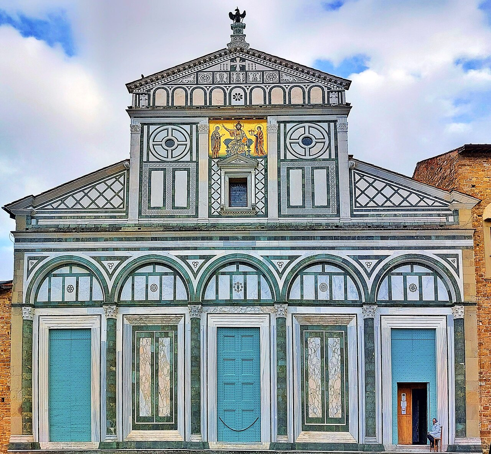

# Abbazia di San Miniato al Monte

```yaml
lugar:
  nombre_original: "Abbazia di San Miniato al Monte"
  pais: "Italia"
  region_admin: "Toscana"
  coordenadas: "43.7596° N, 11.2652° E"
  altitud_m: 118
  fecha_visita: "[DATO PENDIENTE — verificar fuente]"
```

## Mapa



[DATO PENDIENTE — generar mapa con pin]

---

## Qué había antes

Según la tradición cristiana, **San Miniato** era un mercader armenio (o persa, según la versión) que fue martirizado en Firenze durante la persecución del emperador Decio (249–251 d.C.). La leyenda afirma que, decapitado en el área del actual Ponte alle Grazie, Miniato recogió su propia cabeza y subió caminando hasta la colina donde quiso ser enterrado. La topografía de la colina y la ubicación del posterior oratorio cristiano responden a esta tradición.

Una capilla sobre la tumba de Miniato existía ya en épocas altomedievales. El obispo Hildebrando de Firenze encontró el oratorio en estado ruinoso en el siglo X.

---

## Historia

### Línea de tiempo

| Fecha | Hito |
|---|---|
| Siglo III d.C. | Martirio de San Miniato, según la tradición |
| Siglo IV–V | Construcción de un primer oratorio sobre su tumba |
| 1013 | El obispo Ildebrando de Firenze restaura y amplía el oratorio; comienza la construcción de la basilica románica actual |
| 1018 | La basilica es confiada a los monjes benedictinos (más tarde sustituidos por los Olivetanos, rama benedictina que la administra hasta hoy) |
| Siglo XI–XII | Construcción de la fachada en mármol bicolor (verde de Prato, blanco de Carrara) — la más bella del románico toscano |
| 1207 | Construcción del **campanile**; destruido por un rayo en el siglo XIV y reconstruido |
| 1294 | Se añade la **Cappella del Cardinale del Portogallo** [⚠ VERIFICAR fecha exacta] |
| 1347–1348 | Los monjes cierran la abbazia durante la Peste Negra |
| 1529–1530 | Durante el asedio de Firenze por las tropas imperiales de Carlos V, **Michelangelo** (encargado de las defensas de la ciudad) instala cañones en la torre campanaria y protege la estructura con colchones de lana para amortiguar los impactos de artillería |
| Siglo XIX | Restauraciones bajo los monjes olivetanos; instalación del cementerio monumental adyacente |

### Narrativa

San Miniato al Monte es la iglesia más hermosa de Firenze, y lo es en un sentido muy específico: no está llena de obras de arte famosas, no tiene la escala monumental del Duomo ni la densidad histórica de Santa Croce. Su belleza está en la arquitectura en sí misma: la fachada de mármol bicolor blanco y verde de Prato, con su sistema de arcos ciegos, pilastras y mosaico central (Cristo entre la Vergine y San Miniato), es el ejemplo más perfecto del **románico toscano** y uno de los pocos edificios de Firenze que no ha sido sustancialmente alterado desde el siglo XII.

El interior sigue el mismo lenguaje: pavimento de mármol con diseños de intarsia del siglo XII (leones, palomas, signos del zodíaco), la cripta que guarda los restos de San Miniato, la sacristía con frescos de Spinello Aretino. Todo tiene la misma escala humana, sin el monumentalismo renacentista que domina el resto de la ciudad.

La anécdota de **Michelangelo y los cañones** (1530) es una de las más curiosas de la historia del edificio: el artista, encargado temporalmente de las defensas militares de Firenze durante el asedio, usó el campanile como posición de artillería. Para proteger la torre del fuego enemigo, la envolvió con colchones de lana. La torre sobrevivió. Michelangelo no publicó ningún tratado sobre ingeniería militar, pero esta intervención improvisada demuestra que su pensamiento de ingeniero —heredado en parte del modelo de Leonardo— era completamente funcional.

La abbazia está activa: los monjes benedictinos olivetanos la administran y cantan los **oficios litúrgicos** según el rito gregoriano. Es posible asistir a los rezos conventuales, especialmente el oficio de **Vísperas** al atardecer, que convierte la visita en algo muy distinto a la visita museística.

---

## El cementerio monumental

Adyacente a la abbazia, el **Cimitero delle Porte Sante** (siglo XIX) es uno de los cementerios monumentales más interesantes de Toscana: esculturas funerarias del siglo XIX y XX, muchas de alta calidad artística. Aquí están enterrados algunos de los artistas e intelectuales de la Firenze del siglo XIX.

---

## Cómo llegar

Desde el **Piazzale Michelangelo** (a ~5 minutos a pie subiendo por la escalinata con cipreses) o desde el centro subiendo por Via dei Bastioni / Via delle Mura delle Porte Sante. También accesible en bus (verificar línea actual).

---

## Connexiones

- El **Piazzale Michelangelo** está justo por debajo — la visita natural combina los dos: mirador primero, abbazia arriba.
- La fachada de mármol bicolor usa los mismos materiales (mármol blanco de Carrara, verde de Prato) que el **Baptisterio** del Complesso del Duomo en el centro histórico — ambos son del mismo período románico toscano.
- Michelangelo, que intervino en el campanile durante el asedio de 1530, está enterrado en **Santa Croce** en el centro de la ciudad.

---

## Datos interesantes

- Los monjes olivetanos producen y venden **miel, licores herborísticos y cosméticos** de elaboración artesanal en la abbazia — una tradición benedictina que aquí lleva siglos. La tienda del monasterio (antes de entrar a la iglesia) es una de las pocas donde los productos son auténticamente elaborados in situ.
- El mosaico de la fachada (Cristo entre la Vergine y San Miniato) es del siglo XIII y fue restaurado en el siglo XIX. El fondo dorado de teselas de vidrio conserva el mismo tipo de técnica que los mosaicos bizantinos de Ravenna.

---

*fuente: Abbazia di San Miniato al Monte (sitio oficial); Guida d'Italia — Toscana, TCI; Richard Turner, Renaissance Florence.*
