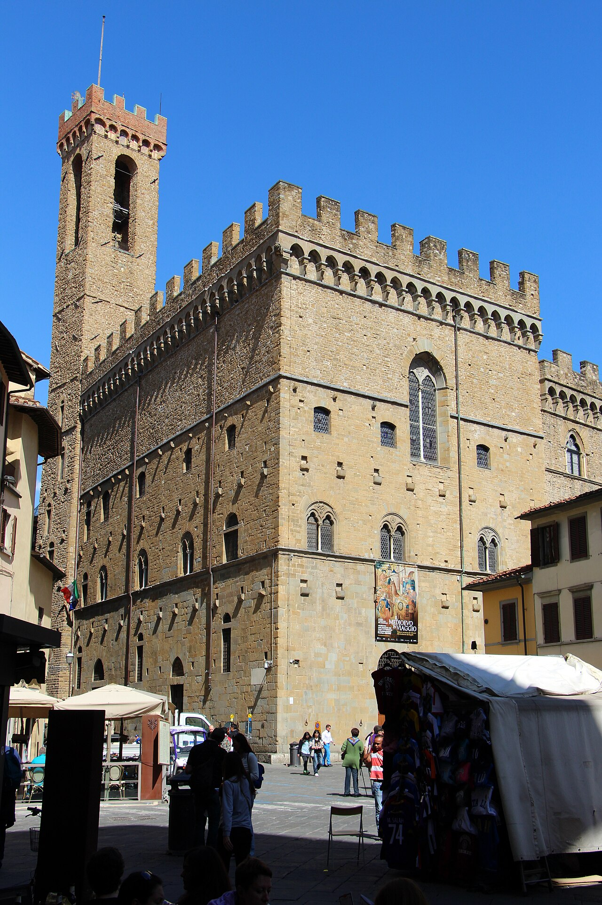
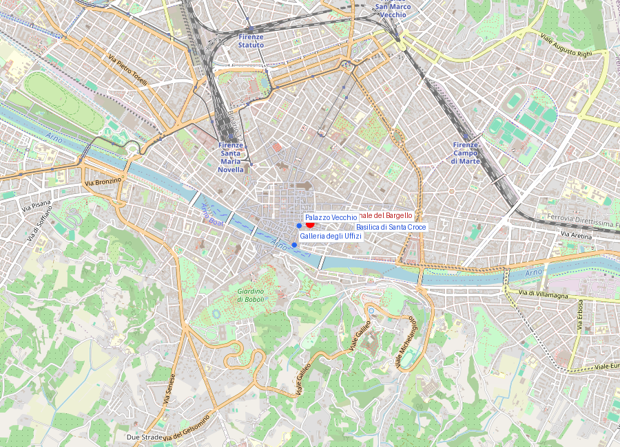
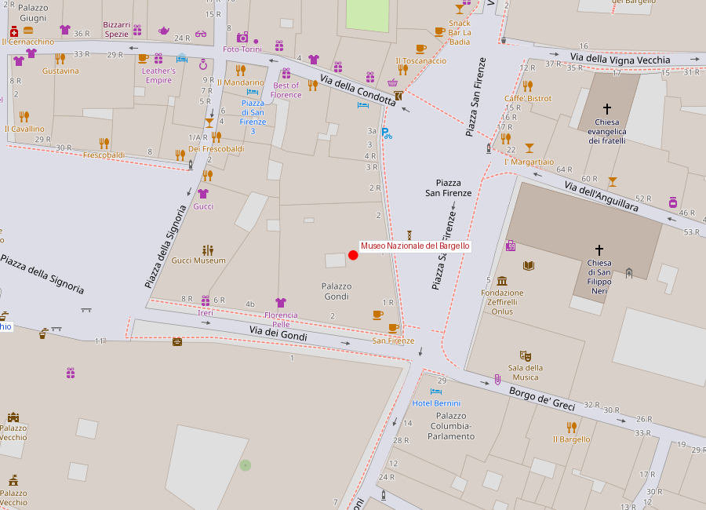

# Museo Nazionale del Bargello

```yaml
lugar:
  nombre_original: "Museo Nazionale del Bargello"
  pais: "Italia"
  region_admin: "Toscana"
  coordenadas: "43.7697° N, 11.2573° E"
  fecha_visita: "[DATO PENDIENTE — verificar fuente]"
```

## Mapa







---

## Qué había antes

El edificio es el **Palazzo del Podestà**, el edificio institucional más antiguo de Firenze, anterior incluso al Palazzo Vecchio. El Podestà era el magistrado externo (traído de otra ciudad para garantizar imparcialidad) que gobernaba Firenze junto con la Signoria.

---

## Historia

### Línea de tiempo

| Fecha | Hito |
|---|---|
| 1255 | Inicio de la construcción del Palazzo del Podestà, primera sede del gobierno republicano de Firenze |
| 1261 | El edificio ya funciona como sede del Podestà y de los capitanes del popolo |
| 1574 | El edificio pasa a ser sede del *Bargello* — el jefe de policía de Firenze. Los nobles y el gobierno se habían trasladado al Palazzo Vecchio |
| Siglos XVI–XVIII | Uso como cárcel y lugar de ejecuciones; el patio interior fue escenario de ajusticiamientos públicos. Las paredes del patio muestran todavía marcas de esto |
| 1786 | Abolición de la pena de muerte en Toscana por Pedro Leopoldo de Lorena — primer estado europeo en abolirla |
| 1865 | Conversión en museo; inauguración como Museo Nazionale del Bargello |
| 1865 | Restauración del edificio y de los frescos del siglo XIV en la Cappella del Podestà |

### Narrativa

El Bargello es el gran museo de escultura de Firenze que casi nadie menciona cuando habla de Firenze. Los turistas corren a los Uffizi (pintura) y a la Accademia (el *David*), pero el Bargello tiene una concentración de escultura del siglo XV sin paralelo en el mundo: el **Donatello completo**, los bronces y mármoles de Michelangelo joven, Ghiberti, Della Robbia, Cellini, Giambologna.

El edificio mismo es el primer capítulo: el patio del Palazzo del Podestà, con sus escudos de armas heráldicos en las paredes (cada Podestà dejaba el suyo), las escaleras exteriores, las arcadas de piedra serena —es Firenze medieval en su forma pura.

**Donatello** tiene aquí todas sus obras fundamentales en un solo espacio. El *San Giorgio* (1415–1417) —escultura de un caballero de una solidez y presencia psicológica completamente nueva en el arte europeo— fue el primer relieve en perspectiva matemática de la historia del arte (*stiacciato*: relieve tan bajo que casi es pintura). El *David* en bronce (c. 1440s) —el primer desnudo masculino de tamaño natural en Europa desde la Antigüedad— es una escultura desconcertante: el David adolescente, sensual, con sombrero de flores, pie sobre la cabeza de Goliat, tiene una ambigüedad que ningún contemporáneo explicó y que los especialistas siguen debatiendo.

Los **paneles de competición para las puertas del Baptisterio** (1401) de Ghiberti y Brunelleschi están expuestos aquí uno frente al otro: los dos paneles sobre el sacrificio de Isaac que presentaron en el concurso que ganó Ghiberti y que se dice que marcó el inicio del Renacimiento florentino. La comparación directa entre los dos es uno de los ejercicios más interesantes que puede hacer un visitante con conocimientos básicos de historia del arte.

---

## Conexiones

- Los paneles de la competición de 1401 están relacionados con las **puertas del Baptisterio** en el Complesso del Duomo — las que Ghiberti ganó el derecho a construir.
- El *David* en bronce de Donatello estuvo originalmente en el **Palazzo Medici Riccardi** (residencia medieval de los Médici), no en el Bargello.
- Cellini tiene aquí modelos en cera y bronce relacionados con el **Perseo** de la Loggia dei Lanzi.

---

## Datos interesantes

- En el patio del Bargello, Savonarola fue juzgado y ejecutado en 1498 (quemado en la Piazza della Signoria, pero el proceso legal ocurrió aquí).
- La "Nación" de los artes y gremios que gobernaban Firenze tenían sus escudos heráldicos en las paredes del patio: son como una historia corporativa de la república florentina en piedra.
- Toscana, bajo Pedro Leopoldo de Lorena, fue el primer estado del mundo en abolir la pena de muerte por ley (1786) — casi un siglo antes que la mayoría de Europa.

---

*fuente: Museo Nazionale del Bargello (sitio oficial); John Pope-Hennessy, Italian Gothic Sculpture e Italian Renaissance Sculpture; Bruce Cole, Italian Art 1250–1550.*
