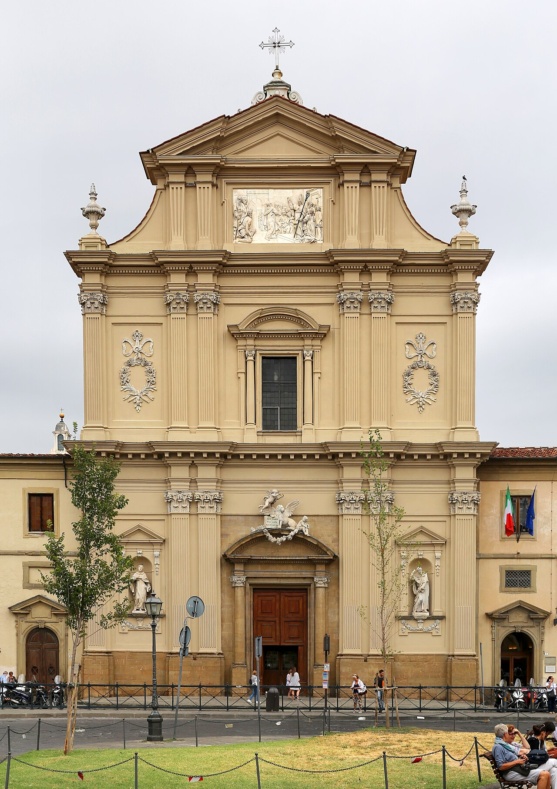

# Basilica e Museo di San Marco

```yaml
lugar:
  nombre_original: "Basilica e Museo di San Marco"
  pais: "Italia"
  region_admin: "Toscana"
  coordenadas: "43.7776° N, 11.2589° E"
  fecha_visita: "[DATO PENDIENTE — verificar fuente]"
```

## Mapa



[DATO PENDIENTE — generar mapa con pin]

---

## Qué había antes

El convento en este lugar fue fundado originalmente por los monjes silvestrinos en el siglo XIII. A mediados del siglo XV, el conjunto estaba en estado de abandono y decadencia. Cosimo de' Medici *il Vecchio* intervendrá para transformarlo radicalmente.

---

## Historia

### Línea de tiempo

| Fecha | Hito |
|---|---|
| Siglo XIII | Fundación del convento por monjes silvestrinos |
| 1436 | Cosimo de' Medici *il Vecchio* cede el convento a los frailes dominicos y financia su reconstrucción total |
| 1437–1452 | **Michelozzo di Bartolommeo** reconstruye el convento por encargo de Cosimo; se diseñan las celdas, la biblioteca y los claustros |
| 1438–1445 | **Fra Angelico** (Giovanni da Fiesole) pinta los frescos de las celdas y los espacios comunes del convento, residiendo él mismo como fraile en el lugar |
| 1439 | El Concilio de Florencia se celebra en la ciudad; intelectuales griegos huyen del Imperio Bizantino trayendo manuscritos; muchos acaban en la **Biblioteca Medicea Laurenziana** fundada por Cosimo aquí mismo |
| 1441 | Inauguración de la biblioteca del convento, primera **biblioteca pública** de Europa según los contemporáneos |
| 1491–1498 | **Girolamo Savonarola** es prior del convento; desde aquí organiza sus sermones incendiarios y las Fogarate della vanità |
| 1498 | Savonarola es detenido, torturado y ejecutado en Piazza della Signoria; su celda en San Marco se conserva |
| 1869 | El convento es suprimido; se convierte en museo del Estado italiano (Museo Nazionale di San Marco) |

### Narrativa

San Marco es el lugar más extraordinario de Firenze que la mayoría de los turistas subestima. No tiene ninguna obra de Michelangelo ni de Botticelli. No está en la lista de los grandes golpes visuales de la ciudad. Pero es el único lugar de Europa —quizás del mundo— donde puedes entrar a las celdas monásticas individuales y encontrarte, solo, frente a un fresco de **Fra Angelico** pintado específicamente para la meditación del fraile que vivía en esa celda.

Fra Angelico pintó no un ciclo decorativo sino un programa espiritual: cada celda tiene un fresco distinto sobre la vida de Cristo o escenas de la Pasión. La *Anunciación* del corredor superior —una de las obras más reproducidas de la pintura italiana— está pintada en el descanso de la escalera, el primer objeto que veían los frailes al subir cada mañana. La escala, la intimidad, el silencio del espacio hacen que el impacto sea completamente diferente al de cualquier museo.

El convento fue también el lugar desde el que **Savonarola** transformó la política florentina. Su celda está conservada con objetos originales. Es imposible no pensar, parado allí, en la secuencia de eventos: el mismo hombre que predicó la destrucción del arte pagano desde este lugar fue quemado a cientos de metros, en Piazza della Signoria, cuatro años después.

La **Biblioteca** del convento —diseñada por Michelozzo con arcadas de piedra serena y techo de vigas de madera— fue una de las primeras estructuras del Renacimiento concebidas específicamente como sala de lectura pública. Cosimo financió no solo el edificio sino la adquisición de los manuscritos.

---

## Conexiones

- Savonarola fue ajusticiado en **Piazza della Signoria**, frente al **Palazzo Vecchio**, el mismo lugar donde había organizado las hogueras de las vanidades.
- Fra Angelico vivió también en Fiesole (en el convento de San Domenico di Fiesole) antes de venir a San Marco — la misma colina a la que apunta el panorama desde el convento.
- Cosimo de' Medici es el mismo mecenas que financió el inicio de la construcción de la nueva **Basilica di San Lorenzo** — un patrón serial del renacimiento arquitectónico florentino.

---

## Datos interesantes

- El *Beato Angelico* fue beato (no santo) hasta 1982, cuando Juan Pablo II lo beatificó. "Fra Angelico" era un apodo de sus contemporáneos por la calidad espiritual de su pintura; su nombre real era Guido di Pietro, de Vicchio di Mugello (Toscana).
- La celda de Cosimo de' Medici en el convento es una de las más grandes (él financió todo, se reservó una celda personal para sus retiros espirituales), aunque igual es pequeña y austera comparada con el resto de su vida.
- Cada fresco de celda está concebido para ser visto por una sola persona a la vez —las dimensiones de la pared y de la celda lo determinan. En el museo de hoy, la visita en solitario temprano en la mañana reproduce exactamente esa experiencia.

---

*fuente: Museo Nazionale di San Marco (sitio oficial); John Pope-Hennessy, Fra Angelico (1974); Lauro Martines, Fire in the City: Savonarola and the Struggle for Renaissance Florence (2006).*
