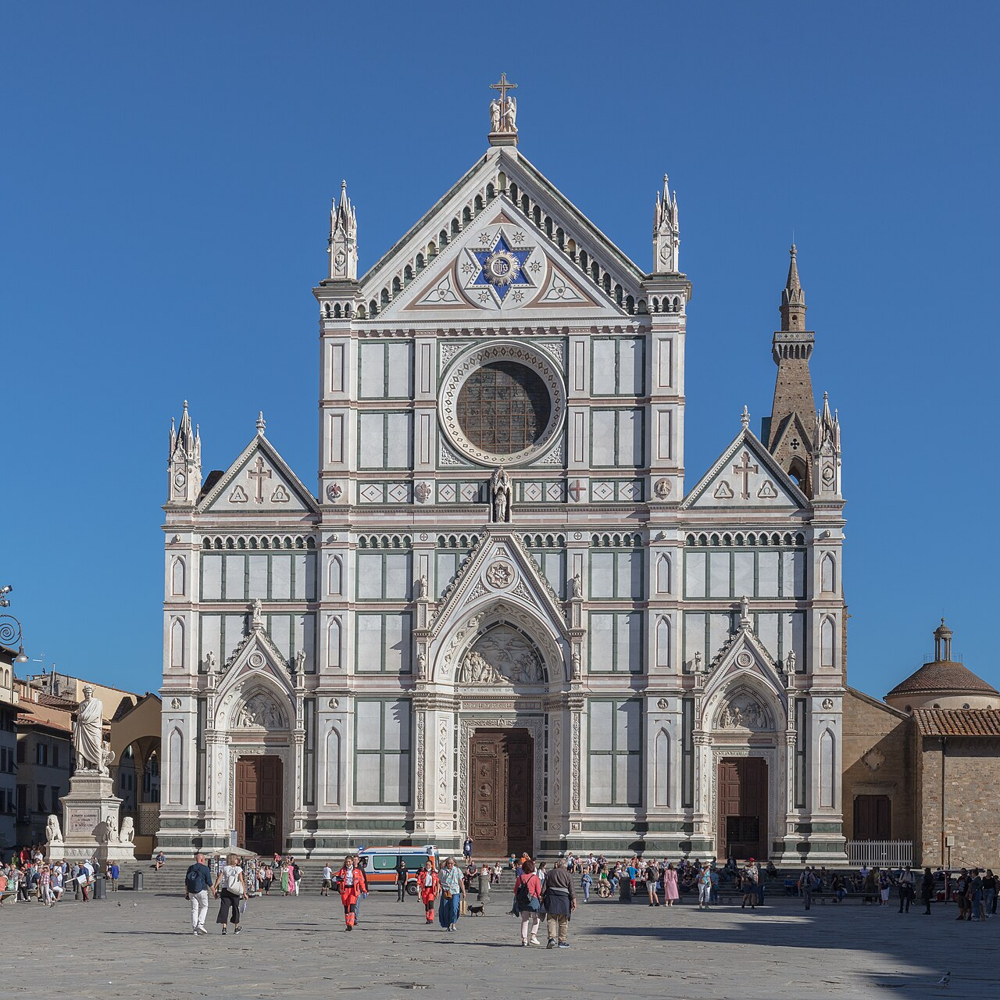
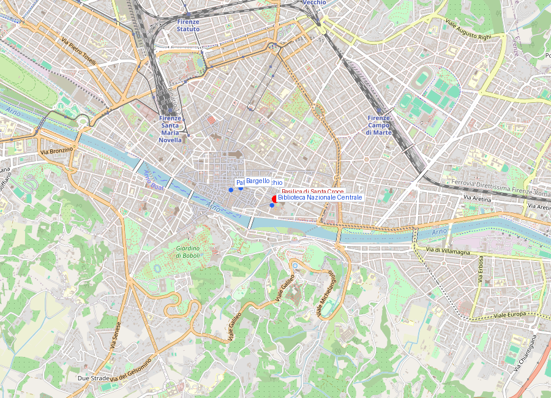
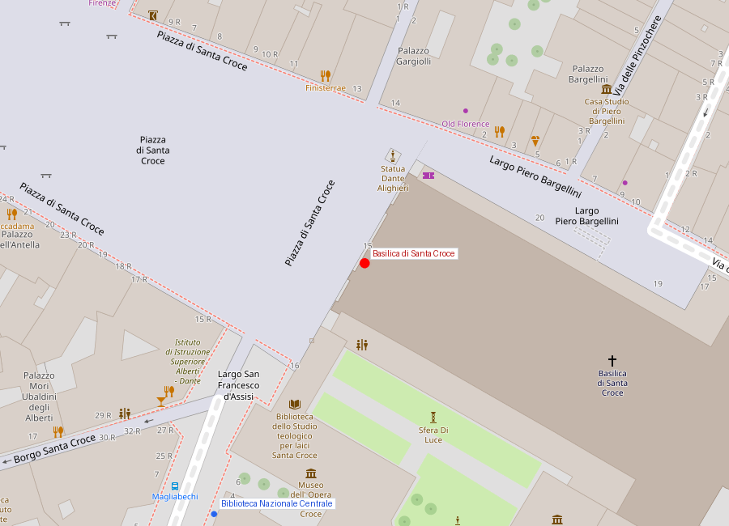

# Basilica di Santa Croce

```yaml
lugar:
  nombre_original: "Basilica di Santa Croce"
  pais: "Italia"
  region_admin: "Toscana"
  coordenadas: "43.7686° N, 11.2622° E"
  fecha_visita: "[DATO PENDIENTE — verificar fuente]"
```

## Mapa







---

## Qué había antes

Los franciscanos se instalaron en este barrio de Firenze en 1228, apenas dos años después de la muerte de San Francisco de Asís. La iglesia original era una estructura modesta; la basilica actual comenzó a construirse en 1294, atribuida a Arnolfo di Cambio (el mismo arquitecto del Palazzo Vecchio y el Duomo). El barrio de Santa Croce era entonces el corazón del artesanado textil florentino, especialmente tintoreros que usaban el canal del Arno cercano.

---

## Historia

### Línea de tiempo

| Fecha | Hito |
|---|---|
| 1228 | Los franciscanos se establecen en Firenze, primero en una capilla modesta |
| 1294 | Inicio de la construcción de la basilica actual, atribuida a Arnolfo di Cambio |
| Siglo XIV | Giotto pinta los frescos de las Cappelle Bardi y Peruzzi (conservados parcialmente) |
| 1443 | Consagración oficial de la basilica |
| 1566 | Cosimo I de' Medici encarga a Giorgio Vasari la renovación interior; se destruyen o cubren muchos frescos medievales |
| 1574 | Sepultura de Miguel Ángel Buonarroti en la basilica (fallecido en Roma, trasladado a Firenze) |
| 1737 | Sepultura de Galileo Galilei (había muerto en 1642 en arresto domiciliario; la Iglesia tardó casi 100 años en permitir su entierro en terreno consagrado digno) |
| 1829 | Dante Alighieri recibe un cenotafio en Santa Croce (su tumba real está en Ravenna) |
| 1863 | Inauguración de la fachada neogótica de Niccolò Matas |
| 1966 | La gran inundación del Arno (4 de noviembre) entra en la basilica: el agua alcanza los 5 metros; el Crucifijo de Cimabue sufre daños gravísimos — se pierde el 60% de la superficie pintada |

### Narrativa

Santa Croce es el panteón de la cultura italiana. En sus naves y en los claustros están enterrados o conmemorados Michelangelo, Galileo, Machiavelli, Ghiberti, Rossini y Leon Battista Alberti, entre muchos otros. No es casual: los florentinos y los italianos posteriores convirtieron conscientemente la basilica en el lugar donde la nación honra a sus grandes hombres, antes incluso de que Italia existiera como nación.

La historia de Galileo condensa bien las contradicciones del lugar. Cuando murió en 1642 bajo arresto domiciliario por orden del Santo Oficio, el Papa Urbano VIII prohibió sepultarlo con honores en Santa Croce. Su cuerpo fue depositado en una capilla menor del complejo. Casi un siglo después, en 1737, la Iglesia finalmente cedió y Galileo recibió el monumento que hoy se ve en la nave principal, frente a la tumba de Michelangelo.

Los frescos de Giotto en las Cappelle Bardi y Peruzzi (hacia 1315-1325) son de los más importantes que se conservan del maestro, y son también una demostración del daño que puede hacer la ignorancia o el "gusto" de una época: en la reforma de Vasari en 1566, muchos frescos medievales fueron encalados o destruidos; los de Giotto sobrevivieron debajo del encalado y fueron redescubiertos en el siglo XIX.

---

## Cappelle

La basilica tiene 16 capillas funerarias en los brazos del transepto y el coro, encargadas por las principales familias mercantiles florentinas. Las más importantes:

- **Cappella Bardi** — Frescos de Giotto sobre la vida de San Francisco
- **Cappella Peruzzi** — Frescos de Giotto sobre San Juan Bautista y San Juan Evangelista
- **Cappella Pazzi** — Obra maestra de Brunelleschi (c. 1430); ejemplo perfecto de arquitectura renacentista. Está en el primer claustro, no dentro de la basilica

---

## Connexiones

- Galileo está enterrado aquí, y sus instrumentos están a pocos minutos en el **Museo Galileo** junto al Arno.
- Michelangelo está enterrado aquí; el mármol de sus obras más importantes es el mismo de Carrara que se puede estudiar en la **Galleria dell'Accademia**.
- La Cappella Pazzi es obra de Brunelleschi, el mismo arquitecto que resolvió la cúpula del **Duomo**.

---

## Datos interesantes

- El cenotafio de Dante Alighieri tiene inscripta la frase *"Onorate l'altissimo poeta"*, verso del Infierno de la Divina Commedia. Dante murió en Ravenna en 1321 y está enterrado allí; Firenze, que lo exilió en vida, le construyó un monumento póstumo.
- El Crucifijo de Cimabue dañado en 1966 se convirtió en símbolo internacional del desastre cultural. La restauración que duró décadas sentó las bases de las técnicas modernas de restauración de pintura sobre madera.

---

*fuente: Opera di Santa Croce (sitio oficial); John Pope-Hennessy, Italian Gothic Sculpture; G. Brucker, Renaissance Florence.*
