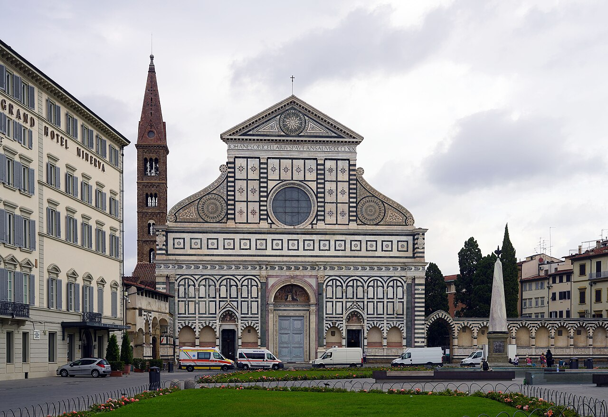
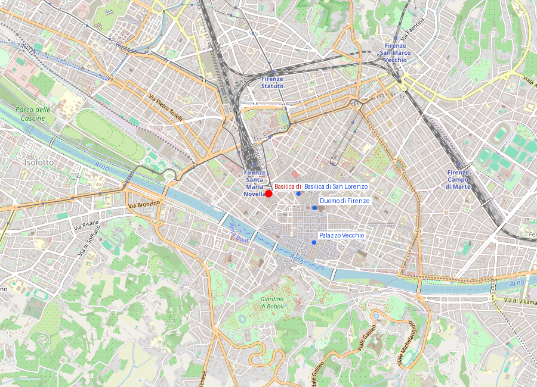
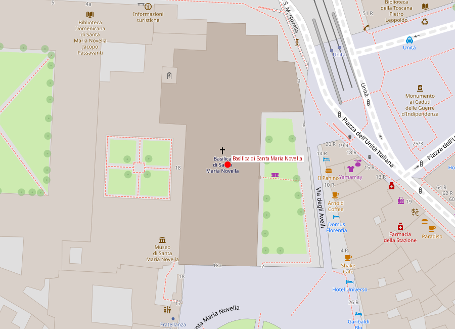

# Basilica di Santa Maria Novella

```yaml
lugar:
  nombre_original: "Basilica di Santa Maria Novella"
  pais: "Italia"
  region_admin: "Toscana"
  coordenadas: "43.7746° N, 11.2494° E"
  fecha_visita: "[DATO PENDIENTE — verificar fuente]"
```

## Mapa







---

## Qué había antes

Los dominicos llegaron a Firenze en 1221 y se establecieron en esta zona al noroeste del centro histórico, cerca de la puerta romana que conducía a la vía hacia Pisa. La primera capilla dominica en este lugar data del siglo XIII. "Novella" (nueva) la llamaron para distinguirla de la anterior iglesia más antigua en el lugar.

---

## Historia

### Línea de tiempo

| Fecha | Hito |
|---|---|
| 1221 | Los dominicos se establecen en Firenze |
| 1246 | Inicio de la construcción de la basilica actual, por los frailes dominicos Sisto da Firenze y Ristoro da Campi |
| 1360 | Consagración de la basilica; la nave y el transepto están esencialmente completos |
| c. 1427–1428 | **Masaccio** pinta la *Trinità* (Trinidad), el primer uso documentado de la perspectiva lineal matemática en una pintura mural de gran formato |
| 1456–1470 | **Leon Battista Alberti** diseña y construye la fachada de mármol, considerada la primera fachada renacentista de una iglesia florentina; fue encargada por Giovanni Rucellai |
| 1485–1490 | **Domenico Ghirlandaio** pinta los frescos del coro (Cappella Tornabuoni) — el joven Miguel Ángel fue aprendiz en su taller durante esta obra |
| 1966 | La inundación del Arno entra en la basilica y en el Museo di Santa Maria Novella; varios cruces y pinturas sufren daños |

### Narrativa

Santa Maria Novella tiene dos obras que cada una por sí sola justificaría cualquier visita a Firenze. La primera es la *Trinità* de Masaccio: un fresco pintado hacia 1427-1428, cuando Masaccio tenía veintipocos años, que es el primer espacio arquitectónico pintado con perspectiva matemática correcta en la historia de la pintura occidental. Antes de esta obra, las figuras flotaban en el espacio pictórico de maneras convencionales. Aquí, el ojo del espectador que mira entra en un espacio tridimensional perfectamente construido —una bóveda de cañón artesonada, columnas corintias, un Dios Padre sosteniendo la cruz— con la ilusión de profundidad calculada geométricamente. Una generación después, los pintores florentinos usaban este fresco como manual de referencia.

La segunda es la **fachada de Alberti**: el primer intento sistemático de aplicar la teoría arquitectónica renacentista (basada en la antigüedad clásica y en Vitruvio) al diseño de una fachada de iglesia gótica ya existente. Alberti incorporó la nave gótica medieval dentro de un sistema de pilastras, arcos y módulos proporcionales derivados de la arquitectura romana. Los grandes volutes (volutas) que conectan la nave central más alta con las naves laterales más bajas fueron una solución tan elegante que se repitió durante siglos en toda Europa.

Los frescos de **Ghirlandaio** en la Cappella Tornabuoni (1485–1490) son una crónica social de Firenze bajo Lorenzo il Magnifico disfrazada de ciclo bíblico: los donantes, sus familias y los ciudadanos notables de la ciudad aparecen como figurantes en escenas de la vida de la Virgen y de San Juan Bautista. Es uno de los documentos visuales más ricos de la sociedad florentina del siglo XV. En este taller trabajó el joven Michelangelo.

---

## Chiostri (Claustros)

El complejo incluye varios claustros accesibles por el Museo di Santa Maria Novella:

- **Chiostro Verde** — Frescos de Paolo Uccello (siglo XV) sobre el Génesis, pintados en *terra verde*
- **Cappellone degli Spagnoli** — Frescos extraordinarios del siglo XIV sobre la misión de la Orden Dominica y la salvación

---

## Connexiones

- Frente a Santa Maria Novella está la **Stazione di Santa Maria Novella** (la estación de tren), proyecto racional de 1932 de Michelucci — la yuxtaposición de la fachada renacentista del siglo XV y la estación racionalista es una de las tensiones urbanas más interesantes de Firenze.
- Ghirlandaio fue el maestro directo del joven Michelangelo; los frescos del coro de esta iglesia son los que Michelangelo estudió en su formación inicial.

---

## Datos interesantes

- La *Trinità* de Masaccio fue encalada durante siglos y solo redescubierta en 1860. En el siglo XVI, Giorgio Vasari cubrió el fresco con una tabla pintada de su propio diseño; debajo seguía el Masaccio intacto.
- La farmacia de los dominicos de Santa Maria Novella (la **Officina Profumo-Farmaceutica di Santa Maria Novella**), fundada en 1612, es la farmacia/perfumería más antigua del mundo en funcionamiento continuo y sigue abierta en la calle adyacente.

---

*fuente: Opera di Santa Maria Novella (sitio oficial); John Pope-Hennessy, Italian Renaissance Painting; L.B. Alberti, De Re Aedificatoria (edición crítica moderna).*
