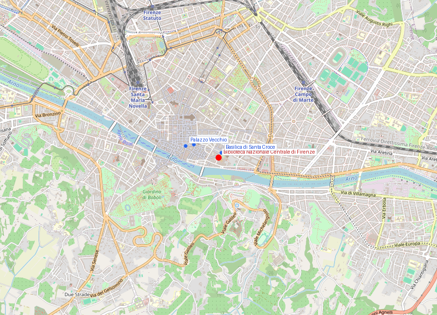
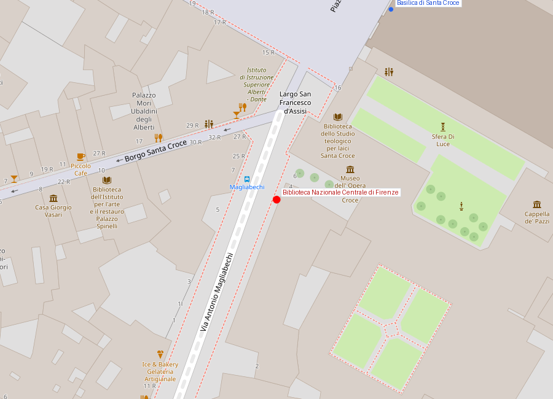

# Biblioteca Nazionale Centrale di Firenze

```yaml
lugar:
  nombre_original: "Biblioteca Nazionale Centrale di Firenze"
  nombre_alternativo: "BNCF"
  pais: "Italia"
  region_admin: "Toscana"
  coordenadas: "43.7680° N, 11.2617° E"
  fecha_visita: "[DATO PENDIENTE — verificar fuente]"
```

## Mapa





---

## Historia

### Línea de tiempo

| Fecha | Hito |
|---|---|
| 1714 | Antonio Magliabechi, erudito y bibliotecario de los Médici, lega a la ciudad de Firenze su colección personal de ~30.000 volúmenes; se funda la **Biblioteca Magliabechiana** |
| 1737 | Extinción de la línea masculina de los Médici; **Anna Maria Luisa de' Medici** cede las colecciones Médici al Estado con la condición de que permanezcan en Firenze |
| 1861 | Con la unificación de Italia, la biblioteca obtiene estatus de **Biblioteca Nacional** junto con la de Roma |
| 1870 | Se fusionan la Biblioteca Magliabechiana y la Biblioteca Palatina (colección de los Lorena); nace la Biblioteca Nazionale Centrale |
| 1935 | Inauguración del edificio actual en el Lungarno, junto a Santa Croce, diseñado por **Cesare Bazzani** |
| 1966 | La inundación del Arno (4 de noviembre) es el peor desastre en la historia de la biblioteca: el agua entra por el Lungarno, alcanza ~4–5 metros en los depósitos inferiores. Se dañan o destruyen ~1.500.000 publicaciones, incluyendo periódicos históricos, incunables y manuscritos — algunas estimaciones señalan daños irreparables en ~300.000 ítems [⚠ VERIFICAR cifras exactas] |
| 1966–1990s | Restauración masiva con ayuda internacional; los *Mud Angels* (voluntarios internacionales, muchos jóvenes de todo el mundo) trabajan durante semanas para rescatar y limpiar volúmenes |
| Actualidad | Depósito legal obligatorio: toda publicación editada en Italia debe entregar un ejemplar a la BNCF. La colección supera los 10 millones de ítems |

### Narrativa

La Biblioteca Nazionale Centrale di Firenze es una de las dos bibliotecas nacionales de Italia (la otra está en Roma) y conserva el patrimonio bibliográfico más importante del país en cuanto a impresos históricos: manuscritos medievales, incunables (primeras impresiones), el archivo de la producción editorial italiana desde el depósito legal.

Para el visitante sin interés específico en investigación, el valor principal del edificio es su **sala de lectura principal** — un espacio de arquitectura racionalista de los años 30 de gran serenidad — y las **exposiciones temporales**, que periódicamente presentan piezas de la colección al público general.

El episodio más dramático de su historia es la **inundación de 1966**. El Arno entró sin aviso en la noche del 3 al 4 de noviembre; los depósitos subterráneos de la biblioteca, que contienen los materiales más frágiles (periódicos del siglo XIX en papel de mala calidad, los más difíciles de restaurar), fueron los primeros en inundarse. La respuesta internacional que llegó en los días siguientes — los *Mud Angels*, voluntarios de decenas de países que llegaron espontáneamente a limpiar y rescatar volúmenes del fango — se convirtió en uno de los primeros casos de solidaridad cultural internacional masiva de la historia moderna, y estableció las bases de las técnicas contemporáneas de conservación y restauración de documentos.

---

## Conexiones

- El edificio está a metros de la **Basilica di Santa Croce** — se puede visitar el mismo día.
- La **Biblioteca Medicea Laurenziana** (en el claustro de San Lorenzo, diseñada por Michelangelo) es la biblioteca histórica más famosa de Firenze y alberga los manuscritos medievales de los Médici; no debe confundirse con esta.
- Los *Mud Angels* de 1966 trabajaron en toda la ciudad, no solo en la biblioteca: también en el **Museo Nazionale del Bargello** y en iglesias que sufrieron daños.

---

## Datos interesantes

- La BNCF conserva el **Codice Ashburnham**, que incluye fragmentos de manuscritos medievales que en el siglo XIX fueron cortados de libros de la Biblioteca Medicea Laurenziana y vendidos al negociante inglés Lord Ashburnham. Tras una disputa legal prolongada, los fragmentos fueron devueltos a Firenze.
- El depósito legal en Italia existe desde 1869 — un año antes de la fundación formal de la BNCF. Desde 1869 hay al menos un ejemplar de cada libro publicado en Italia en los depósitos de la biblioteca.

---

*fuente: Biblioteca Nazionale Centrale di Firenze (sitio oficial, bncf.firenze.sbn.it); Marco Ciatti, Il restauro dei libri alluvionati del 1966; UNESCO Water Heritage documentation.*
