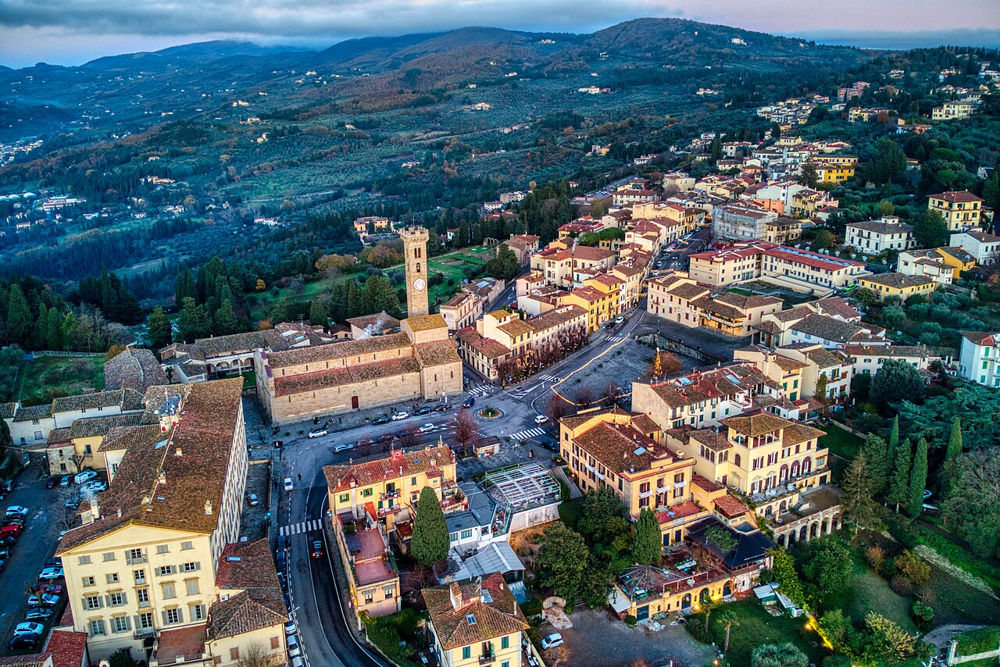

# Fiesole

```yaml
lugar:
  nombre_original: "Fiesole"
  pais: "Italia"
  region_admin: "Toscana"
  coordenadas: "43.8055° N, 11.2930° E"
  altitud_m: 295
  fecha_visita: "[DATO PENDIENTE — verificar fuente]"
```

## Mapa



[DATO PENDIENTE — generar mapa con pin]

---

## Qué había antes

Fiesole es más antigua que Firenze. Era una ciudad **etrusca** ya establecida entre los siglos VIII y VII a.C., posiblemente antes; los etruscos eligieron la cima de la colina por razones defensivas y estratégicas: desde allí se controla la confluencia del Arno y el Mugnone, y el acceso a las rutas de los Apeninos. Cuando Roma conquistó la región (c. 283 a.C.), Fiesole se convirtió en municipio romano y fue la ciudad principal del área — Florentia, fundada en el valle en el 59 a.C., era una ciudad secundaria, un puesto avanzado militar en el vado del Arno.

---

## Historia

### Línea de tiempo

| Fecha | Hito |
|---|---|
| Siglos VIII–VII a.C. | Asentamiento etrusco en la colina; las murallas etruscas (visibles parcialmente hoy) datan de este período |
| 283 a.C. | Conquista romana; Fiesole se convierte en *municipium* |
| 59 a.C. | Fundación de **Florentia** en el valle del Arno como colonia militar romana; Fiesole sigue siendo la ciudad principal del territorio |
| Siglo I a.C.–II d.C. | Construcción del teatro romano (el más importante conservado en Toscana), las termas y el templo en el **Area Archeologica** |
| Siglo IV d.C. | Sede episcopal; obispado de Fiesole, uno de los más antiguos de Toscana |
| 405–406 d.C. | El rey visigodo Radagaiso acampa cerca de Fiesole antes de ser derrotado por Estilicón (general de Honorio) |
| 1010 | La catedrale di San Romolo di Fiesole comienza a construirse en su forma actual (románica) |
| Siglos XII–XIV | Conflicto continuo con Firenze en expansion; Fiesole pierde independencia política y queda incorporada al territorio florentino |
| 1125 | Firenze destruye parcialmente Fiesole para eliminar a un rival estratégico; la ciudad nunca recuperó su importancia urban |
| Siglos XV–XX | Residencia de verano de las familias florentinas pudientes (los Médici tenían una villa en Fiesole); lugar de retiro de artistas e intelectuales |

### Narrativa

La relación entre Fiesole y Firenze es la de la ciudad vieja vencida por la ciudad nueva: Fiesole, asentada en la cima defensible, fue la capital etrusca y luego romana del territorio. Firenze, en el fondo del valle —más expuesta pero con mejor acceso al comercio fluvial— la superó durante la Edad Media y finalmente la incorporó por la fuerza. En 1125, las tropas florentinas destruyeron buena parte de Fiesole para suprimir definitivamente su capacidad de resistencia como rival. Sobrevivió como ciudad-obispado menor, y esa marginalidad es lo que la conservó: no hubo reurbanización masiva, y se puede caminar por sus calles y ver el estado en que quedó el centro histórico medieval.

El **Area Archeologica** es uno de los conjuntos arqueológicos más accesibles e interesantes de Toscana: teatro romano del siglo I a.C. en buen estado de conservación (con gradas, proscenio y orchestra visible), termas romanas, templo etrusco-romano y secciones de muralla etrusca. Técnicamente está al alcance de una excursión de medio día desde Firenze.

La vista desde **Piazza Mino** y desde los jardines sobre Firenze es la vista más célebre y reproducida de la ciudad — más que el Piazzale Michelangelo, porque incluye las colinas en tres direcciones y el Arno como eje.

---

## Cómo llegar desde Firenze

- **Bus urbano línea 7** desde Piazza San Marco (Firenze) hasta Piazza Mino da Fiesole: ~25 minutos. Es la misma línea de bus de los florentinos; no hay que tomar excursión turística.
- A pie: 1,5–2 horas desde el centro histórico de Firenze, subiendo por las rutas peatonales que atraviesan Villa Medici y el bosque.

---

## Qué ver en Fiesole

- **Area Archeologica** — Teatro romano, termas, templo, murallas etruscas; museo adjunto con hallazgos del sitio
- **Cattedrale di San Romolo** — Románica del siglo XI; cripta con los restos del obispo San Romolo
- **Convento di San Francesco** — Sobre la cima más alta, con vistas; museo de arte oriental (colección de los misioneros franciscanos)
- **Villa Médici** — En el camino de subida; jardines accesibles; fue la villa de Lorenzo il Magnifico para sus retiros

---

## Conexiones

- Fra Angelico vivió en el **Convento di San Domenico di Fiesole** antes de ser transferido a **San Marco** en Firenze — el convento está en la falda de la colina, antes de llegar a Fiesole.
- Los Médici tenían su villa de verano aquí; la misma familia que patroneó el Rinascimento en el centro de Firenze escapaba del calor veraniego a estas colinas.
- El teatro romano de Fiesole es contemporáneo del período de construcción del foro romano en Florentia, hoy bajo **Piazza della Repubblica**.

---

## Datos interesantes

- El nombre "Fiesole" deriva del etrusco *Vipsul* o *Faesulae* (forma latina) — uno de los pocos topónimos italianos con raíz etrusca claramente documentada.
- Leonardo da Vinci pasó tiempo en las colinas de Fiesole en su juventud florentina; algunos estudiosos sitúan aquí los fondos de varios de sus cuadros.
- El cementerio de Fiesole es el lugar donde están enterrados algunos de los intelectuales anglosajones que vivieron aquí: la colonia angloamericana de Firenze del siglo XIX tenía a Fiesole como lugar de retiro preferido.

---

*fuente: Comune di Fiesole (sitio oficial); Area Archeologica di Fiesole — museo; Encyclopædia Britannica entrada "Fiesole".*
