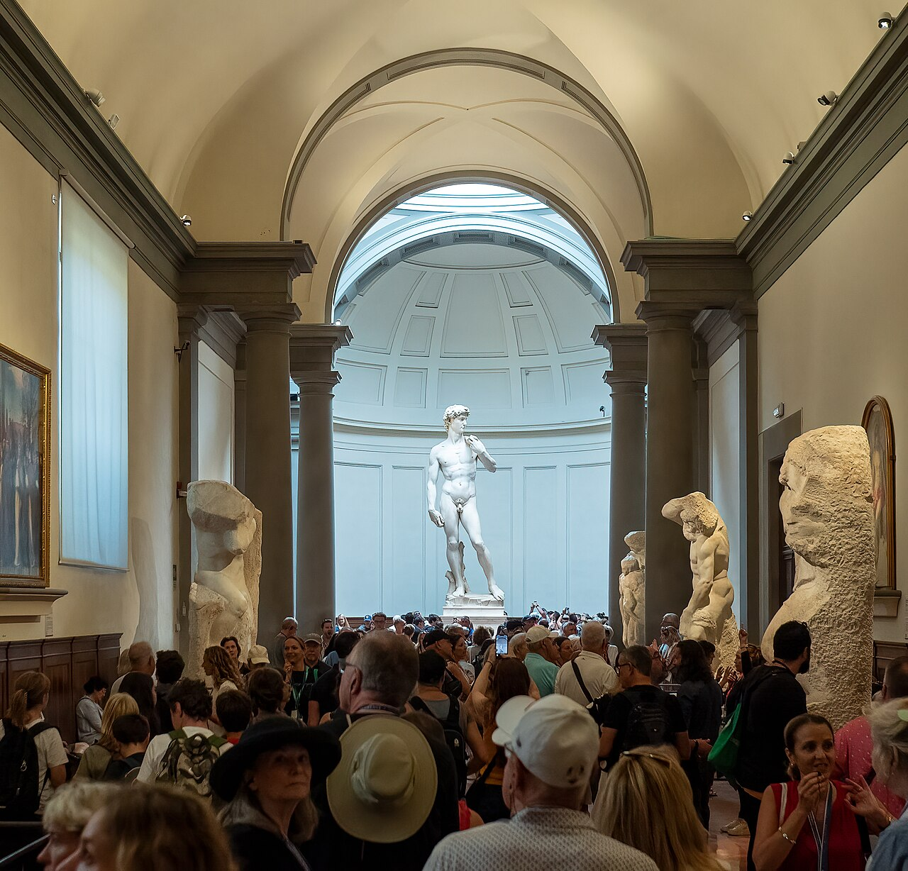

# Galleria dell'Accademia

```yaml
lugar:
  nombre_original: "Galleria dell'Accademia"
  pais: "Italia"
  region_admin: "Toscana"
  coordenadas: "43.7767° N, 11.2588° E"
  fecha_visita: "[DATO PENDIENTE — verificar fuente]"
```

## Mapa



[DATO PENDIENTE — generar mapa con pin]

---

## Qué había antes

El edificio fue construido en el siglo XVIII como parte del complejo del Ospedale di San Matteo y del convento de las monjas agostinas de Sant'Ambrogio. En 1784, el Gran Duque Pietro Leopoldo de Lorena fundó la academia como escuela de arte; la galería se creó simultáneamente para que los estudiantes pudieran estudiar de obras maestras reales. Al principio albergó principalmente obras de pintura medieval y renacentista florentina.

---

## Historia

### Línea de tiempo

| Fecha | Hito |
|---|---|
| 1784 | Pietro Leopoldo de Lorena funda la Galleria dell'Accademia como galería de estudio adjunta a la Academia de Bellas Artes de Florencia |
| 1873 | El *David* de Michelangelo, que hasta entonces estaba en Piazza della Signoria a la intemperie, es trasladado al interior de la galería |
| 1882 | Se inaugura la *Tribuna del David*, sala diseñada expresamente para albergar la escultura |
| Siglo XX | Se incorporan colecciones de música (instrumentos de los Médici), pinturas del gótico tardío florentino y Prigioni de Michelangelo |
| 1990s–2000s | Ampliaciones y restauraciones progresivas de las salas |

### Narrativa

La Galleria dell'Accademia es, en la práctica, un museo construido alrededor de una sola obra: el *David* de Michelangelo. Todo lo demás —las pinturas medievales, los instrumentos musicales de los Médici, los bocetos— es contexto. Pero ese "todo lo demás" es de primer nivel.

El *David* fue esculpido entre 1501 y 1504. Michelangelo tenía 26 años cuando comenzó. El bloque de mármol de Carrara que usó había sido extraído décadas antes, mal trabajado por otro escultor (posiblemente Agostino di Duccio) y abandonado como inutilizable —lo llamaban *el gigante* y llevaba décadas en el patio de la Operai del Duomo—. Michelangelo tomó ese bloque "fallido" y produjo la escultura renacentista más célebre del mundo.

El *David* representa a David bíblico **antes** del combate con Goliat —no después, como la tradición iconográfica anterior—. Las venas marcadas del cuello, la tensión del cuerpo, la honda en el hombro: es el instante de la concentración y la decisión. El mensaje político era claro: Firenze, pequeña república frente a potencias grandes, era David. La escultura se colocó originalmente frente al Palazzo Vecchio como símbolo cívico.

Los *Prigioni* (o *Schiavi*), cuatro esculturas inconclusas de Michelangelo expuestas en la misma sala, son tan fascinantes como el *David*: figuras humanas que parecen emerger parcialmente del mármol, como si estuvieran atrapadas en la piedra. Se discute si Michelangelo los dejó deliberadamente inconclusos o si no pudo terminarlos; hoy son el ejemplo más citado de su concepto de la *non-finito*.

---

## Conexiones

- El *David* estuvo en **Piazza della Signoria** (frente al Palazzo Vecchio) desde 1504 hasta 1873; hoy hay una copia en su lugar original.
- El mármol de Carrara es el mismo que usó Michelangelo para otros proyectos, incluyendo los del complejo de **San Lorenzo**.
- Los instrumentos de los Médici incluyen algunos de los violines y violas más antiguos con construcción documentada del mundo.

---

## Datos interesantes

- La cabeza y las manos del *David* son desproporcionadamente grandes: se cree que Michelangelo las exageró porque la escultura iba destinada originalmente a ser colocada en altura (sobre los contrafuertes del Duomo), donde la perspectiva las haría parecer correctas. Al final se decidió colocarla a nivel del suelo.
- El bloque de mármol tiene apenas 57 cm en su dimensión más estrecha. Michelangelo trabajó en un espacio extremadamente limitado.
- El dedo índice de la mano derecha del *David* está técnicamente "mal": el ángulo violaría la anatomía real. Se cree que fue intencional, para crear mayor tensión dramática.

---

*fuente: Galleria dell'Accademia di Firenze (sitio oficial); Giorgio Vasari, Le Vite de' più eccellenti pittori, scultori e architettori; Ana Fisković et al., estudios de conservación de la Accademia.*
