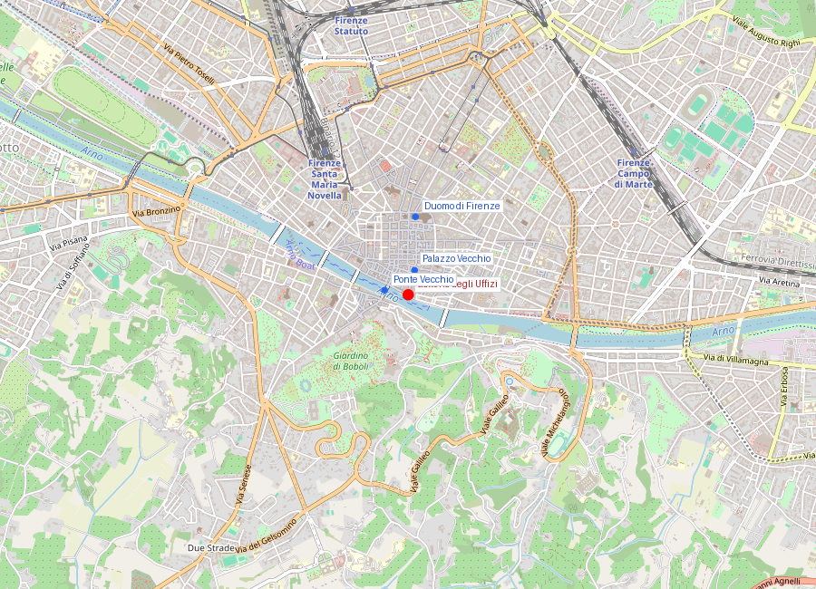
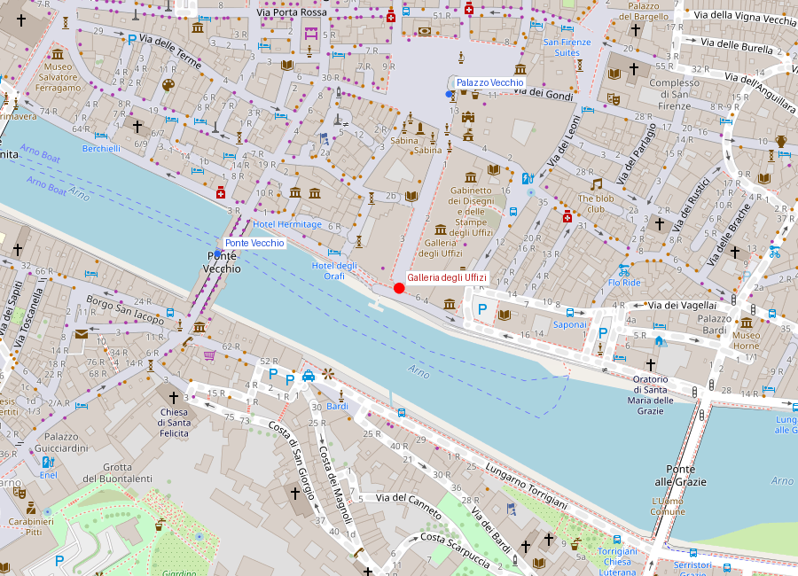

# Galleria degli Uffizi

```yaml
lugar:
  nombre_original: "Galleria degli Uffizi"
  pais: "Italia"
  region_admin: "Toscana"
  coordenadas: "43.7678° N, 11.2553° E"
  fecha_visita: "[DATO PENDIENTE — verificar fuente]"
```

## Mapa





---

<!-- 📷 FOTO: fachada de los Uffizi desde la Piazza della Signoria / galería en U con vista al Arno -->

## Qué había antes

El edificio que hoy alberga los Uffizi fue construido como sede de las **magistraturas gubernativas de la Toscana medicea** —los "uffizi" son literalmente "oficinas"—. Antes de su construcción, en este terreno existía un conjunto de edificios medievales irregulares entre la Piazza della Signoria y el Arno, incluyendo la chiesa di San Pier Scheraggio, parcialmente incorporada al nuevo edificio (algunos de sus arcos románicos aún son visibles en el interior).

---

## Historia

### Línea de tiempo

| Fecha | Hito |
|---|---|
| 1560 | **Cosimo I de' Medici** encarga el edificio a **Giorgio Vasari** para centralizar las oficinas de gobierno de la Toscana |
| 1564 | Muerte de Vasari; la obra continúa bajo **Alfonso Parigi** y **Bernardo Buontalenti** |
| 1565 | Vasari construye el **Corridoio Vasariano**, pasaje elevado que une los Uffizi con el Palazzo Pitti cruzando el Ponte Vecchio |
| 1581 | **Francesco I de' Medici** inaugura la **Tribuna degli Uffizi** (el primer espacio de galería de arte propiamente dicho) en el piso superior del edificio |
| 1737 | La última Médici, **Anna Maria Luisa**, dona toda la colección al Estado florentino con la condición de que nunca salga de Firenze — un acto de mecenazgo que preserva la integridad de la colección hasta hoy |
| 1769 | El edificio abre oficialmente al público como museo |
| 1993 | Un atentado con coche bomba de la Mafia mata 5 personas y destruye parte de la galería y obras de arte |
| 2012–presente | Gran proyecto de expansión ("Nuovi Uffizi") que duplica el espacio expositivo de la colección |

### Narrativa

Los Uffizi son el museo más visitado de Italia [⚠ VERIFICAR ranking actualizado] y uno de los más importantes del mundo, no tanto por su tamaño como por la concentración extraordinaria de obras maestras del Renacimiento italiano. La colección procede casi íntegramente del mecenazgo de la familia Médici acumulado a lo largo de tres siglos, y su permanencia en Firenze se debe a una cláusula legal impuesta por Anna Maria Luisa de' Medici en 1737: cuando la línea dinástica se extinguió, la colección no siguió a los nuevos gobernantes austriacos sino que quedó vinculada para siempre a la ciudad.

El edificio en sí es una de las primeras obras de arquitectura renacentista proyectadas como espacio de exhibición de arte. La Tribuna, encargada por Francesco I en 1581, es considerada el primer "museo" en el sentido moderno: una sala diseñada específicamente para contemplar obras de arte, iluminada cenitalmente, con paredes y suelos coordinados para realzar las piezas.

El **Corridoio Vasariano** —un pasaje elevado de casi un kilómetro de longitud que va de los Uffizi al Palazzo Pitti cruzando sobre el Ponte Vecchio— fue construido en apenas cinco meses en 1565 para permitir a Cosimo I desplazarse entre su palacio de gobierno y su residencia privada sin bajar a la calle, es decir, sin mezclarse con el pueblo ni exponerse a ataques. Una autopista privada para el Duque. El corredor albergó durante décadas una colección de miles de autorretratos de artistas; fue dañado por el atentado de 1993 y ha sido intermitentemente abierto al público. [⚠ VERIFICAR estado de apertura actual del Corridoio]

---

## Colección: obras clave

<!-- 📷 FOTO: interior de las salas / vista de una sala con obras -->

Las salas están organizadas cronológicamente. Los momentos imprescindibles:

### Sala Botticelli (Sala 10–14)

<!-- 📷 FOTO: La nascita di Venere / La Primavera (si está permitido fotografiar) -->

- **La nascita di Venere** (c. 1484-1486): Venus emergiendo del mar sobre una concha gigante, impulsada por los vientos Céfiro y Aura, recibida por una de las Horas. El modelo de Venus fue probablemente **Simonetta Vespucci**, amante de Giuliano de' Medici (hermano de Lorenzo). La pose de Venus reproduce la *Venus Pudica* helenística; la pintura entera es un ejercicio de neoplatonismo medicea: Venus como símbolo del Amor divino que despierta en el cosmos.
- **La Primavera** (c. 1477-1482): uno de los cuadros más estudiados y menos descifrados de la historia del arte. Las interpretaciones oscilan entre alegoría neoplatónica (Ficino), programa político Médici y representación de los meses de primavera. Las tres Gracias, Mercurio, Flora, Céfiro y Cloris rodean a Venus en un vergel de naranjos.

### Sala di Leonardo (Sala 15)

<!-- 📷 FOTO: Sala de Leonardo / detalle de la sala -->

- **Annunciazione** (c. 1472-1475): pintada cuando Leonardo tenía ~20 años y aún trabajaba en el taller de Verrocchio. El Ángel Gabriel y la Virgen en un jardín; el análisis de la perspectiva del atril de la Virgen (calculada para verse correctamente desde la derecha) sugiere que el cuadro fue encargado para colgar en un lugar específico.
- **Adorazione dei Magi** (1481, inacabada): Leonardo la dejó incompleta al partir hacia Milán al servicio de Ludovico Sforza. La composición circular, la arquitectura arruinada al fondo y la multitud de figuras en torbellino anuncian el manierismo antes de que exista.

### Tribuna (Sala 18)
- **Venere de' Medici**: escultura helenística del siglo I a.C. (copia romana de un original griego), que fue durante el siglo XVIII el referente de la belleza clásica femenina para toda Europa. Goethe, Stendhal y Byron la mencionan en sus diarios de viaje.

### Sala di Michelangelo (Sala 35)
- **Tondo Doni** (c. 1506-1508): el único cuadro sobre tabla de Michelangelo que se conserva. La Sagrada Familia en composición en espiral, con un grupo de jóvenes desnudos al fondo (los *ignudi*) cuya función iconográfica sigue siendo debatida. El marco original, diseñado por el propio Michelangelo, es una obra de arte en sí mismo.

### Sala di Raffaello (Sala 66)
- **Madonna del cardellino** (c. 1505-1506): el Niño Jesús sostiene un jilguero mientras San Juan Bautista lo toca; el pájaro, según la tradición iconográfica, simboliza la Pasión. El cuadro se rompió en el terremoto de 1547 y fue restaurado ensamblando los fragmentos.

### Sala di Caravaggio
- **Medusa** (c. 1597): pintada sobre un escudo convexo de madera de álamo, encargada por el Cardenal Francesco Maria Bourbon del Monte como regalo para Fernando I de' Medici. La cabeza cortada con serpientes en lugar de cabello; el espejo del escudo convexo convierte al espectador en Perseo.
- **Sacrificio di Isacco** (1601-1602): Caravaggio al máximo del naturalismo violento; la mano del ángel deteniendo el cuchillo en el último instante.

---

## Datos interesantes

- El edificio tiene forma de **U** con una galería cubierta en el lado del Arno. La perspectiva desde la galería hacia el Arno y el Ponte Vecchio es una de las vistas más fotografiadas de Firenze.
- El atentado de **mayo de 1993** fue obra de la Cosa Nostra siciliana como represalia por el encarcelamiento de jefes mafiosos. La bomba destruyó la Torre dei Pulci (que albergaba la Accademia dei Georgofili, la sociedad agraria más antigua de Europa) y dañó 37 obras, destruyendo irrecuperablemente 3. Murieron 5 personas, incluyendo una familia que vivía en el edificio.
- La colección incluye obras de **más de 2.000 artistas** distribuidas en 101 salas. En un solo recorrido se ve físicamente imposible la colección completa.

---

## Conexiones

- El **Corridoio Vasariano** conecta este edificio con el **Palazzo Pitti** cruzando a nivel del primer piso del **Ponte Vecchio**.
- **Giorgio Vasari**, arquitecto de los Uffizi, es también el autor de las *Vite de' più eccellenti pittori, scultori e architettori* (1550/1568) — la primera historia del arte occidental como disciplina.
- Muchas de las obras de los Uffizi proceden de iglesias y palacios florentinos: la historia de cada cuadro es también la historia de la ciudad.

---

*fuente: Sitio oficial de le Gallerie degli Uffizi (uffizi.it); Encyclopædia Britannica; Jonathan Jones, "The Uffizi" (2010); Wikipedia (entradas verificadas).*
