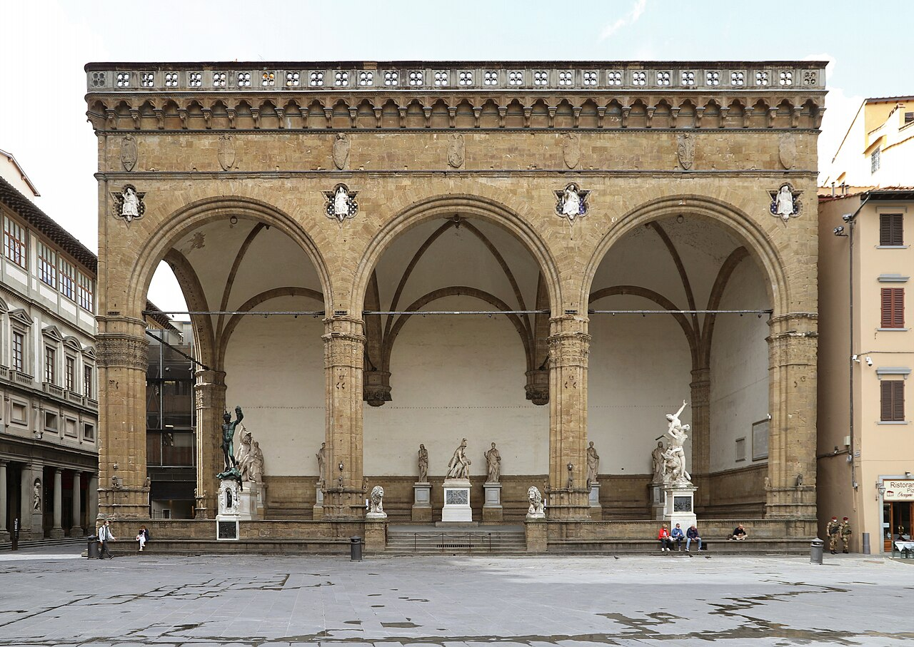
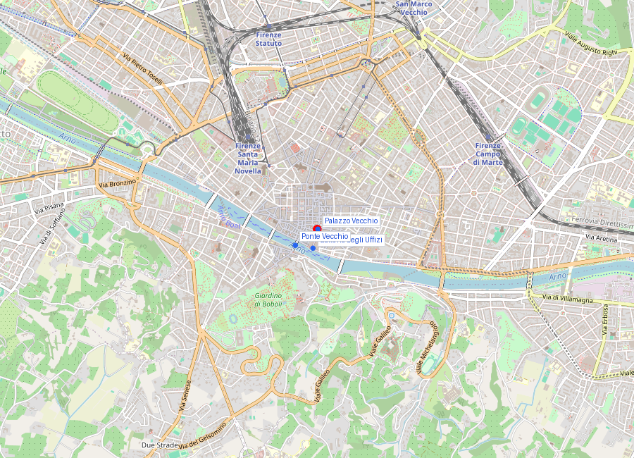
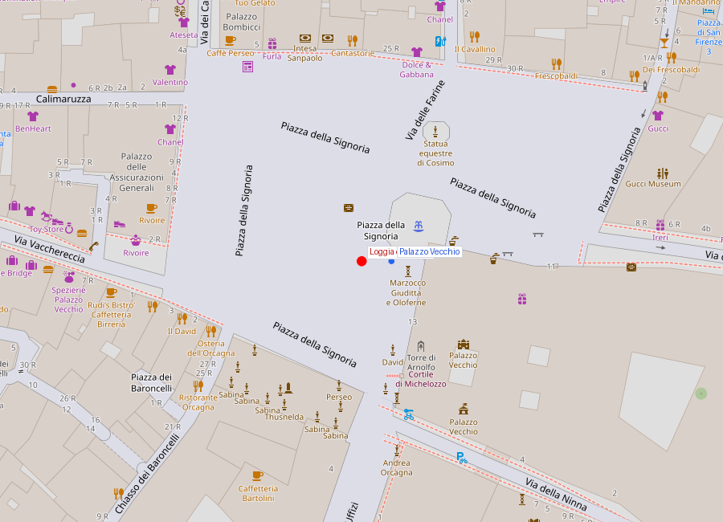

# Loggia dei Lanzi

```yaml
lugar:
  nombre_original: "Loggia dei Lanzi"
  nombre_alternativo: "Loggia della Signoria / Loggia dell'Orcagna"
  pais: "Italia"
  region_admin: "Toscana"
  coordenadas: "43.7695° N, 11.2558° E"
  fecha_visita: "[DATO PENDIENTE — verificar fuente]"
```

## Mapa







---

## Qué había antes

La Loggia ocupa el ángulo sureste de **Piazza della Signoria**, la plaza del gobierno de Firenze desde el siglo XIII. Antes de su construcción, el espacio era parte abierta de la plaza, frente al Palazzo Vecchio.

---

## Historia

### Línea de tiempo

| Fecha | Hito |
|---|---|
| 1376–1382 | Construcción de la Loggia por Benci di Cione y Simone di Francesco Talenti, bajo la supervisión de la Signoria de Firenze |
| Siglo XIV–XV | Uso original: ceremonia política. Aquí se proclamaban las nuevas magistraturas, se recibían embajadores extranjeros y se juraba el cargo. Sin función militar original |
| 1540 | Cosimo I de' Medici instala su guardia personal de lansquenetes (*lanzichenecchi*) en la Loggia — de ahí el nombre popular "dei Lanzi" |
| 1554 | **Benvenuto Cellini** instala el *Perseo con la testa di Medusa*, considerado su obra maestra |
| 1583 | **Giambologna** instala el *Ratto delle Sabine*, escultura que redefine los límites técnicos de la escultura en mármol |
| 1600 | Se añade el *Ercole e il centauro Nesso* de Giambologna |
| Siglos XVII–XIX | La Loggia se convierte progresivamente en un museo al aire libre; se añaden esculturas antiguas y otras obras al conjunto |
| Actualidad | Las obras son originales expuestas a la intemperie (con las tensiones de conservación que eso implica); el *Perseo* fue restaurado y temporalmente devuelto al interior del Bargello durante restauraciones |

### Narrativa

La Loggia dei Lanzi es el museo de escultura al aire libre más extraordinario de Europa, y lo es de manera completamente accidental: nadie la diseñó como galería. Fue un espacio de ceremonias políticas que fue acumulando obras maestras durante tres siglos hasta convertirse en lo que es hoy: una galería abierta donde el *Perseo* de Cellini y el *Ratto delle Sabine* de Giambologna compiten en el mismo espacio con esculturas grecorromanas antiguas, mientras los turistas pasan y los palominos se posan en las cornisas.

---

## Ratto delle Sabine (Giambologna, 1583)

La escultura es un desafío técnico obsesionado consigo mismo. Giambologna —nacido Jean Boulogne en Douai, Flandes, y trabajando en Firenze bajo los Médici— quiso demostrar que era posible esculpir en mármol un grupo de **tres figuras entrelazadas en movimiento espiral** sin punto de vista principal: la escultura es igualmente válida desde cualquier ángulo. Esto se llama figura serpentinata llevada a su extremo.

El tema del *Ratto* (rapto, en el sentido de captura violenta) fue elegido **después** de terminar la escultura, lo que es completamente inusual. Giambologna primero resolvió el problema técnico y formal, y luego pensó en qué narrativa aplicarle. El tema del rapto de las sabinas —el episodio mitológico-histórico en que los romanos fundadores raptaron mujeres de la tribu sabina para repoblar Roma— fue sugerido por el historiador Raffaello Borghini como la única historia que justificaba esa composición de un hombre mayor aplastado, un hombre joven que se lanza hacia arriba y una mujer que forcejea y se resiste.

El bloque de mármol es de Carrara y medía originalmente [⚠ VERIFICAR dimensiones exactas] metros. El desafío estructural era extremo: el peso recae sobre las piernas del hombre mayor arrodillado, que soporta el peso de los otros dos. El mármol no puede resistir tracción, solo compresión; Giambologna tuvo que calcular los ángulos de carga para que el bloque no se fracturara.

---

## Perseo con la testa di Medusa (Benvenuto Cellini, 1545–1554)

Cellini tardó casi diez años en completar esta escultura en bronce, y la fundición final casi termina en desastre: según la propia autobiografía de Cellini (el primer relato autobiográfico de un artista en la historia occidental), mientras el metal no fluía correctamente en el molde, arrojó al horno todos los platos y vajilla de estaño de su casa para bajar la temperatura de fusión y completar el vaciado. La historia puede ser exagerada literariamente, pero la escultura existe.

Perseo, de pie sobre el cuerpo de Medusa, sostiene su cabeza cortada. La sangre que brota del cuello de Medusa está representada en bronce con una veracidad visceral. En la base del pedestal, Cellini incluyó un autorretrato en una de las caras.

---

## Otras esculturas destacadas

- *Ercole e Caco* (Baccio Bandinelli, 1534) — A la derecha de la puerta del Palazzo Vecchio; fue muy criticada en su época, comparada desfavorablemente con el *David*
- *Giuditta e Oloferne* (Donatello, siglo XV) — Copia; el original está en el interior del Palazzo Vecchio
- Varias esculturas romanas antiguas en las paredes laterales de la Loggia

---

## Conexiones

- El *Ratto delle Sabine* está a metros de la copia del *David* en Piazza della Signoria; el original del *David* está en la **Galleria dell'Accademia**.
- Giambologna trabajó también para los Médici en el **Palazzo Vecchio** y fue el escultor de corte más influyente de la segunda mitad del siglo XVI en Firenze.
- La Loggia es el límite sur de Piazza della Signoria, que tiene al **Palazzo Vecchio** en su lado norte.

---

## Datos interesantes

- El nombre "dei Lanzi" viene de los lansquenetes alemanes de Cosimo I, no de ninguna función bélica original de la estructura.
- La escultura del *Ratto* fue la primera obra de arte público en Firenze concebida para ser vista desde todos los ángulos simultáneamente —anticipando el concepto moderno de escultura exenta en el espacio.
- Cellini describe en su *Vita* que cuando el Perseo fue descubierto al público en 1554, la multitud que llenó la plaza vitoreó la obra; fue uno de los primeros "eventos de debut" artísticos documentados en la historia.

---

*fuente: Museo Nazionale del Bargello; Charles Avery, Giambologna: The Complete Sculpture; Benvenuto Cellini, La Vita; John Pope-Hennessy, Italian High Renaissance and Baroque Sculpture.*
