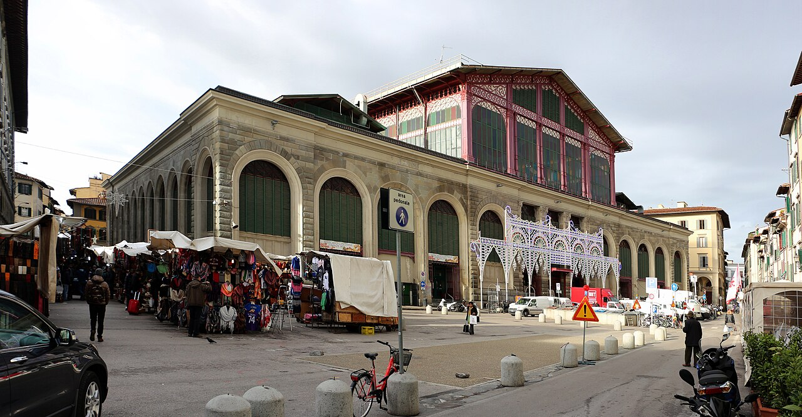

# Mercato Centrale di San Lorenzo

```yaml
lugar:
  nombre_original: "Mercato Centrale di San Lorenzo"
  pais: "Italia"
  region_admin: "Toscana"
  coordenadas: "43.7754° N, 11.2539° E"
  fecha_visita: "[DATO PENDIENTE — verificar fuente]"
```

## Mapa



[DATO PENDIENTE — generar mapa con pin]

---

## Qué había antes

La zona entre la Basilica di San Lorenzo y el convento de San Lorenzo fue durante siglos el corazón del comercio textil florentino: uno de los tres grandes mercados de la ciudad medieval. El mercado al aire libre en las calles adyacentes (especialmente en lo que hoy es Via dell'Ariento y alrededores) existía desde la Edad Media. El edificio de hierro y cristal vino a cubrir y ordenar una actividad comercial ya centenaria.

---

## Historia

### Línea de tiempo

| Fecha | Hito |
|---|---|
| Siglos XIII–XIV | El mercado del barrio de San Lorenzo es uno de los mercados centrales de Firenze medieval, especializado en telas y alimentos |
| 1874 | Inauguración del edificio actual, diseñado por **Giuseppe Mengoni** — el mismo arquitecto de la Galleria Vittorio Emanuele II de Milán (inaugurada en 1877) |
| 1874–1980s | El mercado funciona como distribución mayorista y minorista de alimentos: carnes, pescados, verduras, aceites, quesos |
| 2014 | El primer piso (azotea) se transforma en el **Mercato Centrale** gastronómico: artesanos y pequeños productores toscanos con puestos especializados |

### Narrativa

El edificio del Mercato Centrale es uno de los grandes ejemplos de arquitectura de hierro y cristal del siglo XIX en Italia: una estructura de hierro fundido con cubierta de vidrio, iluminada cenital, que combina la funcionalidad industrial con una ligereza visual que desafía la tradición de piedra florentina. Mengoni —que moriría en 1877 al caer de un andamio durante la instalación de los últimos elementos de la Galleria de Milán— diseñó esta nave con la misma lógica de los grandes mercados y estaciones europeas de la época.

La vida del mercado tiene dos capas temporales completamente distintas. La planta baja mantiene en buena medida la función original: carnicerías, pescaderías, puestos de verduras, quesos, embutidos, aceites. Es ruidosa, práctica, huele a comida real. El primer piso renovado en 2014 es exactamente lo contrario: silencioso, curado, orientado al turista y al florentino con presupuesto. Los dos coexisten en el mismo edificio como si vivieran en épocas distintas.

Alrededor del edificio, las calles del barrio de San Lorenzo (especialmente Via dell'Ariento) están cubiertas de puestos de cuero, textiles y souvenirs: es el Mercato di San Lorenzo, el mercado callejero. Es el contraste máximo con la Firenze museística: aquí Firenze sigue siendo una ciudad que vende cosas, que regatia, que huele a cuero y a fritura.

---

## Conexiones

- El edificio está pegado al costado norte de la **Basilica di San Lorenzo**, cuya parte trasera (el ábside y el claustro) se ve desde los puestos del mercado.
- Mengoni diseñó este edificio y la **Galleria Vittorio Emanuele II de Milán** en el mismo período — ambos son iconos de la arquitectura italiana del hierro y cristal del siglo XIX.

---

## Datos interesantes

- El edificio fue construido sobre el mismo eje del diseño urbanístico renacentista del barrio Médici, que organizaba San Lorenzo, el convento y el Palazzo Medici Riccardi como conjunto. El mercado de hierro del siglo XIX se insertó en esa trama sin demoler las preexistencias.
- La trattoria más antigua del barrio de San Lorenzo todavía en funcionamiento data de [DATO PENDIENTE — verificar fuente].

---

*fuente: Comune di Firenze, Piano Strutturale; Giovanni Klaus Koenig, Architettura del Novecento in Toscana; sitio oficial Mercato Centrale Firenze.*
