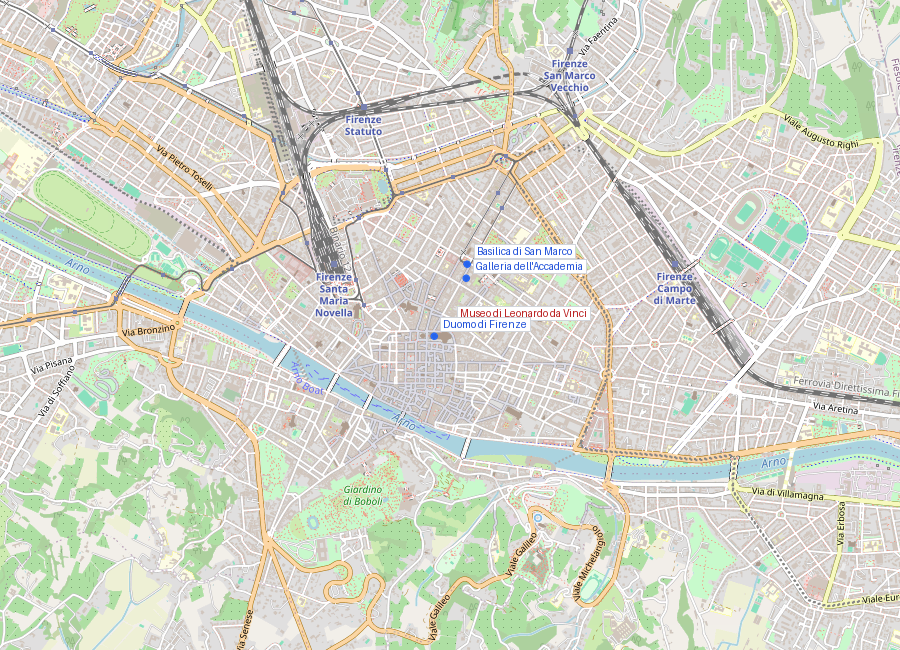
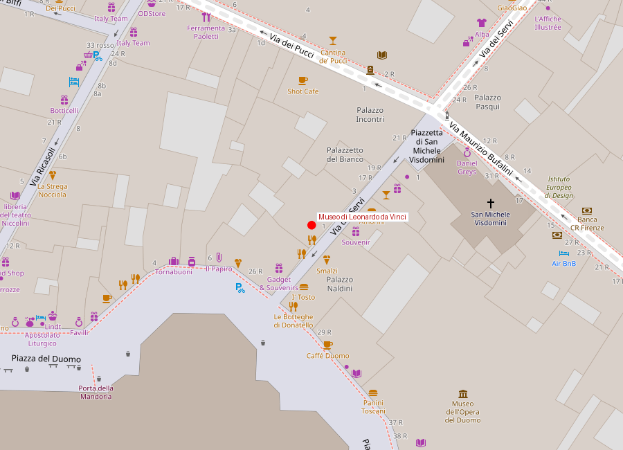

# Museo Nazionale della Scienza e della Tecnologia "Leonardo da Vinci"

> **Nota:** El museo comúnmente llamado "Museo da Vinci" en Firenze es el **Museo Nazionale del Bargello** en cuanto a escultura, pero como museo dedicado específicamente a Leonardo existe el **Museo Nazionale della Scienza e della Tecnologia "Leonardo da Vinci"** en Milán. En Firenze, la institución dedicada específicamente a Leonardo es el **Museo Leonardiano** (en Vinci, localidad natal, a ~40 km) y el **Museo dell'Opera del Duomo** / **Galleria degli Uffizi** que conservan obra suya.
>
> Sin embargo, en el centro de Firenze existe el **Museo Galileo** (Lungarno degli Uffizi) y el espacio dedicado específicamente a modelos de máquinas de Leonardo da Vinci: el **Museo di Leonardo da Vinci** en Via dei Servi. Este archivo documenta este último.

```yaml
lugar:
  nombre_original: "Museo di Leonardo da Vinci"
  pais: "Italia"
  region_admin: "Toscana"
  coordenadas: "43.7738° N, 11.2574° E"
  fecha_visita: "[DATO PENDIENTE — verificar fuente]"
```

## Mapa





---

## Historia y propósito

El museo es una institución privada dedicada a exhibir **modelos a escala de las máquinas y mecanismos diseñados por Leonardo da Vinci**, basados en los estudios de sus cuadernos (*codici*). No conserva obras originales del maestro — esas están repartidas entre la Galleria degli Uffizi (el *Annunciazione* y el *Adorazione dei Magi*, ambos inacabados), la Biblioteca degli Uffizi, y colecciones externas.

El valor del museo está en hacer tangibles los inventos: puedes ver construidos y manipulables los diseños de máquinas voladoras, grúas, puentes portátiles, mecanismos de engranajes, vehículos y armas de asedio que Leonardo dibujó en sus cuadernos entre ~1478 y 1519.

---

## Leonardo en Firenze

Leonardo da Vinci nació en 1452 en el pueblo de **Vinci** (a ~40 km de Firenze) y creció y se formó en la ciudad. A los 14 años entró como aprendiz en el taller de **Andrea del Verrocchio** en Firenze, donde permaneció hasta ~1476. Del taller de Verrocchio salieron también: **Botticelli** (contemporáneo), **Pietro Perugino** y **Lorenzo di Credi$.

Los años florentinos de Leonardo producen sus primeras obras documentadas. Pero en 1482, con 30 años, se marchó a Milán al servicio de **Ludovico Sforza** ("il Moro") y no regresó a Firenze hasta 1500. El segundo período florentino (1500–1506) produjo el cartón de la *Virgen con el Niño y Santa Ana* (hoy en Londres) y el trabajo preparatorio para el fresco de la **Batalla de Anghiari** en el Salone dei Cinquecento del **Palazzo Vecchio** — fresco nunca completado o perdido bajo la renovación de Vasari, cuya búsqueda sigue activa hoy.

---

## Qué ver

- Modelos de la máquina voladora (ornitóptero), el ala delta y el paracaídas diseñados en el *Codice sul volo degli uccelli*
- Modelos de armas de asedio: ballesta gigante, cañón de vapor, carro blindado
- Mecanismos de engranajes y transmisión de movimiento
- Modelos de ingeniería hidráulica y civil

---

## Nota sobre el Museo Leonardiano de Vinci

El pueblo natal de Leonardo, **Vinci**, está a unos 40 km de Firenze y tiene el **Museo Leonardiano** (Castello dei Conti Guidi) con una colección similar de modelos pero en un contexto histórico más profundo. Si hay interés específico en Leonardo, la excursión a Vinci combina museo con el paisaje toscano donde creció el artista.

---

## Connexiones

- La *Adorazione dei Magi* (inacabada, 1481) y el *Annunciazione* de Leonardo están en la **Galleria degli Uffizi**, a pocos minutos.
- La búsqueda de la *Battaglia di Anghiari* perdida ocurre en el **Palazzo Vecchio** (Salone dei Cinquecento).
- El **Museo Galileo** (contiguo a los Uffizi) es el complemento natural: ciencia del Renacimiento y del Barroco con instrumentos originales.

---

*fuente: Museo di Leonardo da Vinci Firenze (sitio oficial); Walter Isaacson, Leonardo da Vinci (2017); Martin Kemp, Leonardo da Vinci: The Marvellous Works of Nature and Man.*
