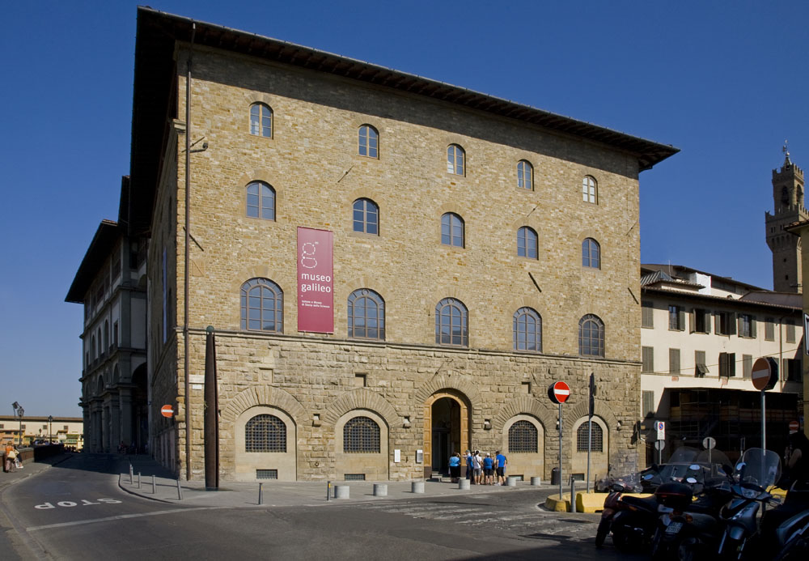

# Museo Galileo

```yaml
lugar:
  nombre_original: "Museo Galileo — Istituto e Museo di Storia della Scienza"
  nombre_alternativo: "Museo di Storia della Scienza"
  pais: "Italia"
  region_admin: "Toscana"
  coordenadas: "43.7681° N, 11.2558° E"
  fecha_visita: "[DATO PENDIENTE — verificar fuente]"
```

## Mapa



[DATO PENDIENTE — generar mapa con pin]

---

## Qué había antes

El edificio que alberga el museo es el **Palazzo Castellani**, una construcción medieval sobre el Lungarno, adyacente a los Uffizi y frente al Arno. Originalmente sede de la familia Castellani y luego de diversas instituciones florentinas, se convirtió en sede del museo de historia de la ciencia en el siglo XX.

---

## Historia

### Línea de tiempo

| Fecha | Hito |
|---|---|
| Siglos XVI–XVII | Los Médici coleccionan activamente instrumentos científicos; Galileo trabaja bajo el patrocinio de Cosimo II de' Medici |
| 1657 | Fundación de la **Accademia del Cimento** en Firenze, primera academia científica experimental del mundo, bajo patronazgo de los Médici |
| 1775 | Pedro Leopoldo de Lorena organiza la colección de instrumentos científicos en el Palazzo degli Uffizi, formando el núcleo del futuro museo |
| 1930 | Se funda formalmente el Istituto e Museo di Storia della Scienza en el Palazzo Castellani |
| 1642 | Galileo muere en Arcetri; sus objetos personales y científicos son preservados por sus discípulos |
| 2010 | Renovación completa y rebautizo como **Museo Galileo** |

### Narrativa

El Museo Galileo es uno de los museos científicos más extraordinarios de Europa, pero no es un museo de ciencia en el sentido moderno: es un archivo físico del pensamiento científico del Renacimiento y el período barroco europeo, con los objetos originales que usaron los hombres que cambiaron la forma en que entendemos el universo.

La pieza más celebrada —y perturbadora— es el **dedo medio de Galileo**, conservado en un relicario de cristal. Fue separado de su cuerpo en 1737, cuando se trasladaron sus restos a Santa Croce, en un gesto que mezcla veneración y macabra ironía: al hombre que señaló el cielo con su telescopio, sus admiradores le conservaron el dedo que lo señalaba. El objeto se perdió en el siglo XIX y fue redescubierto y devuelto al museo en 2009.

Además del dedo, el museo conserva **dos telescopios originales de Galileo** (los únicos supervivientes conocidos), el **objetivo de su telescopio** con el que descubrió los satélites de Júpiter en enero de 1610, y el **compás geométrico-militar** que él mismo construyó y vendió a nobles para cálculos de artillería y finanzas.

Los instrumentos de los Médici que rodean estas piezas centrales son igualmente fascinantes: astrolabios, globos celestes y terrestres, armillas, termómetros (algunos de los más antiguos conservados), brújulas de inclinación, y los instrumentos de la Accademia del Cimento —la primera academia que hizo del experimento repetible su método central.

---

## Conexiones

- Galileo está enterrado en la **Basilica di Santa Croce**, a pocos minutos a pie.
- La Accademia del Cimento operaba bajo el patrocinio de los mismos Médici que gobernaban desde el **Palazzo Vecchio** y residían en el **Palazzo Pitti**.
- El museo está a metros de la **Galleria degli Uffizi**: los Médici usaron el mismo complejo para albergar arte y ciencia.

---

## Datos interesantes

- Galileo nunca "inventó" el telescopio (lo perfeccionó y fue el primero en usarlo sistemáticamente para astronomía), pero sus dos telescopios conservados son los objetos más directamente relacionados con la revolución científica que existen en el mundo.
- El Museo Galileo tiene una de las colecciones de globos terrestres de los siglos XVI–XVIII más importantes de Europa: algunos muestran el mundo tal como lo entendían cartógrafos que aún no sabían de la existencia de Australia o de la costa oeste de América.
- La temperatura medida por Galileo con su termoscopio (precursor del termómetro) no usaba ninguna escala numérica: simplemente mostraba más o menos calor. La escala numérica vino después con Fahrenheit y Celsius.

---

*fuente: Museo Galileo — Istituto e Museo di Storia della Scienza (sitio oficial); Stillman Drake, Galileo at Work; Paolo Galluzzi, The Art of Invention.*
