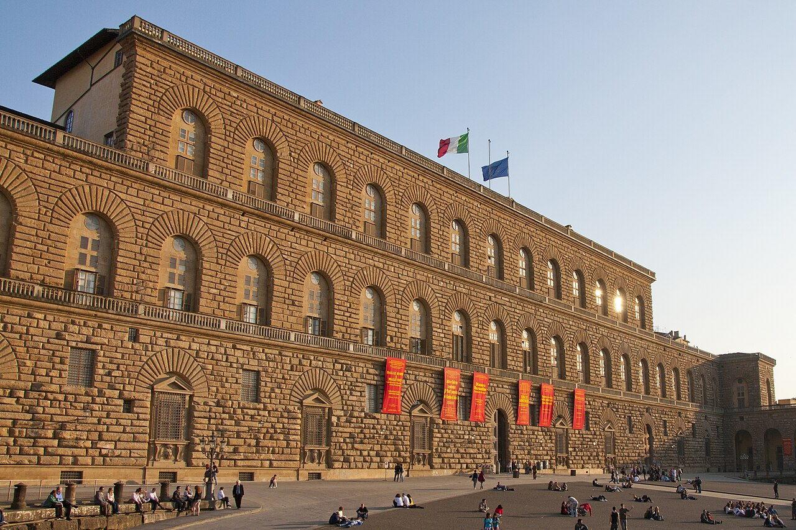
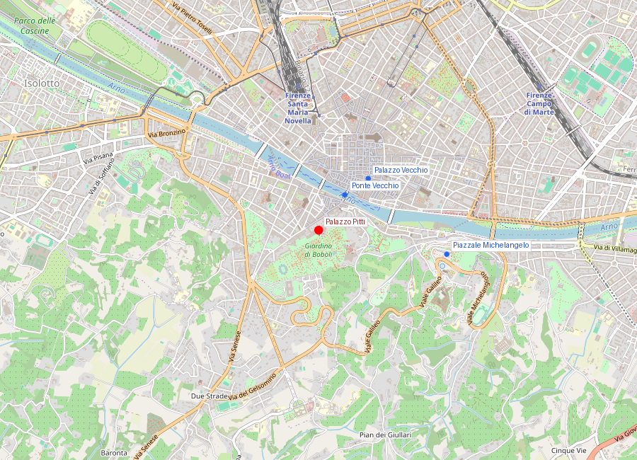
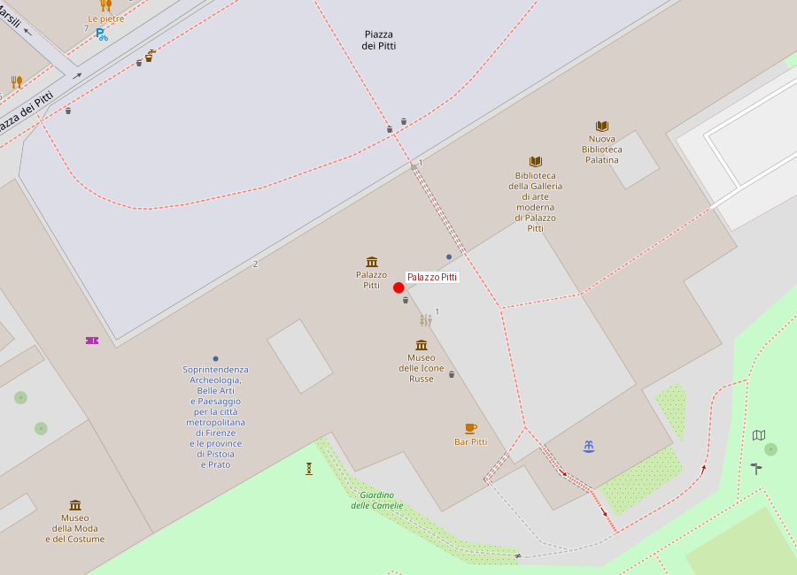

# Palazzo Pitti y Giardino di Boboli

```yaml
lugar:
  nombre_original: "Palazzo Pitti / Giardino di Boboli"
  pais: "Italia"
  region_admin: "Toscana"
  coordenadas: "43.7650° N, 11.2499° E"
  fecha_visita: "[DATO PENDIENTE — verificar fuente]"
```

## Mapa







---

## Qué había antes

El terreno al sur del Arno (el barrio Oltrarno, literalmente "más allá del Arno") era, en el siglo XV, zona de expansión residencial de las familias mercantiles florentinas que no encontraban espacio en el centro denso de la ciudad. La colina detrás del palazzo era terreno baldío con viñas y huertos.

---

## Historia

### Línea de tiempo

| Fecha | Hito |
|---|---|
| 1458 | Luca Pitti encarga el palazzo, probablemente con diseño de Brunelleschi o de su discípulo Luca Fancelli |
| 1465–1472 | Construcción del núcleo original (mucho más pequeño que el actual) |
| 1492 | Muerte de Lorenzo il Magnifico; una serie de crisis políticas y económicas debilitan a los Pitti |
| 1549 | **Eleonora di Toledo**, esposa de Cosimo I de' Medici, compra el palazzo a la familia Pitti en quiebra. Se convierte en residencia oficial de los Médici |
| 1550 | Inicia el diseño del **Giardino di Boboli** bajo dirección de Niccolò Pericoli (*Il Tribolo*); el proyecto continúa con Bartolomeo Ammannati y Bernardo Buontalenti |
| 1560s–1600s | Expansión progresiva del palazzo; se añaden las dos alas laterales que le dan su aspecto actual |
| 1766 | El Giardino di Boboli se abre al público por primera vez |
| 1737 | Con la extinción de los Médici, el palazzo pasa a los Lorena (Habsburgo-Lorena) |
| 1860 | Vittorio Emanuele II usa el palazzo como residencia real durante el período en que Firenze fue capital de Italia (1865–1871) |
| 1919 | El palazzo y sus colecciones son cedidos al Estado italiano por Vittorio Emanuele III |

### Narrativa

Palazzo Pitti empezó como símbolo de rivalidad y terminó como símbolo de poder absoluto. Luca Pitti fue uno de los ciudadanos más ricos y ambiciosos de Firenze, rival directo de los Médici. Mandó construir el palazzo más grande visto hasta entonces en la ciudad —según la leyenda, con la instrucción de que las ventanas fueran más grandes que la puerta entera del Palazzo Medici—. La ironía histórica es perfecta: los Pitti nunca terminaron de pagarlo, cayeron en ruina, y fueron los propios Médici quienes compraron el edificio y lo transformaron en su residencia principal.

Eleonora di Toledo fue quien tomó la decisión estratégica de cruzar el Arno. Hasta entonces los Médici vivían en el Palazzo Medici Riccardi (zona norte, cerca de San Lorenzo) y gobernaban desde el Palazzo Vecchio en el centro. Eleonora quería una residencia separada del espacio de gobierno, con jardín y espacio para su familia. El Corridoio Vasariano —el pasaje elevado que conecta Palazzo Vecchio, Uffizi, Ponte Vecchio y Palazzo Pitti— se construyó precisamente para que los Médici pudieran moverse entre los tres puntos de poder sin bajar a la calle.

El **Giardino di Boboli** es uno de los jardines formales más influyentes de Europa, modelo directo para los jardines de Versalles. Se extiende en terrazas sobre la colina detrás del palazzo: gruta manierista (Grotta del Buontalenti, una de las más extrañas y fascinantes del Renacimiento italiano), anfiteatro, fuentes, estanque con islote. En la Grotta hay copias de los *Prigioni* de Michelangelo (los originales están en la Accademia) fundidas para el contexto del jardín.

---

## Colecciones

Palazzo Pitti alberga varios museos independientes:

- **Galleria Palatina** — Pintura de los siglos XVI–XVII: Tiziano, Rafael, Rubens, Caravaggio, Van Dyck
- **Galleria d'Arte Moderna** — Pintura italiana del siglo XIX
- **Museo degli Argenti** — Tesoro de los Médici: orfebrería, camafeos, cristales
- **Museo della Moda e del Costume** — Historia del vestuario real y cortesano
- **Museo delle Porcellane** — Porcelanas europeas del siglo XVIII

---

## Conexiones

- El **Corridoio Vasariano** conecta este palazzo con los **Uffizi** y el **Ponte Vecchio**: es la espina dorsal del sistema de poder espacial de los Médici en Firenze.
- El Giardino di Boboli sirvió de modelo para el diseño de **Versalles** (la visita de la delegación francesa al jardín está documentada).
- La Grotta del Buontalenti alberga copias de los *Prigioni* de Michelangelo; los originales están en la **Galleria dell'Accademia**.

---

## Datos interesantes

- El palazzo tiene la fachada sin revoque (pietra forte, piedra gris oscura sin enlucir) más grande de Firenze: 205 metros de largo. Fue una elección estética deliberada, símbolo de solidez y poder.
- Eleonora di Toledo murió de tuberculosis en 1562 junto con varios de sus hijos. Cosimo I nunca recuperó del todo el interés en los asuntos del Estado.

---

*fuente: Museo Palazzo Pitti (sitio oficial); Giorgio Vasari, Le Vite; L. Berti, Il principe dello Studiolo.*
