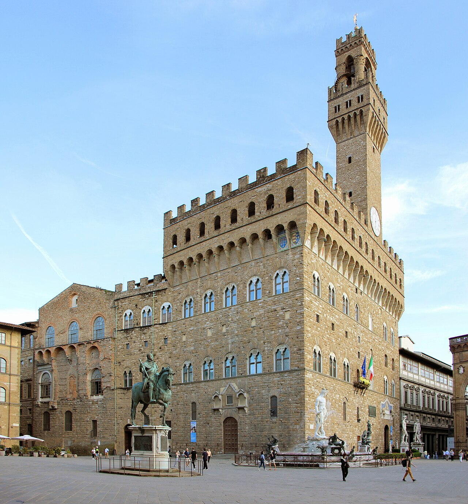
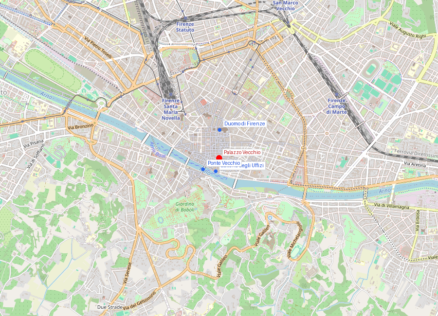
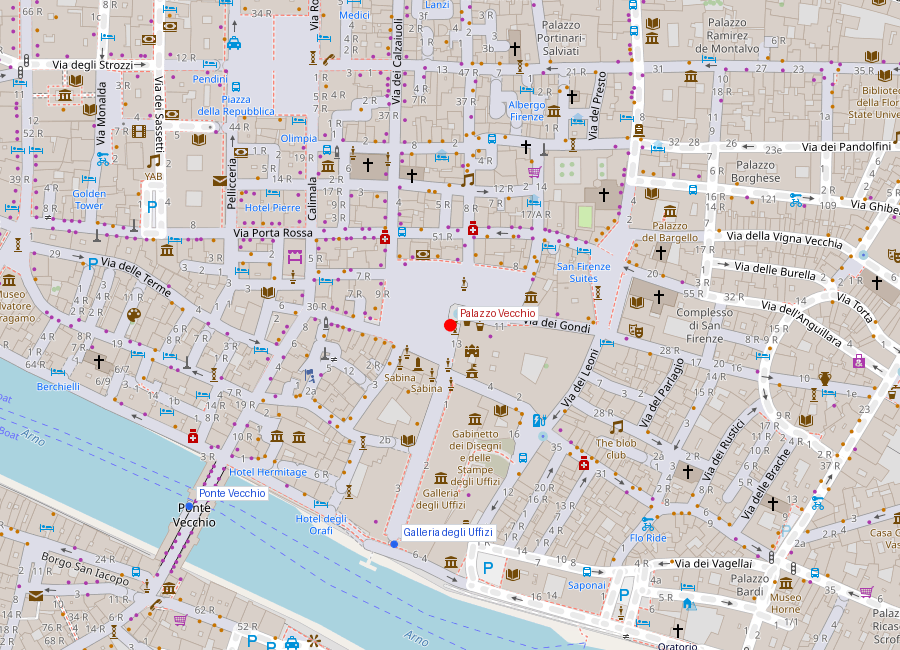

# Palazzo Vecchio

```yaml
lugar:
  nombre_original: "Palazzo Vecchio"
  nombre_alternativo: "Palazzo della Signoria, Palazzo Ducale (en el siglo XVI)"
  pais: "Italia"
  region_admin: "Toscana"
  coordenadas: "43.7695° N, 11.2559° E"
  fecha_visita: "[DATO PENDIENTE — verificar fuente]"
```

## Mapa







---

<!-- 📷 FOTO: fachada del Palazzo Vecchio con Torre di Arnolfo / Piazza della Signoria -->

## Qué había antes

El palacio fue construido sobre los restos de las torres y casas de la familia **Uberti**, una de las familias gibelinas más poderosas de Firenze, expulsada de la ciudad en 1258 tras la victoria güelfa. La demolición de sus propiedades y la prohibición de construir en ese terreno fue una sentencia de *damnatio memoriae* civil: el suelo maldito de una familia enemiga de la república. La forma irregular del palacio —con la torre descentrada respecto a la fachada— se explica en parte por el deseo de no construir sobre el suelo de los Uberti.

---

## Historia

### Línea de tiempo

| Fecha | Hito |
|---|---|
| 1258 | Los güelfos expulsan a los Uberti y prohíben construir sobre su suelo |
| 1299-1302 | **Arnolfo di Cambio** proyecta y comienza la construcción del Palazzo della Signoria como sede del gobierno comunal |
| 1310-1314 | Se completa la **Torre di Arnolfo** (94 metros) |
| 1342 | **Walter de Brienne**, llamado el "Duca d'Atene", intenta tomar el poder personal; es expulsado; la ciudad refuerza el carácter republicano del edificio |
| 1497 | **Savonarola** celebra la primera "Fogarata della vanità" en la **Piazza della Signoria** frente al palacio |
| 1498 | Savonarola es quemado en la misma plaza |
| 1504 | El **David** de Michelangelo es instalado en la entrada del palacio (hoy hay una copia; el original está en la Galleria dell'Accademia) |
| 1540 | **Cosimo I de' Medici** traslada la residencia ducal al palacio; encarga a **Giorgio Vasari** la transformación del interior |
| 1565 | Vasari construye el **Corridoio Vasariano** que parte desde los Uffizi y pasa frente al palacio |
| 1565 | Cosimo I se traslada al **Palazzo Pitti**, en el Oltrarno; el Palazzo della Signoria pasa a llamarse *Palazzo Vecchio* ("palacio viejo") |
| 1865-1871 | Sede del primer Parlamento italiano durante la etapa en que Firenze es capital del Reino de Italia |
| Actualidad | Sede del Municipio (Comune) de Firenze y museo |

### Narrativa

El Palazzo Vecchio es, más que cualquier otro edificio de Firenze, el símbolo del poder en la ciudad: primero del poder comunal republicano, luego del poder ducal medicea, luego del poder del Estado italiano en formación. Su historia es la historia de todos los regímenes que gobernaron Firenze, y cada uno dejó su huella en el interior.

Arnolfo di Cambio lo proyectó deliberadamente imponente y austero: macizo, de pietra forte grisácea, con una merlatura gibelina sobre el paramento y la Torre di Arnolfo elevándose 94 metros —visible desde cualquier punto de la ciudad—. No era un palacio para vivir cómodamente: era una demostración de poder cívico, la sede de la *Signoria* (el gobierno de los Priori), cuyos miembros vivían aquí durante los dos meses de su mandato para garantizar la imparcialidad de las decisiones, aislados de sus familias y de las presiones externas.

Cuando Cosimo I de' Medici se instaló en el palacio en 1540, Vasari transformó el interior en una máquina de propaganda visual. El **Salone dei Cinquecento** —la sala grande proyectada por Cronaca y Simone del Pollaiuolo en 1494 para el Gran Consejo de la República (500 miembros)— fue rediseñado por Vasari con frescos inmensos que celebran las victorias militares de Cosimo I contra Siena y Pisa. En las paredes, gigantescas batallas; en el techo artesonado, la apoteosis de Cosimo.

---

## El misterio del "Cerca trova"

<!-- 📷 FOTO: Salone dei Cinquecento / detalle de los frescos de Vasari -->

En el fresco de la **Batalla di Marciano** (1563) de Vasari en el Salone dei Cinquecento, cerca de la esquina superior izquierda, hay una pequeña cartela con la inscripción: ***"Cerca trova"*** ("El que busca, encuentra"). La inscripción es inusual —ningún otro fresco de la sala la tiene— y aparece en un lugar casi invisible.

El historiador del arte **Maurizio Seracini** propuso desde los años 1970 que la inscripción es una pista dejada por Vasari para indicar que debajo de ese fresco existe una obra perdida: la **Battaglia di Anghiari** de **Leonardo da Vinci**, pintada en 1503-1505 y considerada el fresco más importante de Leonardo, documentada extensamente pero nunca localizada. Vasari habría construido una nueva pared frente a la original para preservar el fresco de Leonardo antes de pintarla, dejando la pista en el lugar.

Las investigaciones de Seracini con técnicas no invasivas encontraron indicios de un espacio y un pigmento consistente con la técnica de Leonardo detrás de la pared de Vasari. El proyecto "La Battaglia di Anghiari" permanece sin conclusión definitiva: la perforación de los frescos de Vasari es políticamente y conservativamente controversia. [⚠ VERIFICAR estado actual de la investigación]

---

## El Salone dei Cinquecento

- Dimensiones: 54 × 23 metros, techo a 18 metros — fue la sala de reuniones más grande de Italia en su tiempo.
- Los frescos de las batallas de Vasari son de dimensiones colosales; los paneles del techo (39 en total) narran la historia de Firenze.
- La escultura del **Genio della Vittoria** de Michelangelo (originalmente concebida para la tumba del papa Julio II) fue instalada aquí por Cosimo I.
- El **Ercole e Caco** de Baccio Bandinelli frente a la entrada exterior fue tan criticado en su época por la ciudadanía —comparado negativamente con el David de Michelangelo que reemplazó— que Bandinelli fue objeto de burlas populares.

---

## La Piazza della Signoria

<!-- 📷 FOTO: Loggia dei Lanzi / Perseo de Cellini / targa de Savonarola en el suelo -->

La plaza frente al palacio es, junto con la Piazza del Duomo, el espacio cívico central de Firenze. Funciona como galería de escultura al aire libre:
- **Loggia dei Lanzi** (1376–1382): galería cubierta que alberga el *Perseo* de Cellini (1554), el *Ratto delle Sabine* de Giambologna (1583), y otras esculturas.
- **Copia del David** en la entrada del palacio.
- **Ercole e Caco** de Bandinelli.
- **Fontana del Nettuno** (il Biancone) de Ammannati (1565): Neptuno en mármol blanco de Carrara, burlado en su época con el dicho "Ammannato, Ammannato, che bel marmo hai rovinato" ("qué buen mármol has arruinado").
- Una targa en el suelo de piedra marca el lugar donde **Savonarola** fue quemado en 1498.

---

## Qué se puede ver hoy

<!-- 📷 FOTO: Studiolo di Francesco I / Sala dei Gigli / vista desde la Torre di Arnolfo -->

- **Exterior**: la fachada de pietra forte, la Torre di Arnolfo (visitable), la copia del David, la Loggia dei Lanzi.
- **Salone dei Cinquecento**: accesible en el horario del museo.
- **Studiolo di Francesco I**: gabinete secreto de Francesco I de' Medici, sin ventanas, decorado con pinturas de Bronzino y Vasari que albergan armarios ocultos. Un espacio íntimo y extraño dentro del palacio monumental.
- **Sala dei Gigli**: sala con el fresco de Domenico Ghirlandaio (1485) y el *Giuditta e Oloferne* de Donatello.
- **Cappella di Eleonora**: frescos de Agnolo Bronzino.
- **La Torre di Arnolfo**: vista de 360° sobre la ciudad, el Duomo y las colinas.

---

## Conexiones

- El **Corridoio Vasariano** pasa frente al palacio uniendo los Uffizi (a 50 metros) con el **Ponte Vecchio** y el **Palazzo Pitti**.
- El *Perseo* de Cellini en la Loggia dei Lanzi es del mismo artista cuyo busto preside el **Ponte Vecchio**.
- La **Battaglia di Anghiari** de Leonardo que posiblemente se esconde detrás de los frescos de Vasari fue pintada en la misma época en que Leonardo pintaba la **Ultima Cena** en Milán y que Michelangelo esculpía el **David** a pocos metros, en el mismo Salone.
- El debate entre el David y el Ercole e Caco es un capítulo en la historia de los encargosy tensiones entre artistas y mecenas que atraviesa toda la Firenze del Cinquecento.

---

*fuente: Sitio oficial del Museo di Palazzo Vecchio (museicivicifiorentini.comune.fi.it); Richard Turner, "Renaissance Florence: The Invention of a New Art" (1997); Encyclopædia Britannica; Wikipedia (entradas verificadas).*
