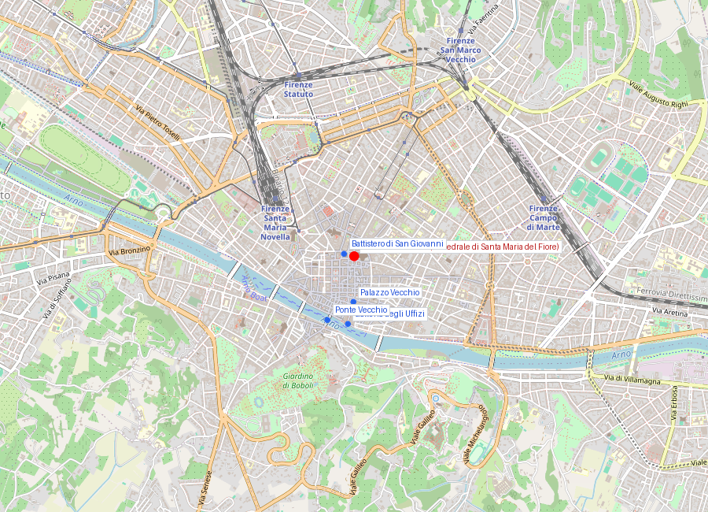
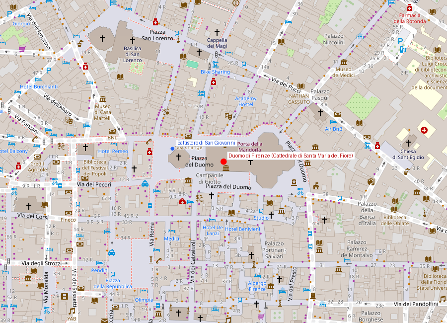

# Piazza del Duomo — Complesso monumentale

```yaml
lugar:
  nombre_original: "Piazza del Duomo"
  pais: "Italia"
  region_admin: "Toscana"
  coordenadas: "43.7731° N, 11.2560° E"
  fecha_visita: "[DATO PENDIENTE — verificar fuente]"
```

> **Nota de archivo**: Este documento es la guía integrada de todos los monumentos de la Piazza del Duomo. Los sitios se documentan también de forma individual:
> - [Cattedrale di Santa Maria del Fiore (Duomo)](duomo.md)
> - [Battistero di San Giovanni](battistero_san_giovanni.md)

---

## Mapa del complesso





---

## Visión de conjunto

<!-- 📷 FOTO: vista general de la Piazza del Duomo con los cuatro edificios -->

La **Piazza del Duomo** concentra en un espacio peatonal de poco más de 200 metros cuatro edificios que son, en conjunto, el corazón histórico, religioso y arquitectónico de Firenze: el **Battistero di San Giovanni**, la **Cattedrale di Santa Maria del Fiore** (con su cúpula de Brunelleschi), el **Campanile di Giotto** y, frente al ábside, el **Museo dell'Opera del Duomo**.

La relación entre los cuatro no es decorativa: el Battistero es el edificio más antiguo y venerado, donde todos los florentinos fueron bautizados durante siglos; la Cattedrale es el espacio litúrgico que lo sucedió en importancia; el Campanile es el emblema visual de la ciudad; y el Museo guarda los originales que ya no pueden exponerse a la intemperie. Los cuatro son un programa único.

Lo que hoy se ve —la fachada blanca, verde y rosa del Duomo, las puertas doradas del Battistero, el campanile de mármol polícromo— es el resultado de casi **mil años de construcción acumulada**, con el concurso de los mayores artistas de cada época: Arnolfo di Cambio, Giotto, Andrea Pisano, Lorenzo Ghiberti, Filippo Brunelleschi, Donatello, Michelangelo, Giorgio Vasari.

---

## Antes de la Piazza

Antes del Duomo actual, en este mismo terreno se encontraba la antigua catedral paleocristiana de **Santa Reparata**, dedicada a una mártir del siglo IV. Convivió con el Battistero durante siglos como catedral de Firenze, hasta que el crecimiento de la ciudad y la ambición de la república determinaron que ya no era suficiente.

Sus restos son accesibles hoy bajo el Duomo. En esa cripta hay mosaicos de pavimento y, de manera extraordinaria, la **tumba de Filippo Brunelleschi** — el arquitecto que construyó la cúpula que lo reemplazó, enterrado literalmente bajo los cimientos de su propia obra.

El Battistero, por su parte, fue durante siglos identificado por los propios florentinos medievales como un antiguo templo romano de Marte. La arqueología moderna descartó esa hipótesis: no hay evidencia de un templo monumental en el sitio, aunque sí hay un pavimento romano del siglo I–IV d.C. Lo que era un templo de Marte era en realidad suelo romano genérico, pero la creencia persistió durante siglos y reforzó el orgullo cívico florentino (que consideraba a Marte el dios fundador de la ciudad antes de su conversión cristiana).

---

## Los cuatro sitios del complesso

### 1. Battistero di San Giovanni
**El edificio más antiguo. El umbral de la vida florentina.**

<!-- 📷 FOTO: exterior del Battistero, detalle de los mármoles bicolor / puerta este (copias doradas) -->

Construido en su forma actual en el **siglo XI** (consagrado en 1059), es el edificio donde todos los florentinos —incluyendo **Dante Alighieri**, nacido en 1265— recibían el bautismo. Era literalmente el umbral de la existencia cívica y religiosa: sin el bautismo aquí, no se era ciudadano de Firenze.

La estructura es un **octágono**, forma elegida por el simbolismo cristiano medieval: el número 7 es el sábado, el día del descanso; el número 8 es el día de la Resurrección, el "nuevo comienzo". Los baptisterios octogonales son una constante en la arquitectura paleocristiana por esa razón.

El exterior de mármol blanco de Carrara y verde de Prato, con sus geometrías incrustadas, fijó el vocabulario visual de la arquitectura románica florentina. El mismo lenguaje de mármoles bicolor aparece en **San Miniato al Monte** y fue adaptado más tarde en el propio Duomo.

#### Las Puertas — la historia del primer Renacimiento en tres actos

<!-- 📷 FOTO: detalle de los paneles de las Puertas del Paraíso (copias) -->

El Battistero tiene **tres puertas de bronce** monumentales. Su historia concentra el inicio del arte renacentista:

**Puerta sur — Andrea Pisano (1330–1336)**
La primera puerta. 28 paneles cuadrilobulados con la vida de San Juan Bautista y las virtudes. Estilo gótico tardío, de gran elegancia lineal. Es el modelo que todos los competidores del siglo siguiente intentarán superar.

**Puerta norte — Lorenzo Ghiberti (1403–1424)**
Resultado del concurso de 1401. 28 paneles con el Nuevo Testamento. Ghiberti la ejecutó en 21 años con un taller que incluyó al joven Donatello y al adolescente Paolo Uccello. El estilo avanza del gótico hacia formas naturalistas y perspectivas más complejas.

**Puerta este — Lorenzo Ghiberti (1425–1452): las "Puertas del Paraíso"**
La obra maestra. Encargada a Ghiberti directamente tras el éxito de la norte. En lugar de 28 paneles pequeños, diseñó **10 paneles grandes** con el Antiguo Testamento, usando por primera vez de manera sistemática la **perspectiva lineal** en relieve escultórico: figuras más pequeñas al fondo crean ilusión de profundidad real.

El nombre "Puertas del Paraíso" se atribuye a **Miguel Ángel**: según Vasari, dijo que eran tan bellas que merecían ser las puertas del Paraíso. La atribución puede ser apócrifa, pero la frase se fijó en la tradición.

> ⚠ Las puertas en la fachada del Battistero son **copias doradas de alta calidad** instaladas en 1990. Los originales están en el **Museo dell'Opera del Duomo**, a pocos metros.

#### El concurso de 1401 — cuando un concurso perdido cambió la historia del arte

La Opera del Duomo convocó a los mejores orfebres de Italia para competir con un panel de prueba: el *Sacrificio di Isacco*. Los dos finalistas fueron **Lorenzo Ghiberti** y **Filippo Brunelleschi**.

Ambos paneles de prueba sobreviven hoy en el **Bargello**. El de Brunelleschi es más dramático y anguloso; el de Ghiberti, más fluido y elegante. El jurado eligió a Ghiberti.

Brunelleschi —humillado, según la tradición— abandonó la orfebrería y marchó a Roma a estudiar la arquitectura antigua. Allí desarrolló la teoría de la **perspectiva lineal** y regresó a Firenze para ganar veinte años después el concurso para la cúpula del Duomo.

**Un concurso perdido generó la perspectiva lineal, la arquitectura renacentista y la mayor cúpula de ladrillo de la historia.**

#### Los mosaicos de la cúpula interior

<!-- 📷 FOTO: interior del Battistero, mosaicos de la cúpula / figura de Cristo Juez -->

El interior del Battistero está dominado por los mosaicos de la cúpula (siglos XIII–XIV), ejecutados en su mayor parte por artistas venecianos y florentinos. El programa es monumental: el **Giudizio Universale** presidido por una figura colosal de Cristo Juez de más de 8 metros, con el Infierno representado a la derecha en imágenes gráficas y detalladas.

Los estudiosos señalan que esta representación del Infierno influyó directamente en **Dante** cuando escribió el *Inferno* de la *Commedia* — ya que fue bautizado y veneró este edificio durante toda su juventud.

---

### 2. Cattedrale di Santa Maria del Fiore (il Duomo)
**El problema técnico más difícil de la Edad Media. Y su solución imposible.**

<!-- 📷 FOTO: fachada del Duomo / cúpula de Brunelleschi desde la calle -->

La construcción del Duomo comenzó en **1296** con diseño de **Arnolfo di Cambio**. Su plan incluía un tambor octogonal de dimensiones colosales para sostener una cúpula. El problema: nadie sabía cómo construirla.

El diámetro del tambor (42 metros internos, ligeramente mayor que el Pantheon romano) era tan grande que los métodos medievales de cimbra de madera eran físicamente imposibles: habrían necesitado cantidades absurdas de madera y un peso que el suelo no habría aguantado.

El concurso de **1418** fue la confesión colectiva del problema: después de más de un siglo, el Duomo seguía sin techo. **Filippo Brunelleschi** (1377–1446), orfebre y arquitecto autodidacta que había pasado años en Roma estudiando el Pantheon, propuso una solución que sus contemporáneos rechazaron inicialmente por absurda:

Construir la cúpula **sin andamiaje**, usando:
- Doble cúpula autoportante (dos cáscaras concéntricas)
- Esqueleto de 8 nervaduras principales de mármol + 16 secundarias de piedra
- Ladrillos colocados en **espina de pez** (*a spina di pesce*) — cada anillo se sostenía solo antes de que el siguiente fuera colocado

#### La cúpula por dentro

<!-- 📷 FOTO: vista desde la linterna sobre Firenze / escaleras entre las dos pieles de la cúpula -->

El espacio entre las dos cáscaras alberga las escaleras de acceso: **463 escalones** que suben en espiral entre las dos pieles. Subir la cúpula es literalmente caminar *dentro* de ella.

| Dato | Valor |
|---|---|
| Diámetro interno | 41,5 m |
| Altura hasta la linterna | 114,5 m |
| Peso total | ~37.000 toneladas |
| Años de construcción | 1420–1436 (cúpula) / hasta 1461 (linterna) |

El fresco interior del *Giudizio Universale* fue pintado por **Giorgio Vasari** y **Federico Zuccari** entre 1572 y 1579. [⚠ VERIFICAR dimensiones exactas del fresco]

#### La leyenda del huevo de Brunelleschi

Según la tradición, cuando Brunelleschi presentó su propuesta en el concurso de 1418, sus rivales le pidieron que explicara cómo pensaba construir sin andamiaje. Brunelleschi respondió retando a todos a mantener un huevo de pie sobre una superficie plana. Nadie pudo; él lo hizo aplastando ligeramente la base. Cuando los otros protestaron diciendo que ellos también habrían podido, él respondió: "Y así conoceréis mi método cuando veáis la cúpula terminada."

La historia —posiblemente apócrifa, registrada por Vasari— se convirtió en símbolo del genio que no puede explicarse antes de ser demostrado.

#### Interior de la Cattedrale

<!-- 📷 FOTO: interior de la Cattedrale / reloj invertido de Uccello / frescos ecuestres -->

En contraste con la exuberancia del exterior, el interior es austero: los Médici retiraron muchas decoraciones medievales en el siglo XV. Lo que destaca:

- **Relojes de Paolo Uccello** en la contrafachada: un reloj de cara inversa, que gira en sentido opuesto al habitual (el único en Italia que conserva esta rareza litúrgica).
- **Pinturas murales ecuestres** de Paolo Uccello: los frescos de Giovanni Acuto (John Hawkwood, el condottiere inglés) y Niccolò da Tolentino, pintados para simular monumentos escultóricos que la ciudad nunca pagó en bronce.
- **La cripta de Santa Reparata**: restos de la catedral paleocristiana anterior y la tumba de Brunelleschi.

---

### 3. Campanile di Giotto
**Un poema en mármol sobre los oficios humanos.**

<!-- 📷 FOTO: Campanile completo / detalle de los relieves hexagonales de la base -->

El campanile fue diseñado por **Giotto di Bondone** — el pintor que según Vasari "devolvió el arte de la naturaleza" — en los últimos años de su vida. Giotto murió en **1337** habiendo construido solo el primer nivel; el diseño fue continuado por **Andrea Pisano** y completado por **Francesco Talenti** en **1359**.

Tiene **85 metros** de altura y está revestido de los mismos mármoles tricolores del Duomo: blanco de Carrara, verde de Prato, rosa/rojo de Maremma.

Lo más extraordinario no es la altura sino el **programa iconográfico de los relieves de la base**:
- Paneles **hexagonales**: los oficios y artes humanas (agricultura, navegación, construcción, medicina, orfebrería...) y las artes liberales (gramática, retórica, lógica, aritmética, geometría, astronomía, música)
- Paneles **romboidales**: los planetas, los sacramentos, las virtudes

Es uno de los programas figurativos medievales más elaborados de Italia: una enciclopedia visual del conocimiento y la actividad humana, tallada a la altura de los ojos en la base del campanile.

> Los relieves originales de la base están en el **Museo dell'Opera del Duomo** — las del campanile son copias de alta calidad.

Subir el campanile requiere **414 escalones** y ofrece una vista directa sobre la cúpula del Duomo a nivel del tambor, perspectiva que no se obtiene desde ningún otro punto.

---

### 4. Museo dell'Opera del Duomo
**El lugar donde están los originales de todo lo demás.**

<!-- 📷 FOTO: Puertas del Paraíso originales de Ghiberti / Pietà Bandini de Michelangelo -->

Ubicado en el edificio que frente al ábside de la Cattedrale fue taller de Brunelleschi durante la construcción de la cúpula, el Museo dell'Opera del Duomo guarda las obras originales que ya no pueden exponerse a la intemperie. Es imprescindible para completar la visita a la Piazza.

Lo que contiene:

- **Las "Puertas del Paraíso" originales de Ghiberti** (los paneles dorados trasladados del Battistero en 1990)
- **Los relieves originales del Campanile** (los hexagonales y romboidales de la base; los del campanile son copias)
- **La *Pietà Bandini* de Michelangelo**: inacabada, concebida por Michelangelo para su propia tumba. La figura del anciano Nicodemo sosteniendo a Cristo es un **autorretrato** de Michelangelo. En un momento de rabia, destrozó la escultura a martillazos — la mano izquierda de Cristo y parte de la pierna izquierda quedaron irreparables. Un discípulo intentó reparar los fragmentos. La obra inacabada y rota es hoy una de las piezas más perturbadoras del museo.
- **La *Cantoria* de Donatello y la de Luca della Robbia**: las tribunas de los cantores del Duomo, del siglo XV, con relieves de niños danzando y cantando.
- **Herramientas y maquetas de Brunelleschi**: incluyendo modelos de las máquinas que inventó para la construcción de la cúpula, aquellas que años después estudiaría Leonardo da Vinci.

---

## Línea de tiempo integrada del complesso

| Fecha | Hito |
|---|---|
| Siglos IV–V | Primera capilla paleocristiana; construcción de Santa Reparata |
| Siglo XI | Battistero en su forma actual; revestimiento de mármoles bicolor |
| 1059 | Consagración del Battistero |
| 1202 | Se añade la cúpula del Battistero; inicio de los mosaicos |
| 1265 | Dante Alighieri es bautizado en el Battistero |
| 1296 | Arnolfo di Cambio inicia el Duomo |
| 1330–1336 | Andrea Pisano ejecuta la puerta sur del Battistero |
| 1334 | Giotto diseña el Campanile; muere en 1337 sin verlo terminado |
| 1359 | Francesco Talenti completa el Campanile |
| 1401 | Concurso para la puerta norte: Ghiberti vence a Brunelleschi |
| 1403–1424 | Ghiberti ejecuta la puerta norte |
| 1418 | Concurso para la cúpula del Duomo |
| 1420–1436 | Brunelleschi construye la cúpula |
| 1425–1452 | Ghiberti ejecuta las "Puertas del Paraíso" |
| 1436 | Consagración del Duomo por el papa Eugenio IV |
| 1461 | Se completa la linterna de la cúpula |
| 1572–1579 | Vasari y Zuccari pintan el fresco del *Giudizio Universale* en la cúpula |
| 1587–1596 | Se demuele la fachada medieval incompleta del Duomo |
| 1871–1887 | La fachada neo-gótica de Emilio De Fabris es construida e inaugurada |
| 1990 | Las Puertas del Paraíso originales son trasladadas al Museo dell'Opera |

---

## Cómo visitar — orientación práctica

El complesso se puede recorrer en cualquier orden, pero esta secuencia narrativa tiene lógica histórica:

1. **Battistero** (exterior + interior): el edificio más antiguo, el punto de origen. Ver las copias de las puertas y entrar para los mosaicos de la cúpula.
2. **Cattedrale interior**: entrar para los relojes de Uccello, los frescos ecuestres y, si el tiempo lo permite, bajar a la cripta de Santa Reparata.
3. **Subida a la Cúpula**: reservar con antelación. El recorrido entre las dos pieles y la vista desde la linterna son la experiencia central del complesso.
4. **Campanile**: subida alternativa (o complementaria) con vista directa sobre el tambor de la cúpula.
5. **Museo dell'Opera del Duomo**: imprescindible para ver los originales de Ghiberti, la *Pietà* de Michelangelo y las maquetas de Brunelleschi.

> Los accesos a la cúpula y el campanile requieren entradas separadas. El Museo dell'Opera es museo independiente.

---

## Conexiones con otros lugares del repositorio

- La **cúpula de Brunelleschi** es modelo directo de la cúpula de **San Pietro** en Roma (diseñada por Michelangelo un siglo después, con diámetro ligeramente menor).
- Los mármoles bicolores del Battistero son el mismo vocabulario visual de **San Miniato al Monte** (en la colina sobre el Oltrarno).
- Los paneles de prueba del concurso de 1401 (Ghiberti y Brunelleschi) están en el **Bargello**, a pocas calles.
- **Dante** menciona el Battistero en *Inferno* XIX y *Paradiso* XXV — dos pasajes de la obra fundacional de la lengua italiana están físicamente ligados a este edificio.
- El mecenazgo Médici que financió partes del complesso conecta con **Roma**: Giulio de' Medici fue el papa Clemente VII, bajo cuyo pontificado ocurrió el Sacco di Roma (1527).

---

*fuente: Museo dell'Opera del Duomo (sitio oficial); Ross King, "Brunelleschi's Dome" (2000); Michael Baxandall, "Painting and Experience in Fifteenth-Century Italy" (1972); Encyclopædia Britannica; Wikipedia (entradas verificadas).*
