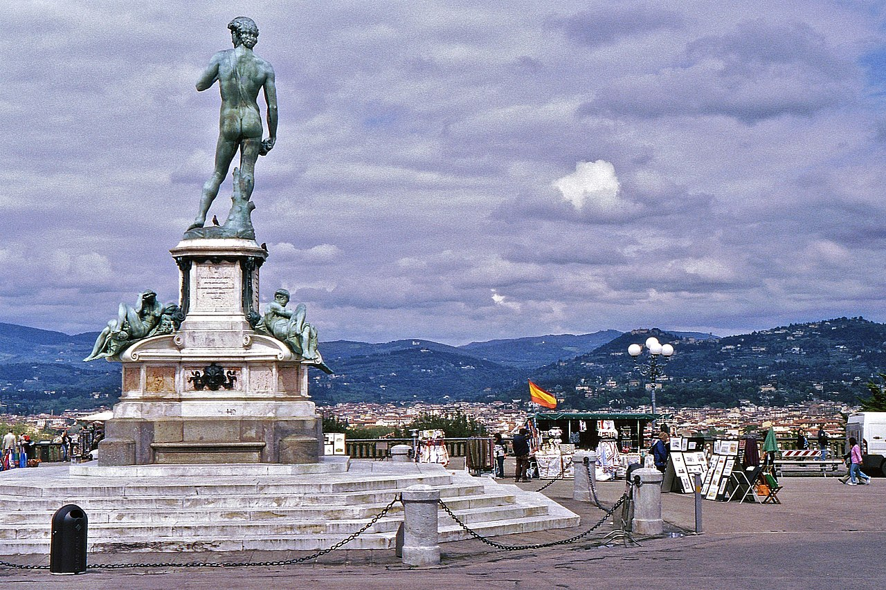
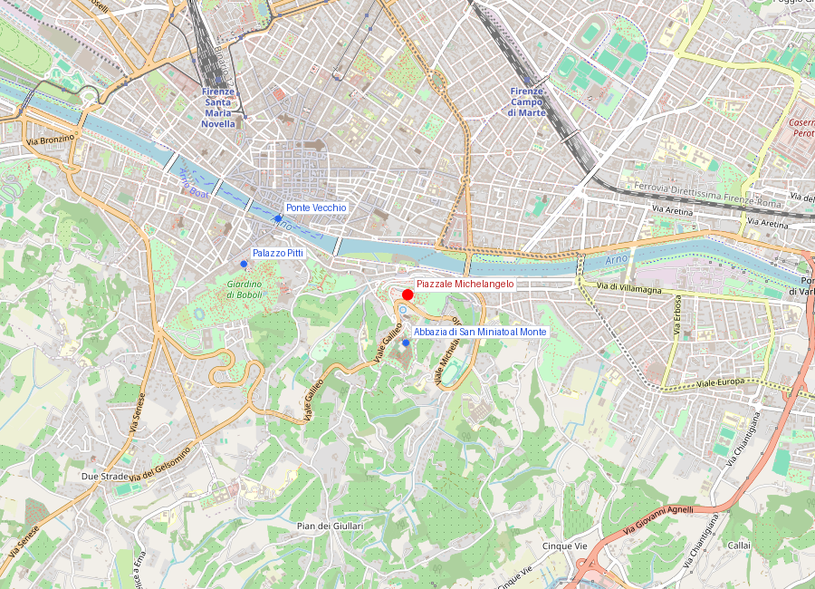
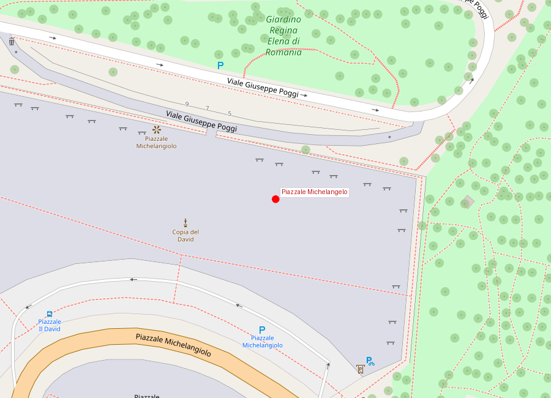

# Piazzale Michelangelo

```yaml
lugar:
  nombre_original: "Piazzale Michelangelo"
  pais: "Italia"
  region_admin: "Toscana"
  coordenadas: "43.7629° N, 11.2654° E"
  altitud_m: 104
  fecha_visita: "[DATO PENDIENTE — verificar fuente]"
```

## Mapa







---

## Qué había antes

La colina de San Miniato al Monte, al sur del Arno, estaba ocupada por viñas, la Basilica di San Miniato al Monte (desde el siglo XI) y algunas fortalezas medievales. Era territorio extramuros, fuera del tejido urbano cotidiano de Firenze.

---

## Historia

### Línea de tiempo

| Fecha | Hito |
|---|---|
| 1865–1871 | Firenze es capital del Reino de Italia; el alcalde Giuseppe Poggi recibe el encargo de modernizar y embellecer la ciudad |
| 1869 | Diseño e inauguración del Piazzale Michelangelo como parte del plan de viali di circonvallazione de Poggi; se coloca la copia en bronce del *David* |
| 1875 | Se completa la escalinata monumental que sube desde el Lungarno |
| 1904 | Se añaden las cuatro copias en bronce de obras de Michelangelo que rodean el *David* central |

### Narrativa

El Piazzale Michelangelo no es un lugar histórico antiguo: es una creación del siglo XIX, concebida deliberadamente como mirador panorámico sobre Firenze en el momento en que la ciudad se transformaba en capital moderna. El arquitecto Giuseppe Poggi trazó los bulevares que rodean el centro histórico y diseñó esta plaza en la colina sur como punto culminante del sistema de paseo urbano.

La elección de Michelangelo como nombre y símbolo fue programática: Firenze queriendo afirmar su identidad cultural en el momento de la unificación italiana. Las copias en bronce del *David* y de las alegorías de las Tumbas Mediceas (Aurora, Crepúsculo, Noche y Día) son réplicas de bronce dorado de originales dispersos en distintos puntos de la ciudad —la forma de tenerlos todos reunidos en un solo lugar.

El valor real del Piazzale es su vista: desde aquí se ve la cúpula del Brunelleschi, el campanile de Giotto, la torre del Palazzo Vecchio y el perfil del centro histórico con las colinas de Fiesole al fondo. Es el encuadre clásico de Firenze.

La escalinata que sube desde el Lungarno —flanqueada por rosas y arbustos en primavera— es el paseo más fotográfico de la ciudad.

---

## Conexiones

- Las copias en bronce representan obras que están repartidas en la **Galleria dell'Accademia** (*David*) y en las **Cappelle Medicee** de la Basilica di San Lorenzo (las alegorías de las tumbas).
- Subiendo más allá del Piazzale se llega a la **Basilica di San Miniato al Monte** (siglo XI), una de las iglesias románicas más bellas de Toscana.

---

## Datos interesantes

- Las copias en bronce son más resistentes a la intemperie que los originales en mármol; pero el color dorado del bronce patinado es radicalmente diferente al blanco frío del mármol de Carrara.
- El amanecer desde el Piazzale (cuando no hay turistas) es uno de los mejores espectáculos visuales de Firenze.
- Poggi diseñó también la escalinata monumental y el sistema de rampas del lateral, incorporando una loggia-cafetería que sigue en uso.

---

*fuente: Comune di Firenze, sitio de patrimonio urbano; Piero Bargellini, La splendida storia di Firenze.*
