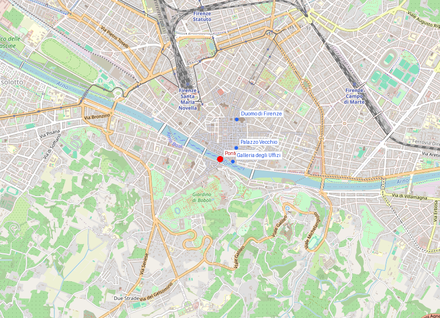
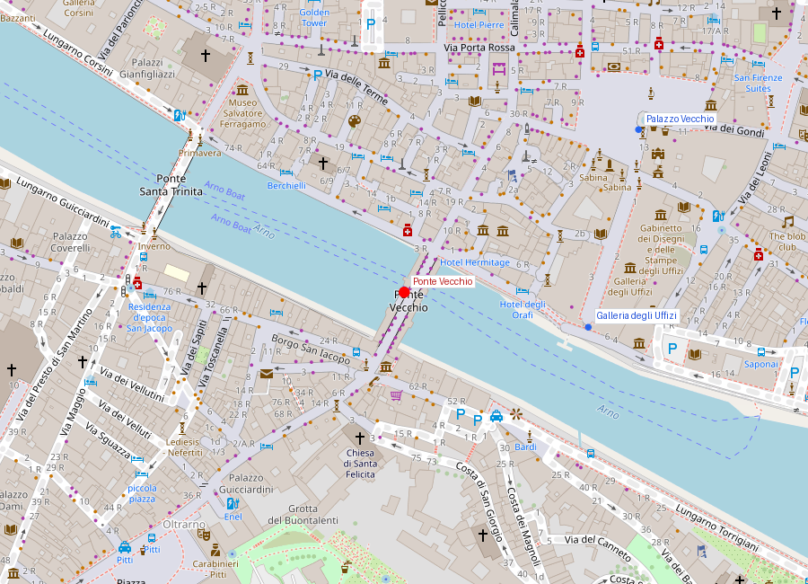

# Ponte Vecchio

```yaml
lugar:
  nombre_original: "Ponte Vecchio"
  pais: "Italia"
  region_admin: "Toscana"
  coordenadas: "43.7681° N, 11.2531° E"
  fecha_visita: "[DATO PENDIENTE — verificar fuente]"
```

## Mapa





---

<!-- 📷 FOTO: vista del Ponte Vecchio desde el Lungarno / perfil del puente desde el Arno -->

## Qué había antes

El Ponte Vecchio existe como cruce de este vado particular del Arno desde época romana: hay evidencia de un puente en este punto que data del siglo I d.C. A lo largo de la Edad Media hubo varios puentes en este lugar, destruidos sucesivamente por las crecidas del Arno. El puente actual data de **1345**, construido tras la gran inundación de 1333 que arrasó el anterior.

---

## Historia

### Línea de tiempo

| Fecha | Hito |
|---|---|
| Siglo I d.C. | Evidencia de puente romano en este punto del Arno |
| 1117 | Primer puente medieval documentado; destruido en inundación posterior |
| 1333 | Gran inundación del Arno destruye el puente medieval entonces existente |
| 1345 | Se construye el puente actual bajo el diseño atribuido a **Taddeo Gaddi** (discípulo de Giotto) |
| Inicialmente | Las tiendas del puente albergan carniceros, pescaderos y curtidores |
| 1565 | Vasari construye el **Corridoio Vasariano** sobre el lado norte del puente |
| 1593 | **Ferdinando I de' Medici** expulsa a los carniceros y curtidores; el puente se reserva a **orfebres y joyeros** (ocupación que mantiene hasta hoy) |
| 1944 | Única retirada alemana en Firenze: Hitler ordena que el Ponte Vecchio no sea destruido; todos los demás puentes de la ciudad son volados. Los alemanes bloquean los accesos derribando edificios medievales en los extremos del puente |
| 1966 | La gran inundación del Arno (4 de noviembre) sube el nivel del agua hasta casi 7 metros sobre el nivel normal; el puente sobrevive pero las tiendas sufren daños graves |

### Narrativa

El Ponte Vecchio es ante todo una paradoja urbana: un puente que es también una calle comercial, un barrio denso, y un corredor privado de poder. Sus tres arcos de medio punto sustentan dos filas de tiendas que se asoman sobre el río y, sobre ellas, el pasaje secreto que conectó durante siglos a los Médici con sus dos palacios sin necesidad de mezclarse con la multitud.

El cambio más importante en su historia es la ordenanza de **1593 de Ferdinando I**: hasta entonces el puente era un mercado bullicioso y maloliente de carniceros, pescaderos y curtidores —oficios que tenían el "privilegio" de arrojar sus desperdicios directamente al Arno desde las tiendas del puente—. Ferdinando, cuya ventana del Corridoio pasaba sobre esas tiendas, desalojó todos los oficios olorosos y reservó las tiendas a orfebres y joyeros. La decisión decorativa de un duque aristocrático determinó el carácter del puente para los siguientes cuatro siglos.

El momento más significativo del siglo XX fue probablemente el **agosto de 1944**: mientras el ejército alemán se retiraba de Firenze ante el avance aliado, destruyó sistemáticamente todos los puentes de la ciudad para retrasar el cruce. El Ponte Vecchio fue la única excepción. La orden viene atribuida a Hitler personalmente —se dice que se negó a destruirlo por razones estéticas, aunque la fuente exacta es difícil de verificar [⚠ VERIFICAR origen de la orden]. Para compensar, los alemanes demolieron los bloques medievales en ambos extremos del puente para bloquear el acceso; esas ruinas son visibles hoy en el Lungarno.

---

## Arquitectura

<!-- 📷 FOTO: detalle de los sporti sobre el río / arcos desde abajo -->

El puente tiene **tres arcos rebajados** ("a schiena d'asino", en lomo de burro) de distinta longitud —29,9 m el central, 27 m los laterales— que le dan un perfil casi plano inusual para la época. La construcción de arcos rebajados de esas dimensiones era técnicamente avanzada para el siglo XIV.

Las tiendas originales se construyeron directamente sobre la estructura del puente y a lo largo de los siglos fueron ampliadas hacia afuera sobre ménsulas de madera y piedra que sobresalen sobre el río —los característicos **sporti** que dan al puente su perfil dentado y que hoy son la imagen más reconocible del Ponte Vecchio.

---

## El Corridoio Vasariano

El pasaje elevado que corre sobre el techo de las tiendas del lado norte fue construido en 1565 por Vasari en solo cinco meses, encargo urgente de Cosimo I de' Medici para unir el Palazzo Vecchio (sede del gobierno) con el Palazzo Pitti (residencia privada). El corredor atraviesa las Gallerie degli Uffizi, cruza sobre el Ponte Vecchio —con ventanas de mirilla sobre el puente y el Arno— y continúa por el Oltrarno hasta el Pitti.

El corredor albergó durante el siglo XX una colección de miles de autorretratos donados por artistas de todo el mundo (Rembrandt, Velázquez, Rubens, y cientos de contemporáneos). Fue dañado parcialmente en el atentado de 1993 y ha tenido historia de apertura intermitente al público. [⚠ VERIFICAR estado de acceso actual]

---

## El busto de Benvenuto Cellini

<!-- 📷 FOTO: busto de Cellini en el centro del puente / candados en la reja -->

En el centro del puente, mirando al Arno aguas abajo, un busto de **Benvenuto Cellini** (1500-1571) ocupa el lugar más prominente de la baranda central. Cellini fue el orfebre y escultor florentino más célebre de su tiempo —autor del *Perseo con la testa di Medusa* en la Loggia dei Lanzi, a pocos metros de los Uffizi—. El busto es del siglo XIX y su ubicación en el centro del puente lo convierte en el patrono simbólico de todos los joyeros que aún trabajan aquí.

Los turistas han consagrado la costumbre de colgar **candados** en las rejas junto al busto como símbolo de amor eterno; las autoridades municipales los retiran periódicamente.

---

## La inundación de 1966

<!-- 📷 FOTO: marcas de nivel del agua de 1966 si están visibles en la ciudad -->

El 4 de noviembre de 1966, el Arno subió casi 7 metros sobre su nivel normal en pocas horas, inundando el centro histórico con agua, fuel y fango. Fue el mayor desastre natural de Firenze en el siglo XX. Los daños en obras de arte, libros y archivos fueron incalculables: el Crucifix de Cimabue en la chiesa di Santa Croce quedó destruido en un 60%, miles de voluminosos del Archivio di Stato quedaron empapados en fuel.

El Ponte Vecchio sobrevivió a la inundación —había sobrevivido a muchas antes—, pero las tiendas sufrieron daños importantes. La respuesta internacional generó la figura de los **"Angeli del fango"** (Ángeles del barro): miles de estudiantes y voluntarios que llegaron de todo el mundo a rescatar obras de arte y libros a mano, durante semanas. Fue uno de los primeros grandes ejemplos de coordinación internacional para la preservación del patrimonio cultural.

---

## Conexiones

- El **Corridoio Vasariano** une este puente con las **Gallerie degli Uffizi** al norte y el **Palazzo Pitti** al sur.
- **Benvenuto Cellini**, cuyo busto preside el puente, tiene su obra más famosa (el *Perseo*) en la **Loggia dei Lanzi**, frente al **Palazzo Vecchio**, a unos 500 metros.
- La vista desde el puente hacia el Lungarno con los edificios medievales parcialmente reconstruidos tras 1944 y las colinas de Fiesole al fondo es una de las más características de Firenze.

---

*fuente: Gene Brucker, "Renaissance Florence" (1983); sitio oficial del Comune di Firenze; Encyclopædia Britannica; Wikipedia (entradas verificadas).*
