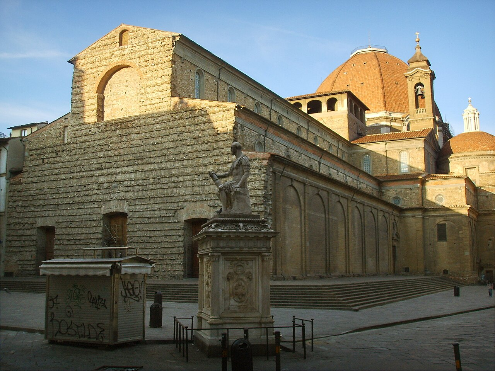

# Basilica di San Lorenzo y Cappelle Medicee

```yaml
lugar:
  nombre_original: "Basilica di San Lorenzo / Cappelle Medicee"
  pais: "Italia"
  region_admin: "Toscana"
  coordenadas: "43.7746° N, 11.2537° E"
  fecha_visita: "[DATO PENDIENTE — verificar fuente]"
```

## Mapa



[DATO PENDIENTE — generar mapa con pin]

---

## Qué había antes

San Lorenzo es la iglesia más antigua de Firenze —o al menos la que tiene el origen más antiguo documentado—. Una primera iglesia en este lugar data del siglo IV d.C. (consagrada por San Ambrosio de Milán en 393 d.C., según la tradición). Durante siglos fue la principal iglesia extra-muros de la ciudad primitiva.

---

## Historia

### Línea de tiempo

| Fecha | Hito |
|---|---|
| 393 d.C. | Consagración de la primera iglesia en el lugar, según la tradición por San Ambrosio de Milán |
| Siglo XI | Reconstrucción romanica; la iglesia es cedida a la familia Médici como iglesia parroquial de su barrio |
| 1419 | Giovanni di Bicci de' Medici (padre de Cosimo el Viejo) financia la reconstrucción renacentista; Brunelleschi recibe el encargo |
| 1421–1428 | Brunelleschi construye la **Sacrestia Vecchia**, uno de los primeros espacios renacentistas claramente definidos en la arquitectura italiana |
| 1442–1470 | Se construye la nave principal según los planes de Brunelleschi (fallecido en 1446; la obra continúa bajo Antonio Manetti) |
| 1464 | **Cosimo il Vecchio** es enterrado en el centro de la iglesia, bajo el crucero; es el único Médici con este honor |
| 1521–1534 | Michelangelo diseña y comienza la **Sacrestia Nuova** (Cappella dei Principi), con las tumbas de Lorenzo il Magnifico y Giuliano de' Medici |
| 1524 | Michelangelo diseña la **Biblioteca Medicea Laurenziana**, accesible desde el claustro de San Lorenzo |
| 1604 | Inicio de la construcción de la **Cappella dei Principi**, el mausoleo octogonal de los Grandes Duques de los Médici |
| 1743 | Muere Anna Maria Luisa de' Medici, última descendiente directa de la familia; es enterrada en la cripta bajo las Cappelle Medicee |

### Narrativa

San Lorenzo es la iglesia familiar de los Médici: el lugar donde bautizaron a sus hijos, enterraron a sus muertos y construyeron los monumentos más ambiciosos de auto-representación dinástica de Firenze. No es la iglesia más grande ni la más famosa (esos títulos van al Duomo), pero es la que concentra más historia de poder.

El complejo es en realidad tres espacios superpuestos: la **basilica** (de Brunelleschi), la **Sacrestia Nuova** (de Michelangelo), y la **Cappella dei Principi** (monumental mausoleo barroco). Cada uno fue construido por una generación distinta de Médici, cada vez más ostentoso.

La **Sacrestia Nuova** es el espacio más extraordinario del conjunto. Michelangelo la diseñó como pendant de la Sacrestia Vecchia de Brunelleschi, deliberadamente paralela en planta pero totalmente distinta en espíritu: donde Brunelleschi es claridad y proporción matemática, Michelangelo es tensión y drama. Las cuatro esculturas alegóricas sobre los sarcófagos de Lorenzo y Giuliano —**Aurora** (amanecer), **Crepuscolo** (atardecer), **Notte** (noche) y **Giorno** (día)— son obras de una densidad filosófica y formal sin igual: el tiempo como ciclo inevitable, el poder como algo que se consume y desaparece.

Las figuras de Lorenzo y Giuliano sentados en los nichos son idealizaciones: no retratos. Michelangelo, cuando alguien señaló que no parecían los Médici reales, respondió que en cien años a nadie le importaría cómo eran realmente. Tenía razón.

La **Cappella dei Principi** (mausoleo barroco de la Cappella de' Principi, iniciado en 1604) es lo opuesto en escala y austeridad: un octógono colosal recubierto de *pietre dure* (mármoles y piedras semipreciosas en incrustación) que los Grandes Duques pensaron construir como el monumento funerario más grandioso de Europa. Se estuvieron añadiendo elementos durante siglos y técnicamente nunca se terminó del todo.

La **Biblioteca Medicea Laurenziana**, diseñada por Michelangelo y accesible desde el claustro, alberga uno de los conjuntos de manuscritos más importantes del mundo —incluyendo el códice más antiguo de Virgilio y manuscritos griegos rescatados de Bizancio por los Médici antes y después de la caída de Constantinopla en 1453. La escalera de acceso, con su diseño inusual de tres rampas fusionadas, es uno de los grandes objetos extraños de la arquitectura manierista.

---

## Conexiones

- Cosimo il Vecchio, enterrado aquí, fue el patrón financiero de Brunelleschi y Donatello —las esculturas de bronce de los púlpitos de la basilica son las últimas obras de **Donatello**, completadas por sus discípulos.
- Las alegorías funerarias de la Sacrestia Nuova son de Michelangelo; las copias en bronce están en el **Piazzale Michelangelo**.
- La Biblioteca Laurenziana conserva manuscritos griegos traídos de Bizancio, muchos de los cuales llegaron a través del Concilio de Florencia de 1439 — el intento de unión entre la Iglesia latina y la Iglesia ortodoxa, celebrado en Firenze.

---

## Datos interesantes

- Michelangelo diseñó la Sacrestia Nuova pero se exilió de Firenze en 1534 (cuando los Médici volvieron al poder con el Duque Alessandro, a quien Michelangelo despreciaba) y nunca regresó. Las esculturas las dejó sin terminar y sin instalar; sus discípulos las colocaron después de su muerte.
- La cripta bajo las Cappelle Medicee contiene los restos de 49 miembros de la familia Médici, incluyendo a Anna Maria Luisa, la última, que legó toda la colección artística de los Médici al Estado florentino con la condición de que nunca saliera de Firenze — condición que se cumple hasta hoy.

---

*fuente: Opera Medicea Laurenziana (sitio oficial); Creighton Gilbert, Michelangelo on and off the Sistine Ceiling; William Wallace, Michelangelo: The Artist, the Man and His Times.*
