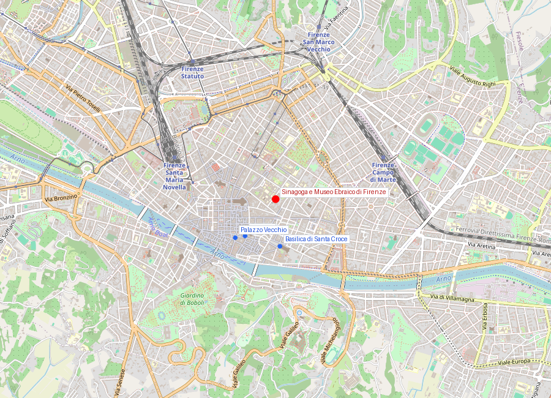
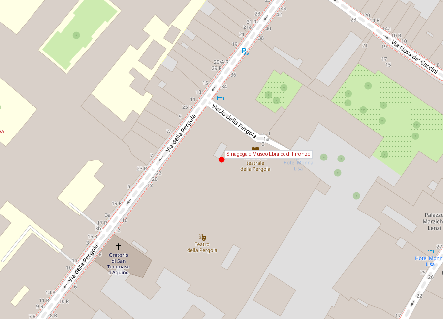

# Sinagoga e Museo Ebraico di Firenze

```yaml
lugar:
  nombre_original: "Sinagoga e Museo Ebraico di Firenze"
  pais: "Italia"
  region_admin: "Toscana"
  coordenadas: "43.7734° N, 11.2616° E"
  fecha_visita: "[DATO PENDIENTE — verificar fuente]"
```

## Mapa





---

## El ghetto florentino — qué había antes

La comunidad judía en Firenze tiene raíces que se remontan al siglo XIII, cuando los prestamistas judíos fueron llamados a la ciudad por los mismos Médici y la Signoria para ejercer el crédito al consumo — actividad que la Iglesia prohibía a los cristianos (usura). Vivían dispersos en el centro histórico, sujetos a restricciones variables según el período político.

En 1571, **Cosimo I de' Medici** ordenó el confinamiento de la comunidad judía en un **ghetto** delimitado en el área noreste del centro histórico (entre la actual Via de' Pilastri y Borgo degli Albizi). Era el mismo año en que otros estados italianos endurecían sus restricciones. El ghetto tenía dos puertas que se cerraban al anochecer.

---

## Historia

### Línea de tiempo

| Fecha | Hito |
|---|---|
| Siglo XIII | Presencia de prestamistas judíos en Firenze, convocados por la Signoria |
| 1437 | Cosimo de' Medici *il Vecchio* negocia con prestamistas judíos la apertura de *banchi* (casas de crédito) en la ciudad |
| 1570–1571 | Cosimo I de' Medici establece el ghetto en el área noreste del centro; la comunidad es confinada |
| 1593 | Ferdinando I de' Medici amplía los derechos de los judíos en Livorno (Toscana), creando una comunidad sefardí próspera — ironía de la misma familia que confinó a los judíos en Firenze |
| 1848–1861 | Con el proceso de unificación italiana, los decretos de emancipación (Statuto Albertino, 1848) abolieron legalmente el status de ghetto |
| 1882 | Demolición del ghetto medieval y construcción de la **Sinagoga Tempio Maggiore** en el barrio de Santa Croce |
| 1882 | Inauguración de la Sinagoga, diseño de **Mariano Falcini**, **Marco Treves** y **Vincenzo Micheli** en estilo morisco-sefardí; la cúpula verde es visible desde muchos puntos de la ciudad |
| 1943–1944 | Ocupación alemana de Firenze; las SS usan la sinagoga como depósito (algunos relatos indican también como establo) y la dañan parcialmente. La comunidad judía florentina es deportada: de las ~1.000 personas deportadas, unas 250 no regresaron [⚠ VERIFICAR cifras exactas] |
| 1966 | La inundación del Arno entra en la sinagoga y daña el archivo y parte de los ornamentos |
| Post-1966 | Restauración larga; el Museo Ebraico se instala en el edificio |

### Narrativa

La **Sinagoga Tempio Maggiore** es el edificio de culto judío más importante de Toscana y uno de los más espectaculares de Italia. Su fachada y especialmente su interior en estilo morisco —arcos de herradura, ladrillos bicolor, azulejos, mosaicos— es una declaración de identidad consciente: la comunidad sefardí de origen ibérico eligió un estilo que evocaba la tradición judío-andaluza, la cultura de Al-Ándalus que los españoles habían destruido en 1492 con la expulsión.

La construcción de la sinagoga en 1882 fue posible por la emancipación legal: por primera vez en siglos, la comunidad podía construir en el centro de la ciudad, sin restricciones, un edificio imponente y visible. La cúpula verde de la sinagoga, visible desde el Piazzale Michelangelo y otros puntos altos de la ciudad, es esa declaración de presencia.

El **Museo Ebraico** en el edificio documenta la historia de los judíos florentinos desde la Edad Media: el sistema de préstamo bancario que los trajo, la vida en el ghetto, los siglos de restricciones y tolerancias variables, la emancipación y la Shoah. Es uno de los documentos más completos de la historia de una comunidad italiana.

---

## Connexiones

- El ghetto original estaba en la zona de lo que hoy es **Piazza della Repubblica** y alrededores: la misma plaza donde los Médici tenían el foro romano y que fue "saneada" urbanísticamente en el siglo XIX.
- La sinagoga está en el barrio de **Santa Croce** — el mismo barrio donde los tintoreros medievales trabajaban, y donde está la basilica donde está enterrado Michelangelo (quien tuvo relaciones documentadas con la comunidad neoplatónica, que incluía intelectuales judíos).
- La familia Médici tuvo una relación ambivalente con los judíos: los convocaron como financieros, los confinaron en ghetto con Cosimo I, y luego construyeron una comunidad judía prospera en Livorno como alternativa económica.

---

## Visita práctica

- La entrada incluye visita guiada a la sinagoga y al museo.
- Los domingos el edificio puede estar cerrado o con horario reducido por el Sabbat (verificar antes de visitar).
- Fotografía permitida en algunas áreas; consultar en la entrada.

---

*fuente: Comunità Ebraica di Firenze (sitio oficial); Renzo De Felice, Storia degli ebrei italiani sotto il fascismo; Cecil Roth, The History of the Jews of Italy.*
