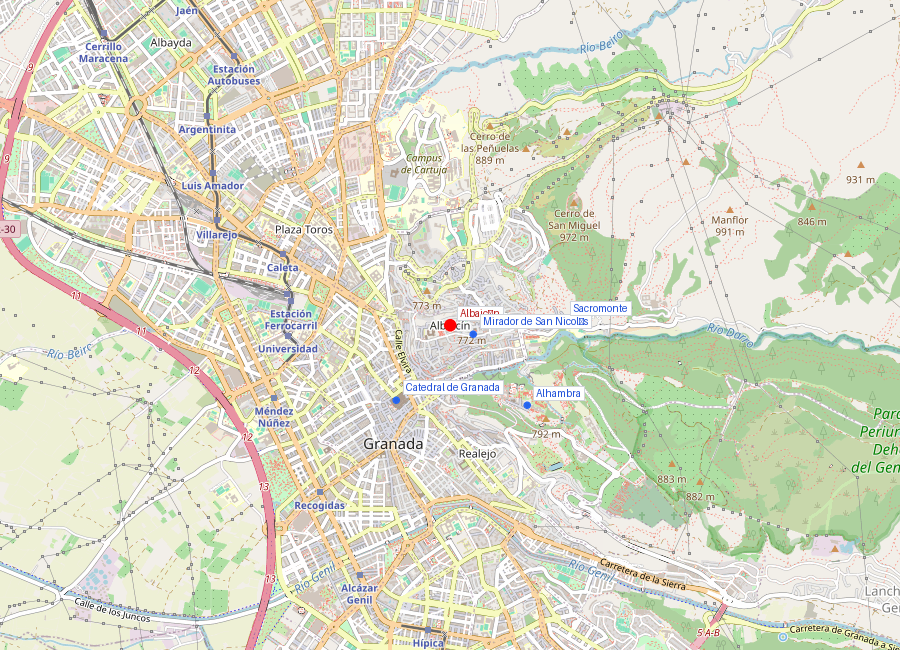
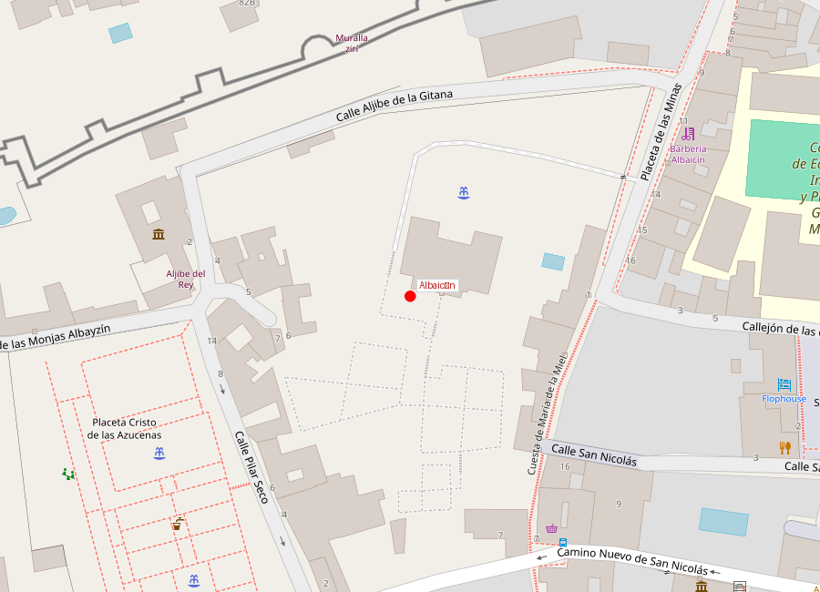

# Albaicín

```yaml
lugar:
  nombre_original: "Albaicín"
  nombre_alternativo: "Albayzín (grafía alternativa oficial)"
  pais: "España"
  region_admin: "Andalucía"
  coordenadas: "37.1816° N, 3.5947° O"
  fecha_visita: "[DATO PENDIENTE — confirmar fecha]"
```





---

## Qué había antes

La colina del Albaicín fue el emplazamiento del oppidum ibérico de **Ilíberis** y del posterior municipio romano **Florentia Iliberritana**. Restos de muralla ibérica y cimientos romanos han sido hallados en diversas excavaciones. Fue aquí, y no en la Sabika de la Alhambra, donde se alzó el primer núcleo urbano de Granada.

---

## Historia

### Período zirí (siglo XI)

Cuando la dinastía bereber de los **Ziríes** estableció su taifa en Granada (1013), eligieron la colina del Albaicín como sede del poder. Construyeron la **alcazaba Cadima** (al-Qaṣba al-Qadīma, "la alcazaba vieja") en la parte alta del barrio. Los restos de la **muralla zirí** del siglo XI son todavía visibles en varios tramos, especialmente en la **Puerta de las Pesas** (Bāb al-Asad) y en la **Puerta Monaita** (Bāb al-Unaydar).

### Período nazarí (siglos XIII–XV)

Con la fundación del Reino Nazarí y el traslado del poder a la Alhambra, el Albaicín se convirtió en el **barrio residencial** más denso y poblado de la ciudad, con una población estimada de hasta 40.000 habitantes en el siglo XIV [⚠ VERIFICAR]. Sus calles estrechas, empedradas y laberínticas, sus cármenes (casas con jardín interior cerrado) y sus aljibes (cisternas públicas) configuraron una trama urbana típicamente andalusí que ha sobrevivido prácticamente intacta hasta hoy.

El Albaicín tenía al menos **30 mezquitas** en el período nazarí. Tras la conquista cristiana, casi todas fueron demolidas o convertidas en iglesias. La única que conserva restos significativos es la que se encontraba bajo la actual **Iglesia del Salvador**, cuyo patio es el antiguo patio de abluciones de la mezquita mayor del Albaicín.

### La conversión y los moriscos

Tras las conversiones forzosas impulsadas por Cisneros (1499–1502), el Albaicín se convirtió en el barrio morisco por excelencia de Granada: musulmanes oficialmente convertidos al cristianismo pero que en muchos casos mantenían sus costumbres, lengua y prácticas religiosas en secreto. El Albaicín fue el epicentro de la **rebelión de 1499** contra las conversiones forzosas, que fue aplastada pero marcó el inicio del conflicto morisco que culminaría en la expulsión de 1609–1614.

### Declive y redescubrimiento

Tras la expulsión de los moriscos, el Albaicín se despobló drásticamente. A lo largo de los siglos XVII–XIX, muchas de sus casas fueron abandonadas o demolidas. El barrio entró en un largo declive que solo se invirtió en el siglo XX, cuando el interés histórico y turístico, combinado con la declaración como **Patrimonio de la Humanidad UNESCO en 1994** (como extensión de la Alhambra y el Generalife), impulsó su rehabilitación.

---

## Arquitectura y trama urbana

### Los cármenes

El **carmen** (del árabe *karm*, viña) es la tipología residencial característica del Albaicín: una casa con muros altos exteriores ciegos (sin apenas ventanas a la calle) que encierran un jardín-huerto interior con agua, flores, frutales y vistas. Es la adaptación granadina del concepto doméstico islámico de la intimidad del hogar: la vida se vuelca hacia adentro.

Hoy muchos cármenes han sido convertidos en restaurantes, hoteles boutique o sedes culturales, pero la esencia del tipo arquitectónico permanece.

### Los aljibes

El Albaicín conserva una red de **aljibes** (cisternas de agua) medievales nazaríes, algunos aún funcionales. Los más notables son el **Aljibe del Rey** (el mayor de Granada, restaurado y visitable) y el **Aljibe de San José**. Estos depósitos garantizaban el suministro de agua al barrio independientemente de las fuentes externas — una ventaja estratégica clave.

### Las calles

La trama urbana del Albaicín es casi idéntica a la medieval: **callejuelas empedradas** que suben, bajan, se quiebran y se bifurcan sin lógica aparente (pero con una lógica interna islámica: maximizar la sombra, la privacidad y la protección del viento). Perderse es inevitable y forma parte de la experiencia.

---

## Mitología y leyendas

### El nombre del barrio

La etimología de "Albaicín" es debatida. La teoría más extendida es que proviene del árabe *Rabāḍ al-Bayyāzīn* ("arrabal de los halconeros"), pero otra hipótesis (sostenida por algunos arabistas) lo deriva de *Rabāḍ al-Bayyāsīn*, el "arrabal de los de Baeza", en referencia a los refugiados de la ciudad de Baeza que se asentaron aquí en el siglo XIII tras la conquista castellana de su ciudad. No hay consenso académico definitivo.

### Las apariciones del Albaicín

Según tradiciones locales, en las noches sin luna se oyen cantos y rezos en árabe en las calles más estrechas del barrio — atribuidos a los espíritus de los moriscos que fueron expulsados y que "regresan" a sus casas. Esta leyenda aparece en varias recopilaciones de tradiciones granadinas del siglo XIX.

---

## Qué se puede ver hoy

- **Mirador de San Nicolás** — la vista más famosa de la Alhambra (ver [mirador_san_nicolas.md](mirador_san_nicolas.md))
- **Placeta de San Miguel Bajo** — plaza tranquila con bares de tapas
- **Iglesia del Salvador** — construida sobre la mezquita mayor del Albaicín; conserva el patio de abluciones
- **Calle Calderería Nueva** (la "calle de las teterías") — tiendas y teterías de estética moruna
- **Paseo de los Tristes** (Paseo del Padre Manjón) — a lo largo del río Darro, con la Alhambra al fondo
- **Carrera del Darro** — la calle más bella de Granada, bordeando el río con puentes árabes

---

## Conexiones

- El Albaicín mira directamente a la [Alhambra](alhambra.md), separados por el barranco del río Darro
- El [Mirador de San Nicolás](mirador_san_nicolas.md) es el punto más emblemático del barrio
- El barrio conecta por el este con el [Sacromonte](sacromonte.md), sin límite neto entre ambos
- La Carrera del Darro desciende hasta la zona de la [Catedral y Capilla Real](catedral_capilla_real.md)

---

## Datos interesantes

- El Albaicín tiene más de **4.000 años de historia urbana** continua [⚠ VERIFICAR], desde el oppidum ibérico hasta hoy
- Es **Patrimonio de la Humanidad UNESCO** desde 1994
- Conserva unos **28 aljibes** nazaríes, la red más completa de cisternas medievales islámicas de la Península [⚠ VERIFICAR]
- En 2003 se inauguró la **Mezquita Mayor de Granada** en el Albaicín, la primera mezquita construida en Granada desde 1492, en un solar junto al Mirador de San Nicolás — un hecho simbólico potente, 511 años después de la caída del reino nazarí

---

*fuente: UNESCO World Heritage Centre; Antonio Orihuela Uzal, "Casas y palacios nazaríes" (El Legado Andalusí); Wikipedia (artículos verificados); Patronato de Turismo de Granada.*
