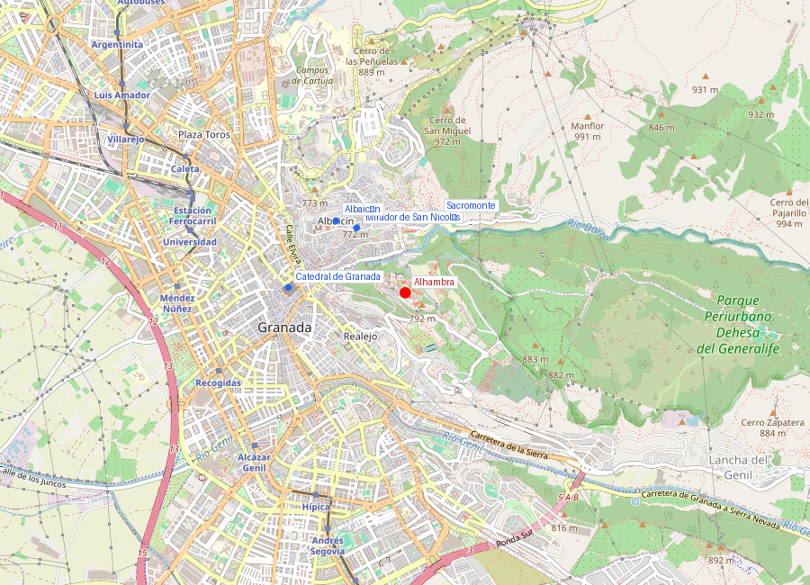
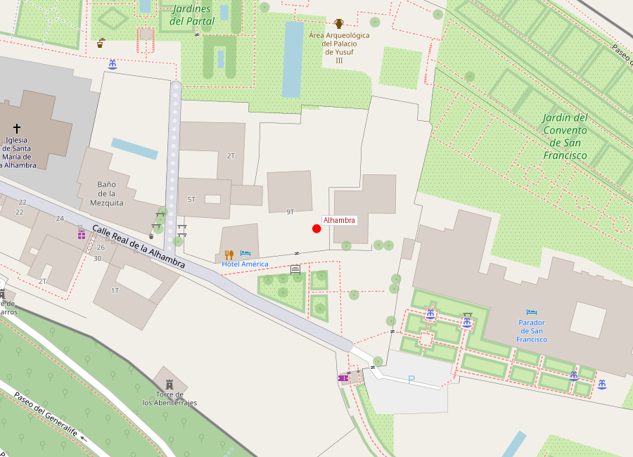

# Alhambra

```yaml
lugar:
  nombre_original: "Alhambra"
  nombre_alternativo: "al-Qalʿa al-Ḥamrāʾ (القلعة الحمراء, 'la fortaleza roja')"
  pais: "España"
  region_admin: "Andalucía"
  coordenadas: "37.1761° N, 3.5881° O"
  altitud_m: 740
  fecha_visita: "[DATO PENDIENTE — confirmar fecha]"
```





---

## Qué había antes

La colina de la Sabika, donde se levanta la Alhambra, estuvo habitada desde la Antigüedad. Restos arqueológicos indican presencia romana en la zona. La primera fortaleza documentada en el sitio data del **siglo IX** (año 889), cuando **Sawwar ibn Ḥamdūn** construyó una alcazaba durante las revueltas contra el Emirato de Córdoba. Esa primera fortaleza era modesta — una posición defensiva aprovechando la topografía natural de la colina, con el barranco del río Darro como foso natural al norte.

Durante el período zirí (siglo XI), la fortaleza fue ampliada pero el centro del poder estaba en la colina del Albaicín. No fue hasta la llegada de los nazaríes cuando la Sabika se convirtió en el corazón del poder granadino.

---

## Historia

| Período | Evento clave |
|---|---|
| Siglo IX | Primera fortaleza en la colina de la Sabika |
| 1238 | **Muḥammad I** (Ibn al-Aḥmar) inicia la reconstrucción como residencia real nazarí |
| 1238–1273 | Construcción de la **Alcazaba** y las primeras murallas. Canalización del agua desde el río Darro mediante la **Acequia Real** |
| 1314–1325 | **Ismāʿīl I** construye el **Mexuar** (sala de justicia y consejo) |
| 1333–1354 | **Yūsuf I** edifica el **Palacio de Comares** (Salón de Embajadores, Patio de los Arrayanes) y la **Torre de Comares** |
| 1362–1391 | **Muḥammad V** construye el **Palacio de los Leones** (Patio de los Leones, Sala de los Abencerrajes, Sala de las Dos Hermanas) |
| 1492 | Entrega de la Alhambra a los Reyes Católicos. Se convierte en residencia real cristiana |
| 1527 | **Carlos V** ordena construir un palacio renacentista dentro de la Alhambra, demoliendo parte del complejo nazarí |
| Siglo XVIII | Abandono progresivo. Tropas napoleónicas vuelan varias torres al retirarse (1812) |
| 1832 | **Washington Irving** publica *Tales of the Alhambra*, renovando el interés internacional |
| 1870 | Declarada **Monumento Nacional** |
| 1984 | Inscrita como **Patrimonio de la Humanidad UNESCO** (junto con el Generalife; ampliado al Albaicín en 1994) [⚠ VERIFICAR] |

---

## Arquitectura

### La Alcazaba

La parte más antigua del complejo, una fortaleza militar pura. Su **Torre de la Vela** (26 metros de altura) es el punto más alto de la Alhambra y ofrece vistas de 360° sobre Granada, la Vega y Sierra Nevada. La campana de la Torre de la Vela se tañe cada 2 de enero para conmemorar la toma de Granada — según la tradición, las mujeres solteras que la tocan ese día se casarán ese año.

### Los Palacios Nazaríes

El corazón artístico de la Alhambra. Tres palacios interconectados:

- **Mexuar**: la sala más antigua, usada para administración de justicia. Reformada en época cristiana como capilla.
- **Palacio de Comares**: el palacio oficial. Su **Patio de los Arrayanes** (o de la Alberca), con el estanque de agua inmóvil que refleja la Torre de Comares, es una de las composiciones arquitectónicas más fotografiadas del mundo. El **Salón de Embajadores** (Salón del Trono), dentro de la Torre de Comares, tiene un techo de madera de cedro con más de 8.000 piezas ensambladas que representan los siete cielos del Paraíso islámico [⚠ VERIFICAR].
- **Palacio de los Leones**: la residencia privada. Su **Patio de los Leones**, con la fuente sostenida por 12 leones de mármol y rodeada por 124 columnas de mármol blanco, es el espacio más célebre de la arquitectura islámica occidental. Las **Salas de los Abencerrajes** y de las **Dos Hermanas** tienen mocárabes (muqarnas) de yeso tan elaborados que parecen estalactitas de una cueva — son puramente decorativos y no tienen función estructural.

### El arte nazarí: una arquitectura del vacío y la luz

La Alhambra no impresiona por la solidez de sus materiales (son mayoritariamente ladrillo, yeso y madera, no piedra noble) sino por la **sofisticación de su decoración** y la **manipulación del espacio, la luz y el agua**. Los principios estéticos son:

- **Caligrafía**: versos del Corán, poesía y el lema nazarí (*Wa lā gāliba illā Allāh*) cubren las paredes en escritura cursiva y cúfica.
- **Ataurique**: decoración vegetal estilizada (hojas, palmetas) tallada en yeso.
- **Lacería**: patrones geométricos entrelazados basados en la repetición y la simetría.
- **Agua**: fuentes, canales y estanques como elemento integrador. El agua no solo refresca: refleja la arquitectura, multiplicando el espacio visualmente y creando sonido ambiental.
- **Ausencia de figuración humana**: en línea con la tradición islámica, la decoración es anicónica. Los 12 leones de la fuente son una rara excepción.

### El Palacio de Carlos V

En 1527, el emperador **Carlos V** ordenó construir un palacio renacentista dentro del recinto de la Alhambra, diseñado por **Pedro Machuca**, discípulo de Miguel Ángel. Es un cubo de piedra con un patio circular interior — un diseño radicalmente clásico que contrasta con la delicadeza nazarí pero que tiene un mérito arquitectónico propio considerable. Nunca fue completado del todo; hoy alberga el **Museo de la Alhambra** y el **Museo de Bellas Artes de Granada**.

### El Generalife

Los jardines y palacio de verano de los sultanes nazaríes, situados en la ladera del Cerro del Sol, junto a la Alhambra pero fuera de sus murallas. El nombre proviene del árabe *Jannat al-ʿArīf* ("jardín del arquitecto" o "jardín del conocedor"). El **Patio de la Acequia**, con su canal central flanqueado por surtidores de agua que forman arcos cruzados, es el jardín histórico más famoso de España.

El Generalife era la finca agrícola de recreo del sultán: sus huertos, plantados originalmente con frutales y hortalizas, estaban irrigados por la Acequia Real que traía agua del río Darro a lo largo de 6 km de canal.

---

## Mitología y leyendas

### La leyenda de los Abencerrajes

La **Sala de los Abencerrajes**, en el Palacio de los Leones, toma su nombre de la leyenda más oscura de la Alhambra. Según la tradición, el sultán **Abū l-Ḥasan ʿAlī** (padre de Boabdil) habría invitado a los 36 caballeros de la familia de los Abencerrajes (Banū al-Sarrāj) a un banquete en esta sala y los habría asesinado a todos, supuestamente por los amores entre uno de ellos y la sultana Morayma (o, en otras versiones, por una conspiración política). Las manchas rojizas de óxido de hierro en la taza de la fuente de la sala se señalan popularmente como "manchas de sangre de los Abencerrajes". La leyenda aparece en las *Guerras Civiles de Granada* de Ginés Pérez de Hita (1595), una novela histórica que mezcla ficción y realidad.

### El Suspiro del Moro

Según la tradición, Boabdil (Muḥammad XII), al abandonar Granada el 2 de enero de 1492, se detuvo en un paso montañoso al sur de la ciudad y, mirando la Alhambra por última vez, lloró. Su madre Aixa le dijo: "Llora como mujer lo que no supiste defender como hombre." El paso se conoce como el **Puerto del Suspiro del Moro** (actual A-44, km 144 aproximadamente). La frase es probablemente apócrifa — no aparece en fuentes árabes contemporáneas sino en crónicas castellanas posteriores.

### Los tesoros ocultos

Numerosas leyendas granadinas hablan de tesoros escondidos por los últimos nazaríes antes de la entrega de la ciudad. Washington Irving recogió varias de estas historias en sus *Cuentos de la Alhambra* (1832), incluyendo la leyenda del astrólogo árabe, la del soldado encantado y la de las tres princesas cautivas en la Torre de las Infantas.

---

## Qué se puede ver hoy

La visita a la Alhambra se divide en zonas con **entrada regulada por franjas horarias** (especialmente los Palacios Nazaríes, con aforo limitado a 300 personas cada 30 minutos [⚠ VERIFICAR]):

1. **Alcazaba** — la zona militar, con acceso a la Torre de la Vela
2. **Palacios Nazaríes** — Mexuar, Comares y Leones (la entrada tiene hora asignada; no se puede acceder fuera de ella)
3. **Generalife** — jardines y palacio de verano
4. **Palacio de Carlos V** — acceso libre; alberga dos museos
5. **Paseo de los cipreses y torres del recinto**

Es imprescindible comprar las entradas con antelación (semanas o meses en temporada alta). La entrada general incluye todas las zonas.

---

## Conexiones

- La Alhambra y el **Albaicín** están separados por el barranco del río Darro; la mejor vista de la Alhambra se obtiene desde el [Mirador de San Nicolás](mirador_san_nicolas.md) en el Albaicín.
- La **Catedral de Granada y Capilla Real** están en la ciudad baja, a unos 20 minutos a pie cuesta abajo desde la Puerta de la Justicia de la Alhambra.
- El **Generalife** fue el precedente de los jardines palaciegos que luego se replicaron en toda Europa, incluyendo los jardines de Aranjuez y Versalles.
- El **Palacio de Carlos V** es contemporáneo y estilísticamente hermano del Palacio de Carlos V en Sevilla (Alcázar) y de las reformas imperiales en el Alcázar de Toledo.

---

## Datos interesantes

- La Alhambra recibe aproximadamente **2,7 millones de visitantes al año** [⚠ VERIFICAR], siendo el monumento más visitado de España.
- El nombre "Alhambra" viene del árabe *al-Qalʿa al-Ḥamrāʾ* ("la fortaleza roja"), probablemente por el color rojizo de las murallas de arcilla y ladrillo, aunque según otra tradición se debe a que las obras se realizaban de noche a la luz de antorchas, que daban un resplandor rojo.
- El sistema hidráulico nazarí de la Alhambra (acequias, albercas, fuentes) funcionaba enteramente por **gravedad**, sin ningún mecanismo mecánico. La ingeniería de pendientes necesaria para llevar agua desde el Darro hasta los patios de los palacios es un logro técnico notable.
- Washington Irving vivió en las habitaciones del Palacio de Carlos V en 1829, cuando la Alhambra estaba semi-abandonada y habitada por vagabundos y contrabandistas. Su libro *Tales of the Alhambra* fue decisivo para la restauración del monumento.
- Los mocárabes del techo de la Sala de las Dos Hermanas contienen más de **5.000 celdas** individuales [⚠ VERIFICAR].

---

*fuente: Patronato de la Alhambra y Generalife (alhambra-patronato.es); Robert Irwin, "The Alhambra" (Profile Books, 2004); Oleg Grabar, "The Alhambra" (Harvard University Press); UNESCO World Heritage Centre; Washington Irving, "Tales of the Alhambra" (1832); Wikipedia (artículos verificados).*
