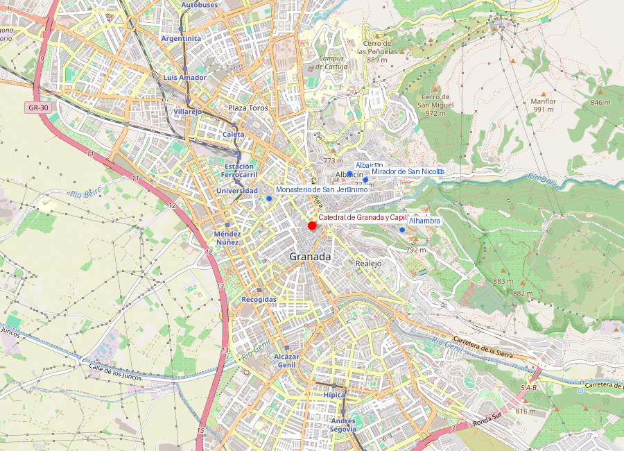
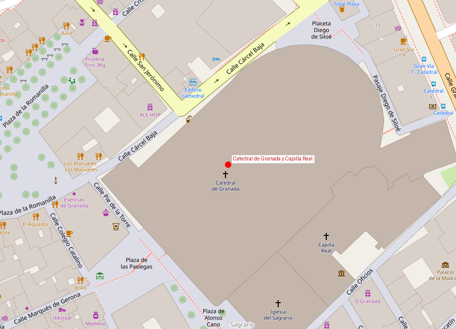

# Catedral de Granada y Capilla Real

```yaml
lugar:
  nombre_original: "Catedral de la Anunciación de Granada / Capilla Real de Granada"
  pais: "España"
  region_admin: "Andalucía"
  coordenadas: "37.1765° N, 3.5993° O"
  fecha_visita: "[DATO PENDIENTE — confirmar fecha]"
```





---

## Qué había antes

La Catedral se levanta sobre el solar de la **Mezquita Mayor** de Granada, la mezquita principal de la ciudad nazarí. Tras la conquista de 1492, la mezquita fue consagrada como catedral provisional. La Capilla Real, adosada a la Catedral, se construyó en terreno anexo para albergar los sepulcros de los Reyes Católicos.

---

## Historia

| Período | Evento clave |
|---|---|
| 1492 | Consagración de la Mezquita Mayor como catedral provisional |
| 1505 | Real Cédula de los Reyes Católicos ordenando la construcción de la **Capilla Real** como panteón regio |
| 1506 | Inicio de las obras de la Capilla Real, diseñada por **Enrique Egas** en estilo gótico isabelino |
| 1517 | Capilla Real concluida. Traslado de los restos de Fernando e Isabel (estaban en el Convento de San Francisco de la Alhambra) |
| 1523 | Inicio de la **Catedral** nueva, bajo proyecto de **Esteban** que pronto asumió **Diego de Siloé** |
| 1528 | Diego de Siloé replantea totalmente la catedral en estilo **renacentista**, convirtiéndola en la primera gran catedral renacentista de España |
| 1561 | Alonso Cano diseña la **fachada barroca** (ejecutada póstumamente) |
| 1704 | Fachada concluida. La catedral nunca se terminó del todo: la segunda torre nunca se construyó |

### La Capilla Real: panteón de los Reyes Católicos

Los Reyes Católicos eligieron deliberadamente Granada como su lugar de enterramiento, rechazando Toledo o Sevilla, para marcar el significado de la conquista. La Capilla Real fue concebida como un espacio de memoria dinástica y de propaganda política: aquí yacían los monarcas que habían completado la Reconquista.

Alberga los **sepulcros de mármol** de:
- **Fernando II de Aragón** e **Isabel I de Castilla** (los Reyes Católicos) — sepulcro obra de **Domenico Fancelli** (1517), escultor italiano de Florencia
- **Juana I** ("la Loca") y **Felipe I** ("el Hermoso") — sepulcro obra de **Bartolomé Ordóñez** (1520)
- El **infante Miguel de la Paz** (nieto de los Reyes Católicos, muerto en 1500), enterrado en un sepulcro menor

Los cuerpos reales están en una cripta simple bajo los mausoleos, en ataúdes de plomo, visibles a través de una reja. Según la tradición, el ataúd de Isabel es más pequeño que el de Fernando, y la almohada de Isabel está más hundida que la del rey, lo que se interpreta popularmente como señal de mayor inteligencia — una leyenda sin base factual pero repetida desde el siglo XVI.

### La Catedral: revolución renacentista

Cuando Diego de Siloé asumió el proyecto en 1528, tomó la decisión radical de abandonar el plan gótico original y diseñar una catedral enteramente renacentista, inspirada en los modelos italianos. La **planta de rotonda** de la capilla mayor (girola circular con pilares clásicos) es única en España y recuerda el Santo Sepulcro de Jerusalén — no por casualidad, pues la intención era crear un monumento al triunfo del cristianismo sobre el islam.

La **fachada principal**, diseñada por **Alonso Cano** (1601–1667) —pintor, escultor y arquitecto granadino, uno de los pocos artistas universales del Siglo de Oro español—, es una composición barroca con tres grandes arcos de medio punto que fue enormemente influyente en la arquitectura religiosa latinoamericana.

---

## Arquitectura

### Capilla Real (gótico isabelino)
- Nave única con bóvedas de crucería
- **Reja mayor** de **Bartolomé de Jaén** (1520): una obra maestra de la forja renacentista española, con escenas de la Pasión
- **Retablo mayor** obra de **Felipe Vigarny** (1520–1522), con escenas de la vida de Cristo y la conquista de Granada
- **Sacristía-Museo**: colección de pintura flamenca de la reina Isabel, que incluye obras de **Rogier van der Weyden**, **Dieric Bouts**, **Hans Memling** y **Sandro Botticelli**. Es una de las colecciones de pintura flamenca primitiva más importantes fuera de Flandes [⚠ VERIFICAR]

### Catedral (renacentista con fachada barroca)
- Cinco naves; altura de la nave central: **30 metros** [⚠ VERIFICAR]
- Capilla Mayor circular con vidrieras originales del siglo XVI
- La segunda torre nunca se construyó, dando a la fachada un aspecto intencionadamente asimétrico
- Órgano barroco del siglo XVIII

---

## Mitología y leyendas

### La almohada de Isabel
Según la tradición popular, al descubrir los ataúdes reales en la cripta, la almohada de plomo del ataúd de Isabel está más hundida que la de Fernando, lo que indicaría una "cabeza más pesada" (es decir, más sabia). La explicación real es probablemente la diferencia de peso de los materiales o una deformación por el tiempo, pero la leyenda ha sido repetida por guías durante siglos.

### El testamento de Isabel
Isabel incluyó en su testamento (1504) la instrucción de que su cuerpo fuera enterrado en Granada, en el Monasterio de San Francisco de la Alhambra, "vestida con el hábito de San Francisco". También pidió que si Fernando prefería ser enterrado en otro lugar, ella permaneciera sola en Granada. Fernando cumplió la voluntad y fue enterrado junto a ella.

---

## Qué se puede ver hoy

- **Capilla Real**: sepulcros, reja, retablo, sacristía-museo con pintura flamenca (entrada independiente)
- **Catedral**: nave, capilla mayor, capillas laterales, fachada (entrada independiente)
- Se recomienda visitar primero la Capilla Real y luego la Catedral (están comunicadas pero tienen entradas y horarios diferentes)

---

## Conexiones

- Los Reyes Católicos celebraron la conquista en la [Alhambra](alhambra.md) y fueron enterrados aquí, a 20 minutos a pie cuesta abajo
- La Catedral se sitúa en el corazón del centro histórico, a pocos metros del inicio de las calles que suben al [Albaicín](albaicin.md)
- Alonso Cano, autor de la fachada, fue también el artista principal del [Monasterio de San Jerónimo](monasterio_san_jeronimo.md), donde hay obras suyas

---

## Datos interesantes

- La Catedral de Granada fue el modelo de numerosas catedrales en América Latina, incluyendo las de Antigua Guatemala, Mérida (Yucatán) y Guadix
- La colección de pintura flamenca de la sacristía de la Capilla Real incluye un **Descendimiento** atribuido a Rogier van der Weyden y un retrato devocional de la Virgen de Hans Memling — reunida por Isabel como colección personal
- Diego de Siloé también diseñó la Escalera Dorada de la Catedral de Burgos, otra obra maestra del Renacimiento español
- La catedral tiene la peculiaridad de no tener la segunda torre construida — algunos la llaman "la catedral manca"

---

*fuente: Capilla Real de Granada (capillarealgranada.com); Earl Rosenthal, "The Cathedral of Granada" (Princeton University Press); Wikipedia (artículos verificados); Patronato de Turismo de Granada.*
