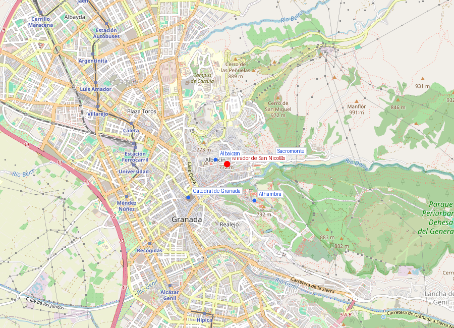
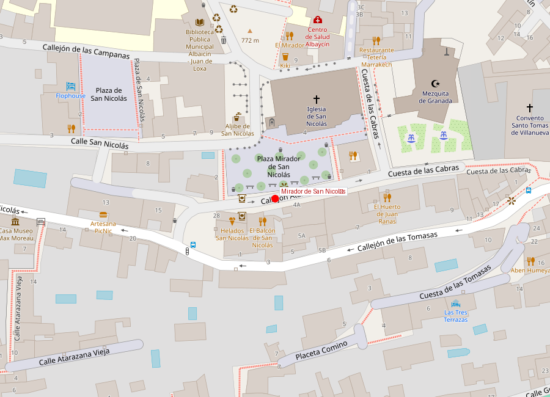

# Mirador de San Nicolás

```yaml
lugar:
  nombre_original: "Mirador de San Nicolás"
  pais: "España"
  region_admin: "Andalucía"
  coordenadas: "37.1810° N, 3.5927° O"
  fecha_visita: "[DATO PENDIENTE — confirmar fecha]"
```





---

## Qué había antes

La placeta frente a la Iglesia de San Nicolás ha sido un espacio abierto al menos desde el siglo XVI. La iglesia fue construida en **1525–1527** sobre el solar de una mezquita del Albaicín. El mirador como tal —la terraza con la vista panorámica— no fue diseñado como atracción: simplemente es el resultado de la topografía del barrio, donde la placeta de la iglesia coincide con un quiebre del terreno que abre una panorámica frontal de la colina de la Sabika.

---

## Historia

El mirador adquirió su fama internacional progresivamente a lo largo del siglo XX, a medida que el turismo masivo llegó a Granada. En **1997**, el presidente estadounidense **Bill Clinton** visitó el mirador y lo describió públicamente como "la puesta de sol más bella del mundo" — una frase que, aunque probablemente exagerada, fue amplificada por los medios y solidificó la reputación del lugar.

En 2003, se inauguró inmediatamente al lado la **Mezquita Mayor de Granada**, la primera mezquita construida en la ciudad desde 1492. El minarete blanco de la nueva mezquita forma ahora parte del paisaje del mirador.

---

## Qué se puede ver

### La vista

Desde el mirador se obtiene una panorámica frontal de:

- La **Alhambra** completa: Alcazaba a la izquierda, Palacios Nazaríes en el centro, Generalife a la derecha
- Detrás de la Alhambra, **Sierra Nevada** con sus cumbres nevadas (el **Mulhacén**, 3.482 m, es el pico más alto de la Península Ibérica)
- La **Vega de Granada** al oeste
- El barranco del **río Darro** entre el Albaicín y la Alhambra

La mejor hora es al **atardecer**, cuando la luz dorada ilumina la Alhambra de frente y Sierra Nevada se tiñe de rosa y violeta. En noches claras, la Alhambra iluminada contra la sierra oscura es igualmente espectacular.

### En la placeta

- **Iglesia de San Nicolás** (siglo XVI) — generalmente cerrada al público excepto en horarios de culto
- **Mezquita Mayor de Granada** (2003) — se puede visitar el jardín-patio
- Músicos callejeros al atardecer (flamenco informal)

---

## Conexiones

- Está en el corazón del [Albaicín](albaicin.md), a unos 15 minutos caminando cuesta arriba desde Plaza Nueva
- La [Alhambra](alhambra.md) se ve entera desde aquí, al otro lado del barranco del Darro
- Desde el mirador se puede continuar subiendo hasta el [Sacromonte](sacromonte.md) por el Camino del Sacromonte
- La bajada por la Cuesta del Chapiz conduce a la Carrera del Darro y de ahí al centro y la [Catedral](catedral_capilla_real.md)

---

## Datos interesantes

- La frase atribuida a Clinton ("the most beautiful sunset in the world") no está documentada como cita textual verificada, pero es repetida universalmente en Granada como hecho histórico
- Al atardecer en temporada alta, el mirador se llena completamente — llegar al menos 30 minutos antes de la puesta de sol para encontrar sitio
- Antigaumente existía otro mirador menos conocido, el **Mirador de San Cristóbal**, más al norte, que ofrece una perspectiva diferente (más amplia, menos frontal a la Alhambra)
- El nombre de la iglesia —San Nicolás— se refiere a San Nicolás de Bari, patrón de los marineros, una advocación extraña para un barrio de montaña que se explica por los orígenes de los colonos que repoblaron el Albaicín tras la conquista

---

*fuente: Patronato de Turismo de Granada; UNESCO World Heritage Centre; Wikipedia (artículos verificados).*
