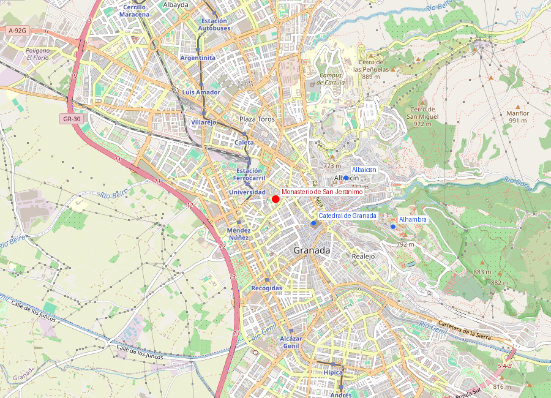
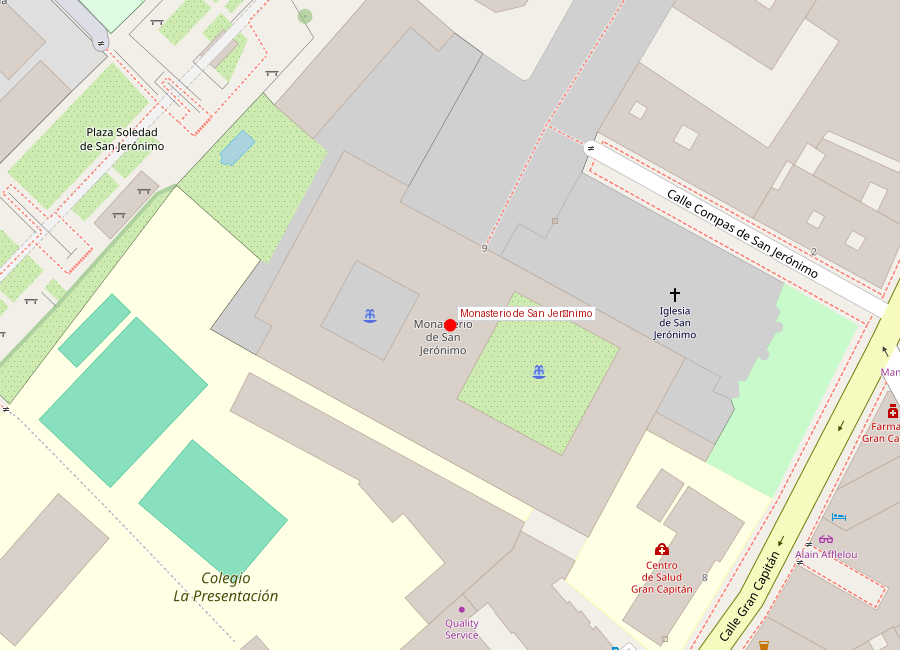

# Monasterio de San Jerónimo

```yaml
lugar:
  nombre_original: "Real Monasterio de San Jerónimo de Granada"
  pais: "España"
  region_admin: "Andalucía"
  coordenadas: "37.1792° N, 3.6046° O"
  fecha_visita: "[DATO PENDIENTE — confirmar fecha]"
```





---

## Qué había antes

El monasterio fue la **primera fundación monástica** establecida en Granada tras la conquista cristiana de 1492. Se fundó inicialmente como campamento provisional en **Santa Fe** —la ciudad-campamento que los Reyes Católicos construyeron durante el asedio de Granada— y se trasladó al emplazamiento actual dentro de la ciudad en 1504.

---

## Historia

| Período | Evento clave |
|---|---|
| 1492 | Fundación en Santa Fe durante el asedio de Granada |
| 1504 | Traslado al emplazamiento actual en Granada |
| 1519 | Inicio de la construcción del edificio definitivo, bajo dirección de **Jacobo Florentino** |
| 1525 | **Diego de Siloé** asume la dirección de las obras (el mismo arquitecto de la Catedral) |
| 1552 | **Gonzalo Fernández de Córdoba**, el "Gran Capitán", es enterrado en la capilla mayor |
| Siglo XVII | **Alonso Cano** y otros artistas barrocos completan la decoración interior |
| 1835 | Desamortización de Mendizábal: los monjes jerónimos son expulsados; el monasterio pasa a ser cuartel militar |
| Siglo XX | Restauración y retorno parcial a uso religioso (monjas jerónimas) |

### El Gran Capitán

El personaje histórico más asociado al monasterio es **Gonzalo Fernández de Córdoba** (1453–1515), conocido como el **Gran Capitán**, uno de los generales más brillantes de la historia militar europea. Veterano de la Guerra de Granada, luego conquistador del Reino de Nápoles para la Corona de Aragón, revolucionó la táctica militar con la creación del sistema de **tercios** (la formación de infantería que dominaría los campos de batalla europeos durante un siglo y medio).

Su viuda, **María Manrique de Lara**, duquesa de Sessa, financió la espectacular capilla mayor del monasterio como panteón del Gran Capitán. La capilla fue diseñada por Diego de Siloé como un espacio de propaganda dinástica comparable a la Capilla Real de los Reyes Católicos.

---

## Arquitectura

### La iglesia

La iglesia del monasterio es de **una sola nave** con crucero y capilla mayor monumental. Lo que la hace excepcional es la decoración de la **capilla mayor**, un tour de force del Renacimiento español:

- **Retablo mayor**: enorme, policromado y dorado, que asciende desde el suelo hasta la bóveda. Contiene escenas bíblicas y figuras de santos, con una profusión decorativa que anticipa el Barroco.
- **Escudos heráldicos** del Gran Capitán y de los Fernández de Córdoba por todas partes
- **Pinturas** de **Juan de Medina** y relieves de santos guerreros (la iconografía militar es deliberada)
- La **bóveda** de la capilla mayor es una obra de ingeniería de Siloé, con medallones y grutescos renacentistas

### Los claustros

El monasterio tiene **dos claustros**:
- **Claustro principal** (gótico-renacentista): dos pisos, con naranjos en el centro. Es extraordinariamente sereno y uno de los claustros más bellos de Andalucía.
- **Claustro menor**: más austero, de uso conventual

La paz de los claustros contrasta vivamente con el bullicio del centro de Granada, a pocos minutos a pie.

---

## Qué se puede ver hoy

- **Iglesia y capilla mayor**: el retablo y el sepulcro del Gran Capitán
- **Claustro principal**: con jardín de naranjos
- **Coro bajo**: con sillería renacentista
- El monasterio está habitado por una comunidad de **monjas jerónimas** que mantienen la tradición de repostería conventual (se pueden comprar dulces a través del torno)

---

## Conexiones

- Diego de Siloé, arquitecto del monasterio, es también el arquitecto de la [Catedral de Granada](catedral_capilla_real.md)
- El Gran Capitán participó en la Guerra de Granada cuya conclusión se celebra en la [Alhambra](alhambra.md)
- El monasterio está a unos 10 minutos a pie de la Catedral, en dirección noroeste, fuera del casco histórico medieval pero dentro del ensanche renacentista

---

## Datos interesantes

- El Gran Capitán inventó la expresión **"las cuentas del Gran Capitán"**: cuando Fernando el Católico le pidió cuentas detalladas de los gastos de la campaña de Nápoles, Gonzalo le presentó una lista que incluía partidas como "100.000 ducados en picos, palas y azadones" y "100.000 ducados en guantes perfumados para preservar a las tropas del hedor de los cadáveres enemigos". La respuesta era una forma elegante de decir que el rey le debía más de lo que podía pagarle. La expresión se usa hoy en español para referirse a cuentas exageradas o poco detalladas.
- Las monjas jerónimas venden **dulces conventuales** (bizcochadas, alfajores, pestiños) a través de un torno giratorio sin ver ni ser vistas — una tradición que se mantiene desde el siglo XVI
- La Desamortización de 1835 causó daños enormes al monasterio: se perdieron piezas de arte, libros y mobiliario, y el edificio sirvió como cuartel de caballería durante décadas

---

*fuente: Orden de San Jerónimo; Antonio Gallego Burín, "Granada: Guía artística e histórica de la ciudad" (Editorial Don Quijote); Wikipedia (artículos verificados).*
