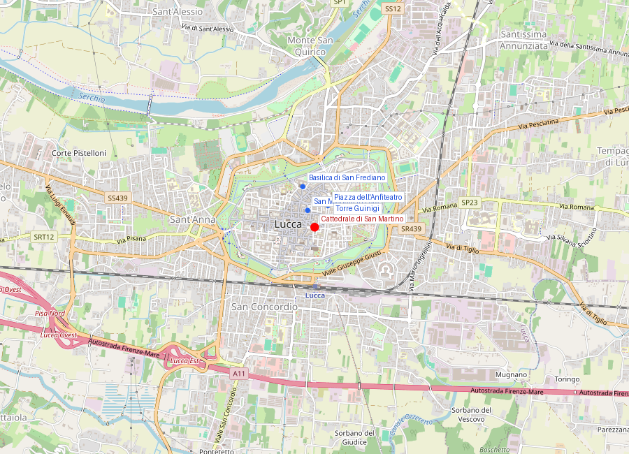
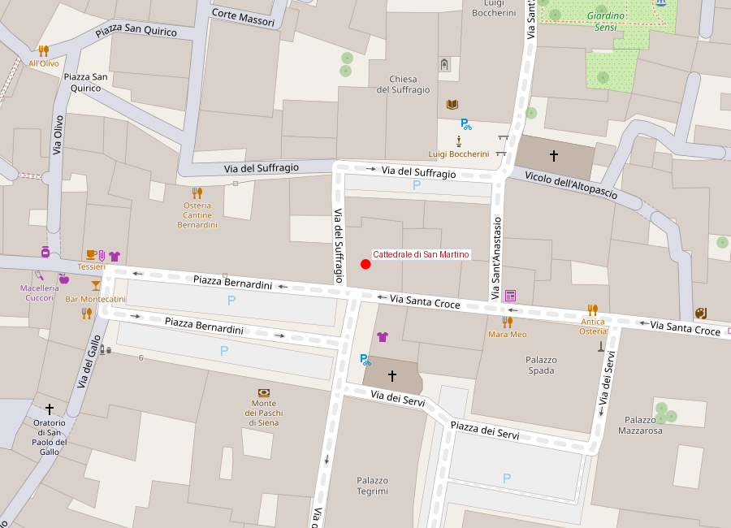

# Cattedrale di San Martino

```yaml
lugar:
  nombre_original: "Cattedrale di San Martino"
  nombre_alternativo: "Duomo di Lucca"
  pais: "Italia"
  region_admin: "Toscana"
  coordenadas: "43.8426° N, 10.5061° E"
  altitud_m: 19
  fecha_visita: "[DATO PENDIENTE — confirmar fecha]"
```





---

<!-- 📷 FOTO: fachada del Duomo con logias de columnas / asimetría del pórtico y campanile -->

## Primera impresión: la asimetría

La fachada de la Cattedrale di San Martino golpea antes de que uno pueda articular los motivos: es **asimétrica**. El pórtico tiene tres arcos, pero el de la izquierda está comprimido, mucho más estrecho que los otros dos. La razón es pragmática y medieval al mismo tiempo: el **campanile** —la torre del campanario— ya existía cuando se construyó el pórtico del siglo XIII, y el arquitecto **Guidetto** simplemente ajustó los proporciones del pórtico para no entrar en conflicto con la torre preexistente.

La asimetría que podría parecer un error es en realidad la huella del tiempo y de las prioridades cambiantes de una construcción medieval que duró siglos.

---

## Historia

### Fundación y primeras fases (siglo VI–XI)

La tradición atribuye la fundación de la catedral al obispo **San Frediano** en el siglo VI, aunque no hay restos físicos de ese primer edificio. La catedral medieval significativa comienza con la reconstrucción impulsada por el papa **Alessandro II** (que antes de ser papa había sido obispo de Lucca), quien en el **1060** inició una renovación importante de la iglesia en estilo románico.

En este período Lucca era suficientemente importante en la jerarquía eclesiástica como para que un obispo local ascendiera al papado: **Anselmo da Baggio**, obispo de Lucca, fue elegido papa en 1061 como **Alessandro II** y gobernó la Iglesia hasta 1073.

### La fachada de Guidetto (c. 1204)

La fachada actual, con su extraordinaria decoración de **logias de columnas en tres niveles** sobre el pórtico, fue ejecutada por el marmista y arquitecto **Guidetto** (o Guido Bigarelli) a partir de **1204**. Guidetto era un representante de la corriente de los *Maestri Campionesi*, artistas de origen lombardo que trabajaban al servicio de las cattedrali toscanas.

La fachada es uno de los ejemplos más bravos del **románico pisano-luchese**: tres portadas en planta baja, sobre las cuales tres niveles de logias ciegas con columnas de distintos diseños —cada columna diferente de la siguiente—, trabajadas con mármoles bicolor (blanco y verde). El nivel superior está coronado por un rosetón central y dos finestras minionas.

Lo que diferencia a San Martino del románico pisano "puro" es el **encuadre abovedado del pórtico**: la loggia luchese tiene un sotopórtico más oscuro y envolvente que la linealidad pisana, creando una profundidad arquitectónica mayor.

### Las esculturas del pórtico

<!-- 📷 FOTO: relieves del pórtico / Deposición de la Cruz / San Martino a caballo -->

El pórtico es también un programa escultórico:

- **San Martino a caballo partiendo la capa**: sobre el arco de entrada central (lado izquierdo), el relieve más famoso del pórtico muestra al patrón de la catedral dando la mitad de su capa militar a un mendigo. El episodio, que según la tradición ocurrió en Amiens (Francia) en el siglo IV, es el fundamento iconográfico del culto a San Martín de Tours —el soldado romano que se convirtió en obispo y cuyo generoso gesto se convirtió en símbolo del ideal caritativo cristiano. Esta escultura es del siglo XIII.
- **La Deposizione di Cristo**: en el arquitecto (pilastro) del pórtico, existe un excepcional relieve medieval del siglo XII–XIII con la bajada de la Cruz, de un expresionismo austero y poderoso.
- **El laberinto**: en el muro izquierdo del pórtico, a la altura de la mano, hay una pequeña incisión circular con un laberinto. Los laberintos en catedrales medievales son simbólicamente complejos: aluden al camino de la vida y la salvación, pero también a la peregrinación. En algunas interpretaciones, el peregrino tocaba el laberinto antes de entrar en la catedral. El de San Martino tiene una inscripción latina que lo rodea: *"Hic quem Creticus edit Daedalus est laberintus / De quo nullus vadere quivit qui fuit intus"* ("Este es el laberinto que el cretense Dédalo construyó / Del que ninguno podía salir una vez dentro").

---

## El Volto Santo

<!-- 📷 FOTO: el Volto Santo en su capilla / detalle del rostro y la corona -->

El objeto más sagrado de Lucca —y posiblemente uno de los más venerados de la Italia medieval— es el **Volto Santo** ("Santo Rostro"): una figura de Cristo en la Cruz, de madera oscura, de tamaño natural, vestida con una túnica larga (el *colobium*) y coronada.

### La leyenda de origen

La leyenda del Volto Santo es de las más ricas del santoral medieval. Según la tradición, fue esculpida por **Nicodemo** —el fariseo que, junto con José de Arimatea, descendió a Jesús de la Cruz según el Evangelio de Juan— que habría trabajado de memoria inmediatamente después de la Crucifixión. Según la leyenda, Nicodemo era incapaz de reproducir el rostro con suficiente exactitud y se quedó dormido; cuando despertó, encontró el rostro terminado por manos angélicas.

La imagen permaneció en Judea hasta el siglo VIII, cuando un obispo cristiano de Palestina la cargó en un barco sin timón ni tripulación encomendando su destino a Dios. El barco llegó solo al puerto de **Luni** (cerca de La Spezia) en el año **742 d.C.** Los habitantes de Luni y los de Lucca se disputaron la imagen; la tradición cuenta que la decisión fue tomada milagrosamente: se colocó la imagen en un carro tirado por bueyes que no habían sido entrenados ni dirigidos, y los animales partieron solos hacia Lucca. La imagen quedó en Lucca.

### El significado medieval

Independientemente de la historicidad de la leyenda, el Volto Santo fue en la Edad Media uno de los **crucifijos más venerados de Europa**. La razón está en su iconografía: mientras que los crucifijos medievales convencionales representan a Cristo sufriente y semidesnudo, el Volto Santo muestra a un Cristo **hierático, vivo, vestido con ropa real y coronado** — una imagen derivada de la tradición bizantina oriental que subraya la divinidad sobre la humanidad de Cristo.

Esta imagen "diferente" atraía peregrinaciones de toda Europa. En los archivos medievales ingleses, hay referencias a un juramento *"por el Santo Volto de Lucca"* que era considerado uno de los juramentos más solemnes posibles. **Guillermo el Conquistador** es mencionado en fuentes medievales como devoto del Volto Santo. La figura se convirtió en uno de los destinos de la **Via Francigena**.

La celebración principal es la **Luminara di Santa Croce** (la noche del 13 de septiembre): una procesión nocturna por las calles de Lucca donde los habitantes llevan velas encendidas, y el Volto Santo es transportado en procesión por la ciudad. Es una de las fiestas religiosas más antiguas de la Toscana, documentada desde el siglo XII.

### La escultura

La datación de la escultura actual está debatida. Durante siglos se creyó que era obra del medieval temprano (siglo VIII-IX), coherente con la leyenda. El análisis técnico moderno ha sugerido que la figura actual es probablemente de los **siglos XI–XII**, posiblemente una sustitución o restauración de un original anterior. El estilo es románico, con influencias del arte otomiano germánico y ciertos elementos bizantinos. [⚠ VERIFICAR cronología exacta]

El Volto Santo se conserva en la **Cappella del Volto Santo**, un pequeño tabernáculo renacentista dentro de la Cattedrale, diseñado por **Matteo Civitali** (un escultor luchese del siglo XV). La capilla en sí es una joya del Renacimiento tardío.

---

## El monumento funerario de Ilaria del Carretto (1406)

<!-- 📷 FOTO: sarcófago de Ilaria del Carretto / detalle del perro a sus pies / detalle del drapeado -->

En una capilla lateral de la catedral se conserva una de las esculturas más importantes del **primer Renacimiento italiano**: el **monumento funerario de Ilaria del Carretto**, esposa de Paolo Guinigi (señor de Lucca), que murió en 1405 a los 24 años, poco después de dar a luz.

**Jacopo della Quercia**, escultor sienés, la ejecutó en **1406**. Es una de las primeras obras maestras del nuevo lenguaje renacentista aplicado a la escultura funeraria.

### La escultura en detalle

Ilaria está representada **yacente**, con los ojos cerrados y las manos juntas sobre el pecho, en la postura típica del *gisant* medieval. Pero hay algo distinto:

1. **El drapeado del vestido**: las telas caen sobre el cuerpo con una naturalidad y un peso real que la escultura medieval nunca había conseguido. Della Quercia estudió los sarcófagos romanos del Camposanto Monumentale de Pisa —las telas de los relieves clásicos greco-romanos— y aprendió de ellos cómo representar el tejido como algo con masa y gravedad, no como un ornamento lineal.

2. **El perro a sus pies**: a los pies de Ilaria descansa un perro de caza. El animal es símbolo de fidelidad conyugal en la iconografía medieval (aparece en muchos monumentos funerarios medievales europeos), pero en della Quercia el perro es un retrato escultórico de un animal real: tiene peso, musculatura, postura. No es un símbolo sino un ser.

3. **El rostro**: sereno, suavemente idealizado, con una belleza que ya no debe nada al hieratismo medieval sino a la observación directa de rostros reales. No sabemos si es un retrato verdadero de Ilaria o una idealización, pero la pregunta ya tiene sentido en 1406, lo que de por sí es nuevo.

4. **El sarcófago decorado con putti**: los lados del sarcófago están decorados con guirnaldas sostenidas por *putti* (angelotes desnudos), una derivación directa de los sarcófagos romanos. Es uno de los primeros usos del *putto* renacentista en la escultura italiana.

### La "admiración de Miguel Ángel"

Una tradición literaria —difícil de verificar con exactitud pero repetida por Vasari y otros— cuenta que **Miguel Ángel**, después de ver el monumento de Ilaria en Lucca, lo consideró la obra de escultura más bella que había visto hasta entonces. Haya o no dicho exactamente eso, la admiración de Miguel Ángel por Della Quercia está bien documentada: el sienés influyó directamente en algunos de los relieves de la **Porta Magna** de San Petronio en Bolonia que Della Quercia ejecutó más tarde, y esos relieves fueron uno de los modelos que el joven Michelangelo estudió en sus visitas a Bolonia.

---

## El interior de la catedral

### La Sacrestia y el Martirio di San Bartolomeo

El interior es de tres naves, en estilo gótico-románico de transición. En la sacristía de la catedral se conserva una notable **Madonna con Bambino e Santi** de **Domenico Ghirlandaio** y en el coro una órgano monumental barroco.

En una de las lunetas del transito se encuentra además una tela atribuida **[⚠ VERIFICAR]** a **Tintoretto** con el martirio de San Bartolomeo.

### Museo della Cattedrale

Adyacente a la catedral, el **Museo della Cattedrale** guarda los tesoros más valiosos del Duomo: el vestuario ceremonial del Volto Santo (robe, corona, zapatos de plata), orfebrería medieval, y objetos litúrgicos de gran valor.

---

## Conexiones

- El Volto Santo convirtió a Lucca en parada obligatoria de la **Via Francigena**, la misma ruta de peregrinación que conectaba Canterbury con Roma y que pasaba también por la **Abbazia di San Miniato al Monte** en Firenze.
- **Jacopo della Quercia**, autor del monumento de Ilaria, trabajó también en el **Battistero di Siena** (junto a Donatello y Ghiberti) y en la **Porta Magna** de San Petronio en Bolonia. Es una figura bisagra del primer Renacimiento.
- La catedral es el ejemplo paradigmático del estilo **románico luchese**, que se relaciona con el románico pisano pero tiene una identidad propia reconocible.

---

## Datos interesantes

- El Volto Santo viste distintos **ropajes ceremoniales** según la época litúrgica del año: hay trajes de Semana Santa, de fiesta, de luto. Los tejidos utilizados durante siglos son ahora custodiados en el Museo della Cattedrale.
- Hay en la fachada **columnas que, si se miran con detenimiento, son todas distintas**: finas, retorcidas, con incrustaciones de mosaico, lisas, historiadas. Es un catálogo de habilidades de los maestros canteros medievales.
- El laberinto del pórtico es uno de los pocos **laberintos medievales** conservados *in situ* en toda Italia: la mayoría de los que aparecen en catedrales medievales europeas son pavimentos interiores.

---

*fuente: Giuseppina Benassati, "Jacopo della Quercia" (ed. Calderini); Enrico Ridolfi, "L'arte in Lucca" (1882); Touring Club Italiano, Toscana; Encyclopædia Britannica (voz "Ilaria del Carretto"); sitio del Archivio di Stato di Lucca; Wikipedia (verificado).*
