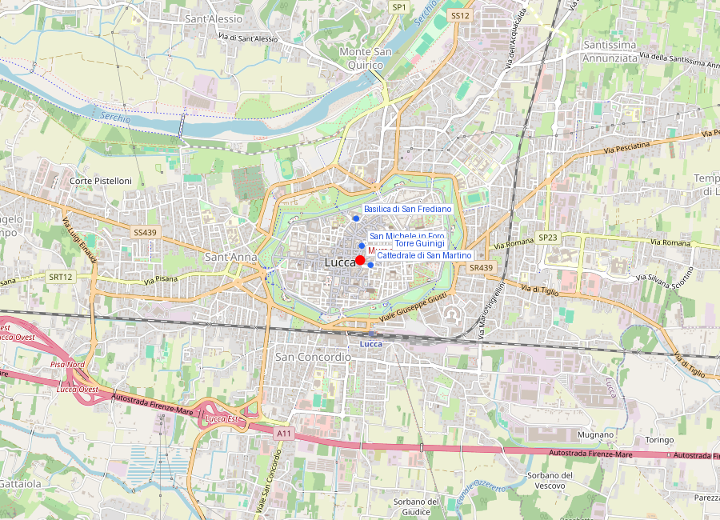
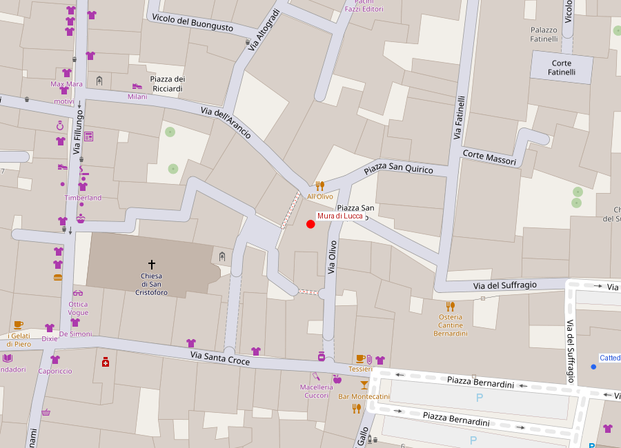

# Mura di Lucca

```yaml
lugar:
  nombre_original: "Mura di Lucca"
  pais: "Italia"
  region_admin: "Toscana"
  coordenadas: "43.8430° N, 10.5050° E"
  altitud_m: 19
  fecha_visita: "[DATO PENDIENTE — confirmar fecha]"
```





---

<!-- 📷 FOTO: vista aérea de las murallas / paseo arbolado sobre el baluarte / bicicletas en el camino de ronda -->

## Qué hacen única a estas murallas

Las Mura di Lucca son únicas en Europa por una razón sencilla: son **las únicas murallas renacentistas de gran escala del continente que permanecen completamente intactas y que jamás fueron empleadas en combate real**. Construidas entre 1544 y 1650 a un costo descomunal para la pequeña República, nunca sirvieron para lo que fueron diseñadas. El ejército al que debían detener jamás llegó.

Esa paradoja —una obra de ingeniería militar de primer orden convertida en paseo cívico— es la esencia de Lucca.

---

## Historia

### Las murallas medievales anteriores

Antes de las murallas renacentistas actuales, Lucca tuvo dos anillos de murallas medievales. El primero, de origen tardorromano y carolingio, fue sustituido por un segundo anillo en el siglo XII–XIII cuando la ciudad se expandió. Fragmentos de esas murallas medievales aún son visibles integrados en edificios del centro histórico.

A finales del siglo XV, la tecnología militar había cambiado radicalmente con la **artillería de campo**: los castillos medievales de muros altos y verticales —perfectos contra escaleramientos y proyectiles de catapulta— eran vulnerables a los cañones, que podían derruir la piedra vertical con facilidad. 

### El nuevo sistema abaluartado (1544–1650)

La solución renacentista a este problema fue la **muralla en estrella** (*trace italienne*): muros inclinados más bajos y más gruesos, capaces de absorber y deflectar los impactos de cañón; y **baluartes** en forma de flecha proyectados hacia afuera en las esquinas, que eliminaban los "ángulos muertos" desde los que el enemigo podía atacar sin recibir fuego de flanco.

La República de Lucca encargó el proyecto a **Jacopo Seghizzi** y otros ingenieros militares. El resultado fue:

| Dato | Valor |
|---|---|
| Circunferencia total | 4,2 km |
| Anchura en la base | hasta 30 metros |
| Número de baluartes | 11 originales + 1 añadido |
| Altura de los terraplenes | ~10–12 m sobre el foso |
| Foso externo | sí, aunque parcialmente cegado hoy |
| Portal de acceso | 3 puertas principales: Porta San Pietro, Porta Sant'Anna, Porta Elisa |
| Fecha de inicio | 1544 |
| Fecha de conclusión | 1650 (aunque la obra fue esencialmente continua) |
| Material principal | tierra y ladrillo (núcleo de tierra apisonada revestida de ladrillo) |

La clave estructural de estas murallas es el **relleno de tierra**: en lugar de muros de piedra maciza que el cañón puede fragmentar, los baluartes lucheses tienen un núcleo masivo de **tierra apisonada** revestida de ladrillo. La tierra absorbe los impactos sin fragmentarse. Es una tecnología militar que en la segunda mitad del siglo XVI era de vanguardia.

La construcción consumió recursos enormes para la pequeña República: se estima que requirió décadas de trabajo continuo y representó uno de los mayores esfuerzos financieros de la historia de la ciudad.

### ¿Por qué nunca se usaron?

La muralla se completó precisamente cuando Lucca estaba en un largo período de paz relativa. Las guerras de Italia del siglo XVI —con españoles, franceses e imperiales peleando sobre el terreno italiano— no llegaron directamente a Lucca. Y cuando Napoleón llegó en 1799 y disolvió la República, no con artillería sino con un decreto, las murallas resultaron inútiles para su propósito original.

No fueron demolidas —como sucedió con las murallas de muchas ciudades europeas en el siglo XIX para abrir bulevares— porque la República ya no existía y el espacio extra-muros no tenía la presión de crecimiento industrial de ciudades mayores. Sobrevivieron por inercia, y esa inercia las preservó perfectamente.

### Las murallas en el siglo XIX: el paseo de los Borbones

En el período del **Ducato di Lucca** (1817–1847), los Bourbon-Parma transformaron las murallas en un **paseo ornamental**: se plantaron filas de plátanos y encinas sobre el camino de ronda superior, se instalaron bancos y miradores. Los lucheses dejaron de ver las murallas como defensa y empezaron a apropiarlas como espacio cívico. El paseo arbolado que se puede recorrer hoy es heredero directo de esa transformación decimonónica.

---

## Arquitectura e ingeniería

### Los baluartes

Los **baluartes** (llamados en italiano *baluardi*) son los elementos arquitectónicamente más imponentes. En planta tienen forma de estrella de cinco puntas truncada: dos "orejas" laterales y una punta central que se projeta hacia afuera del muro principal. Esta geometría permite que los defensores sobre los flancos puedan disparar a lo largo de la cara del muro adyacente, eliminando los puntos ciegos.

Los baluartes de Lucca tienen nombres propios: *Baluardo San Martino*, *Baluardo San Frediano*, *Baluardo Santa Croce*, etc. —casi todos los patronos de las principales iglesias de la ciudad.

Cada baluardo tiene en su interior **cámaras de artillería** (*cannoniere*) y pasajes que conectan con el interior de la muralla. Algunos están hoy accesibles en su interior o pueden visitarse.

### Las puertas

Las tres puertas monumentales son obras de arquitectura civil de primer nivel:

- **Porta San Pietro** (sur): la más monumental, con un arco de triunfo de estilo tardomanierista que incorpora el escudo de armas de la República.
- **Porta Sant'Anna** (oeste): reformada en época napoleónica.
- **Porta Elisa** (este): nombrada en honor a **Elisa Bonaparte Baciocchi**, princesa de Lucca; de diseño neoclásico, mandada construir en 1811 como entrada de honor.

---

## El paseo hoy: recorrer las murallas

El camino de ronda sobre las murallas es **completamente peatonal y ciclable**. Tiene 4,2 km de circuito cerrado y puede completarse:
- **A pie**: en unos 45–60 minutos a paso tranquilo.
- **En bicicleta**: en 20–30 minutos.

La bicicleta es el modo recomendado y el más típico: hay docenas de puntos de alquiler en la ciudad, especialmente cerca de la estación de tren. Las bicicletas con canasta o de paseo son las más comunes.

Los árboles (plátanos en la mayor parte del recorrido, encinas en algunos tramos) forman un dosel que ensombrece el camino en las horas más calurosas. Las vistas desde arriba permiten ver:
- El interior del casco histórico: tejados de terracota, campanarios, el bosquete de árboles en lo alto de la **Torre Guinigi**.
- El exterior: el foso (parcialmente cegado y convertido en zona verde), los suburbios modernos de Lucca, y en días claros las colinas de las **Alpi Apuane** y la **Garfagnana** al norte.

### Puntos de parada en el recorrido

Los **baluartes** son las paradas más interesantes: ofrecen plataformas más anchas con bancos y vistas en múltiples direcciones. Particularmente recomendados:

- **Baluardo San Frediano** (norte): el más grande, con un anfiteatro verde público en su interior. Vistas sobre la Basilica di San Frediano.
- **Baluardo San Paolino** (oeste): junto a Porta Sant'Anna.
- **Baluardo San Regolo** (sur): frente a la Porta San Pietro, con vistas sobre el Palazzo Ducale.

---

## Conexiones

- Las murallas son el marco visual que define todo lo que hay dentro: todo el centro histórico de Lucca está circunscrito por este perímetro.
- Los baluartes llevan el nombre de los patronos de las iglesias románicas del interior, creando una cartografía religiosa superpuesta a la militar.
- El foso exterior, ahora convertido en zona verde y parques lineales, rodea las murallas y forma un cinturón de espacio público que separa el centro histórico del resto de la ciudad.

---

## Datos interesantes

- Lucca es la única ciudad de Italia donde se puede **dar la vuelta completa al perímetro urbano histórico** caminando o en bicicleta sobre las propias murallas, sin interrupciones.
- Las murallas tienen en algunos puntos una anchura de base de hasta **30 metros**: no son un muro sino una montaña de tierra y ladrillo.
- La República gastó en la construcción de las murallas una suma equivalente a décadas de presupuesto ordinario. Fue el mayor proyecto de obras públicas de toda su historia.
- Los árboles que crecen en los baluartes tienen raíces que penetran en el relleno de tierra: son parte inseparable de la estructura hoy.

---

*fuente: Touring Club Italiano, "Toscana" (ed. TCI); Giorgio Tori, "Lucca medievale e moderna" (ed. Pacini Fazzi); sitio oficial del Comune di Lucca; Encyclopædia Britannica.*
