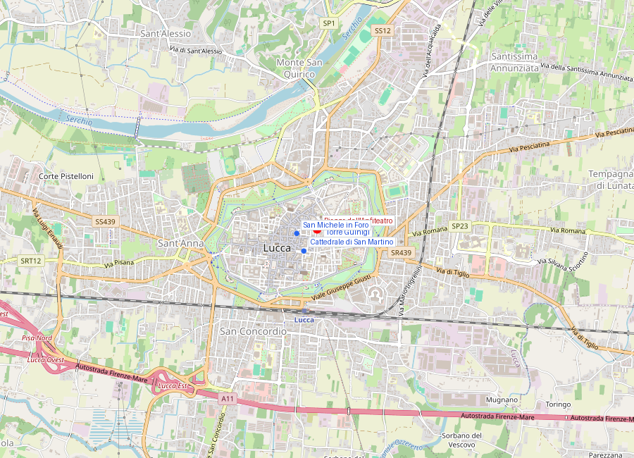
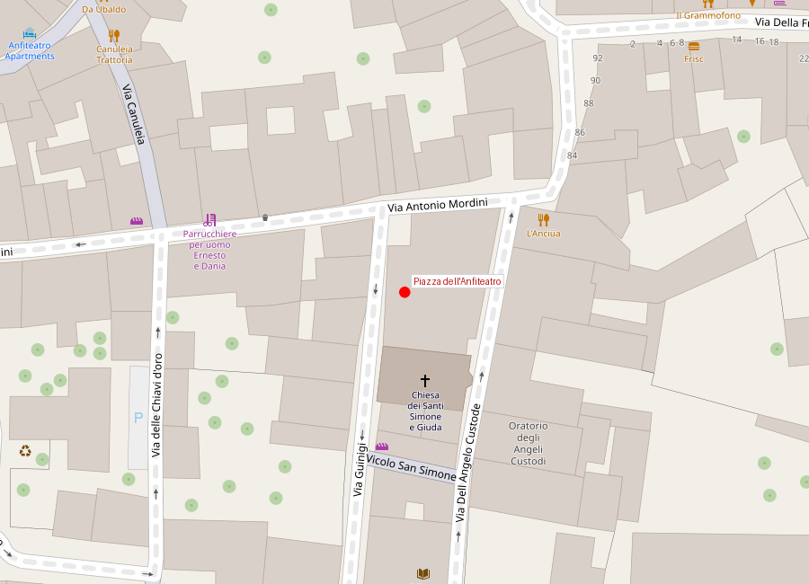

# Piazza dell'Anfiteatro

```yaml
lugar:
  nombre_original: "Piazza dell'Anfiteatro"
  pais: "Italia"
  region_admin: "Toscana"
  coordenadas: "43.8445° N, 10.5077° E"
  altitud_m: 19
  fecha_visita: "[DATO PENDIENTE — confirmar fecha]"
```





---

<!-- 📷 FOTO: vista aérea de la piazza elíptica / pasillos de acceso / fachadas irregulares con arcos tapiados -->

## Qué es este lugar

La **Piazza dell'Anfiteatro** es una de las piazzas más singulares de Italia: una elipse perfecta, sin ángulos rectos ni lados paralelos, rodeada por fachadas que suben y bajan siguiendo la curva natural de un edificio enterrado hace más de mil años. Es el anfiteatro romano de Lucca, transformado a lo largo de doce siglos en barrio habitado, y luego en plaza pública.

No hay ningún signo visible del anfiteatro romano cuando uno entra desde la calle: las fachadas son medievales, renacentistas y barrocas, pintadas en ocres y amarillos. Pero el suelo sobre el que se camina es el nivel de la arena romana, y las paredes curvas que rodean el espacio reproducen exactamente la forma del graderío del siglo II d.C.

---

## Historia

### El anfiteatro romano (siglo II d.C.)

El anfiteatro fue construido durante el **siglo II d.C.**, en el período de mayor prosperidad de la *Colonia Luca* romana. Las dimensiones exactas están reconstruidas parcialmente: se estima que tenía unos **135 metros en el eje mayor** y unos **109 metros en el eje menor**, con capacidad para entre 10.000 y 12.000 espectadores [⚠ VERIFICAR cifras exactas — distintas fuentes difieren].

Su función era la habitual de los anfiteatros imperiales: *munera* (combates de gladiadores), *venationes* (cacerías de animales) y ocasionalmente ejecuciones públicas. En ciudades de tamaño mediano como Luca, el anfiteatro era también el principal espacio de reunión cívica donde el poder imperial se hacía visible ante la comunidad.

Con la caída del Imperio Romano de Occidente y el fin de los espectáculos de gladiadores (probablemente en el siglo V d.C.), el anfiteatro fue progresivamente abandonado como estructura monumental.

### De monumento a cantera a barrio (siglos VI–XII)

La historia típica de los anfiteatros romanos es su degradación gradual: primero abandono, luego uso como cantera para extraer piedra de construcción para otros edificios, finalmente ocupación espontánea por viviendas y talleres.

En Lucca sucedió exactamente esto, pero con una particularidad: la forma elíptica del anfiteatro era tan robusta —los muros de cavea y los corredores abovedados del graderío eran estructuras de hormigón y travertino extraordinariamente sólidas— que en lugar de ser completamente desmontada, la estructura fue **habitada y reutilizada por dentro**.

A partir del siglo VI–VII, los lucenses comenzaron a construir casas y talleres **dentro de las arcadas del graderío**, luego **sobre** el graderío, incorporando los muros de travertino romano como cimiento y paredes de carga. Los arcos de acceso originales (los *vomitoria* romanos) fueron parcialmente tapiados o convertidos en pasajes entre viviendas. Los espacios abovedados bajo las gradas se convirtieron en bodegas, establos y almacenes.

El proceso se repitió en decenas de ciudades romanas de Italia (Verona, Nîmes, Arles, Pozzuoli), pero Lucca es uno de los ejemplos en que la transformación de anfiteatro en tejido urbano se conserva de manera especialmente legible.

Durante la Alta y Baja Edad Media, el interior del anfiteatro —el espacio de la arena— quedó gradualmente cerrado y transformado en lo que se llamó *il Cortile* (el patio): un espacio semipúblico irregular, sin la forma elíptica perfecta que hoy se ve, lleno de construcciones acumuladas sin orden.

### La intervención del siglo XIX: Lorenzo Nottolini y la recuperación de la forma

En el período del **Ducato di Lucca** bajo el duque **Carlo Ludovico di Borbone** (1824–1847), el arquitecto ducal **Lorenzo Nottolini** propuso un ambicioso proyecto de regularización y saneamiento del espacio interior.

El proyecto, ejecutado entre **1830 y 1840** aproximadamente, implicó:
1. **Demolición de las construcciones irregulares** que habían invadido la arena y ocultaban la forma elíptica.
2. **Regularización de las fachadas interiores**: las casas perimetrales fueron parcialmente rediseñadas para seguir una línea curva continua, con arcadas en planta baja que hacen referencia a los arcos originales del anfiteatro.
3. **Apertura de cuatro pasajes de acceso** desde las calles exteriores, que reproducen aproximadamente los *vomitoria* originales.
4. **Pavimentación de la arena** como espacio público abierto.

El resultado es la piazza que se conoce hoy: no una excavación arqueológica (los restos romanos siguen mayormente enterrados o integrados en los edificios), sino una **relectura urbana neoclásica** que hace visible la forma del anfiteatro original sin desmantelar el tejido medieval superpuesto.

Es una intervención de restauración urbana notablemente sofisticada para 1830: Nottolini no destruyó el palimpsesto histórico sino que lo interpretó y lo hizo legible.

---

## La piazza hoy

### La experiencia de entrada

<!-- 📷 FOTO: pasaje de acceso desde Via Fillungo / efecto de sorpresa al desvelare la elipse -->

Uno de los mayores placeres de la Piazza dell'Anfiteatro es la **sorpresa de la entrada**: las calles que llevan a ella son estrechas y medievales; no hay ningún indicio externo de que al doblar la esquina y pasar por uno de los cuatro pasajes se va a encontrar el amplio espacio elíptico. El contraste entre la estrechez peatonal medieval y la apertura oval de la piazza es inmediato y poderoso.

La entrada más usada es la del lado oeste, desde **Via Anfiteatro** / Via Fillungo.

### Las fachadas interiores

Las fachadas que rodean la piazza son un caleidoscopio de épocas: se reconocen tramos de **travertino romano** en la base de algunos edificios (los muros originales de la *cavea*), arcos tapiados medievales, ventanas barrocas, y los arcos en planta baja de la regularización de Nottolini. Los colores son variables —ocre, amarillo, rosa, blanco— siguiendo la paleta toscana característica.

Si se mira con atención la base de los edificios perimetrales, en algunos puntos se pueden identificar blocks de travertino de gran tamaño: son los sillares romanos originales, reutilizados como cimiento y revestimiento hace dos mil años.

### Los arcos tapiados

En varios edificios de la fachada interior son visibles **arcos de medio punto tapiados** a distintas alturas. Algunos son arcos romanos originales que fueron cerrados durante la Edad Media al construirse las viviendas sobre las arcadas del graderío. Otros son arcos medievales que luego fueron tapiados a su vez cuando cambió el uso del edificio. Son un testimonio de la acumulación histórica que constituye el verdadero material de este lugar.

### Ambiente y uso actual

La piazza funciona hoy como el principal espacio de **vida social y comercial** del centro histórico de Lucca. Tiene terrazas de bares y restaurantes en todo el perímetro, con sillas y mesas sobre el adoquinado de la arena. Es el lugar donde lucenses y visitantes coinciden para el aperitivo, el café matutino o la cena.

El ambiente cambia a lo largo del día: mañanas tranquilas con luz lateral sobre las fachadas curvas; mediodía lleno de calor y turistas; atardeceres con la piazza llena de locales.

---

## Los restos arqueológicos subterráneos

La arqueología moderna ha documentado los restos del anfiteatro mediante sondeos y excavaciones parciales. Los muros de la *cavea* (las tribunas de espectadores) y los anillos de corredores abovedados bajo ellas están en gran parte **intactos bajo los edificios actuales**. El nivel romano es aproximadamente 1,5–2 metros por debajo del nivel actual del suelo de la piazza.

No hay una visita arqueológica subterránea regularmente accesible al público en la Piazza dell'Anfiteatro (a diferencia, por ejemplo, del anfiteatro de Verona o del de Arezzo), aunque en determinadas ocasiones se organizan visitas guiadas que acceden a algunos de los espacios medievales bajo las casas. [⚠ VERIFICAR disponibilidad de visitas subterráneas]

---

## Conexiones

- La forma elíptica de la piazza es el mismo principio que el **Colosseo** de Roma —aunque en escala menor— y comparte con él la misma historia de transformación de monumento romano en tejido urbano habitado.
- En el extremo norte de la piazza se puede acceder a la **Via Fillungo**, la calle comercial principal de Lucca, que corre sobre el antiguo cardo romano.
- La **Torre Guinigi** está a apenas 200 metros al sur de la piazza.
- El conjunto es comparable —en cuanto a palimpsesto urbano sobre substrato romano— con el **teatro romano de Florentia** (bajo la Piazza della Repubblica de Firenze) o la **Piazza Navona** de Roma (sobre el Estadio de Domiciano).

---

## Datos interesantes

- El eje mayor de la piazza mide aproximadamente **107 metros**, que reproduce casi exactamente el eje mayor del anfiteatro romano original. La elipse no es un diseño nuevo: es el anfiteatro romano hecho visible.
- Las cuatro entradas de la piazza corresponden aproximadamente a las entradas originales del anfiteatro (*vomitoria*), que los romanos orientaban de manera que los espectadores pudieran desalojar la estructura en pocos minutos.
- Las casas perimetrales tienen un peculiar problema estructural: sus paredes **no son rectas** sino que siguen la curva del anfiteatro original. Los planos de estas casas son únicos en el sentido más literal: ninguna habitación es rectangular.
- El nombre "Anfiteatro" se usa coloquialmente para referirse a la piazza en Lucca: cuando un luchese dice *"ci vediamo all'Anfiteatro"*, no se refiere al monumento arqueológico sino al bar de la piazza.

---

*fuente: Lorenzo Gori Montanelli, "L'anfiteatro romano di Lucca" (ed. Pacini Fazzi); TCI Toscana; sitio del Comune di Lucca; Wikipedia (verificado).*
