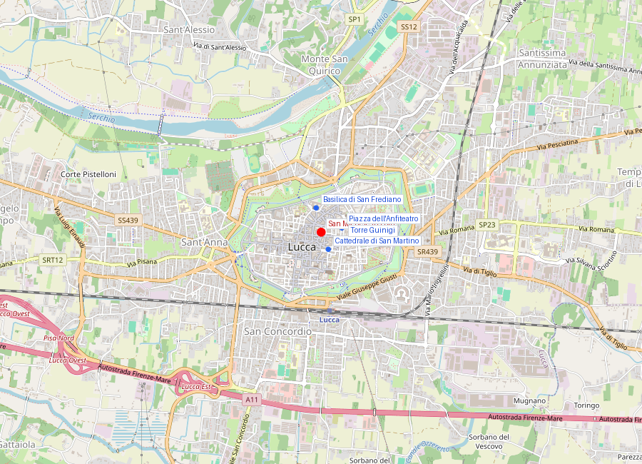

# San Michele in Foro

```yaml
lugar:
  nombre_original: "Chiesa di San Michele in Foro"
  pais: "Italia"
  region_admin: "Toscana"
  coordenadas: "43.8441° N, 10.5052° E"
  altitud_m: 19
  fecha_visita: "[DATO PENDIENTE — confirmar fecha]"
```



> [DATO PENDIENTE — generar mapa con pin]

---

<!-- 📷 FOTO: fachada completa de San Michele in Foro / detalle de las columnas con incrustaciones -->

## El nombre explica todo

*In Foro* — "en el foro". La iglesia se llama así porque está construida **sobre el foro romano de Luca**: la plaza central de la colonia romana fundada en el 180 a.C., que fue durante siglos el corazón de la vida cívica, política y comercial de la ciudad.

La piazza que rodea hoy a San Michele —la **Piazza San Michele**— ocupa exactamente el espacio del foro romano. Las dimensiones, la orientación y el carácter de espacio abierto central son heredados directamente de la planificación urbanística romana.

---

## Historia

### El foro romano bajo la piazza

El foro romano de *Luca* fue el nodo central de la colonia fundada en el **180 a.C.** Con la caída del Imperio Romano, el foro no fue abandonado sino que continuó siendo el espacio cívico principal de la ciudad, ahora como sede del mercado (como ocurrió con la mayoría de los fori italiani), luego como espacio residual de la vida medieval.

La iglesia de San Michele fue construida en este solar durante la **Alta Edad Media**: hay referencias documentales del siglo VIII. La reconstrucción románica, que es la que se ve hoy, comienza en el **siglo XI** y se prolonga durante todo el siglo XII y parte del XIII.

### La fachada: máximo exponente del románico luchese

La fachada de San Michele in Foro es el **ejemplo más elaborado y exuberante del románico luchese** — y posiblemente uno de los más ornamentados del románico toscano en general.

Está estructurada en **cuatro niveles de logias arcadas** corona la fachada, con arcos sobre columnas geminadas, con cada columna decorada de manera diferente:

- Columnas con **fustes de mármoles incrustados** en rombos, zigzags y meandros, usando materiales de distintos colores (blanco, verde, y ocasionalmente tonos rosados)
- Columnas con **espirales talladas** en relieve
- Columnas con **decoración geométrica** árabe (*moresca*), que derivan claramente de modelos del arte islámico del Mediterráneo —llegados a Lucca a través del comercio con Sicilia, el Magreb y el Levante
- Columnas con fuste **liso**, en contraste deliberado con las anteriores

Esta variedad ornamental no es aleatoria: su función era demostrar la capacidad de los maestros canteros medievales de dominar distintos repertorios decorativos, y hacer de la fachada una **enciclopedia visual** del universo decorativo disponible en la Lucca del siglo XII.

El efecto cuando la luz matutina ilumina los mármolos blancos y los incrustados en colores es de una riqueza visual extraordinaria.

### El coronamiento: l'Angelo Michele

Sobre el vértice de la fachada, coronando la pequeña espadaña que la remata, hay una estatua de **San Michele Arcangelo** con las alas extendidas y la espada. En algunos días con viento, la figura está coronada con una aureola luminosa resultante de la refracción de la luz en el metal. La presencia del arcángel en el punto más alto de la fachada —al mismo nivel visual que las torres y los campaniles de la ciudad— subraya la dimensión protectora-celeste del patrono.

---

## El interior

### Cuatro santos — Filippino Lippi

El interior, más austeramente románico que la extravagante fachada, contiene varias obras de arte significativas.

La más importante es un **pannello con cuatro Santos** (Santos Jerónimo, Sebastián, Elena y Rocco) pintado por **Filippino Lippi** (c. 1483), hijo de Filippo Lippi y uno de los pintores florentinos más importantes de la segunda mitad del siglo XV, que también trabajó en Roma (Cappella Carafa en Santa Maria sopra Minerva).

La obra fue encargada probablemente en relación con una epidemia de peste: Santos Sebastián y Rocco son ambos protectores contra la peste, y su presencia conjunta en una sola pannello sugiere una comisión *ex-voto* o preventiva en tiempos de epidemia —un motivo repetido en el arte italiano del siglo XV.

La tabla tiene un estado de conservación notable para su antigüedad y muestra la típica elegancia lineal del Lippi hijo, con siluetas esbeltas y expresiones contemplativas.

### El crucifijo

En el presbiterio, un gran **Cristo en la Cruz** de madera pintada, de tradición medieval, preside el altar. Tiene un aura de veneración popular: es tradición que los lucenses dediquen oraciones aquí antes de viajes importantes.

---

## La piazza hoy

La **Piazza San Michele** —que ocupa el antiguo foro romano— es hoy el corazón comercial y de la vida cotidiana de Lucca. Es más animada y menos turística que la Piazza dell'Anfiteatro: tiene cafés, tiendas, y en sus extremos los edificios del Palazzo Pretorio (la antigua sede del gobierno comunal, del siglo XIV) y otros palacios medievales.

La logistica de la piazza sigue siendo la del foro romano: espacio abierto, rodeado de actividad comercial, con la iglesia en el lugar del templo central.

---

## La campaña de restauración

<!-- 📷 FOTO: stato actual de la fachada / zonas restauradas y por restaurar -->

La fachada de San Michele in Foro ha pasado por diversas restauraciones. Algunas columnas y decoraciones son completamente originales del siglo XII; otras son integraciones del siglo XIX y XX. En algunos puntos menos visibles de la loggias superiores se aprecian las diferencias entre el mármol medieval envejecido y las reintegraciones modernas más blancas.

---

## Conexiones

- San Michele in Foro está conectada conceptualmente con la **Piazza della Repubblica** de Firenze y con el **Foro di Traiano** de Roma: los tres son ejemplos de cómo el espacio del foro romano medieval se transforma en la piazza central medieval y luego moderna de una ciudad.
- La decoración con motivos islámicos (*a moresca*) de las columnas de la fachada conecta con el comercio luchese de la seda y con las influencias del mundo islámico en el arte románico toscano —una dimensión intercultural rara vez explícita pero constantemente presente.
- **Filippino Lippi** (autor del pannello interior) fue discípulo de **Sandro Botticelli** en Firenze: el mismo Botticelli cuya *Nascita di Venere* está en los Uffizi.

---

## Datos interesantes

- Las cuatro logias superiores de la fachada son decorativas y **no corresponden a ningún espacio interior real**: son una pantalla arquitectónica, una *telón de fondo* de mármol que sobresale en altura sobre la nave de la iglesia. La nave es mucho más baja que la fachada que la corona. Este recurso —llamado *facciata a vento* ("fachada al viento") — era empleado para hacer las iglesias románicas más imponentes de lo que sus proporciones internas permitirían.
- El foro romano enterrado bajo la piazza nunca ha sido completamente excavado: sus restos están a pocos metros bajo el nivel de adoquines actuales, pero una excavación sistemática implicaría destruir la piazza y los edificios que la rodean.
- La ciudad de Lucca tiene documentadas **más de 100 iglesias medievales** dentro del perímetro de las murallas, la mayoría de ellas aún en pie (aunque no todas abiertas al culto o al turismo). La densidad es incomparable en la Toscana.

---

*fuente: Renzo Manetti, "Le chiese di Lucca" (ed. Pacini Fazzi); Touring Club Italiano, Toscana; Giorgio Tori, "Lucca medievale e moderna"; Wikipedia (verificado).*
