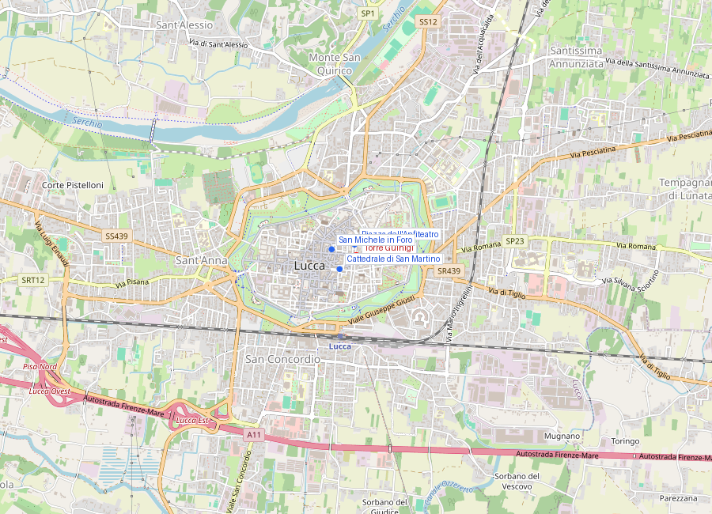
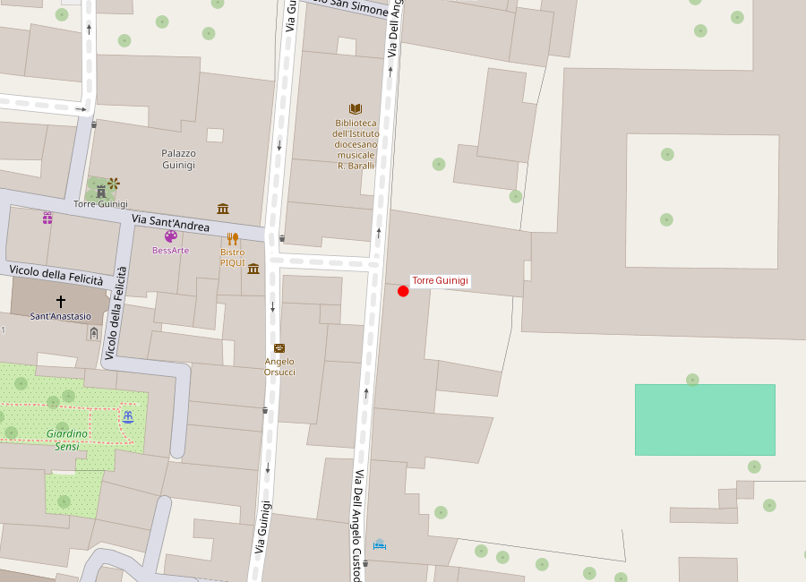

# Torre Guinigi

```yaml
lugar:
  nombre_original: "Torre Guinigi"
  pais: "Italia"
  region_admin: "Toscana"
  coordenadas: "43.8435° N, 10.5079° E"
  altitud_m: 19
  fecha_visita: "[DATO PENDIENTE — confirmar fecha]"
```





---

<!-- 📷 FOTO: vista de la torre desde la calle con los árboles en la cima / vista desde la cima sobre Lucca -->

## Lo que hace diferente a esta torre

Hay decenas de torres medievales en Italia: en San Gimignano, en Bolonia, en Florencia, en Perugia. La Torre Guinigi es la única que tiene **encinas vivas creciendo en la terraza de la cima**. Los siete árboles —cuatro a la fecha, habiendo sobrevivido distintos a lo largo de los siglos— emergen de los 44 metros de ladrillo con una familiaridad que desorienta: parecen haber estado siempre ahí, como si la torre los hubiera cultivado desde la Edad Media.

Vista desde abajo, contra el cielo, la Copa del bosquete en lo alto de la torre medieval es una de las imágenes más características de la Toscana.

---

## Historia

### Las torres medievales de Lucca

Lucca tuvo, en su apogeo medieval (siglos XII–XIV), decenas de torres similares a las que aún pueblan San Gimignano. Las torres medievales italianas no eran campanarios eclesiásticos sino **torres privadas de familias poderosas**: símboles de estatus social, refugios defensivos en los conflictos civiles intraurbanos, y plataformas de observación y señalización.

En las ciudades medievales italianas, las guerras entre facciones (Güelfos vs. Gibelinos, o simplemente rivales comerciales) se libraban frecuentemente en el nivel de la calle. Tener una torre significaba poder retirarse a ella y resistir; lanzar proyectiles desde arriba sobre enemigos en la calle; y señalizar a aliados en otras partes de la ciudad. Cuanto más alta la torre, mayor el estatus y mayor la capacidad militar de la familia.

Lucca llegó a tener probablemente más de noventa torres medievales encesta; la mayor parte fueron demolidas o reducidas de altura en los siglos XIV–XVI, cuando las instituciones republicanas intentaron pacificar la ciudad limitando la altura de las torres privadas —un fenómeno documentado también en Florencia, Siena y otras ciudades.

La Torre Guinigi es la **única torre medieval de grandes dimensiones que sobrevive casi intacta** en Lucca, con su altura original de unos **44 metros**.

### La familia Guinigi

La torre pertenecía a la familia **Guinigi**, uno de los linajes de mercaderes más ricos y políticamente influyentes de Lucca en los siglos XIV–XV. Los Guinigi acumularon su fortuna en el comercio del **tejido de seda** y en la banca internacional, con sucursales en Londres, Brujas y el Mediterráneo.

El miembro más poderoso de la familia fue **Paolo Guinigi** (1372–1431), que gobernó Lucca como señor de facto —aunque sin ostentar formalmente ese título en una república que en teoría no lo admitía— desde 1400 hasta 1430. Fue bajo su protección que **Jacopo della Quercia** esculpió el monumento funerario de su segunda esposa **Ilaria del Carretto** (muerta en 1405) en la Cattedrale di San Martino.

Paolo Guinigi fue depuesto en 1430 por una conspiración interna; murió en prisión en 1431 en Pavia, adonde había sido trasladado. Los bienes de la familia fueron confiscados en parte; la torre pasó gradualmente al patrimonio común de la ciudad.

### Los árboles en la cima

El origen exacto de los árboles (*Quercus ilex*, encinas o lecci) que crecen en la terraza de la cima no está claramente documentado en las fuentes medievales. La hipótesis más aceptada es que la terraza-jardín fue creada por algún miembro de la familia Guinigi en el siglo XIV o XV como **jardino pensile** (jardín en altura) — una práctica de lujo medieval que muestra la riqueza de la familia, capaz de sostener tierra y vegetación en la cima de una estructura tan alta.

Las encinas (*lecci*) son árboles de hoja perenne notablemente resistentes y longevos: pueden vivir siglos en condiciones difíciles. Los que hoy crecen en la torre no son necesariamente los originales medievales, pero los hay continuamente desde al menos el siglo XVI (hay representaciones pictóricas que los muestran). La tierra que sostiene las raíces ocupa la terraza superior completa.

---

## Arquitectura

La torre está construida en **ladrillo rojo** (laterizio), como era típico de las torres medievales luchesi y toscanas del siglo XIV. Tiene planta cuadrada. No tiene ventanas regulares en los primeros niveles —por razones defensivas— y en los niveles superiores abre con bifore (ventanas geminadas) y trifore.

La terraza superior, de unos **metros cuadrados** [⚠ VERIFICAR dimensión exacta], está rodeada por un muro bajo de ladrilllo y sostiene la tierra en la que crecen las encinas. El acceso es por una escalera interior de **229 peldaños** — la subida es estrecha y moderadamente exigente, pero el desembarco en la terraza bajo las encinas y con la vista de los tejados de Lucca a 360° es la recompensa completa.

---

## La vista desde la cima

<!-- 📷 FOTO: vista panorámica desde la terraza con los árboles en primer plano -->

La terraza a 44 metros ofrece la vista panorámica más completa del **casco histórico de Lucca**:

- Las **Mura** perimetrales se ven completas, incluyendo los baluartes con sus plataformas arboladas.
- En el punto más alto visible hoy en día desde la terraza es el conjunto de la **Cattedrale di San Martino** y el campanile.
- La planimetría del centro histórico —perfectamente plana dentro de las murallas, atravesada por unas pocas calles principales— es legible de un solo vistazo.
- En días claros, las **Alpi Apuane** al norte (con sus cimas de mármol de Carrara) y la **costa tirrena** al oeste son visibles.
- Y bajo los pies, casi, los siete árboles: no se ven sus troncos sino sus copas, desde arriba.

---

## Conexiones

- La Torre Guinigi está a **200 metros de la Piazza dell'Anfiteatro**: es posible combinar ambas visitas en una mañana sin dificultad.
- **Paolo Guinigi** (el miembro más poderoso de la familia propietaria) está indisolublemente ligado al **monumento de Ilaria del Carretto** en la Cattedrale di San Martino: la esposa cuya tumba encargó a Della Quercia.
- En **San Gimignano**, a 50 km, hay un conjunto de torres medievales similares (aunque más numerosas y sin la peculiaridad de los árboles) que comparte con la Torre Guinigi la misma lógica medieval de poder y rivalidad familiar expresada en altura.

---

## Datos interesantes

- Las **encinas** (*Quercus ilex*) en la cima no son simplemente un accidente pintoresco: son uno de los símbolos heráldicos de la familia Guinigi. La encina (*ilice*) forma parte del apellido Guinigi en algunas versiones del escudo familiar. Que planten encinas en la cima de su torre es, en cierta medida, un acto de branding medieval.
- Lucca tenía en el siglo XIII al menos **72 torres privadas** documentadas [⚠ VERIFICAR número exacto en fuentes]. Hoy solo quedan fragmentos de pocas, siendo la Guinigi la más alta y completa que sobrevive.
- La escalera tiene **229 peldaños**: estrecha, en caracol, con luz escasa hasta los últimos tramos. No recomendable para quien tenga claustrofobia severa.
- La torre forma parte del **Museo Nazionale di Villa Guinigi** junto con el palazzo adyacente, que guarda la colección arqueológica y de arte medieval de Lucca.

---

*fuente: Touring Club Italiano, Toscana; Ilaria Belli Barsali, "Guida di Lucca" (ed. TCI); Michel Baridon, "Les jardins du monde" (trad. italiana); Wikipedia (verificado).*
