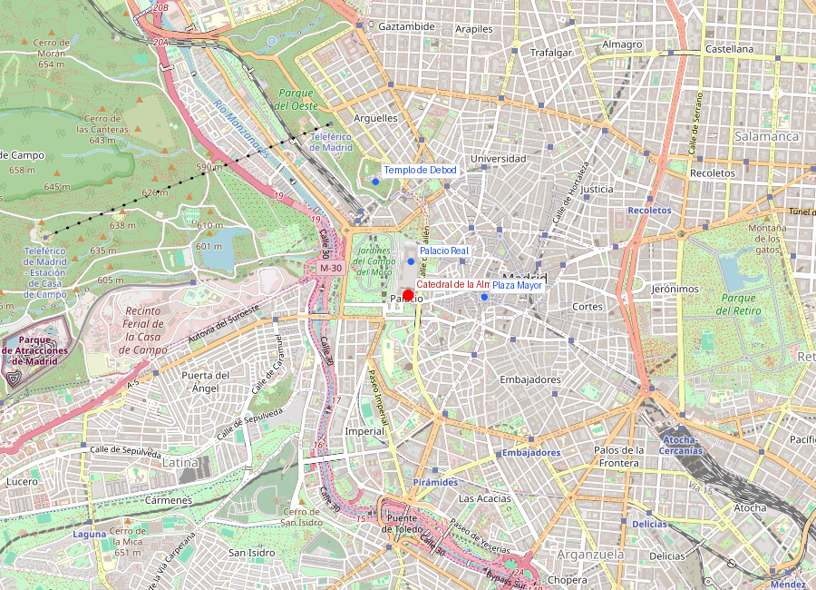
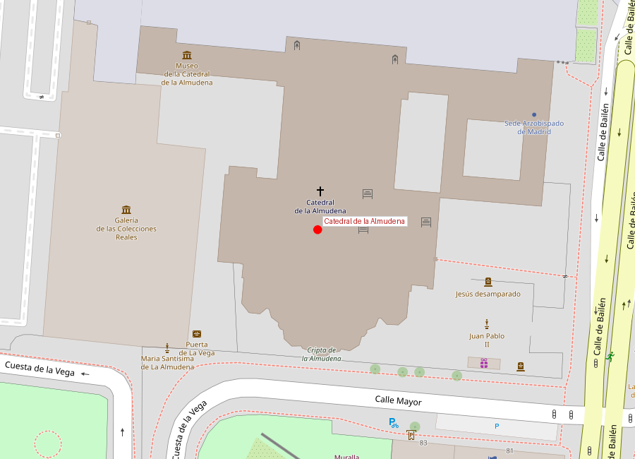

```yaml
lugar:
  nombre_original: "Catedral de Santa María la Real de la Almudena"
  pais: "España"
  region_admin: "Comunidad de Madrid"
  coordenadas: "40.4156, -3.7146"
  fecha_visita: "[DATO PENDIENTE — confirmar fecha]"
```





# Catedral de la Almudena

## Qué había antes

El solar de la catedral tiene una historia religiosa que se remonta al Madrid islámico. Aquí se encontraba un tramo de la **muralla árabe** del siglo IX, donde según la tradición se ocultó la imagen de la Virgen de la Almudena antes de la conquista cristiana. El nombre "Almudena" deriva del árabe *al-mudayna* (la ciudadela), refiriéndose al recinto amurallado.

## Historia

| Fecha | Hito |
|---|---|
| 1083 | Según la leyenda, se descubre la imagen de la Virgen oculta en la muralla |
| 1868 | Se derriba la iglesia de Santa María (la más antigua de Madrid), que estaba en este lugar |
| 1883 | Se coloca la primera piedra de la catedral (proyecto neogótico de Marqués de Cubas) |
| 1911 | Se consagra la cripta neorrománica |
| 1944 | Se abandona el proyecto neogótico; nuevo diseño neoclásico de Fernando Chueca Goitia |
| 1993 | Consagración por el papa Juan Pablo II — 110 años después de la primera piedra |
| 2004 | Boda del príncipe Felipe (actual Felipe VI) y Letizia Ortiz |

## La catedral que Madrid no tenía

Madrid es un caso único entre las capitales europeas: fue capital de un imperio mundial durante siglos **sin tener catedral**. La razón es eclesiástica: Madrid pertenecía a la archidiócesis de Toledo, y el poderoso arzobispado toledano se opuso durante siglos a la creación de una diócesis independiente en Madrid, lo que habría requerido una catedral.

No fue hasta 1885 que el papa León XIII creó la diócesis de Madrid-Alcalá, y aun así la construcción fue un calvario de más de un siglo: cambios de proyecto, guerras, falta de fondos y debates estilísticos interminables.

## Arquitectura

La Almudena es un edificio **esquizofrénico estilísticamente**, resultado de sus 110 años de construcción:

- **Cripta** (1911): neorrománica, con columnas monocilíndricas y capiteles historiados. Es el espacio más atmosférico, oscuro y recogido. Las 400 columnas y 20 capillas crean un bosque mineral.
- **Exterior**: neoclásico, deliberadamente diseñado para armonizar con el **Palacio Real** adyacente. Chueca Goitia sacrificó coherencia interna para lograr unidad visual con la fachada del palacio.
- **Interior**: neogótico con toques inesperadamente modernos. Las vidrieras abstractas de Kiko Argüello (artista del Camino Neocatecumenal) son atipícamente contemporáneas y generan opiniones divididas.
- **Cúpula**: doble tambor con linterna, visible en el skyline madrileño.

## Mitología y leyendas

La leyenda fundacional de la Almudena es uno de los mitos más queridos de Madrid:

Según la tradición, cuando los musulmanes conquistaron la villa en el siglo VIII, los cristianos ocultaron una imagen de la Virgen María en un hueco de la muralla. Cuando Alfonso VI reconquistó Madrid en 1083, nadie recordaba dónde estaba la imagen. Se organizó una procesión solemne, y un tramo de la muralla se desplomó solo, revelando la imagen intacta junto con **dos cirios que llevaban ardiendo más de 300 años**. La Virgen fue proclamada patrona de Madrid.

Esta leyenda es inverificable históricamente, pero es la piedra angular de la identidad religiosa madrileña. La imagen original se perdió; la actual es una talla del siglo XVI.

## Qué se puede ver hoy

- **Catedral** (planta superior): nave central, vidrieras de Argüello, capilla mayor
- **Cripta** (neorrománica): acceso independiente, espacio más interesante arquitectónicamente, con tumbas y capillas
- **Museo de la Catedral**: vestimentas, orfebrería, maquetas de los proyectos descartados
- **Mirador de la cúpula**: acceso por escaleras, vistas de 360° sobre Madrid [⚠ VERIFICAR disponibilidad]
- **Exterior**: la explanada entre la catedral y el Palacio Real es uno de los mejores puntos para fotografiar ambos monumentos

## Conexiones

- La Almudena y el **Palacio Real** están frente a frente, separados por la Plaza de la Armería. Son un conjunto visual inseparable, aunque los separan dos siglos de construcción.
- La muralla árabe del siglo IX (restos visibles en el Parque del Emir Muhammad I, junto a la catedral) conecta la Almudena con los orígenes islámicos de Mayrit.
- El **Templo de Debod** está a 10 minutos al norte, creando un recorrido que va del Egipto antiguo al Madrid moderno.

## Datos interesantes

- Tardó **110 años** en completarse (1883-1993) — una de las catedrales más lentas de la historia.
- Es la única catedral española consagrada por un papa en suelo español.
- Los restos de la muralla árabe junto a la catedral son la estructura más antigua conservada *in situ* de Madrid (siglo IX).
- La boda real de 2004 fue la primera boda de un heredero al trono español celebrada en una catedral desde el siglo XIX.

---

*fuente: Cabildo de la Catedral de Santa María la Real de la Almudena; Fernando Chueca Goitia, memoria del proyecto; Ayuntamiento de Madrid; Wikipedia (artículos verificados)*
