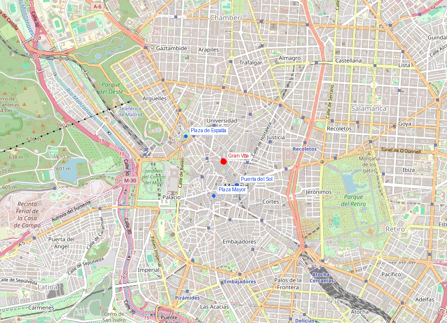
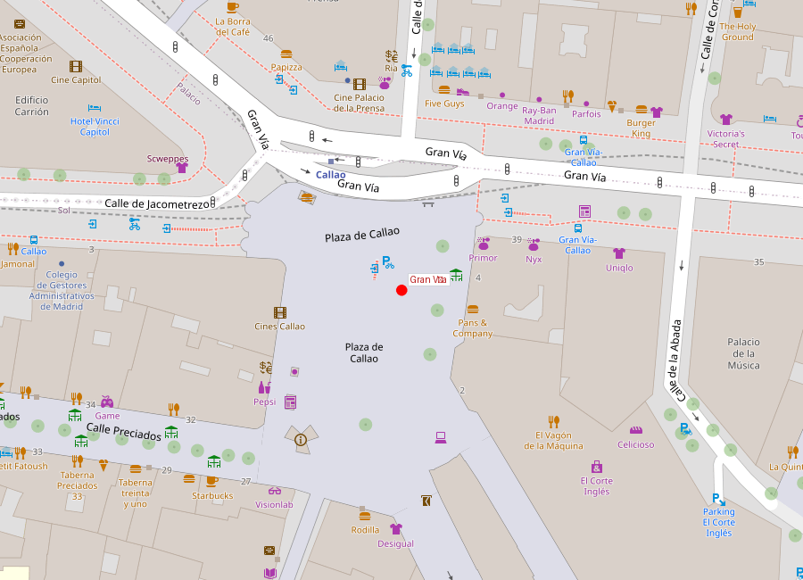

```yaml
lugar:
  nombre_original: "Gran Vía"
  pais: "España"
  region_admin: "Comunidad de Madrid"
  coordenadas: "40.4200, -3.7057"
  fecha_visita: "[DATO PENDIENTE — confirmar fecha]"
```





# Gran Vía

## Qué había antes

La Gran Vía no existía antes de 1910. Donde hoy hay una avenida de 1,3 km se extendía un **laberinto de 300 calles medievales**, 14 plazas y más de 300 edificios del casco antiguo. La apertura de la Gran Vía fue la mayor operación de cirugía urbana de la historia de Madrid: se demolieron manzanas enteras, se desalojaron miles de personas, se destruyeron iglesias, palacios e incluso un tramo de la Real Acequia.

El proyecto se debatió durante décadas. Ya en 1862 se propuso una "gran vía" al estilo de los bulevares de Haussmann en París o la Via Laietana de Barcelona. La resistencia de propietarios, la falta de fondos y la complejidad legal retrasaron el inicio hasta 1910.

## Historia

| Fecha | Hito |
|---|---|
| 1862 | Primera propuesta de apertura de una gran avenida |
| 1904 | Aprobación del proyecto definitivo (arquitectos José López Sallaberry y Francisco Andrés Octavio) |
| 4 abr 1910 | Alfonso XIII da el primer piquetazo, demoliendo la Casa del Cura de San José |
| 1910-1917 | Primer tramo: Alcalá a Red de San Luis (hoy Gran Vía - Montera) |
| 1917-1922 | Segundo tramo: Red de San Luis a Plaza del Callao |
| 1925-1929 | Tercer tramo: Callao a Plaza de España |
| 1936-1939 | Bombardeos durante la Guerra Civil ("avenida de los obuses") |
| Siglo XXI | Peatonalización parcial y restricción de tráfico |

## Arquitectura — un muestrario de estilos

La Gran Vía se construyó en tres fases, y cada tramo refleja el estilo dominante de su época:

### Primer tramo (Alcalá — Montera)
Estilo **francés-academicista**: edificios de inspiración parisina con mansardas, cúpulas y fachadas ornamentadas. El más notable es el **Edificio Metrópolis** (1911), en la esquina con Alcalá, con su cúpula de pizarra y la Victoria alada dorada (originalmente era una estatua de Fénix, sustituida en 1975 por la Victoria de Federico Coullaut-Valera).

### Segundo tramo (Montera — Callao)
Estilo **ecléctico-expresionista**: la Telefónica (1929), diseñada por Ignacio de Cárdenas bajo dirección del estadounidense Lewis S. Weeks, fue el **primer rascacielos de España** y durante años el edificio más alto de Europa. Su estilo neobarroco español con estructura de acero americano es un híbrido fascinante.

### Tercer tramo (Callao — Plaza de España)
Estilo **art déco y racionalista**: edificios de líneas más limpias, influencia americana. El **Edificio Capitol** (1933, de Feduchi y Eced) es una obra maestra del art déco, con su esquina redondeada y su cartel luminoso de Schweppes que se ha convertido en icono de la ciudad.

## La Gran Vía en la Guerra Civil

Entre 1936 y 1939, la Gran Vía fue rebautizada popularmente como **"la avenida de los obuses"**. El frente de batalla estaba en la Ciudad Universitaria, apenas 3 km al noroeste, y los proyectiles franquistas alcanzaban regularmente la avenida. La Telefónica, el edificio más alto, era blanco frecuente (y también puesto de observación republicano). Los madrileños aprendieron a caminar pegados a las fachadas del lado sur, menos expuestas al fuego.

## Qué se puede ver hoy

Recorriendo la Gran Vía de este a oeste:

- **Edificio Metrópolis** (esquina con Alcalá): cúpula y Victoria alada, mejor fotografiado desde Alcalá
- **Oratorio del Caballero de Gracia**: iglesia neoclásica "escondida" que sobrevivió a las demoliciones
- **Edificio de la Telefónica**: primer rascacielos español, hoy con la Fundación Telefónica (exposiciones gratuitas)
- **Plaza del Callao**: nudo central, cines históricos convertidos en tiendas
- **Edificio Capitol / Schweppes**: el icono luminoso art déco
- **Plaza de España**: cierre occidental de la avenida, con el monumento a Cervantes

La Gran Vía sigue siendo el corazón comercial y de entretenimiento de Madrid, con cines, teatros musicales, tiendas y una vida nocturna intensa.

## Conexiones

- La Gran Vía arranca en la **calle de Alcalá**, que conecta directamente con la **Puerta del Sol** y Cibeles.
- Desemboca en la **Plaza de España**, desde donde se accede al **Templo de Debod** y al **Palacio Real**.
- Los teatros de la Gran Vía (Lope de Vega, Coliseum, Rialto) la convirtieron en el "Broadway madrileño" — una tradición que sigue viva con musicales.

## Datos interesantes

- La demolición para abrir la Gran Vía destruyó más de 300 edificios y desplazó a miles de familias. Fue extremadamente controversial en su momento.
- El nombre oficial cambió varias veces: Avenida de Pi y Margall, Avenida de Eduardo Dato, Avenida de José Antonio (durante el franquismo). El nombre popular "Gran Vía" siempre prevaleció.
- El letrero luminoso de Schweppes en el Edificio Capitol es uno de los más fotografiados de Europa. Ha estado encendido casi ininterrumpidamente desde los años 70.
- Durante la Guerra Civil, el Hotel Florida (demolido en 1964) en la Gran Vía alojó a corresponsales como Ernest Hemingway y Robert Capa, que cubrían el asedio desde allí.

---

*fuente: Pedro de Répide, "Las calles de Madrid"; Ayuntamiento de Madrid, "La Gran Vía: historia de una calle"; José del Corral, "La Gran Vía"; Wikipedia (artículos verificados)*
