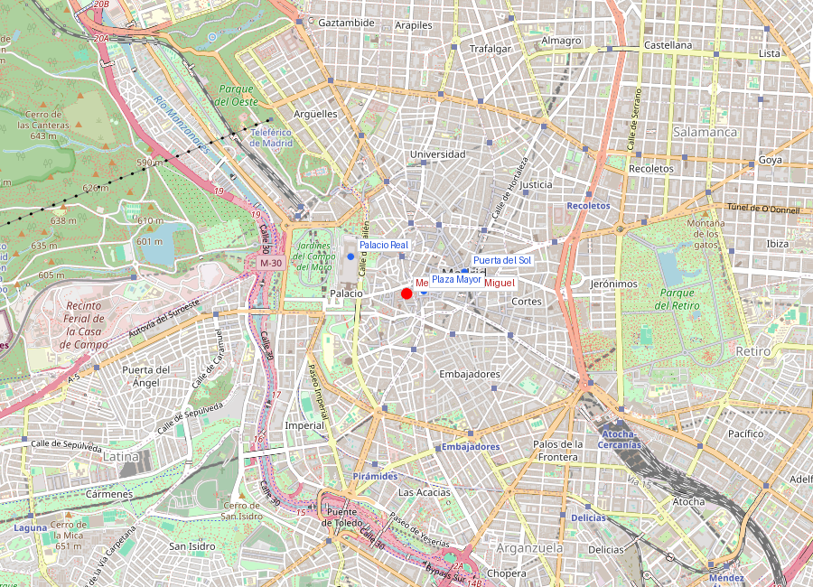
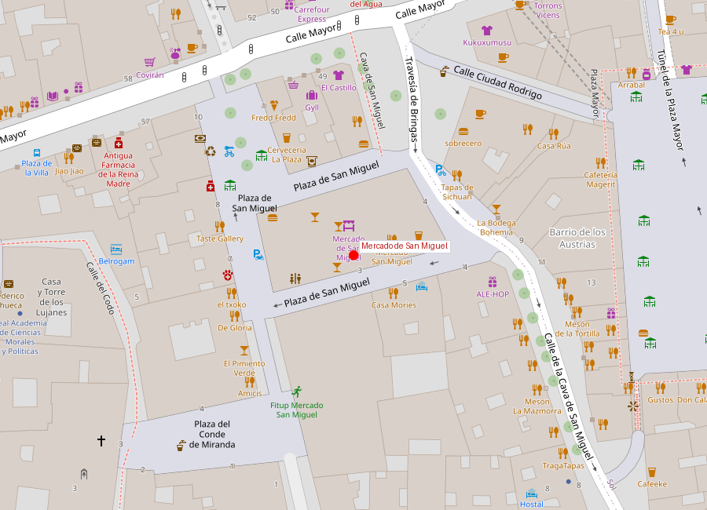

```yaml
lugar:
  nombre_original: "Mercado de San Miguel"
  pais: "España"
  region_admin: "Comunidad de Madrid"
  coordenadas: "40.4153, -3.7090"
  fecha_visita: "[DATO PENDIENTE — confirmar fecha]"
```





# Mercado de San Miguel

## Qué había antes

En el solar del mercado se levantaba la **Iglesia de San Miguel de los Octoes**, una de las parroquias más antiguas de Madrid medieval (documentada desde el siglo XII). La iglesia fue demolida en 1809 durante la ocupación napoleónica como parte de un plan de Joseph Bonaparte para abrir plazas y espacios públicos en el denso casco antiguo. El espacio resultante se dedicó a mercado al aire libre.

## Historia

| Fecha | Hito |
|---|---|
| Siglo XII | Iglesia de San Miguel de los Octoes |
| 1809 | Demolición de la iglesia por Joseph Bonaparte |
| 1809-1916 | Mercado al aire libre en el solar |
| 1916 | Inauguración del edificio actual de hierro y cristal (Alfonso de Palacios) |
| 1999 | Declarado Bien de Interés Cultural |
| 2003 | Cierre por deterioro |
| 2009 | Reapertura como mercado gastronómico |

## Arquitectura

El Mercado de San Miguel es uno de los pocos **mercados de hierro** que sobreviven en Madrid. Fue diseñado por el arquitecto **Alfonso de Palacios** en 1916, siguiendo la tradición de las estructuras metálicas del siglo XIX inspiradas en Les Halles de París y el Mercat de la Boqueria de Barcelona.

La estructura es enteramente de **hierro fundido y cristal**: columnas de hierro con capiteles decorados, grandes ventanales que inundan el interior de luz natural, y una planta rectangular diáfana sin muros de carga. El hierro fue fabricado en talleres de Bilbao, siguiendo la tradición siderúrgica vasca.

Es de los últimos ejemplos madrileños de "arquitectura del hierro" — la mayoría de los mercados de este estilo fueron demolidos en el siglo XX (el Mercado de la Cebada, el de los Mostenses, el de Olavide).

## Qué se puede ver hoy

El mercado fue reinventado en 2009 como **mercado gastronómico**, abandonando su función de mercado de abastos tradicional. Hoy ofrece:

- **Puestos de degustación**: tapas, ostras, jamón ibérico, quesos, croquetas, conservas gourmet
- **Barra de vinos y vermut**: varios puestos especializados
- **Productos mediterráneos**: aceite, embutidos, dulces artesanales
- **Ambiente**: el espacio interior es luminoso y abierto, ideal para tapear de pie recorriendo los puestos

El cambio de formato ha sido controvertido: los precios son significativamente más altos que en un mercado convencional, y la clientela es mayoritariamente turística. Los madrileños tienden a preferir mercados de barrio como el Mercado de la Paz, el de Antón Martín o el de Maravillas.

## Conexiones

- El Mercado de San Miguel está pegado a la **Plaza Mayor** — literalmente a un arco de distancia por la Cava de San Miguel.
- Forma parte del circuito del **Madrid de los Austrias** junto con la Plaza Mayor, la **Puerta del Sol** y el **Palacio Real**.
- La tradición de mercados cubiertos de hierro conecta con el movimiento de arquitectura industrial del XIX que también produjo la Gare d'Orsay (hoy Musée d'Orsay) y la Torre Eiffel.

## Datos interesantes

- El nombre "San Miguel de los Octoes" sigue sin explicarse definitivamente. "Octoes" podría referirse a una familia medieval o a un término hoy desaparecido.
- La intervención de Joseph Bonaparte, que demolió iglesias y creó plazas, fue odiada por los madrileños de la época. Irónicamente, hoy agradecemos varios de los espacios que creó.
- Es uno de solo tres mercados de hierro supervivientes en Madrid [⚠ VERIFICAR].
- La estructura de hierro permite que todo el mercado sea esencialmente un invernadero — puede resultar extremadamente caluroso en verano.

---

*fuente: Ayuntamiento de Madrid; BIC, expediente del Mercado de San Miguel; María Isabel Gea, "Los nombres de las calles de Madrid"; Wikipedia (artículos verificados)*
