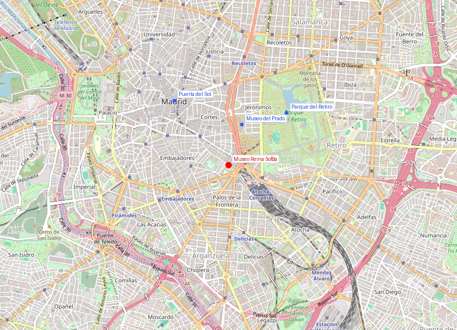
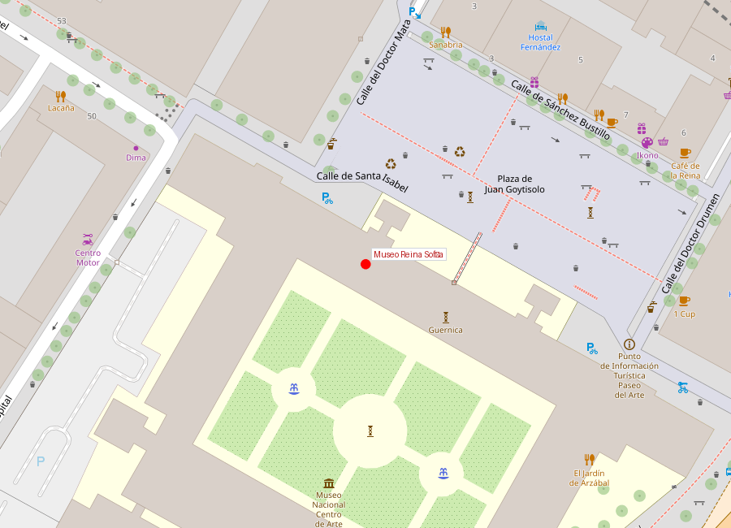

```yaml
lugar:
  nombre_original: "Museo Nacional Centro de Arte Reina Sofía"
  pais: "España"
  region_admin: "Comunidad de Madrid"
  coordenadas: "40.4086, -3.6943"
  fecha_visita: "[DATO PENDIENTE — confirmar fecha]"
```





# Museo Nacional Centro de Arte Reina Sofía

## Qué había antes

El edificio principal era el **Hospital General de San Carlos**, un enorme hospital del siglo XVIII diseñado por José de Hermosilla y Francisco Sabatini por encargo de Carlos III. Funcionó como hospital hasta 1965 y fue declarado Monumento Histórico-Artístico en 1977, salvándolo de la demolición.

## Historia

| Fecha | Hito |
|---|---|
| 1788 | Inauguración del Hospital General de San Carlos |
| 1965 | Cierra como hospital |
| 1977 | Declarado Monumento Histórico-Artístico |
| 1986 | Apertura como centro de arte (aún sin colección permanente) |
| 1988 | Inauguración oficial como Museo Nacional |
| 1992 | Llegada del *Guernica* desde el Museo del Prado |
| 2005 | Ampliación de Jean Nouvel: tres edificios nuevos con techo flotante |

## El Guernica — la obra central

El *Guernica* de Pablo Picasso (1937) es mucho más que una pintura: es un documento político, un grito contra la barbarie y probablemente el cuadro más famoso del siglo XX.

**Contexto**: El 26 de abril de 1937, aviones de la Legión Cóndor alemana y la Aviazione Legionaria italiana bombardearon la villa vasca de Guernica durante la Guerra Civil española. Fue uno de los primeros bombardeos sistemáticos contra población civil de la historia. Picasso, que estaba en París trabajando en un encargo para el Pabellón Español de la Exposición Internacional, abandonó su proyecto original y en pocas semanas pintó el *Guernica* como respuesta.

**Dimensiones**: 3,49 × 7,77 metros — un mural monumental en blanco, negro y gris.

**Odisea del cuadro**: Picasso exigió que el *Guernica* no fuera a España mientras existiera una dictadura. La obra estuvo en el MoMA de Nueva York desde 1939 hasta 1981, cuando —tras la muerte de Franco y la transición democrática— fue trasladada a Madrid. Primero estuvo en el Casón del Buen Retiro (anexo del Prado) protegida por cristal antibalas, y en 1992 se trasladó al Reina Sofía, donde se exhibe sin cristal protector en una sala dedicada.

## Más allá del Guernica

El Reina Sofía alberga una colección de arte moderno y contemporáneo español e internacional:

- **Salvador Dalí**: extensa colección que incluye *El gran masturbador* y *Muchacha en la ventana*.
- **Joan Miró**: pinturas, esculturas y tapices de todas sus épocas.
- **Juan Gris**: una de las mejores colecciones de cubismo sintético.
- **Arte contemporáneo internacional**: obras de Francis Bacon, Richard Serra, Anish Kapoor, entre otros.

## Arquitectura

El contraste entre el edificio histórico y la ampliación contemporánea es deliberado:

- **Edificio Sabatini**: neoclásico del XVIII, austero, de granito gris. Las torres de ascensores exteriores de vidrio y acero (de Ian Ritchie, 1988) se han convertido en imagen icónica del museo.
- **Ampliación Jean Nouvel** (2005): tres edificios organizados alrededor de un patio, cubiertos por un espectacular **techo flotante** rojo metálico que parece desafiar la gravedad. Nouvel diseñó el espacio para que el techo creara sombras cambiantes a lo largo del día.

## Qué se puede ver hoy

- **Sala 206.06** — *Guernica* y estudios preparatorios
- **Colección permanente gratuita**: recopila el arte español del siglo XX en orden cronológico
- **Exposiciones temporales**: en la ampliación de Nouvel
- **Jardín de esculturas**: en el patio entre los edificios
- **Biblioteca y centro de documentación**: uno de los mayores archivos de arte contemporáneo de Europa

## Conexiones

- El Reina Sofía completa el **Triángulo del Arte** junto con el **Museo del Prado** (500 metros al norte) y el **Museo Thyssen-Bornemisza** (entre ambos).
- El *Guernica* conecta directamente con la Guerra Civil española, cuyos ecos se sienten por todo Madrid — desde el frente de la Ciudad Universitaria hasta las marcas de metralla aún visibles en algunos edificios.
- La relación Picasso-Dalí-Miró es una de las triadas artísticas más importantes del siglo XX, y los tres están representados aquí.

## Datos interesantes

- El *Guernica* nunca viajará de nuevo. Su fragilidad (lienzo sin preparación, pintura industrial) hace imposible cualquier préstamo.
- Las torres de cristal de los ascensores exteriores fueron controvertidas en 1988 — hoy son patrimonio visual de la ciudad.
- La ampliación de Nouvel costó 92 millones de euros [⚠ VERIFICAR] y triplicó la superficie expositiva.
- El museo ocupa el extremo sur del Paseo del Prado, justo frente a la estación de Atocha con su famoso jardín tropical interior.

---

*fuente: Museo Nacional Centro de Arte Reina Sofía (www.museoreinasofia.es); Gijs van Hensbergen, "Guernica: The Biography of a Twentieth-Century Icon"; Wikipedia (artículos verificados)*
