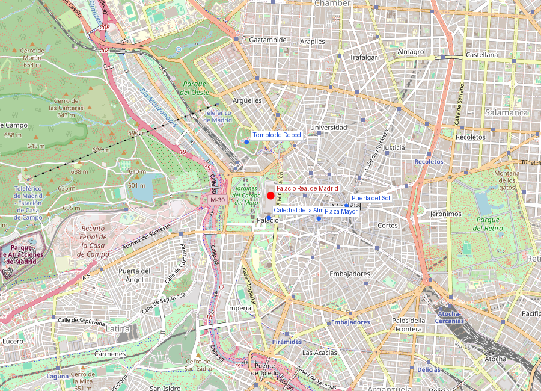
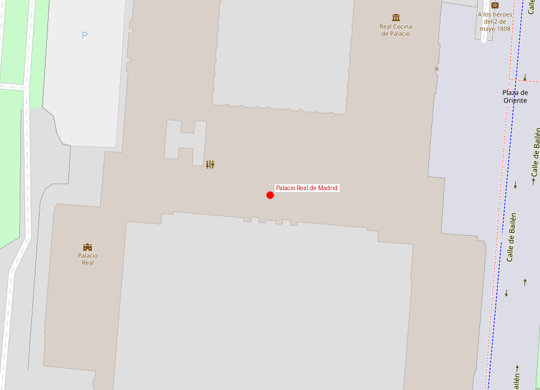

```yaml
lugar:
  nombre_original: "Palacio Real de Madrid"
  pais: "España"
  region_admin: "Comunidad de Madrid"
  coordenadas: "40.4180, -3.7143"
  fecha_visita: "[DATO PENDIENTE — confirmar fecha]"
```





# Palacio Real de Madrid

## Qué había antes

Donde hoy se levanta el Palacio Real existió primero una fortaleza islámica del siglo IX, parte del sistema defensivo de Mayrit. Tras la conquista cristiana, los reyes castellanos la ampliaron y convirtieron en residencia ocasional. Los Habsburgo construyeron sobre ella el **Real Alcázar de Madrid**, un imponente castillo-palacio que fue sede de la corte desde Felipe II.

El Alcázar ardió en la Nochebuena de 1734 en un incendio que duró cuatro días. Se perdieron unas 500 pinturas, incluidas obras de Velázquez, Rubens y Tiziano. La tradición popular sostiene que Felipe V, educado en Versailles, no lamentó demasiado la pérdida: por fin podía construir un palacio borbónico "a la francesa". Algunos historiadores sospechan que el incendio fue provocado, aunque no hay pruebas concluyentes.

## Historia

| Fecha | Hito |
|---|---|
| ca. 865 | Fortaleza islámica de Muhammad I |
| 1083 | Conquista cristiana por Alfonso VI |
| Siglo XVI | Ampliación como Alcázar Real bajo los Austrias |
| 24 dic 1734 | Incendio destruye el Alcázar |
| 1738 | Inicio de construcción del palacio actual (Juvara / Sacchetti) |
| 1764 | Carlos III es el primer monarca en habitarlo |
| 1879 | Alfonso XII instala electricidad (uno de los primeros palacios europeos en tenerla) |
| Actualidad | Residencia oficial del Rey, usado para actos de Estado |

## Arquitectura

El diseño inicial fue de **Filippo Juvara**, arquitecto italiano del barroco tardío, quien propuso un palacio colosal que habría sido el doble de Versailles. Juvara murió en 1736 antes de comenzar la obra, y su discípulo **Giovanni Battista Sacchetti** simplificó el proyecto, manteniendo la planta cuadrada con patio central.

El palacio se construyó enteramente en **piedra caliza y granito** —Felipe V ordenó expresamente que no se usara madera para evitar otro incendio—. El resultado es un edificio de estilo barroco-clasicista italiano, con influencias del Palazzo Reale di Torino y el proyecto original de Bernini para el Louvre.

Datos dimensionales:
- **135.000 m²** de superficie construida [⚠ VERIFICAR]
- **3.418 habitaciones** — la hace la residencia real más grande de Europa Occidental en número de estancias [⚠ VERIFICAR]
- Fachada principal de 130 metros de longitud

El interior es un despliegue de estilos que va del rococó al neoclásico:
- **Salón del Trono**: decorado por Giovanni Battista Tiepolo con frescos que representan la monarquía española y las provincias del imperio.
- **Salón de Gasparini**: rococó extremo, con paredes de seda bordada, estucos polícromos y un techo de Mengs.
- **Farmacia Real**: colección de tarros de cerámica de Talavera del siglo XVIII, una de las farmacias históricas mejor conservadas de Europa.
- **Real Armería**: una de las mejores colecciones de armas y armaduras del mundo, con piezas de Carlos V y Felipe II.

## Mitología y leyendas

Según la tradición, el solar del palacio fue elegido originalmente porque desde allí se dominaba el valle del Manzanares y los caminos hacia el norte. La leyenda cuenta que Muhammad I, al ver la posición estratégica del cerro, dijo que era "un lugar donde el cielo besa la tierra" — aunque esta cita probablemente sea una invención romántica del siglo XIX.

Existe una leyenda sobre un pasadizo secreto que conectaría el Palacio Real con la Casa de Campo al otro lado del río, presuntamente construido para una posible huida real. Aunque se han encontrado túneles bajo el palacio, ninguno ha sido confirmado como pasadizo hacia la Casa de Campo.

## Qué se puede ver hoy

El Palacio Real es visitable cuando no hay actos oficiales (la mayoría de los días). El recorrido incluye:

- **Salones de Estado**: Trono, Gasparini, Porcelana, Columnas
- **Real Armería**: en un edificio anexo, imprescindible
- **Farmacia Real**: frente a la fachada sur
- **Jardines de Sabatini**: al norte, creados en los años 30 sobre las antiguas caballerizas
- **Campo del Moro**: jardines paisajistas al oeste, con vista espectacular del palacio desde abajo

La **Plaza de Oriente**, frente a la fachada este, está flanqueada por 44 estatuas de reyes visigodos y de los primeros reinos cristianos. Según la leyenda, estas estatuas estaban originalmente destinadas a la cornisa del palacio, pero la reina Isabel de Farnesio soñó que un terremoto las derribaba sobre ella, y ordenó bajarlas a nivel del suelo.

## Conexiones

- El Palacio Real se construyó para reemplazar el Alcázar perdido, igual que la **Catedral de la Almudena** (a su lado) se construyó para dar a Madrid una catedral digna de una capital — ambos proyectos tardaron siglos en completarse.
- La Real Armería conecta con las colecciones de Carlos V expuestas también en la **Real Armería de Viena** — muchas piezas se dividieron entre las dos ramas de los Habsburgo.
- **Tiepolo**, que pintó los frescos del Salón del Trono, es el mismo artista cuya obra puede admirarse en la Residenz de Würzburg (Patrimonio UNESCO).

## Datos interesantes

- El Palacio Real nunca ha sido residencia habitual de los reyes desde Alfonso XIII (1931). Hoy la familia real vive en el **Palacio de la Zarzuela**, mucho más modesto, en las afueras de Madrid.
- Los 44 reyes de la Plaza de Oriente mezclan personajes históricos (Atanagildo, Recaredo) con otros semi-legendarios cuya existencia es discutida.
- La colección de **Stradivarius** del Palacio Real (cinco instrumentos) es la colección palatina más importante del mundo. Incluye dos violines, una viola y dos violonchelos del siglo XVIII [⚠ VERIFICAR].

---

*fuente: Patrimonio Nacional (www.patrimonionacional.es); José Luis Sancho, "El Palacio Real de Madrid"; Wikipedia (artículos sobre Palacio Real de Madrid, Real Alcázar de Madrid)*
