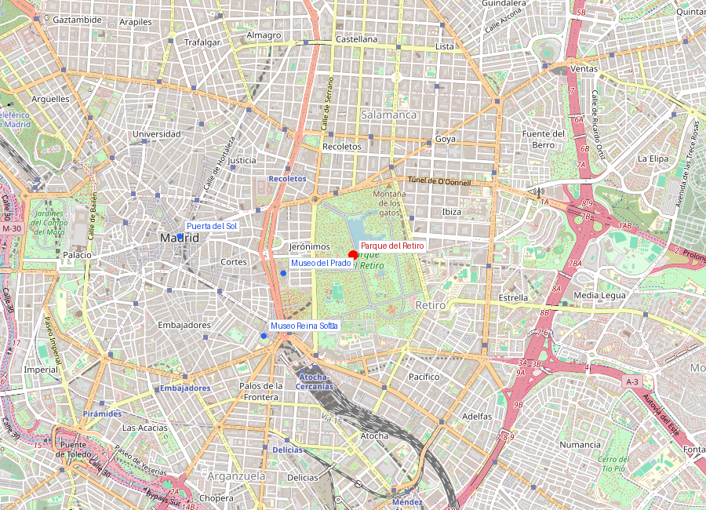
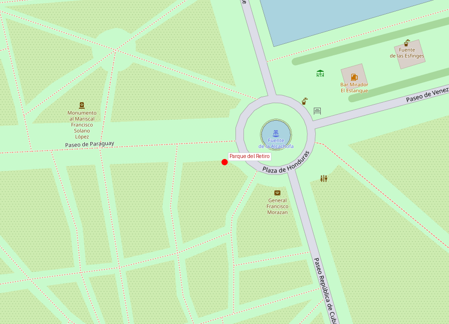

```yaml
lugar:
  nombre_original: "Parque del Retiro"
  nombre_alternativo: "Parque del Buen Retiro"
  pais: "España"
  region_admin: "Comunidad de Madrid"
  coordenadas: "40.4153, -3.6845"
  fecha_visita: "[DATO PENDIENTE — confirmar fecha]"
```





# Parque del Retiro

## Qué había antes

El Retiro actual es apenas un fragmento del enorme **Palacio del Buen Retiro**, construido entre 1630 y 1640 por el Conde-Duque de Olivares como regalo para Felipe IV. Era un complejo palaciego con jardines, teatro, estanque, ermitas y un zoológico real — un Versailles avant la lettre, concebido para que el rey pudiera "retirarse" de las presiones de la corte en el Alcázar.

El palacio fue devastado durante la Guerra de la Independencia (1808-1814), cuando las tropas napoleónicas lo usaron como cuartel y fortaleza. Solo sobrevivieron dos edificios: el **Casón del Buen Retiro** (hoy sala del Prado) y el **Salón de Reinos** (actualmente en proceso de restauración para integrarse al Prado).

## Historia

| Fecha | Hito |
|---|---|
| 1630-1640 | Construcción del Palacio del Buen Retiro por Olivares para Felipe IV |
| 1632 | Se inaugura el estanque grande para representaciones navales |
| 1767 | Carlos III permite el acceso público con restricciones |
| 1808-1814 | Destrucción casi total del palacio por tropas napoleónicas |
| 1868 | Cesión completa al Ayuntamiento de Madrid; se convierte en parque público |
| 1887 | Construcción del Palacio de Cristal para la Exposición de Filipinas |
| 2021 | Inscrito como Patrimonio de la Humanidad UNESCO (junto al Paseo del Prado) [⚠ VERIFICAR] |

## Arquitectura y puntos de interés

### Palacio de Cristal
Diseñado por Ricardo Velázquez Bosco en 1887 para una exposición de flora y fauna de Filipinas (entonces colonia española). Inspirado en el Crystal Palace de Londres, es una estructura de **hierro, cristal y cerámica** sobre un lago artificial con cipreses de los pantanos. Hoy funciona como espacio de exposiciones del Reina Sofía. La luz que entra por sus paneles lo convierte en uno de los espacios más fotogénicos de Madrid.

### Palacio de Velázquez
También de Velázquez Bosco (1883), con fachada de ladrillo y azulejos de Daniel Zuloaga. Otro espacio expositivo del Reina Sofía, a menudo infrautilizado y vacío — lo que permite admirar la arquitectura en sí.

### Estanque Grande
Originalmente diseñado para **naumaquias** (simulaciones de batallas navales) para entretenimiento de Felipe IV. Hoy se pueden alquilar barcas de remo y es el corazón social del parque. La columnata monumental en su orilla este está presidida por la estatua ecuestre de Alfonso XII (1922).

### Monumento al Ángel Caído
Escultura de Ricardo Bellver (1877) que representa a Lucifer en el momento de su caída del cielo. Es una de las pocas estatuas del mundo dedicadas al diablo, y según la leyenda urbana madrileña, está situada exactamente a **666 metros sobre el nivel del mar** — dato que es aproximadamente correcto pero probablemente coincidencia [⚠ VERIFICAR].

### La Rosaleda
Diseñada por Cecilio Rodríguez en 1915, con más de 4.000 rosales de 170 variedades.

## Mitología y leyendas

La tradición cuenta que Felipe IV usaba el Retiro para sus frecuentes aventuras amorosas, lejos de la rigidez del protocolo del Alcázar. El laberinto de ermitas y pabellones aislados del jardín original facilitaba estos encuentros. Se dice que el rey tuvo más de 30 hijos ilegítimos.

La leyenda del Ángel Caído a 666 metros es una de las historias urbanas más repetidas de Madrid. Aunque la altitud real es cercana, los topógrafos señalan que varía según el punto exacto de medición.

## Qué se puede ver hoy

- **Paseo de las Estatuas** (Paseo de Argentina): bulevar flanqueado por estatuas de reyes, conecta la entrada de Alfonso XII con el centro del parque
- **Palacio de Cristal y Palacio de Velázquez**: exposiciones gratuitas del Reina Sofía
- **Estanque Grande**: barcas de remo, monumento a Alfonso XII
- **Ángel Caído**: en la encrucijada de varios caminos
- **Rosaleda**: mejor en primavera (mayo-junio)
- **Bosque del Recuerdo**: memorial por las víctimas de los atentados del 11-M (2004), con 192 cipreses y olivos

## Conexiones

- El Retiro forma parte del conjunto **Paseo del Prado y el Buen Retiro**, inscrito como Patrimonio UNESCO en 2021, junto con el **Museo del Prado**, el **Jardín Botánico** y todo el eje cultural diseñado por Carlos III.
- El Palacio de Cristal funciona como extensión del **Museo Reina Sofía**, creando un puente entre el Triángulo del Arte y el parque.
- El Salón de Reinos superviviente será la futura ampliación del **Museo del Prado** — cerrando un círculo de 400 años.

## Datos interesantes

- El Retiro tiene **125 hectáreas** y más de 15.000 árboles, incluyendo un ahuehuete (ciprés de Moctezuma) plantado hacia 1633 que podría ser el árbol más antiguo de Madrid.
- Durante la segunda mitad del siglo XIX, el parque albergó zoológico, invernadero de fieras, montaña rusa y hasta una pista de patinaje.
- El apodo *El Retiro* viene de la función original: un lugar de "retiro" espiritual y recreativo para la corte.

---

*fuente: Patrimonio Nacional; Ayuntamiento de Madrid; UNESCO, expediente de inscripción "Paseo del Prado and Buen Retiro" (2021); Wikipedia (artículos verificados)*
