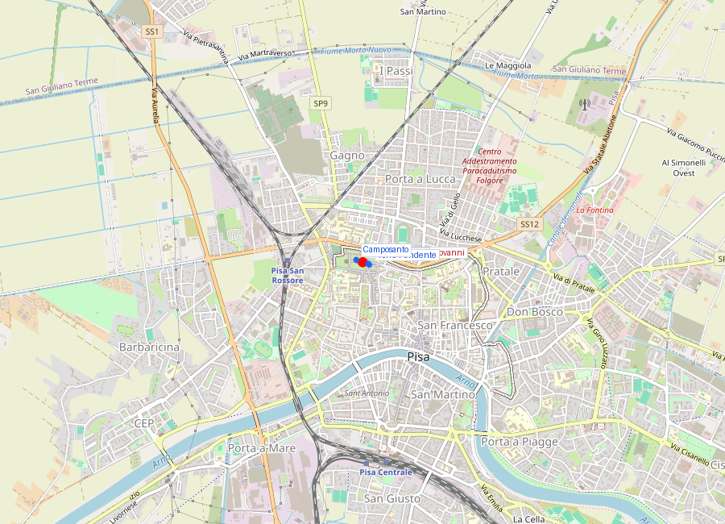
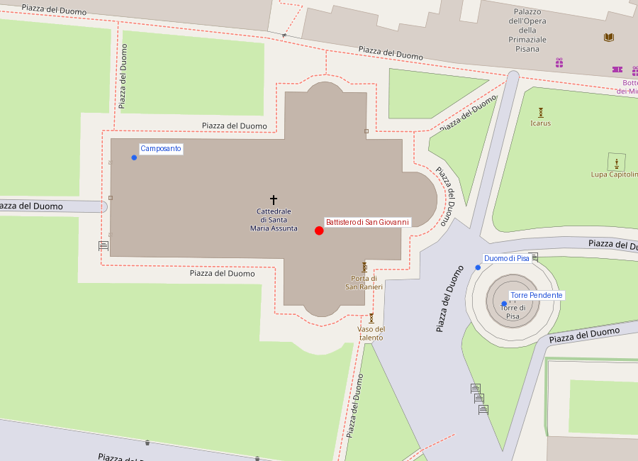

# Battistero di San Giovanni (Pisa)

```yaml
lugar:
  nombre_original: "Battistero di San Giovanni"
  pais: "Italia"
  region_admin: "Toscana"
  coordenadas: "43.7232° N, 10.3959° E"
  altitud_m: 4
  fecha_visita: "[DATO PENDIENTE — confirmar fecha]"
```





---

<!-- 📷 FOTO: exterior del Battistero desde la fachada / detalle del contraste entre el románico bajo y el gótico superior / cúpula -->

## Introducción

El **Battistero di San Giovanni** de Pisa es el **mayor baptisterio de Italia** —y uno de los mayores del mundo— con un diámetro exterior de más de 34 metros y una altura de 54,86 metros. Iniciado en 1152, su construcción se extendió durante dos siglos, cruzando el umbral estilístico del románico al gótico, lo que se lee claramente en su perfil: la mitad inferior es románica pisana; la mitad superior es gótica, añadida en los siglos XIII–XIV por **Nicola y Giovanni Pisano** y sus colaboradores.

Pero lo que justifica más que cualquier otra cosa la visita al Battistero es lo que contiene en su interior: el **pulpito de Nicola Pisano** (1260), la obra que los historiadores del arte señalan como el comienzo de la escultura medieval moderna y el antecedente directo de toda la plástica renacentista que viene un siglo y medio después.

---

## Historia

### Línea de tiempo

| Fecha | Hito |
|---|---|
| 1152 | Inicio de la construcción. Arquitecto: **Diotisalvi**. Se construyen los niveles inferiores románicos |
| c. 1200–1260 | Continuación de las obras. Se añaden los pisos intermedios |
| 1260 | **Nicola Pisano** completa el **pulpito** interior — fecha exacta en inscripción firmada |
| 1278–1284 | **Giovanni Pisano** y **Arnolfo di Cambio** trabajan en los pisos superiores del exterior, añadiendo el vocabulario gótico |
| Siglos XIV–XV | Conclusión de la cúpula y de la decoración exterior gótica (pináculos, estatuas de santos) |
| 1363 | Se añade al vértice de la cúpula la estatua de San Giovanni Battista |

### Diotisalvi: el arquitecto del comienzo

**Diotisalvi** (siglo XII) dejó su firma en una inscripción en el interior: *"Diotisalvi me fecit"* — "Diotisalvi me hizo". Es uno de los pocos arquitectos medievales italianos que firmaron su obra.

La planta circular del Battistero sigue la tradición de los baptisterios paleocristianos: la forma circular o poligonal como símbolo de la perfección divina y del ciclo de la vida. El Battistero de Pisa es circular en el exterior pero con un **deambulatorio anular** en el interior que separa la nave central de la corona exterior — una solución espacial que crea una profundidad y una complejidad interior sorprendente para el período.

---

## El exterior: un manual de dos estilos

<!-- 📷 FOTO: vista del exterior con las dos fases estilísticas / detalle de los arcos ciegos románicos vs. los pináculos góticos -->

### Románico pisano (niveles inferiores)

La parte inferior del Battistero está articulada con los **arcos ciegos** del románico pisano: arcadas decorativas de medio punto con columnas geminadas engastadas en la pared, superficie en mármol bicolor blanco y verde, geomtría precisa y controlada.

### Gótico pisano (niveles superiores)

La parte superior, añadida en el siglo XIII, tiene un vocabulario diferente: **arcos a sesto acuto** (apuntados), pináculos, tracería gótica, estatuas de santos en hornacinas. Los maestros que culminaron el exterior fueron Giovanni Pisano y colaboradores que habían estudiado el gótico francés.

El resultado es un edificio que en el perfil ha fusionado dos estilos cronológicamente separados, no siempre de manera perfectamente armoniosa, pero visualmente estimulante: el románico dibuja la base horizontal y la lógica de plano; el gótico crea verticalidad y dinamismo ascendente.

### La ligera inclinación

Como ya se mencionó, el Battistero comparte con la Torre Pendente el mismo suelo de arena y arcilla compresible. El edificio tiene una **ligera inclinación** visible si se observa la cúpula desde lejos — inclinada en dirección opuesta a la Torre (hacia el norte) [⚠ VERIFICAR dirección exacta]. Esta inclinación es mucho más discreta que la de la Torre y no ha requerido intervención.

---

## El interior

### El espacio

<!-- 📷 FOTO: interior del Battistero con la fuente central / detalle de la cúpula interior / perspectiva del deambulatorio -->

El interior del Battistero es una de las más sorprendentes experiencias espaciales de la arquitectura medieval italiana. El núcleo central está dominado por la **fuente bautismal** octogonal (siglo XIII), pequeña en comparación con el espacio enorme que la rodea. Las proporciones generan una sensación de vasto silencio.

La **cúpula interna** (que no coincide exactamente con la cúpula exterior — hay un espacio entre las dos, como en el Duomo de Firenze) tiene una **acústica extraordinaria**. Los guardias del Battistero tienen tradición de cantarle una nota al visitante y dejar que el espacio construya un acorde con el eco: la cúpula refleja el sonido de manera que una sola nota vocal crea un efecto de armonía múltiple que puede durar varios segundos. Es un fenómeno acústico real y notable, que los constructores medievales puede que tuvieran en cuenta deliberadamente.

### La fuente bautismal

La fuente bautismal central es una **vasca octagonal** de mármol blanco, con relieves en cada uno de los ocho lados. Tiene dimensiones suficientes para el bautismo por **immersione**: el neófito bajaba al agua, no solo recibía agua sobre la cabeza.

---

## El pulpito de Nicola Pisano (1260)

<!-- 📷 FOTO: pulpito de Nicola Pisano desde ángulo frontal / detalle paneles / detalle columnas con figuras -->

### Nicola Pisano: quién era

**Nicola Pisano** (c. 1220–c. 1284) es una figura envuelta en cierta misterio biográfico. El apodo "Pisano" sugiere vínculos con Pisa, pero los documentos más tempranos lo ubican trabajando en el sur de Italia, probablemente en el territorio del Reino de Sicilia bajo **Federico II de Hohenstaufen** — el imoperatore ilustrado que hablaba seis idiomas, escribía poesía en siciliano, correspondía con matemáticos árabes, y creó una corte que era el mayor foco intelectual de la Europa del siglo XIII.

En la corte de Federico II, los escultores estaban en contacto con los sarcófagos romanos de colección —Federico fue un coleccionista de antigüedades— y con refrescos del arte romano que los demás escultores medievales del norte de Europa no habían visto en su formación. Esta exposición a la escultura clásica fue fundamental para Nicola.

### El pulpito: descripción y significado

El pulpito de Nicola en el Battistero de Pisa (1260) es la primera obra que Nicola que conocemos con seguridad. Está **firmado y fechado**: la inscripción en prosa latina del borde lo atribuye a Nicola Pisano en el año 1260.

La estructura tiene forma **hexagonal**: seis columnas sostienen el parapeto con varios paneles. Tres de las columnas descansan sobre *leones* (un motivo del románico lombardo que Nicola adapta). Los **capiteles** tienen cabezas de santos, profetas y personajes del Antiguo Testamento, de un modelado que ya no tiene nada del hieratismo románico convencional: tienen individualidad, masa, presencia.

Los **cinco paneles** del parapeto representan:
1. La **Natividad** de Cristo (con la Visitación y el parto de María)
2. **L'Adorazione dei Magi**
3. La **Presentación al Templo**
4. La **Crocifissione**
5. Il **Giudizio Universale**

### Por qué el panel de la Natividad es revolucionario

El panel de la **Natività** es el más estudiado de los cinco. Para entender su importancia, hay que mirar el **sarcófago romano del Camposanto Monumentale** a pocos metros: Nicola había estudiado directamente los relieves de ese sarcófago y había copiado de él la pose de la **Virgen reclinada** — una *lectrix* romana transformada en María después del parto.

La figura de María en el panel de Nicola tiene el peso, el volumen y la presencia tridimensional de la escultura clásica. No es la Madonna estilizada y etérea del románico convencional. Es una mujer con masa, con un cuerpo que ha parido y que descansa. Este contacto directo con el modelo clásico y esta voluntad de producir figuras que parezcan reales —figuras con cuerpo, no símbolos con forma humana— es lo que hace la obra de Nicola fundacional.

El arte que sigue a Nicola Pisano —su hijo **Giovanni Pisano**, luego **Arnolfo di Cambio** (discípulo de Nicola), luego a través de ellos **Giotto**, y más tarde **Donatello** y **Michelangelo**— es heredero directo de esta decisión tomada en 1260 en Pisa.

La secuencia causal es directa: **Nicola Pisano (1260) → Giovanni Pisano → Arnolfo di Cambio → Giotto → Renacimiento florentino**.

---

## Conexiones

- El **pulpito de Nicola** (1260, Battistero de Pisa) y el **pulpito de Giovanni** (1302-1311, Duomo di Pisa) son obra de padre e hijo. Visitar ambos en la misma tarde es una experiencia única: se ve la evolución entre el classicismo mesurado de Nicola y el expressionismo dinámico e inquieto de Giovanni.
- **Arnolfo di Cambio**, discípulo de Nicola Pisano, fue el arquitecto del Duomo di Firenze (Santa Maria del Fiore) y de la Basilica di Santa Croce en Firenze. La línea entre el románico pisano y el Renacimiento florentino es directa y documentable.
- Los sarcófagos romanos del **Camposanto Monumentale** a pocos metros fueron los modelos directos que Nicola Pisano estudió para calibrar sus figuras hacia el classicismo. La distancia entre el pulpito y los sarcófagos es de unos 100 metros.

---

## Datos interesantes

- La acústica del Battistero es tan notable que se han organizado **conciertos de polifonía** medievale dentro del edificio, aprovechando la reverberación de la cúpula. Algunos grabaciones de música medieval han sido realizadas en el interior.
- El Battistero es el mayor baptisterio de Italia, pero no tiene *pala d'altare* ni pinturas significativas en el interior — es un espacio de arquitectura y escultura pura.
- El efecto acústico es reproducible: si un guardiano del Battistero está disponible y permite la demostración, puede cantar una nota y el espacio construirá un acorde. No hay necesidad de solicitar esto con énfasis especial; a menudo los custodi lo hacen por su cuenta con los visitantes.

---

*fuente: Moshe Barasch, "Giotto and the Language of Gesture" (Cambridge University Press); John Pope-Hennessy, "Italian Gothic Sculpture" (Phaidon); TCI Toscana; Encyclopædia Britannica; opapisa.it.*
