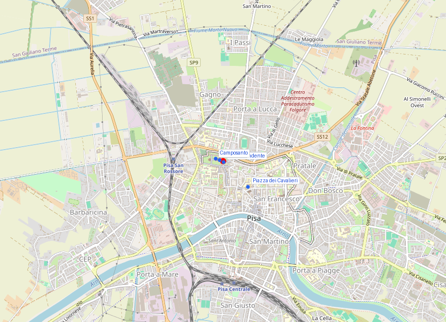
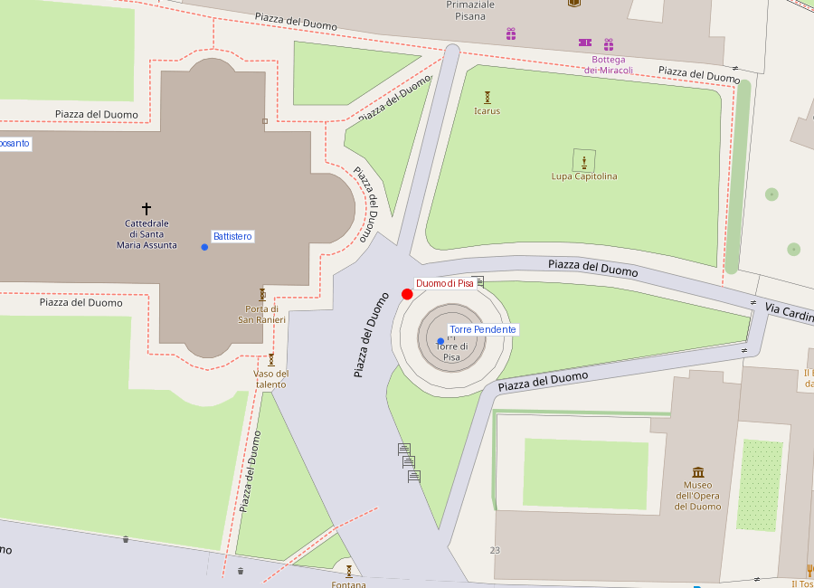

# Duomo di Pisa

```yaml
lugar:
  nombre_original: "Cattedrale di Santa Maria Assunta"
  nombre_alternativo: "Duomo di Pisa"
  pais: "Italia"
  region_admin: "Toscana"
  coordenadas: "43.7231° N, 10.3965° E"
  altitud_m: 4
  fecha_visita: "[DATO PENDIENTE — confirmar fecha]"
```





---

<!-- 📷 FOTO: fachada del Duomo desde el Campo / detalle de los arcos y columnas de la fachada / interior de cinco naves -->

## Introducción

La **Cattedrale di Santa Maria Assunta** es la madre de todas las catedrales del románico pisano y uno de los edificios más influyentes de la arquitectura medieval italiana. No solo porque es hermosa —lo es, extraordinariamente— sino porque el **estilo** que inventó: las galerías de columnas superpuestas, los mármoles bicolor, los arcos ciegos en la parte baja y las logias abiertas en la alta, la decoración con incrustaciones geométricas de tradición islámica... todo eso fue exportado a docenas de catedrales de Cerdeña, Sicilia, el sur de Italia, Toscana y más allá.

El Duomo de Pisa es, además, un contenedor de obras de arte de primer rango: las puertas de bronce de Bonanno Pisano, el pulpito de Giovanni Pisano, el mosaico de la concha del ábside, las columnas de granito de antigüedad romana.

---

## Historia

### Línea de tiempo

| Fecha | Hito |
|---|---|
| 1063 | El Consejo de la República de Pisa autoriza la construcción tras el botín de Palermo |
| 1064 | Inicio de las obras. Primer arquitecto: **Buscheto** (o Buketius). La inscripción conmemorativa de su tumba está en la fachada |
| 1099 | Consagración parcial de la catedral por el papa Gelasio II (aunque las obras continúan) |
| c. 1180 | **Bonanno Pisano** ejecuta las puertas de bronce orientales (destruidas en el incendio de 1595 excepto una) |
| c. 1180–1200 | Se añade el transepto y el ábside |
| 1278 | **Rainaldo** completa la fachada occidental con las cuatro galerías de columnas superpuestas |
| 1302–1311 | **Giovanni Pisano** ejecuta el **pulpito** de la catedral, su obra maestra |
| 1595 | Incendio que destruye buena parte de la decoración interior y las puertas de bronce originales. Reconstrucción posterior |
| Siglo XVII | Nueva decoración interior barroca que superpone elementos sobre el románico original |

### Buscheto: el arquitecto inaugural

**Buscheto** (siglo XI) es el primer gran nombre de la arquitectura italiana medieval. Su obra en Pisa inauguró el estilo románico pisano que dominaría la arquitectura de la Toscana y de Cerdeña durante los siguientes dos siglos.

Lo que Buscheto creó no era una derivación del románico lombardo del norte ni del románico provenzal del sur de Francia. Era una **síntesis nueva**:
- Del mundo **romano**: la planta basilical de cinco naves, las proporciones, el uso de columnas de granito antiguo reusadas.
- Del mundo **bizantino**: la decoración en mosaico, la cúpula ovalada sobre el crucero.
- Del mundo **islámico**: los motivos geométricos de incrustación en mármol (*cosmateschi* y derivados), que llegaron a través del commercio con el mundo árabe.

La tumba de Buscheto está incorporada en la fachada occidental de la catedral, en la arcata más a la izquierda: una lápida con epitafio en verso latino que lo exalta como un segundo Ulises que superó con el arte lo que Ulises superó con el ingenio. Es una inscripción medievalísima en su autoconciencia humanista.

---

## La fachada

<!-- 📷 FOTO: detalle de las cuatro galerías de columnas / vista del rosetón central / inscripción de la tumba de Buscheto -->

La fachada occidental, completada por **Rainaldo** en el siglo XIII, es el paradigma del románico pisano maduro:

**Planta baja**: cuatro **arcadas ciegas** decoradas con rombos y motivos geométricos incrustados en mármol bicolor (blanco y verde-gris). Las superficies de los pedimentos entre los arcos tienen incrustaciones de mármoles de colores. En el centro, el portal principal con decoración escultórica.

**Los cuatro niveles de galerías**: sobre la base arcuata, cuatro niveles progresivamente más pequeños de **galerías abiertas** con columnas geminadas. Cada galería retrocede levemente respecto a la anterior, creando un efecto de perspectiva ascendente. Las columnas son de mármol bianco y hanno capiteles tallados individualmente.

En el vértice de la fachada: el **rosetón** sobre el portal central, con decoración geométrica intrincada.

**El portal central** tiene dovelas esculpidas con animales fantásticos, motivos vegetales y figuras de santos. Las **puertas actuales** son de **1603**, ejecutadas por varios orfebres florentinos para reemplazar las de Bonanno destruidas en el incendio del 1595 [⚠ VERIFICAR autoría exacta]. Una de las puertas originales de Bonanno Pisano —la que estaba en el lado del transetto— sobrevivió al incendio y está hoy en el Museo dell'Opera del Duomo adyacente.

---

## El interior

### Las cinco naves

<!-- 📷 FOTO: vista de las naves con las columnas de granito / detalle del artesonado del techo -->

El interior es vasto y solemne: **cinco naves** separadas por filas de columnas. Las columnas son una de las características más notables: son **columnas de granito** provenientes de edificios de **época romana y de los territorios mediterráneos** que Pisa controlaba. La República tenía acceso a materiales de un ámbito geográfico enorme —Sardinia, Córcega, Sicilia, el Levante— y sus arquitectos y almirantes recogieron columnas de edificios romanos en todos esos territorios.

Las columnas de granito tienen distintos colores (gris, rosado, verde oscuro, con vetas variadas) porque proceden de canteras distintas. La diversidad es parte de la riqueza visual del interior.

Sobre las columnas corre una **loggia** de arcos que da al nivel del cleristorio. El techo es de **madera lacada y dorada** (de obras de restauración post-incendio del siglo XVII), con decoración de estilo manierista tardío que contrasta con el románico de los muros.

### La cupola ovalada sobre el crucero

En el crucero central, la cúpula que cubre el espacio de intersección de la nave central y el transepto es **ovalada** — una forma inusual para el románico italiano, que generalmente prefiere la planta circular o poligonal en las cúpulas. Su forma ovalada podría derivar de influencias islámicas o bizantinas llegadas a través del commercio mediterráneo pisano.

### El mosaico absidal: Cristo en Majestad

El ábside oriental está decorado con un gran **mosaico** de teselas doradas (el fondo) sobre el que aparece un **Cristo en Majestad** (*Maiestas Domini*), de tradición iconográfica bizantina, con la Virgen y San Giovanni Evangelista a los lados.

El mosaico fue comenzado en el siglo XII pero la figura del Cristo que se ve hoy es mayormente de **1302**, ejecutada por **Cimabue** —el mismo Cimabue que pintó los frescos de la Basilica Superiore di Assisi y cuya Madonna en Maestà está en los Uffizi de Firenze. Es una de las últimas obras documentadas del maestro, que murió posiblemente en Pisa en 1302 durante la ejecución del encargo.

---

## El pulpito de Giovanni Pisano (1302–1311)

<!-- 📷 FOTO: pulpito de Giovanni Pisano desde espaldas / detalle de los paneles narrativos / detalle de las columnas del apoyo -->

El **pulpito** que **Giovanni Pisano** (c. 1250–c. 1314) ejecutó para la catedral de Pisa es, junto con el de su padre **Nicola Pisano** en el Battistero (1260), la obra escultórica más importante de Italia del siglo XIII–XIV.

### Giovanni Pisano: el más formidable y el más difícil

Giovanni fue el hijo de Nicola Pisano y aprendió el oficio en el taller de su padre, participando en la ejecución del pulpito del Siena y de la Fontana Maggiore di Perugia. Pero mientras Nicola miraba principalmente a los modelos romanos clásicos, Giovanni miraba al **gótico francés**: sus figuras tienen la elegancia agitada de las esculturas de las catedrales del Île-de-France, con un componente dramático y expresionista que va mucho más allá del classicismo sereno de su padre.

### El pulpito: descripción

El pulpito es una estructura de mármol blanco sostenida por **columnas** que alternan apoyos sobre pedestales y sobre figuras de animales y de águila. Los capiteles de las columnas son figuras humanas y alegóricas que soportan el peso de la estructura.

La **cassa** (la caja exterior) tiene **nove panelli narrativi** que representan episodios de la infancia de Cristo, la Pasión y el Juicio Universal. Las escenas están dispuestas en relieve muy alto (*alto-rilievo*), casi tridimensional en algunos puntos, con un dinamismo y una densidad de figuras que anticipa directamente la pintura narrativa de Giotto.

Algunos de los panells más expresivos:
- **La Strage degli Innocenti**: la masacre de los inocentes por orden de Herodes. Las madres se retuercen en dolor, los soldados matan a los niños. La intensidad emocional de este relieve es de una modernidad impactante: no es la dolentísima convencional del arte medieval sino dolor real, con cuerpos convulsos y caras deformadas por el sufrimiento.
- **Il Giudizio Universale**: la representación del Juicio Final, con los condenados al infierno en una masa densa de cuerpos entrelazados. La influencia sobre **Dante** (que estaba en estos mismos años escribiendo la Commedia) es debatida pero plausible.

### El pulpito desmontado y reensamblado

El pulpito fue **desmontado** en el siglo XVII y las piezas fueron dispersadas por razones no del todo claras (posiblemente relacionadas con los daños del incendio de 1595). Durante varios siglos, los paneles y columnas estuvieron en distintos almacenes y algunos elementos fueron a parar a museos. En **1926**, fue **reensamblado** en la posición actual después de una campaña de recuperación de los fragmentos. Aunque la mayor parte es original, la disposición del montaje actual tiene algunas incertidumbres sobre si el orden original era exactamente el que se ve hoy.

---

## Conexiones

- Las columnas de granito romano reutilizadas en el Duomo conectan materialmente con el mundo romano del Mediterráneo, del que Pisa extraía recursos en sus conquistas navales —del mismo modo que el **Colosseo** de Roma y el **Tempio di Atena** en Siracusa tienen columnas reutilizadas.
- **Cimabue** (autor del mosaico absidal) es el maestro de **Giotto**: el último gran pintor del estilo medievale y el maestro del primer pintor del Renacimiento. Su obra en Pisa es contemporánea del pulpito de Giovanni Pisano y del inicio de la carrera de Giotto.
- El **románico pisano** que el Duomo canonizó se puede rastrear en las iglesias de **Cerdeña** (donde la presencia pisana fue intensa en los siglos XI-XII), creando una red de edificios con la misma gramática visual.

---

## Datos interesantes

- La inscripción funeraria de **Buscheto** en la fachada es una de las primeras evidencias de **alabanza explícita al arquitecto** (y no solo al comitente) en la historia de la arquitectura medieval. La conciencia de la autoría del artista — normal en el Renacimiento, rarísima antes— se asoma ya aquí en el siglo XI.
- El incendio de **1595** fue uno de los grandes desastres del patrimonio artístico del Cinquecento pisano: destruyó las puertas de bronce de Bonanno, telas y pinturas medievales, y parte de la decoración del techo. La reconstrucción del siglo XVII tiene calidad en algunos puntos, pero la pérdida de la decoración original fue irreparable.
- **Galileo Galilei** habría observado el movimiento de un **lampadario** (una lámpara de techo) en el Duomo y, calculando mentalmente su período de oscilación, habría formulado la ley del péndul0. La historia es atribuida por Viviani, el mismo biógrafo que cuenta la Torre. El lampadario en cuestión sigue colgando del techo del Duomo; la placa que lo identifica lo llama "Il Lampadario di Galileo", aunque se ha comprobado que el artefacto actual es de **1587**, después de los años formativos de Galileo. El lampadario verdadero habría sido reemplazado.

---

*fuente: Emilio Tolaini, "Forma Pisarum"; Pio Pecchiai, "Il Duomo di Pisa" (TCI); Enciclopedia dell'Arte Medievale (Treccani); Encyclopædia Britannica; opapisa.it.*
