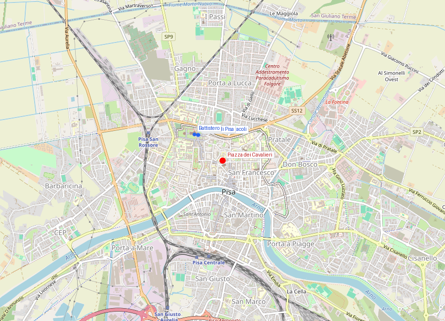
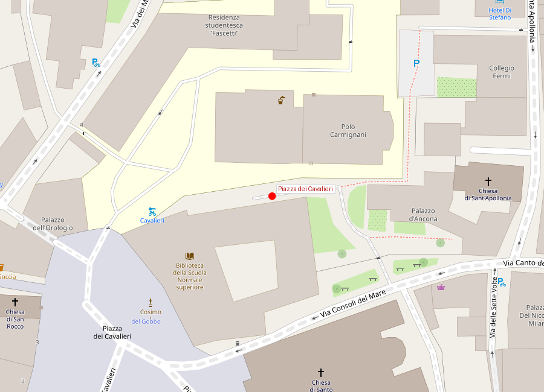

# Piazza dei Cavalieri

```yaml
lugar:
  nombre_original: "Piazza dei Cavalieri"
  pais: "Italia"
  region_admin: "Toscana"
  coordenadas: "43.7199° N, 10.4008° E"
  altitud_m: 4
  fecha_visita: "[DATO PENDIENTE — confirmar fecha]"
```





---

<!-- 📷 FOTO: fachada del Palazzo della Carovana / vista general de la piazza / Torre della Gherardesca (Torre della Fame) -->

## Introducción

La **Piazza dei Cavalieri** es el corazón histórico de la Pisa medieval y renacentista —y el lugar que los pisanos consideran "su" centro, a diferencia del Campo dei Miracoli orientado al turismo masivo. Aquí estuvo la sede del gobierno comunal de la República, aquí fue establecida la sede de la orden militar de los **Cavalieri di Santo Stefano**, y aquí se encuentra la torre donde uno de los episodios más oscuros y literariamente célebres de la historia medieval italiana tuvo lugar: la muerte por inanición del Conde **Ugolino della Gherardesca**, inmortalizado por Dante en el *Inferno*.

La piazza hoy alberga además la sede de la **Scuola Normale Superiore di Pisa**, una de las instituciones académicas de mayor prestigio del mundo.

---

## Historia

### El foro romano y el centro comunal

Como sucede con la Piazza San Michele in Foro de Lucca, la Piazza dei Cavalieri de Pisa ocupa el espacio del **foro romano** de la colonia *Pisae*: el centro cívico original de la ciudad romana. La continuidad espacial entre el foro antiguo y la piazza medieval era típica de las ciudades italianas, donde el espacio del foro nunca perdió su función de centro del poder público.

Durante los siglos XII y XIII, cuando Pisa era la República Marinara más poderosa del Tirreno, esta piazza fue la sede del **governo comunale**: aquí estaba el Palazzo degli Anziani (los ancianos, magistrados de la República), aquí se proclamaban las leyes, aquí se organizaban las facciones políticas que a veces desembocaban en violencia de calle.

### El Conte Ugolino e la Torre della Fame: Dante e la crueldad medieval

El episodio más dramático ligado a esta piazza pertenece a la historia y a la literatura simultáneamente.

**Ugolino della Gherardesca** (c. 1220–1289) fue el jefe de la facción güelfa de Pisa durante el período posterior a la catastrófica derrota de Meloria (1284). En un contexto de luchas internas feroces entre güelfos y gibelinos, Ugolino fue acusado de traición por el arzobispo **Ruggieri degli Ubaldini** (jefe de la facción gibelina) y encarcelado en la **Torre dei Gualandi**, también llamada luego **Torre della Muda** y —después del episodio que sigue— **Torre della Fame** (Torre del Hambre).

En **1289**, Ugolino fue encerrado en la torre junto con sus hijos y nietos —cuatro en total según las fuentes— y la torre fue tapiada. Murieron de inanición.

**Dante Alighieri** recoge el episodio en el **Canto XXXIII del Inferno** de la *Divina Commedia* (escrito c. 1307-1314): Ugolino y el arzobispo Ruggieri están congelados en el noveno círculo del infierno (el hielo de Cocito, reservado a los traidores), y Ugolino —eternamente congelado con la cabeza de Ruggieri bajo la suya, royéndole el cráneo— le narra a Dante cómo murieron él y sus hijos:

> *"Poscia, più che il dolor, poté il digiuno"*
> ("Luego, el hambre pudo más que el dolor")

El verso más famoso y más oscuro del Inferno: Ugolino sobrevivió el tiempo suficiente para ver morir a sus hijos uno por uno, y la línea sugiere —sin afirmarlo— que en el delirio final se alimentó de los cadáveres de sus propios hijos. Dante deja la insinuación flotando sin confirmarla: es uno de los momentos de mayor ambigüedad moral de la Commedia.

La torre en que ocurrió esto sigue en pie en la piazza: hoy se llama informalmente **Torre della Gherardesca** o **Torre della Fame**. No está abierta al público, pero se ve desde la piazza, integrada en el edificio que la rodea.

### Cosimo I y los Cavalieri di Santo Stefano (1561)

Cuando **Cosimo I de' Medici** incorporó definitivamente Pisa al territorio del Ducado de Toscana, transformó la Piazza dei Cavalieri en la sede de una nueva orden militar: los **Cavalieri di Santo Stefano**, fundada en **1561** y aprobada por el Papa Pío IV en 1562.

La orden fue creada con un propósito muy específico: la **guerra de corso contra los piratas turcos y barbarescos** en el Mediterráneo. En el siglo XVI, los corsarios otomanos y de los Regencias de Argel, Túnez y Trípoli asolaban las costas italianas, capturando personas para venderlas como esclavas, saqueando pueblos costeros y perturbando el comercio. Los Cavalieri di Santo Stefano eran básicamente piratas estatales autorizados a contraatacar: tenían su propia flota, sus propios reglas de corso y el privilegio de quedarse con parte del botín capturado.

La piazza fue completamente rediseñada por **Giorgio Vasari** (el mismo Vasari que construyó los Uffizi de Firenze y el Corridoio Vasariano) entre **1562 y 1596**: se regularizó el espacio, se construyó el Palazzo della Carovana como sede de la orden, y se instaló el programa decorativo en fachada que todavía se puede ver.

---

## Los edificios de la piazza

### Palazzo della Carovana (hoy Scuola Normale Superiore)

<!-- 📷 FOTO: fachada del Palazzo della Carovana con el sgraffito / detalle de los busti de los Médici en los medallones -->

El **Palazzo della Carovana** (1562, Vasari) es el edificio más importante de la piazza. La fachada es una de las obras más elaboradas de Vasari: cubierta de un **sgraffito** (decoración hecha raspando el revoco húmedo para crear dibujos en negativo) con motivos geométricos, trofeos militares y medallones con los bustos de los primeros Grandes Duques de Toscana. El efecto visual es denso, casi tapizado: la fachada no tiene un centímetro sin decorar.

El sgraffito es técnica rara en la Toscana —más común en el norte de Italia y en España— y la elección de Vasari por este acabado le da a la fachada un carácter único en el contexto del arte florentino.

La "Carovana" en el nombre se refiere al período de entrenamiento (*carovana*) que los caballeros novatos debían completar antes de ser admitidos en la orden.

Hoy el palazzo es la sede histórica de la **Scuola Normale Superiore di Pisa**, fundada por Napoleón en 1810 como filial de la École Normale Supérieure de París —la institución que formó a la elite intelectual francesa. La Scuola Normale es actualmente una de las instituciones académicas más selectivas y prestigiosas del mundo: admite un número muy reducido de estudiantes por concurso de excelencia y les garantiza alojamiento, manutención y tutorías individualizadas. Sus alumni incluyen varios premios Nobel y algunas de las figuras académicas más importantes de Italia del siglo XX.

### Chiesa di Santo Stefano dei Cavalieri

Frente al Palazzo della Carovana, la **chiesa di Santo Stefano dei Cavalieri** fue construida también por diseño de Vasari (comenzada en 1565). El interior es un museo de los trofeos de la orden: **proas de barcos turcos** capturados en battaglia, estandartes otomanos, armaduras y armas, cadenas de esclavos. Es una iglesia que funciona literalmente como sala de trofeos de una orden de guerra.

El campanile de la chiesa fue diseñado por **Giovanni de' Medici**, hijo natural de Cosimo I.

### Torre della Gherardesca (Torre della Fame)

La torre medieval integrada en el edificio del lado norte de la piazza es la que la tradición identifica como el lugar de la morte di Ugolino. No está abierta al público. Tiene una placa conmemorativa y su perfil es visible desde la piazza.

---

## La Scuola Normale hoy

La **Scuola Normale Superiore** tiene dos sedes: en Pisa (Palazzo della Carovana y edificios adyacentes) y en Florencia (Palazzo Strozzi, para el área umanística). Ofrece cursos de grado y posgrado en ciencias exactas y ciencias humanas con un sistema de tutoria intensiva.

El campus de Pisa ocupa varios edificios históricos de la piazza y alrededores. Ver grupos de estudiantes leyendo o discutiendo en la piazza es parte del ambiente cotidiano.

---

## Conexiones

- El **Conte Ugolino** de Dante conecta esta piazza directamente con la *Divina Commedia*, que fue escrita en los mismos años en que Nicola y Giovanni Pisano trabajaban en el Campo dei Miracoli a 500 metros. Los tres —Dante, Nicola Pisano, Giovanni Pisano— son contemporáneos exactos.
- **Giorgio Vasari**, arquitecto del Palazzo della Carovana, es también el autor de las **Gallerie degli Uffizi** en Firenze y el autor de *Le Vite de' più eccellenti pittori, scultori e architettori* (1550), el primer libro de historia del arte del mundo moderno.
- La **Scuola Normale** tiene un linaje intelectual que conecta con la historia científica de Pisa: en la misma ciudad donde nació Galileo y donde Leonardo Fibonacci introdujo los números arábigos, funciona hoy una de las instituciones científicas más rigurosas del mundo.

---

## Datos interesantes

- El **sgraffito** del Palazzo della Carovana es uno de los ejemplos más grandes y mejor conservados de esta técnica decorativa en la Toscana.
- La rigorosa selección de la Scuola Normale admite en promedio unos **25 estudiantes por año** (entre ciencias y humanidades), de toda Italia. La proporción de aspirantes admitted es de las más bajas del sistema universitario italiano.
- El episodio de Ugolino ha sido tratado por artistas desde el siglo XIII hasta hoy: Dante lo escribió, **Rodin** lo esculpió en *La Porta dell'Inferno* (1880-1917), el episodio fue pintado por **Joshua Reynolds** (siglo XVIII) y adaptado al cine y al teatro múltiples veces.
- La *carovana* que da nombre al palazzo no era un viaje en camello: era el período de servicio activo en el mar que los caballeros debían cumplir para demostrar su aptitud militar antes de ser admitidos formalmente en la orden.

---

*fuente: Emilio Tolaini, "Forma Pisarum"; Anna Maetzke, "I Cavalieri di Santo Stefano" (ed. Pacini); Dante Alighieri, *Inferno*, Canto XXXIII (ed. Petrocchi); TCI Toscana; Encyclopædia Britannica; sitio web Scuola Normale Superiore (sns.it).*
