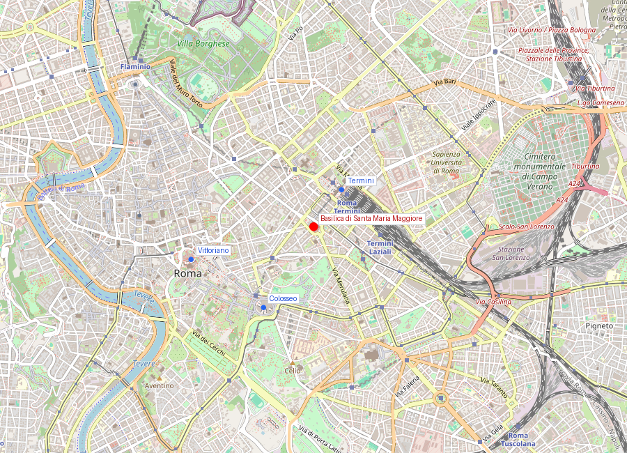
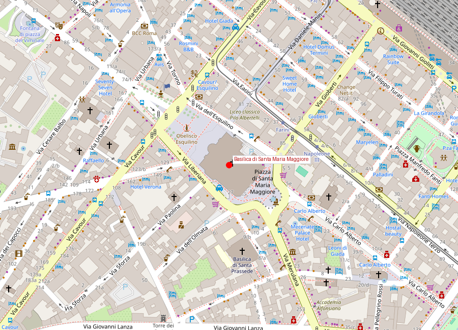

# Basilica di Santa Maria Maggiore

```yaml
lugar:
  nombre_original: "Basilica di Santa Maria Maggiore"
  pais: "Italia"
  fecha_visita: "2026-03-23/2026-03-30"
```

## Mapa


## Mapa en detalle


## Qué había antes

El Esquilino, donde se alza la basílica, fue en la Roma antigua una colina de villas aristocráticas y jardines. Bajo el suelo de la iglesia hay restos de un edificio romano del siglo I d.C. (probablemente un macellum o mercado). La tradición cristiana sitúa la decisión de construir aquí a un evento milagroso: la nevicata de agosto del 358 d.C. (ver sección de leyendas). Antes de la basílica actual, se cree que existió una iglesia anterior, la *Basilica Liberiana*, atribuida al papa Liberio (352-366), aunque no hay restos arqueológicos firmes que la confirmen.

## Historia

### Línea de tiempo

| Fecha | Hito |
|---|---|
| 358 d.C. | Según la tradición, nevada milagrosa en el Esquilino que señala el lugar de la iglesia |
| 431 | Concilio de Éfeso: se proclama a María como *Theotokos* (Madre de Dios) |
| 432-440 | Sixto III construye la basílica actual para celebrar el dogma de Éfeso; se realizan los mosaicos del arco triunfal y la nave |
| Siglo VI | Se añaden mosaicos del ábside (retocados posteriormente) |
| 1288-1292 | Nicolás IV encarga a Jacopo Torriti los mosaicos del ábside que se ven hoy — la Coronación de la Virgen |
| ~1290 | Arnolfo di Cambio crea el primer belén escultórico conocido para la capilla del Presepe |
| 1377 | Se construye el campanario románico-gótico (el más alto de Roma, 75 m) |
| 1586 | Sixto V encarga a Domenico Fontana trasladar el obelisco egipcio a la plaza posterior y construir la Cappella Sistina (no confundir con la del Vaticano) |
| 1605-1611 | Paolo V Borghese encarga la Cappella Paolina como réplica y competencia de la Cappella Sistina de Sixto V |
| 1741-1743 | Ferdinando Fuga rediseña la fachada principal con la loggia que enmascara los mosaicos medievales del siglo XIII |
| 1825 | Luigi Valadier restaura el baldaquino del altar mayor con columnas de pórfido |
| Siglo XX | Excavaciones bajo la nave revelan restos romanos del siglo I d.C. |

### Narrativa

Santa Maria Maggiore es la respuesta arquitectónica de Roma a una batalla teológica. En el Concilio de Éfeso (431), la Iglesia definió que María era *Theotokos* — Madre de Dios, no solo madre de un hombre llamado Jesús. El papa Sixto III levantó esta basílica como proclamación física de esa doctrina. Los mosaicos de la nave central (siglo V), que narran escenas del Antiguo Testamento, y los del arco triunfal, con la infancia de Cristo enfatizando el papel de María, son la catequesis visual de Éfeso.

Lo extraordinario es que esos mosaicos del siglo V sobreviven casi intactos — son los ciclos musivos paleocristianos más completos de Roma. Mientras que en otras basílicas los mosaicos originales fueron reemplazados o destruidos, aquí se conservan 36 paneles de la nave con escenas de Abraham, Jacob, Moisés y Josué, ejecutados con una vitalidad narrativa que conecta directamente con la tradición del arte romano tardío.

La basílica tiene un estatus especial: es una de las cuatro basílicas papales mayores de Roma (junto con San Pietro, San Giovanni in Laterano y San Paolo fuori le Mura) y goza de extraterritorialidad — pertenece a la Santa Sede, no al Estado italiano, aunque está en suelo de Roma.

## Mitología y tradición

La leyenda del *Miracolo della Neve* cuenta que en la noche del 4 al 5 de agosto del 358 d.C., la Virgen se apareció en sueños simultáneamente al papa Liberio y al patricio Giovanni, indicándoles que construyeran una iglesia en el lugar donde encontrarían nieve al día siguiente. A la mañana siguiente, la cima del Esquilino apareció cubierta de nieve en pleno verano romano. Cada 5 de agosto se conmemora con una lluvia de pétalos blancos desde el techo de la capilla Borghese durante la misa.

Se trata de una tradición devocional, no de un hecho histórico verificable.

## Qué se puede ver hoy

- **Los mosaicos de la nave** (siglo V): 36 paneles a lo largo de la nave central con escenas del Antiguo Testamento. Son pequeños y están altos — conviene llevar binoculares o usar la iluminación que se activa con monedas.
- **Los mosaicos del arco triunfal** (siglo V): escenas de la infancia de Cristo con énfasis mariano, directamente vinculados al dogma de Éfeso.
- **El mosaico del ábside** (Jacopo Torriti, 1295): la Coronación de la Virgen con un fondo dorado espectacular, con ríos que fluyen y aves — mezcla de tradición paleocristiana y sensibilidad gótica.
- **El techo artesonado**: se dice que fue dorado con el primer oro llegado de América, donado por Fernando e Isabel de España a Alejandro VI Borgia. [⚠ VERIFICAR]
- **La Cappella Sistina** (de Sixto V, no del Vaticano): diseñada por Domenico Fontana, contiene la capilla del Presepe con las figuras de Arnolfo di Cambio (siglo XIII) — el belén escultórico más antiguo que se conserva.
- **La Cappella Paolina/Borghese**: con el icono de la *Salus Populi Romani*, una imagen de la Virgen de tradición muy antigua (atribuida legendariamente a san Lucas), especialmente venerada por los papas — Francisco reza ante ella antes y después de cada viaje.
- **El campanario**: el más alto de Roma (75 m), con estilo románico-gótico, visible desde varios puntos de la ciudad.
- **El pavimento cosmatesco**: mármoles polícromos en patrones geométricos, de tradición medieval romana.
- **La Columna de la Paz** (en la plaza): columna corintia del siglo II d.C. procedente de la Basilica di Massenzio, coronada con una estatua de la Virgen.

## Cultura

Sus mosaicos paleocristianos son fundamentales para estudiar la continuidad y transformación entre Antigüedad tardía y Edad Media romana. La basílica muestra, en un solo edificio, el paso del arte narrativo romano al programa iconográfico cristiano, sin ruptura: las técnicas son las mismas, el lenguaje visual evoluciona.

El edificio mantiene una fuerte vida litúrgica actual. Es la iglesia mariana más importante de Roma y la única de las basílicas papales que ha celebrado misa cada día sin interrupción desde el siglo V.

## Conexiones

- Se vincula con el sistema de basílicas mayores y con la geografía simbólica de peregrinación en Roma. Las cuatro basílicas mayores marcaban los puntos cardinales de la *Roma sacra* medieval.
- Dentro de la ciudad moderna, conecta con el nodo de Termini y con los ejes hacia el [Colosseo](colosseo.md) y el centro histórico.
- La Cappella Paolina conecta con la familia Borghese y, por tanto, con [Villa Borghese](villa_borghese.md): Paolo V Borghese la construyó como capilla familiar.
- Los mosaicos del siglo V conectan estilísticamente con los de Ravenna (San Vitale, Galla Placidia) como los dos grandes ciclos paleocristianos de Italia.

## Datos interesantes

- Es parte del conjunto UNESCO del centro histórico de Roma dentro de los bienes de la Santa Sede con régimen especial de extraterritorialidad.
- El belén de Arnolfo di Cambio (circa 1290) en la capilla subterránea es el primer belén escultórico documentado de la historia.
- Cada 5 de agosto, pétalos blancos caen desde el techo de la capilla Borghese para conmemorar la nevada milagrosa.
- Bajo la basílica se encontraron restos de un calendario romano pintado del siglo I d.C. [⚠ VERIFICAR]
- El icono de la *Salus Populi Romani* fue llevado en procesión por Gregorio Magno durante la peste del 590 d.C., según la tradición.

fuente: Basilica Papale di Santa Maria Maggiore (vatican.va); UNESCO World Heritage Centre, ref. 91; Turismo Roma; Hugo Brandenburg, *Ancient Churches of Rome*, Brepols Publishers
