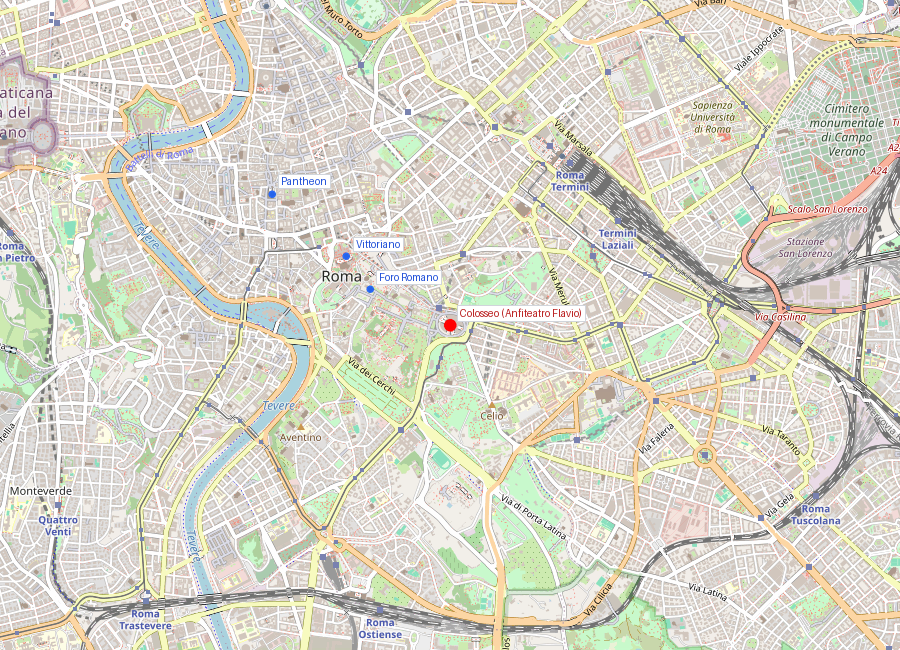
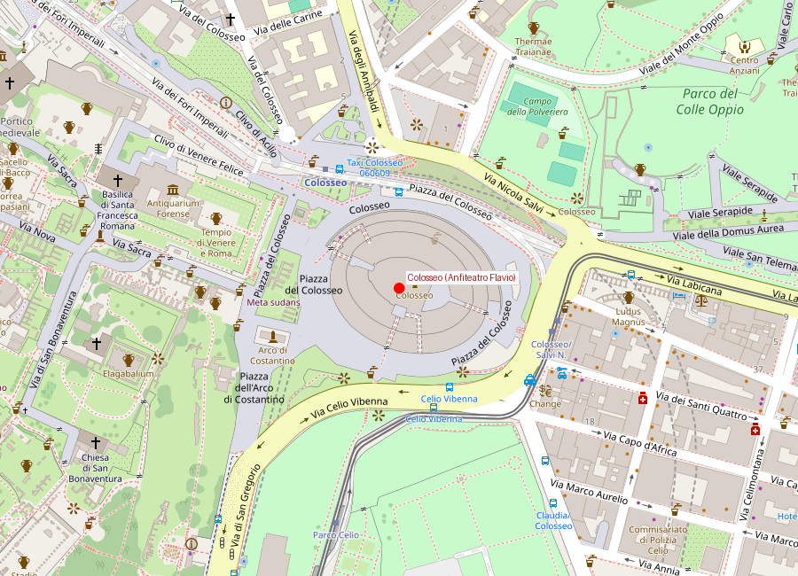
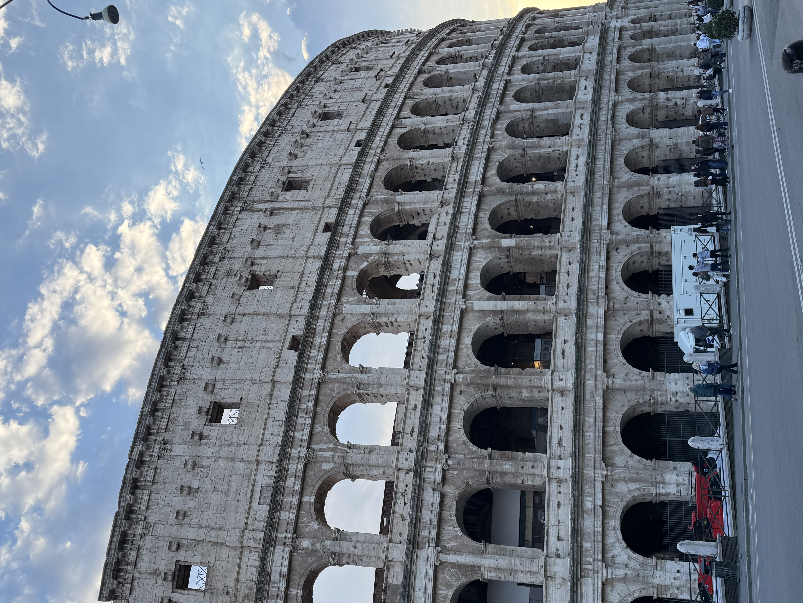
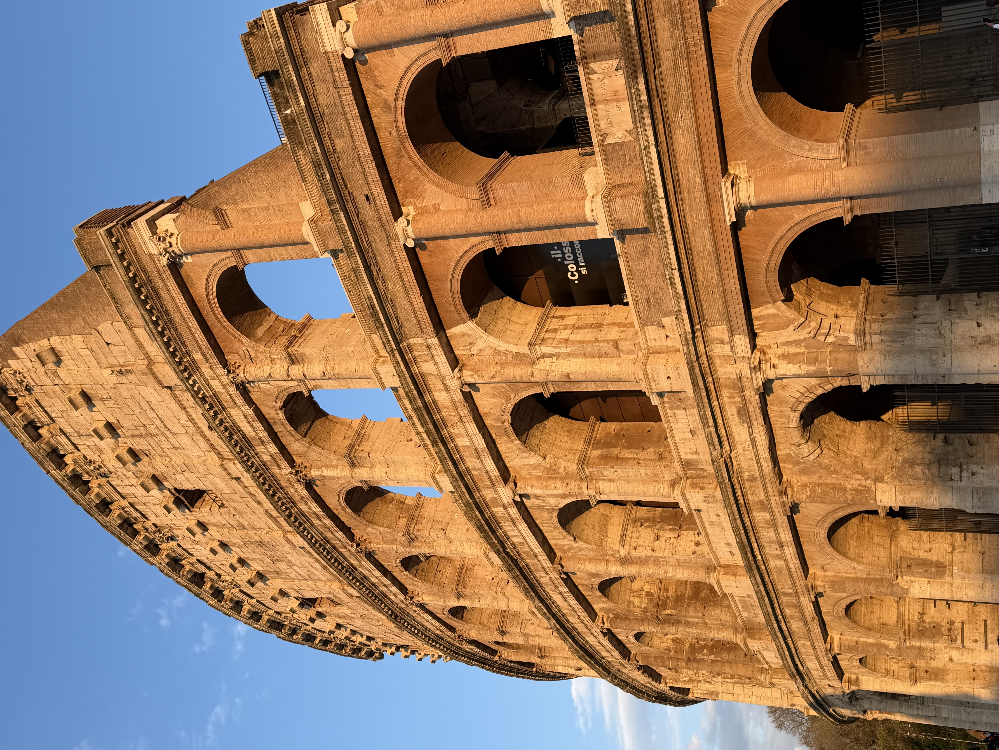

# Colosseo (Anfiteatro Flavio)

```yaml
lugar:
  nombre_original: "Colosseo (Anfiteatro Flavio)"
  pais: "Italia"
  fecha_visita: "2026-03-23/2026-03-30"
```

## Mapa


## Mapa en detalle


## Qué había antes

Antes del anfiteatro, este terreno formaba parte de los jardines y el lago artificial de la Domus Aurea de Nerón, el enorme palacio que se extendía desde el Palatino hasta el Esquilino. Tras el suicidio de Nerón en 68 d.C. y el caótico Año de los Cuatro Emperadores (68-69 d.C.), Vespasiano decidió drenar el lago y devolver al pueblo lo que Nerón se había apropiado. El gesto fue deliberado: donde antes había lujo privado de un tirano, habría entretenimiento público.

## Historia

### Línea de tiempo

| Fecha | Hito |
|---|---|
| 64 d.C. | Gran incendio de Roma; Nerón construye la Domus Aurea con su lago artificial en este lugar |
| 70-72 d.C. | Vespasiano ordena drenar el lago e iniciar la construcción del anfiteatro |
| 80 d.C. | Tito inaugura el Colosseo con 100 días de juegos, según las fuentes antiguas |
| 82 d.C. | Domiciano completa el último nivel (maenianum summum) y los hipogeos subterráneos |
| 217 d.C. | Un incendio grave daña la parte superior; las reparaciones se prolongan décadas |
| 443 y 484 d.C. | Terremotos dañan seriamente la estructura |
| 523 d.C. | Últimos espectáculos de venationes (cacerías) documentados |
| Siglos VI-XIV | Abandono gradual; se convierte en cantera de materiales, fortaleza y vivienda improvisada |
| 1349 | Un gran terremoto derrumba el lado sur exterior — los bloques se reutilizan en palacios e iglesias |
| 1749 | Benedicto XIV consagra el Colosseo como lugar sagrado por la tradición del martirio cristiano, frenando el expolio |
| 1804-1807 | Raffaele Stern y Giuseppe Valadier refuerzan los extremos con contrafuertes de ladrillo (aún visibles) |
| 1995 | Gran restauración moderna de la fachada norte |
| 2023 | Se anuncia el proyecto de reconstrucción de la arena (suelo retráctil) para devolver la planta al estado original |

### Narrativa

El Colosseo fue el instrumento más potente de propaganda que tuvo la dinastía Flavia. Vespasiano, un general sin linaje patricio, necesitaba legitimarse: ¿qué mejor que regalar al pueblo un anfiteatro colosal donde antes Nerón había construido su paraíso privado? El mensaje era claro — "nosotros gobernamos para Roma, no para nosotros mismos."

La construcción fue posible gracias a la mano de obra de prisioneros de la Guerra Judía (70 d.C.) y a la ingeniería romana de hormigón (*opus caementicium*) combinado con travertino de las canteras de Tibur (actual Tivoli). Se estima que se usaron unas 100.000 toneladas de travertino, transportadas por una calzada construida específicamente para la obra.

El anfiteatro funcionaba como una máquina social: las gradas estaban divididas por estatus legal — senadores en el podium, ciudadanos de clase ecuestre arriba, plebe más arriba, y mujeres y esclavos en el último nivel de madera. Los 76 arcos de acceso numerados (los *vomitoria*) permitían llenar y vaciar los 50.000-70.000 espectadores en minutos, un diseño de flujos que no se volvió a igualar hasta los estadios modernos.

Los hipogeos subterráneos, añadidos por Domiciano, contenían un sistema de montacargas y trampillas que permitían hacer aparecer animales y gladiadores desde el suelo de la arena — un efecto teatral que completaba el espectáculo.

## Qué se puede ver hoy

- **La fachada exterior**: solo sobrevive completa en el lado norte; los tres órdenes de arcadas (dórico, jónico, corintio) son un catálogo de arquitectura romana. En el lado sur se ven los contrafuertes de ladrillo de Stern y Valadier (principios del siglo XIX).
- **Los hipogeos**: abiertos al público desde 2010, permiten ver el sistema de túneles, celdas de animales y mecanismos de elevación bajo la arena.
- **El podium**: la zona más baja de gradas, donde se sentaban los senadores, con restos de inscripciones que reservaban asientos por nombre.
- **La cruz y las estaciones del Via Crucis**: instaladas desde el siglo XVIII por la consagración de Benedicto XIV.
- **El Arco di Costantino** (adyacente): arco triunfal del 315 d.C. que reutiliza relieves de monumentos de Trajano, Adriano y Marco Aurelio — un collage de propaganda imperial en sí mismo.
- **El terreno de la arena**: actualmente expuesto al nivel de los hipogeos; el proyecto de nuevo suelo retráctil busca devolver la experiencia visual del nivel original.

## Cultura y memoria

Durante la Edad Media, el Colosseo dejó de ser anfiteatro y se convirtió en cantera, fortaleza de la familia Frangipane, viviendas y talleres. Esa historia de expolio explica por qué gran parte de los palacios renacentistas de Roma contienen travertino del Colosseo — literalmente, la ciudad medieval y renacentista "construyó" Roma sobre Roma.

La tradición que asocia el lugar con el martirio cristiano es tardía (no hay evidencia firme antes del siglo XVI) pero fue decisiva para su conservación: al declararlo lugar sagrado, los papas detuvieron el desmantelamiento.

## Mitología y leyendas

Según la tradición medieval recogida por el Venerable Beda (siglo VIII), una profecía decía: *"Quamdiu stabit Coliseus, stabit et Roma; quando cadet Coliseus, cadet et Roma; quando cadet Roma, cadet et mundus"* — "Mientras el Coliseo esté en pie, Roma estará en pie; cuando caiga el Coliseo, caerá Roma; cuando caiga Roma, caerá el mundo." Esta frase, aunque probablemente apócrifa, resume el peso simbólico que el edificio ya tenía en la Alta Edad Media.

El nombre "Colosseo" se asocia tradicionalmente al Coloso de Nerón, una estatua de bronce de unos 30 metros que estuvo cerca del anfiteatro y que Adriano hizo trasladar con 24 elefantes.

## Conexiones

- Funciona narrativamente junto con [Foro Romano e Palatino](foro_romano_palatino.md) como un solo recorrido: mito fundacional, gobierno imperial y espectáculo público.
- Se relaciona con el Arco di Costantino, que muestra continuidad y reapropiación de símbolos imperiales.
- El travertino de su fachada conecta materialmente con Palazzo Venezia, Palazzo Barberini y la Basilica di San Pietro, construidos en parte con piedra extraída del anfiteatro.
- Con el [Monumento a Vittorio Emanuele II](monumento_vittorio_emanuele_ii.md): la Roma antigua como telón de fondo de la nueva nación.

## Datos interesantes

- Se estima que entre 400.000 y 700.000 personas murieron en los juegos a lo largo de los siglos, aunque estas cifras son muy difíciles de verificar. [⚠ VERIFICAR]
- El velarium, una enorme lona manejada por marineros de la flota de Miseno, cubría a los espectadores del sol. Sus anclajes de piedra son visibles en la cornisa superior.
- En los juegos inaugurales de Tito, según Dión Casio, se sacrificaron 9.000 animales en 100 días.
- El sistema de vomitoria y escaleras permitía evacuar a decenas de miles de personas con una rapidez que los estadios modernos apenas igualan.
- Debajo de la arena, los montacargas podían elevar animales y decorados completos al nivel del suelo en segundos.

## Fotos


*Fachada exterior del Colosseo — los tres órdenes superpuestos de arcos (dórico, jónico, corintio) con el ático ciego superior son claramente visibles. Los contrafuertes de ladrillo de Stern y Valadier (principios del siglo XIX) refuerzan el extremo que sobrevivió al terremoto de 1349.*


*Vista del interior del Colosseo con los hipogeos expuestos — la red de túneles, celdas y montacargas bajo la arena donde se preparaban gladiadores, animales y escenografías antes de ser elevados al nivel del espectáculo.*

fuente: Parco archeologico del Colosseo (parcocolosseo.it); UNESCO World Heritage Centre, ref. 91 (whc.unesco.org/en/list/91); Enciclopedia Treccani (treccani.it); Keith Hopkins & Mary Beard, *The Colosseum*, Profile Books; Dión Casio, *Historia Romana*, Libro LXVI
