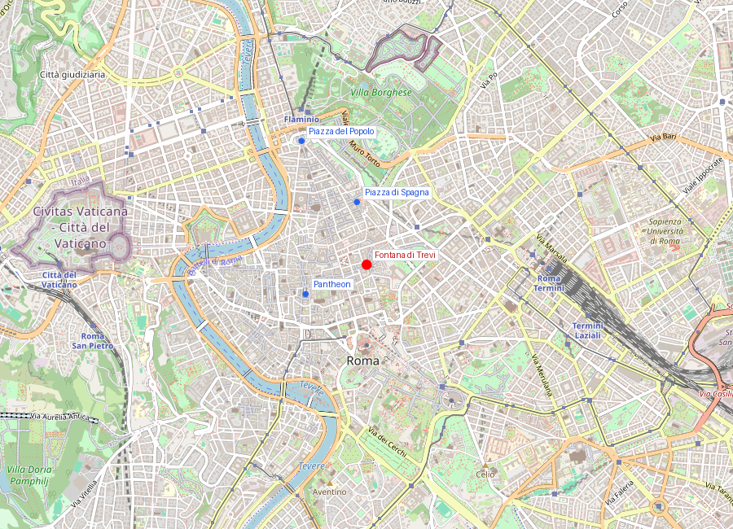
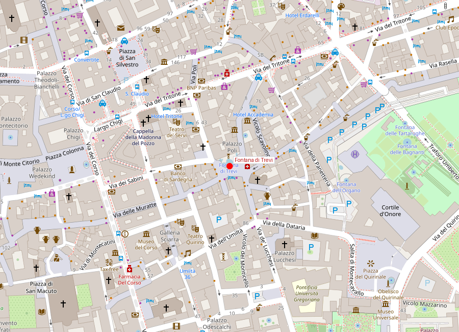
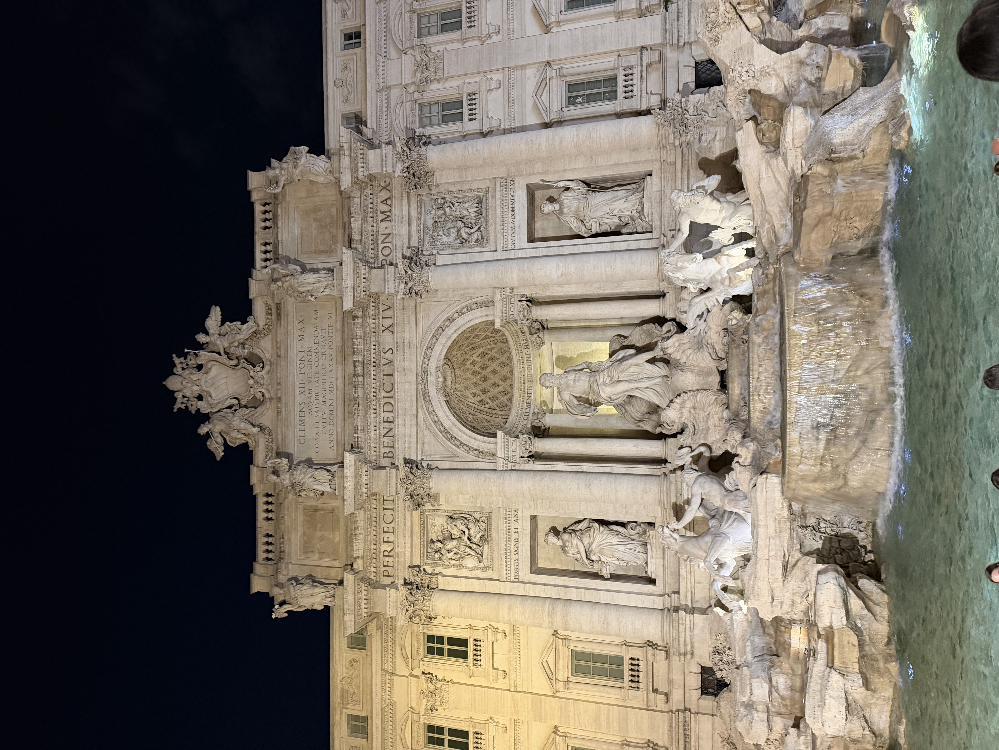

# Fontana di Trevi

```yaml
lugar:
  nombre_original: "Fontana di Trevi"
  pais: "Italia"
  fecha_visita: "2026-03-23/2026-03-30"
```

## Mapa


## Mapa en detalle


## Qué había antes

El lugar de Trevi fue durante siglos el punto terminal del Acqua Vergine (Aqua Virgo), un acueducto inaugurado por Agripa en el 19 a.C. para alimentar sus termas en el Campo de Marte. El nombre "Vergine" proviene, según la leyenda transmitida por Frontino, de una joven virgen que indicó el manantial a unos soldados sedientos en las afueras de Roma. Antes de la fuente monumental barroca, hubo una modesta salida de agua adosada a un muro que funcionó durante siglos. En 1453, el papa Nicolás V encargó a Leon Battista Alberti una primera fuente decorativa, pequeña y sencilla. Esa fuente estuvo en uso durante casi 300 años antes de ser reemplazada por el proyecto monumental actual.

## Historia

### Línea de tiempo

| Fecha | Hito |
|---|---|
| 19 a.C. | Agripa inaugura el Aqua Virgo, el acueducto que alimenta la fuente hasta hoy |
| Siglo VI d.C. | Los godos cortan varios acueductos de Roma; el Aqua Virgo sobrevive por ser en gran parte subterráneo |
| 1453 | Nicolás V encarga a Leon Battista Alberti una primera fuente terminal, modesta |
| 1629 | Urbano VIII Barberini encarga a Bernini un proyecto monumental; queda inconcluso tras la muerte del papa |
| 1730 | Clemente XII convoca un concurso; el proyecto ganador es de Nicola Salvi |
| 1732 | Comienzan las obras según el diseño de Salvi, usando la fachada del Palazzo Poli como telón |
| 1751 | Muere Nicola Salvi sin ver la fuente terminada |
| 1762 | Giuseppe Pannini completa la fuente bajo Clemente XIII; inauguración oficial |
| 1998 | Gran restauración que recupera la blancura del travertino |
| 2015-2016 | Restauración patrocinada por Fendi; la fuente se desvía temporalmente por una pasarela sobre la piscina vacía |

### Narrativa

La Fontana di Trevi es un ejercicio de urbanismo barroco de máxima ambición: convertir una pared medianera de un palacio en un escenario teatral con agua, roca y escultura. Salvi no solo diseñó una fuente — diseñó una experiencia de sorpresa. La plaza es pequeña y las calles que llegan a ella son estrechas; el visitante escucha la fuente antes de verla, y al girar una esquina la encuentra ocupando todo el campo visual. Esa escenografía de "revelación" es deliberada.

El agua que cae en la piscina viene del mismo acueducto que Agripa construyó hace más de 2.000 años. El Aqua Virgo — renombrado Acqua Vergine en italiano — es el único acueducto romano que ha funcionado de forma prácticamente continua desde la Antigüedad. Sobrevivió a las destrucciones godas del siglo VI porque su recorrido es mayoritariamente subterráneo (a diferencia de los acueductos elevados sobre arcadas, que fueron objetivos fáciles).

La figura central, a menudo identificada popularmente como Neptuno, es en realidad Oceanus — la personificación del océano —, montado en una concha tirada por caballos marinos guiados por tritones. Los dos caballos representan los estados del mar: uno agitado, otro manso. Las alegorías laterales son la Abundancia (con cuerno) y la Salubridad (con copa y serpiente), ambas en nichos flanqueando a Oceanus.

## Mitología y leyendas

La leyenda fundacional del acueducto cuenta que unos soldados romanos, sedientos en las afueras de Roma, fueron guiados hasta un manantial por una joven virgen (*virgo*). La historia, recogida por Frontino en su tratado *De Aquaeductu*, dio nombre al acueducto y, 2.000 años después, sigue dando nombre al agua que alimenta Trevi.

La tradición de arrojar monedas — una moneda con la mano derecha sobre el hombro izquierdo para asegurar el regreso a Roma — se popularizó sobre todo a partir de la película *Three Coins in the Fountain* (1954), aunque prácticas similares de ofrenda a fuentes existen desde la Antigüedad romana. Se estima que se recogen unos 3.000 euros diarios en monedas, que se destinan a la organización benéfica Caritas. [⚠ VERIFICAR]

## Qué se puede ver hoy

- **La fachada-fuente**: ocupa toda la pared del Palazzo Poli. El efecto de roca natural (travertino labrado como arrecife) surgiendo de un palacio clásico es el corazón del diseño barroco.
- **Oceanus en el nicho central**: la estatua principal es de Pietro Bracci (no de Salvi), completada después de la muerte del arquitecto.
- **Los bajorrelieves superiores**: representan a Agripa ordenando la construcción del acueducto y a la virgen señalando el manantial.
- **Los caballos marinos**: el caballo agitado (a la izquierda del espectador) y el caballo manso (a la derecha), con sus tritones.
- **La piscina**: el agua color turquesa sobre el fondo claro de travertino. La profundidad es de unos 50 cm.
- **Las monedas en el fondo**: miles de monedas visibles en todo momento.

## Cultura y simbolismo

La composición central combina mitología clásica y propaganda papal: los papas, al restaurar los acueductos romanos, se presentaban como herederos legítimos del poder imperial. Cada fuente terminal de acueducto (Trevi para el Acqua Vergine, el Fontanone del Gianicolo para el Acqua Paola, la Fontana del Mosè para el Acqua Felice) era una declaración de capacidad de gobierno.

La fuente es también un hito del cine: la escena de Anita Ekberg bañándose en Trevi en *La Dolce Vita* (1960) de Federico Fellini la convirtió en símbolo del hedonismo romano y de una cierta idea de Italia.

## Conexiones

- Se relaciona con otras fuentes terminales de acueducto en Roma: el Fontanone del Gianicolo (Acqua Paola) y la Fontana del Mosè (Acqua Felice) — las tres cuentan la misma historia de papas que restauran infraestructura antigua.
- Dialoga con la Fontana della Barcaccia en [Piazza di Spagna](piazza_di_spagna.md) y con la Fontana dei Quattro Fiumi en Piazza Navona dentro de la lógica de la ciudad-escenario barroca.
- El acueducto Acqua Vergine conecta materialmente Trevi con la Roma de Agripa y el [Pantheon](pantheon.md), construidos por el mismo hombre.
- Dentro del circuito de plazas barrocas del centro histórico.

## Datos interesantes

- El Aqua Virgo/Acqua Vergine ha funcionado de forma casi continua durante más de 2.000 años — es probablemente la infraestructura hidráulica activa más antigua de Europa.
- Se recogen aproximadamente 1 millón de euros al año en monedas arrojadas a la fuente. [⚠ VERIFICAR]
- Nicola Salvi murió antes de ver su obra terminada; la estatua central de Oceanus fue tallada por Pietro Bracci como reemplazo del diseño original.
- La fuente tardó 30 años en completarse (1732-1762).
- El nombre "Trevi" viene probablemente de *tre vie* (tres calles), por las tres vías que confluyen en la plaza.

## Fotos


*La Fontana di Trevi en toda su escala monumental — la fachada del Palazzo Poli sirve como telón de fondo a la composición barroca con Oceanus en el nicho central, flanqueado por las alegorías de la Abundancia y la Salubridad. El agua del Acqua Vergine, activo desde el 19 a.C., sigue alimentando la fuente.*

fuente: Turismo Roma (turismoroma.it); Soprintendenza Speciale di Roma (soprintendenzaspecialeroma.it); Treccani (treccani.it); Frontino, *De Aquaeductu Urbis Romae*; Pinto, *The Trevi Fountain*, Yale University Press
