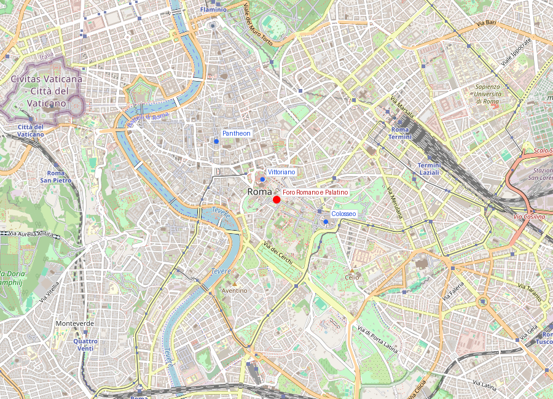
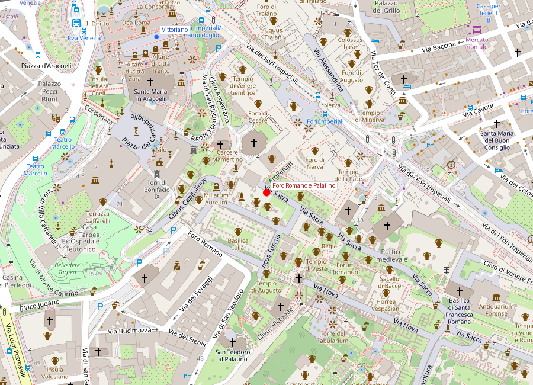

# Foro Romano e Palatino

```yaml
lugar:
  nombre_original: "Foro Romano e Palatino"
  pais: "Italia"
  fecha_visita: "2026-03-23/2026-03-30"
```

## Mapa


## Mapa en detalle


## Qué había antes

El valle del Foro fue originalmente una zona pantanosa e inundable entre las colinas del Palatino, Capitolino y Esquilino. Antes de convertirse en centro cívico, sirvió como necrópolis para las aldeas de las colinas circundantes (restos de tumbas del siglo X-IX a.C. han sido excavados bajo el pavimento del Foro). La tradición atribuye a los reyes etruscos de Roma — especialmente a Tarquinio Prisco — la construcción de la Cloaca Maxima, el gran colector que drenó el pantano y convirtió el valle en espacio utilizable. El Palatino, por su parte, fue una de las primeras colinas habitadas, con restos de cabañas de la Edad del Hierro (siglos IX-VIII a.C.) que la tradición asocia a la cabaña de Rómulo.

## Historia

### Línea de tiempo

| Fecha | Hito |
|---|---|
| Siglos X-IX a.C. | Necrópolis en el valle; primeras cabañas en el Palatino |
| ~600 a.C. | Drenaje del valle (Cloaca Maxima); el Foro empieza a funcionar como espacio público |
| 509 a.C. | Caída de la monarquía; el Foro se convierte en centro de la República — la Curia y los Rostra se consolidan |
| 497 a.C. | Consagración del Tempio di Saturno, uno de los más antiguos del Foro |
| 179 a.C. | Construcción de la Basilica Aemilia, centro de negocios y justicia |
| 46-44 a.C. | César reforma el Foro; inicia la Basilica Iulia; su asesinato ocurre en la Curia de Pompeyo (no en el Foro, pero el funeral sí se celebra aquí) |
| 29 a.C. | Augusto dedica el Tempio del Divo Giulio en el lugar de la cremación de César |
| 27 a.C.-14 d.C. | Augusto convierte el Palatino en residencia imperial; construye la Casa di Augusto y el Tempio di Apollo Palatino |
| 64 d.C. | El gran incendio daña partes del Foro; Nerón extiende la Domus Aurea desde el Palatino |
| 81 d.C. | Se erige el Arco di Tito en la Via Sacra para conmemorar la conquista de Jerusalén |
| 141 d.C. | Antonino Pío dedica el Tempio di Antonino e Faustina (hoy iglesia de San Lorenzo in Miranda) |
| 203 d.C. | Se construye el Arco di Settimio Severo |
| 283 d.C. | Incendio destruye la Curia; Diocleciano la reconstruye (la estructura actual) |
| 608 d.C. | Se erige la Colonna di Foca — último monumento romano añadido al Foro |
| Siglos VII-XV | Abandono progresivo; el Foro se entierra bajo sedimentos y se conoce como "Campo Vaccino" (campo de vacas) |
| 1803-1819 | Primeras excavaciones sistemáticas bajo Carlo Fea y Antonio Nibby |
| 1870-1900 | Excavaciones masivas tras la unificación italiana desentierran la mayor parte del Foro visible hoy |
| 1907 | Giacomo Boni excava el Lapis Niger y la necrópolis arcaica |

### Narrativa

La fuerza del Foro Romano está en su larga duración: no representa un momento, sino un palimpsesto de más de mil años de transformación. En un espacio relativamente pequeño se superponen templos de la República, basílicas de César y Augusto, arcos triunfales de la era imperial y la última columna honorífica del 608 d.C. Cada capa contradice, modifica o absorbe a la anterior.

El Palatino añade la dimensión del poder personal. Augusto, que se presentaba como ciudadano modelo, eligió vivir en el Palatino no por casualidad: era la colina del mito fundacional, la de Rómulo. Su "modesta" casa estaba conectada directamente con el Tempio di Apollo Palatino, haciendo del espacio doméstico un espacio sagrado. Sus sucesores — Tiberio, Calígula, Domiciano — fueron menos sutiles: la Domus Augustana de Domiciano convirtió toda la cima en un palacio monumental cuyas dimensiones aún impresionan.

## Mitología y leyendas

Según la tradición romana transmitida por Livio y Virgilio, el Palatino es donde Faustulo encontró a Rómulo y Remo amamantados por la loba en la cueva del Lupercal. En 2007, arqueólogos anunciaron haber encontrado una cueva decorada bajo la Casa di Augusto que podría ser el Lupercal, aunque la identificación sigue debatida. [⚠ VERIFICAR]

El Lapis Niger (piedra negra) en el Foro, excavado por Giacomo Boni en 1899, marca según la tradición el lugar de la tumba de Rómulo o de su padre adoptivo Faustulo. Contiene una de las inscripciones en latín más antiguas conocidas (siglo VI a.C.).

En el Foro también se encontraba el Lacus Curtius, donde según la leyenda el joven Marco Curcio se sacrificó arrojándose a una grieta en la tierra para salvar a Roma, montado en su caballo y con armadura completa.

## Qué se puede ver hoy

**En el Foro Romano:**
- **Via Sacra**: la calle procesional que conecta todo el recorrido, desde el Arco di Tito hasta el Arco di Settimio Severo.
- **Tempio di Saturno**: ocho columnas del pórtico, icono visual del Foro. Funcionaba como tesoro público (*aerarium*).
- **Arco di Settimio Severo** (203 d.C.): bien conservado, con relieves de campañas contra los partos.
- **Curia Iulia**: la sede del Senado, reconstruida por Diocleciano. Interior sobrio y sorprendentemente intacto gracias a su conversión en iglesia en el siglo VII.
- **Tempio di Antonino e Faustina**: la fusión más visible de Roma antigua y cristiana — columnas corintias del siglo II d.C. con fachada barroca de la iglesia de San Lorenzo in Miranda.
- **Basilica di Massenzio**: las tres enormes bóvedas de la nave lateral norte son lo más imponente que queda en pie. Permiten imaginar la escala original del edificio más grande del Foro.
- **Arco di Tito**: en el extremo oriental, con el famoso relieve del botín del Templo de Jerusalén (la menorá).
- **Colonna di Foca** (608 d.C.): columna solitaria, último monumento del Foro clásico.

**En el Palatino:**
- **Casa di Augusto y Casa di Livia**: frescos del siglo I a.C. con colores sorprendentemente vivos — rojos, azules, amarillos.
- **Domus Augustana / Domus Flavia**: el enorme complejo palacial de Domiciano. La planta baja del peristilo permite entender la escala del poder imperial.
- **Stadio Palatino**: un recinto alargado (no un estadio deportivo) que servía como jardín privado imperial.
- **Orti Farnesiani**: jardines renacentistas de los Farnese superpuestos a las ruinas; uno de los primeros jardines botánicos de Europa.
- **Mirador sobre el Foro**: desde el borde norte del Palatino se obtiene la mejor vista panorámica del conjunto del Foro.
- **Museo Palatino**: piezas arqueológicas del Palatino, incluyendo fragmentos de frescos y esculturas.

## Cultura

Recorrer el Foro permite ver cómo la vida pública romana mezclaba religión, justicia y política en un mismo escenario urbano. La Via Sacra era, a la vez, ruta de triunfos militares, procesiones religiosas y eje de memoria estatal. El propio nombre del Palatino dio origen a la palabra "palacio" en múltiples lenguas europeas (palatium → palazzo, palace, palais, palacio).

El período como "Campo Vaccino" — cuando el Foro estaba sepultado bajo metros de tierra y servía como pasto para ganado — fue pintado por artistas del Grand Tour y resulta casi inverosímil visto desde hoy. Pinturas de Canaletto y Giovanni Battista Piranesi muestran columnas emergiendo entre vacas y carros.

## Conexiones

- Conecta de forma directa con [Colosseo](colosseo.md) y el Arco di Costantino en el extremo oriental.
- Desde el Palatino se domina el Circo Máximo al sur.
- Dialoga con el Campidoglio moderno (diseño de Michelangelo), donde se reinterpretó la herencia clásica en época renacentista.
- El [Monumento a Vittorio Emanuele II](monumento_vittorio_emanuele_ii.md) se levanta al otro lado del Capitolino, mirando hacia el Foro — la nación moderna contemplando su origen antiguo.
- Las excavaciones del siglo XIX conectan con el espíritu del Risorgimento: desenterrar Roma era desenterrar la identidad italiana.

## Datos interesantes

- El término "palacio" en varias lenguas europeas deriva de *Palatium*, el nombre de la colina.
- Muchos restos visibles hoy son fruto de restauraciones y excavaciones de los siglos XIX y XX; el Foro "tal como se ve" es en parte una construcción arqueológica moderna.
- La Cloaca Maxima, construida hacia el 600 a.C. para drenar el valle, sigue activa como parte del sistema de alcantarillado de Roma.
- En la Basilica Iulia se han encontrado tableros de juego grabados en el pavimento por ciudadanos romanos que esperaban su turno en los tribunales.
- El incendio funerario de Julio César en el Foro fue tan intenso que algunas tiendas cercanas ardieron. Augusto construyó un templo exactamente en el lugar de la pira.

fuente: Parco archeologico del Colosseo (parcocolosseo.it); Sovrintendenza Capitolina ai Beni Culturali (sovraintendenzaroma.it); Treccani (treccani.it); Filippo Coarelli, *Il Foro Romano*, Quasar; Andrea Carandini, *La nascita di Roma*
