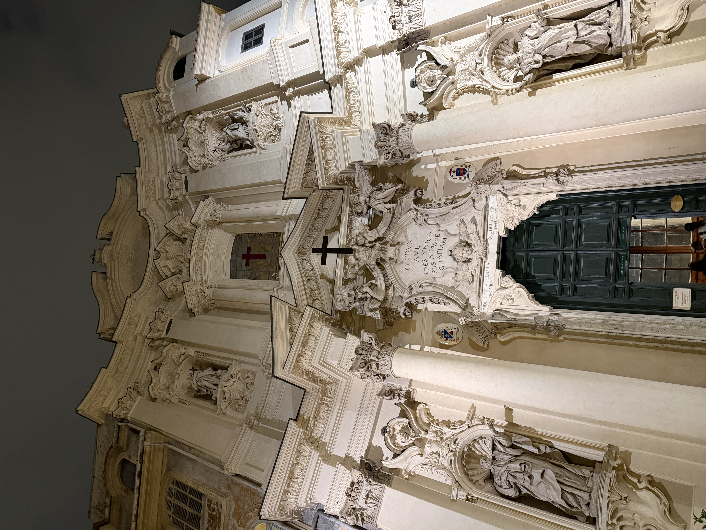

# Iglesias de Roma

```yaml
lugar:
  nombre_original: "Chiese di Roma"
  pais: "Italia"
  fecha_visita: "2026-03-23/2026-03-30"
```

Roma es, probablemente, la ciudad con mayor densidad de iglesias del mundo. Se estiman más de 900 iglesias dentro de los límites comunales, un paisaje arquitectónico y espiritual que abarca desde basílicas paleocristianas del siglo IV hasta capillas barrocas del XVII. Cada una lleva inscrita la historia de algún papa, algún santo, algún mecenas o algún gremio que quiso dejar su marca en la ciudad eterna.

## Contexto histórico

La construcción de iglesias en Roma empezó inmediatamente después del Edicto de Milán (313 d.C.), cuando Constantino legalizó el cristianismo. Las primeras grandes basílicas — San Giovanni in Laterano, San Pietro, San Paolo fuori le Mura y Santa Maria Maggiore — establecieron el modelo de "basílica mayor" que perdura hasta hoy. A partir del Renacimiento y especialmente durante la Contrarreforma (siglo XVI-XVII), la ciudad se llenó de iglesias diseñadas para impresionar: fachadas monumentales, interiores recubiertos de mármol, frescos de los maestros y un despliegue de arte sacro sin equivalente en ninguna otra ciudad.

Lo notable es que muchas de estas iglesias contienen obras maestras que en cualquier otro lugar serían la pieza central de un museo: Caravaggio en Santa Maria del Popolo y San Luigi dei Francesi, Bernini en Sant'Andrea al Quirinale, Michelangelo en San Pietro in Vincoli (el Moisés). En Roma, estas obras están a la vista de cualquiera que entre — gratis — a los templos que las albergan.

## Iglesias visitadas

### Fotos


*Iglesia visitada durante el recorrido por Roma.*

## Conexiones

- Las cuatro basílicas papales mayores — San Giovanni in Laterano, San Pietro, San Paolo fuori le Mura y [Basilica di Santa Maria Maggiore](basilica_santa_maria_maggiore.md) — tienen estatus de extraterritorialidad (propiedad de la Santa Sede dentro de Italia).
- Muchas iglesias romanas se construyeron reutilizando columnas y materiales del [Foro Romano](foro_romano_palatino.md) y otros monumentos antiguos, una práctica que desdibuja la línea entre destrucción y preservación.
- La Piazza del Popolo alberga dos de las llamadas "iglesias gemelas" (Santa Maria dei Miracoli y Santa Maria in Montesanto), diseñadas por Rainaldi y completadas por Bernini, como se describe en [Piazza del Popolo](piazza_del_popolo.md).

## Datos interesantes

- De las más de 900 iglesias de Roma, solo cuatro tienen el rango de "basílica papal mayor". Las demás se clasifican como basílicas menores, iglesias titulares (asignadas a cardenales) o simples parroquias.
- Muchas iglesias romanas están construidas sobre templos paganos anteriores. El [Pantheon](pantheon.md) mismo es técnicamente una iglesia (Basilica di Santa Maria ad Martyres) desde el año 609 d.C.
- La tradición del "giro delle sette chiese" (peregrinación de las siete iglesias), instituida por San Felipe Neri en el siglo XVI, sigue siendo una devoción popular en Roma.

fuente: Vicariato di Roma (diocesidiroma.it); Touring Club Italiano, *Roma e dintorni*; UNESCO World Heritage Centre, ref. 91
