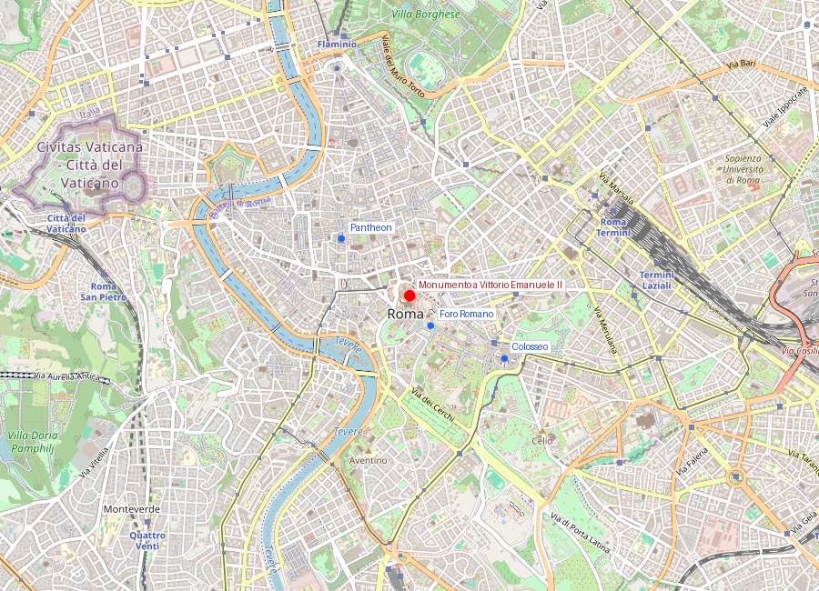
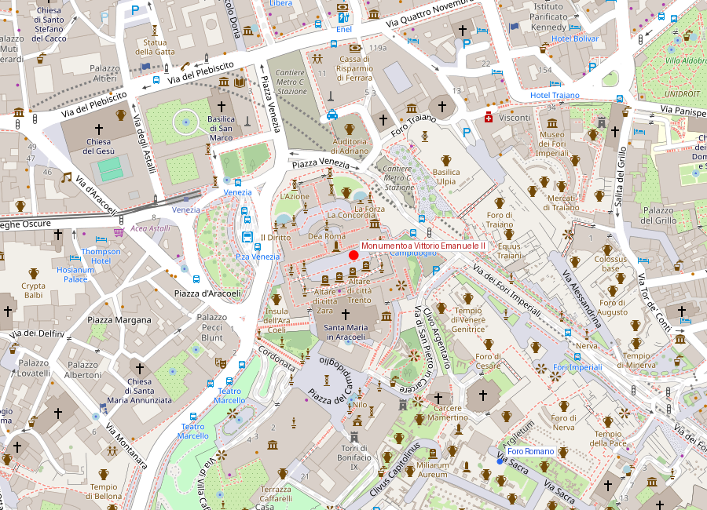

# Monumento a Vittorio Emanuele II (Vittoriano / Altare della Patria)

```yaml
lugar:
  nombre_original: "Monumento a Vittorio Emanuele II"
  pais: "Italia"
  fecha_visita: "2026-03-23/2026-03-30"
```

## Mapa


## Mapa en detalle


## Qué había antes

El Vittoriano se levantó demoliendo un barrio medieval entero en la ladera norte del Campidoglio. Se sacrificaron la torre de Paolo III, el convento de Aracoeli, casas medievales, una parte del jardín del Convento de los Franciscanos y restos arqueológicos de un templo romano. La demolición fue polémica ya entonces: se destruyó tejido urbano histórico para construir un monumento que celebrara una Italia recién unificada. El Campidoglio, justo detrás, ya era el centro simbólico de Roma desde la Antigüedad (el Capitolium) y había sido rediseñado por Michelangelo en el siglo XVI.

## Historia

### Línea de tiempo

| Fecha | Hito |
|---|---|
| 1878 | Muere Vittorio Emanuele II, primer rey de la Italia unificada; se decide erigir un monumento nacional |
| 1880 | Concurso internacional de diseño; se presentan 98 proyectos |
| 1884 | Segundo concurso, restringido; gana Giuseppe Sacconi con un diseño neoclásico de mármol blanco |
| 1885 | Inicio de las demoliciones del barrio medieval en la ladera del Campidoglio |
| 1889 | Colocación de la primera piedra por Umberto I |
| 1911 | Inauguración parcial con ocasión del 50° aniversario de la unificación, aunque las obras continúan |
| 1921 | Se traslada al monumento el cuerpo del Milite Ignoto (soldado desconocido de la Primera Guerra Mundial), elegido por Maria Bergamas entre 11 féretros anónimos |
| 1935 | Se completan las cuadrigas de bronce en la cuspide |
| 2007 | Se instalan los ascensores panorámicos que permiten subir a la terraza superior (Terrazza delle Quadrighe) |

### Narrativa

El Vittoriano es, ante todo, un edificio de ansiedad. Italia se unificó en 1861, un proceso lento, sangriento y todavía incompleto cuando Vittorio Emanuele II murió en 1878. La nueva nación — fragmentada en dialectos, tradiciones y lealtades locales — necesitaba un símbolo unificador comparabre a los que tenían Francia (el Arco de Triunfo) o Alemania (el Niederwalddenkmal). El monumento debía ser tan grande como la ambición; y lo fue.

Giuseppe Sacconi diseñó una montaña de mármol botticino de Brescia (no *romano* — un detalle que los romanos nunca perdonaron del todo) con escalinatas, columnatas, estatuas alegóricas y un altar central. Es deliberadamente una cita de los santuarios helenísticos de Pergamo y Praeneste (Palestrina), reinterpretados en clave de religión civil moderna.

El momento que transformó el monumento de homenaje real a santuario de la nación fue 1921. Tras la Primera Guerra Mundial, se eligió un soldado desconocido entre 11 cuerpos no identificados procedentes de 11 frentes de batalla. Maria Bergamas, madre de un soldado caído cuyo cuerpo nunca se recuperó, fue elegida para señalar uno de los féretros. Lo hizo desplomándose llorando sobre el segundo ataúd. Desde entonces, el Altare della Patria es el centro de las ceremonias de Estado y la llama eterna arde permanentemente custodiada por dos soldados.

## Qué se puede ver hoy

- **La escalinata central y el Altare della Patria**: la Tumba del Milite Ignoto con la llama eterna y guardia permanente. El 2 de junio (Festa della Repubblica) y el 4 de noviembre se celebran aquí las ceremonias de Estado.
- **La estatua ecuestre de Vittorio Emanuele II**: 12 metros de altura, en bronce dorado, sobre un enorme pedestal con relieves de las ciudades italianas.
- **Las alegorías de las regiones**: 16 estatuas que representan las regiones de Italia en la balaustrada, revelando la obsesión unitaria del proyecto.
- **La Terrazza delle Quadrighe**: accesible por ascensor panorámico (desde 2007); ofrece la mejor vista 360° de Roma — desde la cúpula de San Pietro hasta el Colosseo, con el Foro Romano directamente debajo.
- **El Museo del Risorgimento**: dentro del monumento, narra la historia de la unificación italiana con documentos, uniformes y objetos originales.
- **El Sacrario delle Bandiere**: colección de banderas de guerra del ejército italiano.
- **Los propileos**: las dos estructuras laterales con las cuadrigas de bronce de la Unidad y la Libertad en la cúspide.

## Cultura y memoria cívica

Desde 1921, el Vittoriano funciona como el centro de la religión civil italiana. La Tumba del Milite Ignoto es el equivalente italiano del Tomb of the Unknown Soldier en Arlington o del soldado desconocido bajo el Arco de Triunfo de París.

El edificio divide opiniones: los romanos lo llaman con ironía *"la macchina da scrivere"* (la máquina de escribir) o *"la torta nuziale"* (la tarta de bodas) por su blancura y sus líneas horizontales que contrastan con el travertino dorado del tejido romano circundante. Pero su función ceremonial lo ha hecho intocable.

## Conexiones

- Enlaza físicamente con Piazza Venezia y el entorno del Campidoglio (Michelangelo). Desde la terraza se entiende la relación: el poder imperial romano (Foro), el poder medieval-renacentista (Campidoglio) y el poder nacional moderno (Vittoriano) en tres niveles.
- Dialoga con el [Foro Romano](foro_romano_palatino.md) y el [Colosseo](colosseo.md): la Roma antigua como telón de fondo de la memoria nacional moderna.
- Se conecta conceptualmente con [Piazza del Popolo](piazza_del_popolo.md): ambos son nodos de la Roma monumental unitaria.
- El mármol botticino lo diferencia materialmente del travertino romano que domina el centro histórico — una disonancia que es parte de la identidad del edificio.

## Datos interesantes

- Su perfil en mármol blanco lo hace uno de los edificios más discutidos y visibles del centro histórico, precisamente por el contraste con el tejido preexistente.
- Las cuadrigas de la cúspide son tan grandes que durante su montaje se celebró un banquete dentro del vientre de uno de los caballos.
- El mármol botticino de Brescia fue elegido por su blancura; con el tiempo amarillea menos que el travertino, lo que acentúa el contraste visual.
- Desde la Terrazza delle Quadrighe se obtiene la única vista de Roma donde se ven simultáneamente el Colosseo, el Foro, las cúpulas barrocas del centro y San Pietro.
- La elección del Milite Ignoto en 1921 fue retransmitida en todo el país; Maria Bergamas se convirtió en símbolo del duelo nacional.

fuente: VIVE - Vittoriano e Palazzo Venezia (vive.cultura.gov.it); Istituto per la storia del Risorgimento italiano; Ministero della Cultura; Bruno Tobia, *L'Altare della Patria*, Il Mulino
