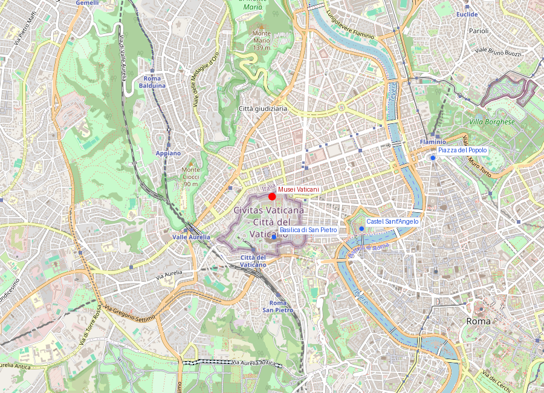
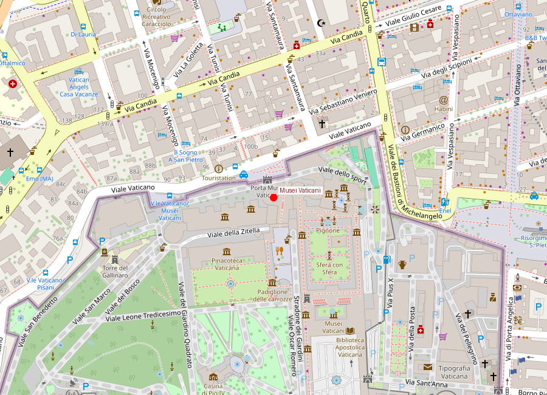
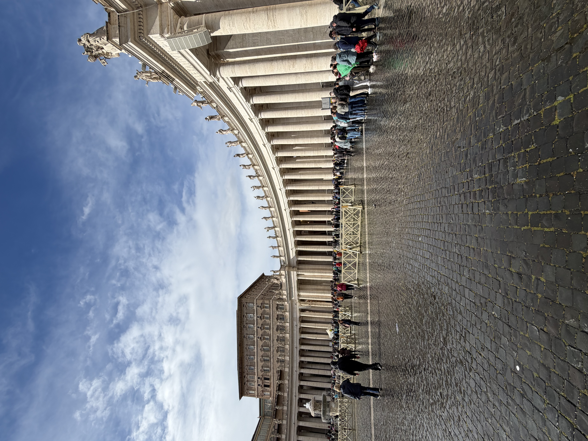

# Musei Vaticani

```yaml
lugar:
  nombre_original: "Musei Vaticani"
  pais: "Ciudad del Vaticano"
  fecha_visita: "2026-03-23/2026-03-30"
```

## Mapa


## Mapa en detalle


## Qué había antes

El terreno de los Musei Vaticani ocupa la Colina Vaticana (*Mons Vaticanus*), que en la Antigüedad era una zona periférica fuera del *pomerium* (límite sagrado) de Roma. Estaba ocupada por jardines, villas y una necrópolis. Calígula construyó aquí un circo privado que Nerón amplió — el Circo de Nerón —, donde según la tradición cristiana fue martirizado san Pedro alrededor del 64 d.C. Constantino construyó la primera basílica de San Pedro sobre la tumba del apóstol hacia el 320 d.C. Los palacios papales se fueron extendiendo a partir del regreso de los papas de Aviñón (1377), y las colecciones de arte fueron acumulándose en estos palacios a lo largo de los siglos siguientes.

## Historia

### Línea de tiempo

| Fecha | Hito |
|---|---|
| Siglo I d.C. | Circo de Calígula y Nerón; necrópolis en la Colina Vaticana |
| ~64 d.C. | Según la tradición, martirio de san Pedro en el circo neroniano |
| ~320 d.C. | Constantino construye la primera basílica de San Pedro |
| 1377 | Los papas regresan de Aviñón y se instalan definitivamente en el Vaticano |
| 1473 | Sixto IV manda construir la Cappella Sistina |
| 1480-1482 | Botticelli, Perugino, Ghirlandaio y otros pintan los muros laterales de la Sistina |
| 1503-1513 | Julio II inicia las colecciones vaticanas: adquiere el Laocoonte (1506) y el Apolo del Belvedere; encarga a Bramante el Cortile del Belvedere; Rafael comienza las Stanze |
| 1508-1512 | Michelangelo pinta el techo de la Cappella Sistina |
| 1534-1541 | Michelangelo pinta el Juicio Final en la pared del altar de la Sistina |
| 1756-1771 | Clemente XIV y Pío VI crean el Museo Pio-Clementino, primer museo público del Vaticano |
| 1797 | Napoleón se lleva cientos de obras maestras a París (Tratado de Tolentino); muchas regresan tras 1815 |
| 1816 | Canova negocia la devolución de las obras; se crea la Pinacoteca Vaticana |
| 1837 | Gregorio XVI funda el Museo Etrusco y el Museo Egizio |
| 1932 | Pío XI inaugura la nueva Pinacoteca en un edificio dedicado |
| 1973 | Se abre la Collezione d'Arte Religiosa Moderna, con obras de Matisse, Dalí, Francis Bacon |
| 2000 | Restauración de la Cappella Sistina completada (controvertida por la limpieza de los frescos) |

### Narrativa

Los Musei Vaticani no son un museo: son una ciudad dentro de una ciudad, con 7 kilómetros de recorrido, 20.000 obras expuestas (de un patrimonio estimado en más de 70.000) y una acumulación de espacios que refleja cinco siglos de papas compitiendo entre sí por dejar su marca.

Todo empezó con Julio II, el "papa guerrero" que en 1506 compró el Laocoonte — desenterrado ese mismo año en una viña del Esquilino — y lo instaló en el Cortile del Belvedere. Esa compra señaló una política: el papado se presentaría como heredero y custodio de la cultura clásica. Julio II no se detuvo ahí: contrató a Bramante para diseñar el corredor que uniera los palacios medievales con el Belvedere, encargó a Rafael la decoración de sus apartamentos privados (las Stanze), y obligó a un Michelangelo reticente a pintar el techo de la Sistina.

La Cappella Sistina merece detenerse: no es solo una capilla — es la sala donde se eligen los papas en cónclave. El techo de Michelangelo (1508-1512) cuenta la historia de la creación según el Génesis, desde la separación de la luz y la oscuridad hasta la ebriedad de Noé. Las nueve escenas centrales funcionan como una secuencia cinematográfica leída desde el altar hacia la entrada. La Creación de Adán — la mano de Dios casi tocando la de Adán — es probablemente la imagen más reproducida de la historia del arte occidental.

Veinticinco años después, un Michelangelo envejecido y más pesimista pintó el Juicio Final en la pared del altar: una masa turbulenta de 400 figuras, donde Cristo como juez atlético separa salvados y condenados. El fresco escandalizó: Biagio da Cesena, maestro de ceremonias papal, protestó por los desnudos, y Michelangelo lo pintó en el infierno como Minos con orejas de burro. Tras el Concilio de Trento, Daniele da Volterra fue encargado de cubrir los genitales más explícitos — ganándose el apodo de *"il Braghettone"* (el pintacalzones).

## Qué se puede ver hoy

**Piezas y espacios imprescindibles:**
- **Cappella Sistina**: techo de Michelangelo + Juicio Final + muros laterales con ciclos de Botticelli, Perugino y Ghirlandaio.
- **Stanze di Raffaello**: cuatro salas. La Stanza della Segnatura contiene *La Scuola di Atene* (con el autorretrato de Rafael y el retrato de Michelangelo como Heráclito).
- **Cortile del Belvedere / Museo Pio-Clementino**: Laocoonte y sus hijos, Apolo del Belvedere, Torso del Belvedere (la pieza que Michelangelo estudió obsesivamente).
- **Galleria delle Carte Geografiche**: 120 metros de mapas pintados al fresco de todas las regiones de Italia (1580-1585), encargados por Gregorio XIII.
- **Sala Rotonda**: versión a pequeña escala del Pantheon, con mosaicos romanos del siglo III d.C. en el suelo y una enorme pila de pórfido rojo.
- **Museo Egizio**: colección de momias, sarcófagos y estatuaria traída por coleccionistas papales.
- **Pinacoteca**: Transfiguración de Rafael (su última obra), San Jerónimo de Leonardo (inacabado), Deposición de Caravaggio.
- **La Escalera de Bramante** (espiral doble helicoidal, 1932, de Giuseppe Momo — inspirada en el diseño original de Bramante): la salida icónica.

## Cultura

Son una herramienta de memoria cultural y también de diplomacia simbólica: muestran cómo el papado usó coleccionismo, arqueología y arte para construir continuidad histórica entre mundo clásico, cristiano y moderno. 

El episodio de Napoleón es revelador: en 1797, llevarse las obras del Vaticano a París fue un acto de guerra simbólica — quien posee el arte del pasado posee la legitimidad cultural. La labor de Canova en 1815, negociando pieza por pieza la devolución, fue el primer caso moderno de restitución de patrimonio cultural tras un conflicto.

## Conexiones

- Se relacionan con la Basilica di San Pietro (acceso interior directo desde la Sistina al balcón de la basílica para los cardenales en cónclave).
- El Cortile del Belvedere conecta con la historia de las excavaciones arqueológicas romanas: el Laocoonte salió del mismo suelo que alimenta el [Foro Romano](foro_romano_palatino.md) y el [Colosseo](colosseo.md).
- La Galleria delle Carte Geografiche conecta con la idea del Risorgimento y el [Monumento a Vittorio Emanuele II](monumento_vittorio_emanuele_ii.md): España, antes de la unificación, las regiones de Italia eran un atlas fragmentado.
- Dialogan con los museos y sitios arqueológicos de Roma en la disputa por la herencia clásica.

## Datos interesantes

- La experiencia de visita depende enormemente del recorrido y del horario: la escala del complejo transforma el museo en ciudad interior. Se recomienda llegar a primera hora o a última hora de la tarde.
- Se estiman unos 6 millones de visitantes al año, lo que convierte a los Musei Vaticani en uno de los museos más visitados del mundo.
- El techo de la Sistina fue pintado por Michelangelo de pie (no acostado, como popularizó la película *The Agony and the Ecstasy*) sobre un andamio especial diseñado por él mismo.
- Rafael murió a los 37 años, el Viernes Santo de 1520. Su Transfiguración, inacabada, fue colocada junto a su lecho de muerte y luego su féretro.
- El Torso del Belvedere, un fragmento de escultura sin cabeza, brazos ni piernas, fue tan admirado por Michelangelo que se negó a restaurarlo alegando que era perfecto así.

## Fotos


*Interior de los Musei Vaticani — el complejo museístico más grande del mundo, con 7 km de galerías que albergan más de 70.000 obras acumuladas por los papas a lo largo de cinco siglos. Desde esculturas clásicas en el Museo Pio-Clementino hasta los frescos de la Cappella Sistina y las Stanze di Raffaello.*

fuente: Musei Vaticani (museivaticani.va); Vatican Museums official resources; Treccani (treccani.it); Giorgio Vasari, *Le Vite*; Ross King, *Michelangelo and the Pope's Ceiling*
