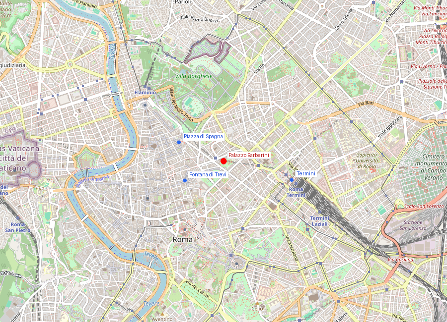
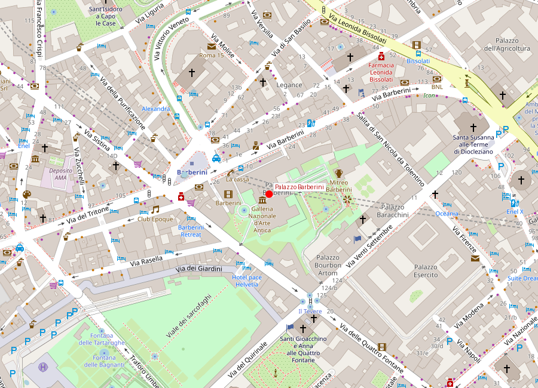
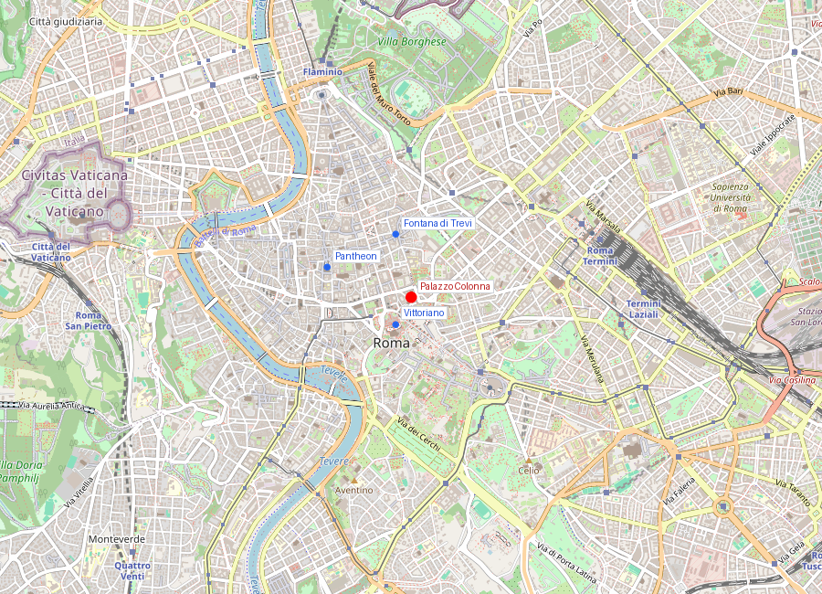
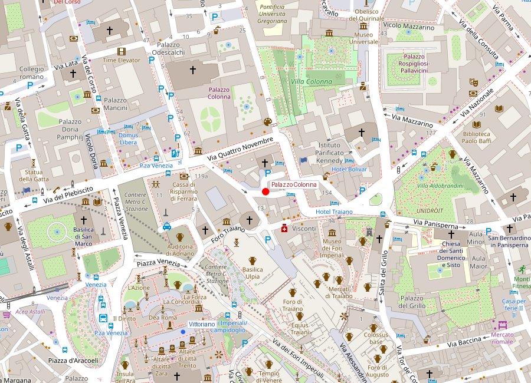

# Palazzi di Roma

```yaml
lugar:
  nombre_original: "Palazzi di Roma"
  pais: "Italia"
  fecha_visita: "2026-03-23/2026-03-30"
```

Los palacios romanos son la expresión física de siglos de poder papal, aristocrático y financiero. A diferencia de otras capitales europeas donde la monarquía concentraba la construcción monumental, en Roma fueron las familias papales — Barberini, Borghese, Pamphilj, Colonna, Farnese — quienes levantaron residencias que rivalizaban entre sí en escala y colecciones artísticas. Cada palacio era una declaración dinástica: el papa de turno canalizaba recursos hacia su familia, y el palacio familiar se convertía en sede de poder, galería de arte y símbolo de linaje.

Muchos de estos palacios fueron construidos reutilizando materiales del [Colosseo](colosseo.md), del [Foro Romano](foro_romano_palatino.md) y de otros monumentos antiguos — una práctica que explica por qué tanta Roma antigua desapareció y por qué estos edificios contienen, literalmente, fragmentos de la ciudad imperial.

---

## Palazzo Barberini (Galleria Nazionale d'Arte Antica)

### Mapa


### Mapa en detalle


### Historia

#### Línea de tiempo

| Fecha | Hito |
|---|---|
| 1625 | Maffeo Barberini es elegido papa como Urbano VIII; la familia adquiere el palacio del cardenal Sforza en Via delle Quattro Fontane |
| 1627 | Carlo Maderno inicia el diseño del nuevo palazzo |
| 1629 | Muere Maderno; Bernini asume la dirección de la obra |
| 1633 | Borromini, como asistente de Bernini, diseña la escalera helicoidal y la ventanería del ala norte |
| 1639 | Pietro da Cortona completa el fresco del *Trionfo della Divina Provvidenza* en el gran salón |
| 1644 | Muere Urbano VIII; los Barberini caen en desgracia y huyen a Francia |
| Siglos XVIII-XIX | El palazzo pasa por varias manos; decadencia gradual |
| 1949 | El Estado italiano adquiere el palazzo y lo destina a la Galleria Nazionale d'Arte Antica |

#### Narrativa

Palazzo Barberini es un triple retrato de genio: Maderno lo concibió, Bernini lo completó y Borromini trabajó en sus detalles — los tres arquitectos más importantes de la Roma del siglo XVII reunidos en un solo edificio. La planta es innovadora: en vez del tradicional palazzo cerrado con patio interior, Maderno diseñó una planta en H abierta, más cercana a una villa suburbana que a un palacio urbano.

El edificio fue la sede de poder de la familia Barberini durante el papado de Urbano VIII (1623-1644), uno de los pontificados más fastuosos y controvertidos del Barroco. Urbano VIII fue el papa que expolió el bronce del [Pantheon](pantheon.md) para fundir el baldaquino de San Pietro y los cañones de Castel Sant'Angelo — "lo que no hicieron los bárbaros, lo hicieron los Barberini."

El fresco del gran salón, el *Trionfo della Divina Provvidenza* de Pietro da Cortona (1633-1639), es una de las obras cumbre de la pintura barroca: un torbellino de figuras alegóricas que glorifican a los Barberini (y sus abejas heráldicas) con una energía que anticipa todo el ilusionismo de techos del Barroco tardío.

### Qué se puede ver hoy

- **El gran salón con el fresco de Pietro da Cortona**: la Divina Providencia coronando las virtudes Barberini — el techo ilusionista más importante de Roma después de la Capilla Sixtina.
- **La Galleria Nazionale d'Arte Antica**: una de las colecciones de pintura más importantes de Italia. Obras clave:
  - *Giuditta che taglia la testa di Oloferne* (Caravaggio)
  - *La Fornarina* (Raffaello) — retrato de su amante, Margherita Luti
  - *Narciso* (atribuido a Caravaggio)
  - *Enrique VIII* (Hans Holbein el Joven)
  - Obras de Filippo Lippi, Tintoretto, El Greco, Guido Reni
- **La escalera helicoidal de Borromini**: en el ala norte, con columnas que se estrechan progresivamente hacia arriba creando una ilusión de mayor profundidad.
- **La escalera cuadrada de Bernini**: en el ala sur, monumental y de planta cuadrada — el contraste con la de Borromini ilustra las dos personalidades.
- **El jardín**: parcialmente restaurado, con acceso desde el palazzo.

### Datos interesantes

- El travertino de la fachada proviene en parte del [Colosseo](colosseo.md) — un hecho documentado que conecta materialmente ambos edificios.
- Las tres abejas del escudo Barberini aparecen por todo el palacio, incluyendo el fresco de Pietro da Cortona.
- Borromini y Bernini trabajaron aquí todavía como colaboradores; su rivalidad feroz vendría después, y sus dos escaleras en el mismo palacio se convirtieron en símbolo de sus estilos opuestos.

---

## Palazzo Colonna e Giardini Colonna

### Mapa


### Mapa en detalle


### Historia

#### Línea de tiempo

| Fecha | Hito |
|---|---|
| Siglo XIV | La familia Colonna consolida su presencia en la zona de Santi Apostoli, al pie del Quirinale |
| 1417 | Oddone Colonna es elegido papa como Martín V — fin del Cisma de Occidente; la familia alcanza su máximo poder |
| 1484-1530 | Construcción y ampliación del palazzo principal |
| 1654-1665 | Antonio del Grande diseña la Galleria Colonna, la gran sala de celebración de la victoria de Lepanto |
| 1700-1703 | Filippo II Colonna encarga a Johann Paul Schor y Girolamo Fontana la decoración completa de la Galleria |
| 1710-1730 | Se completan los jardines en las laderas del Quirinale |
| Siglo XX | La familia Colonna mantiene la propiedad; abren la galería al público los sábados |

#### Narrativa

La familia Colonna es una de las dinastías más antiguas de la nobleza romana — documentada desde el siglo XII, dio un papa (Martín V), generales, cardenales y mecenas a lo largo de siete siglos. Su palazzo, adosado a la Basilica dei Santi Apostoli al pie de la colina del Quirinale, es una acumulación de siglos de construcción que desemboca en su pieza maestra: la Galleria Colonna.

La Galleria Colonna fue construida para celebrar la victoria de la batalla de Lepanto (1571), donde Marcantonio Colonna comandó la flota papal en la coalición cristiana que derrotó al Imperio Otomano. Es una de las salas privadas más espectaculares de Roma: 76 metros de largo, con frescos de techos que narran la vida de Marcantonio Colonna y la batalla de Lepanto, columnas de mármol amarillo (giallo antico), espejos venecianos y una colección de pintura que incluye obras de Bronzino, Veronese, Tintoretto, Guercino y Annibale Carracci.

Los jardines se extienden por la ladera del Quirinale, conectando el palazzo con la cima de la colina. Son un ejemplo raro de jardín aristocrático romano conservado, con terrazas, fuentes y una vista notable sobre los tejados del centro.

### Qué se puede ver hoy

- **La Galleria Colonna**: abierta al público los sábados por la mañana (y por cita previa). La sala principal con los frescos de la batalla de Lepanto, la colección de pintura y la bala de cañón incrustada en la escalinata (de un ataque durante el asedio de Roma de 1849) son los puntos destacados.
- **La Sala del Trono**: con el trono reservado simbólicamente para el papa Martín V Colonna.
- **La columna heráldica**: el símbolo de la familia (una columna) aparece repetidamente en la decoración.
- **Los Giardini Colonna**: las terrazas escalonadas hacia el Quirinale con fuentes, ruinas romanas integradas y vegetación mediterránea.
- **La Sala dell'Apoteosi di Martino V**: frescos que glorifican al papa Colonna.

### Datos interesantes

- La galería se abre solo los sábados por la mañana — es una de las visitas más exclusivas y menos masificadas de Roma.
- Una bala de cañón del asedio republicano de 1849 (la defensa de la República Romana contra las tropas francesas) quedó incrustada en la escalinata de mármol y se conserva como testimonio.
- La batalla de Lepanto (1571), tema central de los frescos, fue el último gran enfrentamiento naval a remos de la historia y una de las batallas más decisivas del Mediterráneo.
- Los Colonna y los Orsini mantuvieron una rivalidad sangrienta durante siglos — las dos familias se enfrentaron militarmente dentro de Roma en múltiples ocasiones.
- El palazzo sigue siendo residencia privada de la familia Colonna, lo que le da un carácter muy diferente a los museos estatales.

---

## Conexiones

- Palazzo Barberini conecta materialmente con el [Colosseo](colosseo.md) (travertino reutilizado) y con el [Pantheon](pantheon.md) (expolio de bronce por Urbano VIII Barberini).
- La Galleria Nazionale d'Arte Antica en Palazzo Barberini complementa la colección de la Galleria Borghese en [Villa Borghese](villa_borghese.md) — ambas familias (Barberini y Borghese) fueron dinastías papales rivales.
- La Galleria Colonna, con sus frescos de Lepanto, conecta con la historia naval mediterránea y con la iglesia de Sant'Agnese in Agone en [Piazza Navona](piazza_navona.md) (ambas comisionadas por familias papales como declaración dinástica).
- Borromini trabajó en Palazzo Barberini y en Sant'Agnese in Agone ([Piazza Navona](piazza_navona.md)) — su presencia conecta ambos sitios.
- Los Giardini Colonna se extienden hasta el Quirinale, sede actual de la Presidencia de la República Italiana — el poder aristocrático medieval toca literalmente el poder republicano moderno.

## Fotos

### Palazzo Barberini

<!-- Placeholder para fotos de Palazzo Barberini -->
<!--  -->
<!-- *Descripción de la foto* -->

### Palazzo Colonna

<!-- Placeholder para fotos de Palazzo e Giardini Colonna -->
<!--  -->
<!-- *Descripción de la foto* -->

fuente: Galleria Nazionale d'Arte Antica - Palazzo Barberini (barberinicorsini.org); Galleria Colonna (galleriacolonna.it); Treccani (treccani.it); Touring Club Italiano, *Roma e dintorni*; Rudolf Wittkower, *Art and Architecture in Italy 1600-1750*, Penguin
