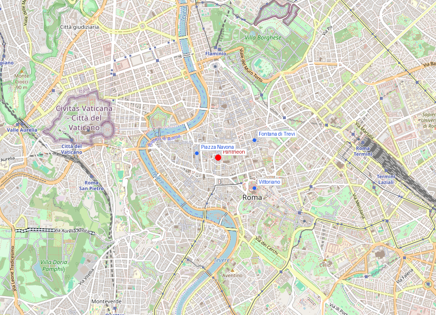
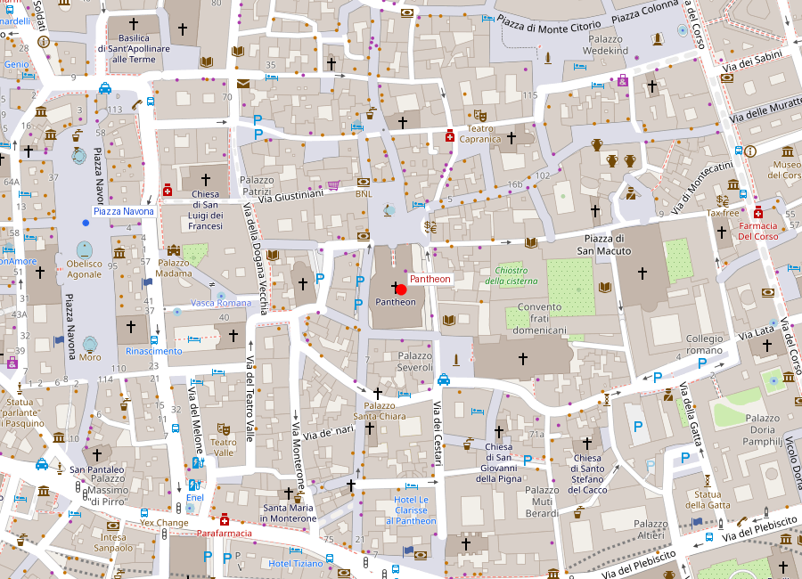
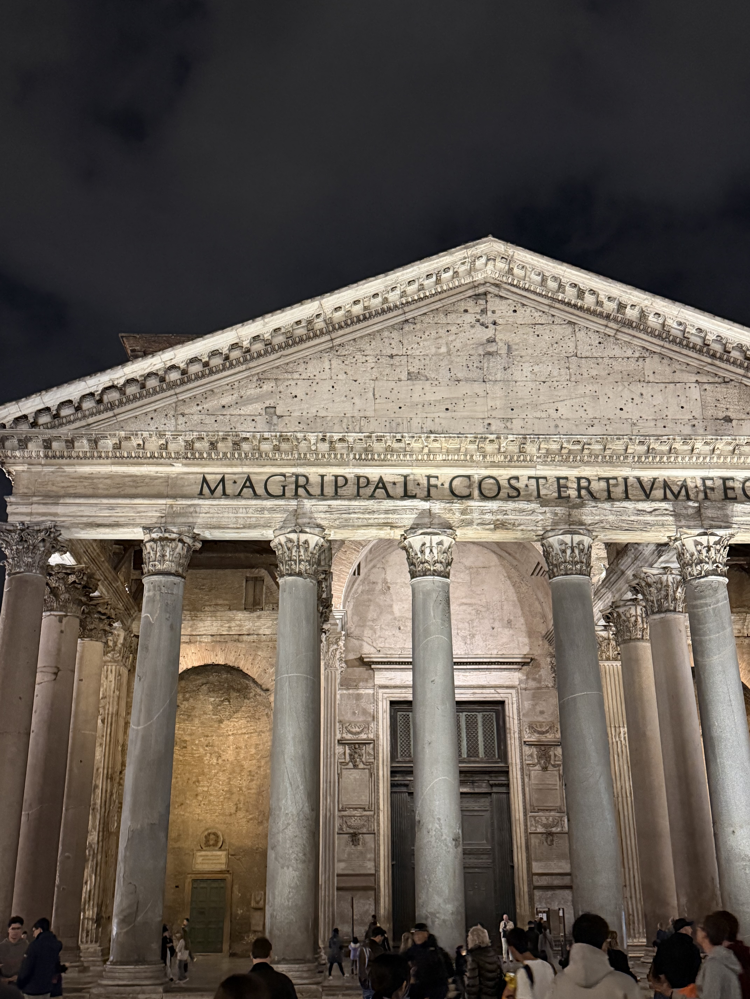
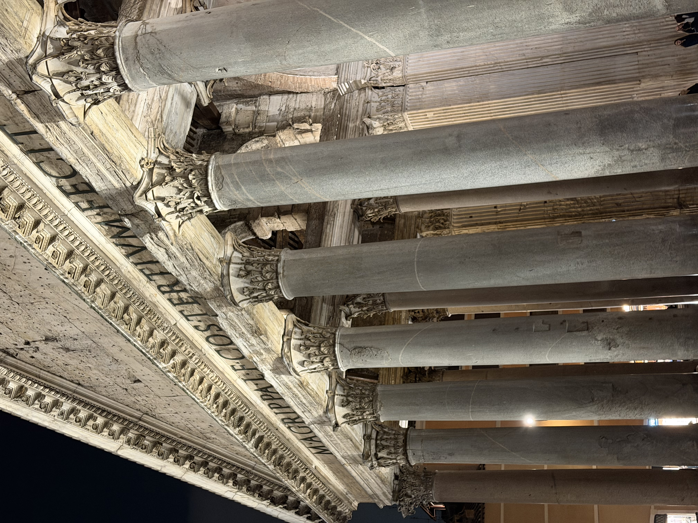

# Pantheon (Basilica di Santa Maria ad Martyres)

```yaml
lugar:
  nombre_original: "Pantheon"
  pais: "Italia"
  fecha_visita: "2026-03-23/2026-03-30"
```

## Mapa


## Mapa en detalle


## Qué había antes

En este lugar Agripa construyó un primer templo en 27-25 a.C., orientado al norte y probablemente de planta rectangular convencional. Ese edificio se incendió en el 80 d.C. y fue reconstruido por Domiciano, para volver a arder tras un rayo en el 110 d.C. Lo que vemos hoy es la tercera construcción, obra de Adriano (circa 113-125 d.C.), que sin embargo mantuvo la inscripción original de Agripa en el frontón: *M·AGRIPPA·L·F·COS·TERTIVM·FECIT* ("Marco Agripa, hijo de Lucio, cónsul por tercera vez, lo hizo"). Durante siglos se creyó que el edificio era el original de Agripa; solo la investigación moderna de los sellos de los ladrillos demostró que pertenece a la época de Adriano.

## Historia

### Línea de tiempo

| Fecha | Hito |
|---|---|
| 27-25 a.C. | Agripa construye el primer Pantheon como parte de un complejo termal en el Campo de Marte |
| 80 d.C. | Incendio destruye el templo original |
| ~110 d.C. | Un rayo daña la reconstrucción de Domiciano |
| ~113-125 d.C. | Adriano reconstruye el Pantheon en su forma actual con la gran cúpula |
| 202 d.C. | Septimio Severo y Caracalla restauran el edificio |
| 609 d.C. | El emperador bizantino Focas dona el edificio al papa Bonifacio IV, que lo consagra como iglesia de Santa Maria ad Martyres — hecho clave para su supervivencia |
| 663 d.C. | El emperador Constante II retira las tejas de bronce dorado del techo |
| 735 d.C. | Gregorio III reemplaza las tejas con láminas de plomo (las que se ven hoy) |
| 1270 | Se añade un pequeño campanario sobre el frontón (eliminado en el siglo XVII) |
| 1520 | Entierro de Raffaello Sanzio, según su voluntad |
| 1625 | Urbano VIII Barberini retira las vigas de bronce del pórtico para fundir el baldaquino de San Pietro y cañones para Castel Sant'Angelo — origen de la frase *"quod non fecerunt barbari, fecerunt Barberini"* |
| 1870 | Tras la unificación italiana, se convierte en tumba de los reyes de Italia: Vittorio Emanuele II (1878), Umberto I (1900) |
| 2023 | Se introduce entrada de pago (5 €) por primera vez en su historia como iglesia abierta |

### Narrativa

El Pantheon de Adriano es el edificio antiguo mejor conservado de Roma, y probablemente del mundo. Eso no es casualidad: su conversión en iglesia en el 609 d.C. lo salvó del destino del Colosseo o del Foro, donde siglos de abandono y expolio redujeron los edificios a ruinas. El Pantheon, en cambio, nunca dejó de usarse.

La cúpula es la pieza maestra. Con 43,3 metros de diámetro interior — exactamente igual a la altura desde el suelo hasta el óculo —, el espacio interior se inscribe en una esfera perfecta. Es la mayor cúpula de hormigón no armado jamás construida, y mantuvo el récord de luz libre hasta el siglo XX. Adriano lo logró mediante una ingeniería sutil: el hormigón varía en densidad, más pesado en la base (con agregados de travertino y tufo) y más ligero en la cúspide (con piedra pómez volcánica). Los casetones del interior no son solo decorativos — aligeran la estructura progresivamente hacia el centro.

El óculo de 8,9 metros de diámetro es la única fuente de luz. Cuando llueve, el agua entra y cae al suelo ligeramente convexo, que drena a través de pequeños orificios casi invisibles. El 21 de abril (aniversario fundacional de Roma), al mediodía, la luz del óculo cae exactamente sobre la entrada principal — una alineación que probablemente fue intencional.

## Mitología y leyendas

El nombre *Pantheon* (del griego "todos los dioses") ha generado debate desde la Antigüedad: Dión Casio sugería que el nombre se refería a las estatuas de muchas deidades que contenía, o a la semejanza de la cúpula con la bóveda celeste. La segunda interpretación — el templo como modelo del cosmos — es la más sugerente y la que mejor explica la decisión del óculo: el cielo real entra en el cielo arquitectónico.

Según la tradición popular medieval, el agujero del óculo fue hecho por un demonio que huyó del edificio cuando fue consagrado como iglesia cristiana.

## Qué se puede ver hoy

- **El pórtico**: 16 columnas monolíticas de granito gris y rosa, de 11,8 metros de altura, traídas de Egipto. Las ocho frontales son de granito gris del Mons Claudianus; las interiores, de granito rosa de Asuán.
- **La inscripción de Agripa**: en el friso del frontón, intacta tras 2.000 años.
- **La cúpula y el óculo**: el efecto del espacio esférico y la luz cenital se perciben inmediatamente al entrar. En días de lluvia, la experiencia de ver agua caer desde el centro es memorable.
- **Los casetones**: 5 anillos de 28 casetones cada uno, decrecientes hacia el óculo.
- **La tumba de Raffaello**: en la tercera capilla a la izquierda, con el epitafio de Pietro Bembo: *"Ille hic est Raphael, timuit quo sospite vinci / rerum magna parens, et moriente mori"* ("Aquí yace Raffaello; mientras vivió, la Naturaleza temió ser vencida; cuando murió, temió morir con él").
- **Las tumbas reales**: Vittorio Emanuele II y Umberto I con la reina Margherita.
- **El pavimento**: mármoles polícromos con patrón geométrico, en gran parte original del siglo II d.C., con la convexidad para drenaje.
- **Las puertas de bronce**: originales romanas, de 7 metros de altura — las puertas de bronce antiguas más grandes que sobreviven en Roma.

## Cultura y memoria

El Pantheon une tres capas de Roma de forma única: es templo romano, iglesia activa (se celebra misa regularmente) y mausoleo nacional. Aloja tumbas de figuras artísticas (Raffaello, Annibale Carracci, Baldassare Peruzzi, el compositor Arcangelo Corelli) y políticas (los dos primeros reyes de Italia), por lo que funciona a la vez como patrimonio antiguo, espacio de culto vivo y lugar de memoria.

La frase sobre los Barberini (*"quod non fecerunt barbari, fecerunt Barberini"*) resume la compleja relación de Roma con sus propios monumentos: los papas fueron a la vez conservadores y expoliadores del patrimonio antiguo, según las necesidades del momento.

## Conexiones

- Une capas de Roma imperial, Roma cristiana y Roma nacional contemporánea.
- Dentro del centro histórico, se encuentra a minutos a pie de Piazza Navona, [Fontana di Trevi](fontana_di_trevi.md) y el eje hacia [Monumento a Vittorio Emanuele II](monumento_vittorio_emanuele_ii.md).
- La cúpula es el referente directo de la de Brunelleschi en Firenze y de la de Michelangelo en San Pietro — la línea de influencia va del Pantheon a toda la arquitectura occidental de cúpulas.
- El traslado de obeliscos y columnas desde Egipto para este y otros templos romanos conecta con Piazza del Popolo y su obelisco Flaminio.

## Datos interesantes

- La cúpula del Pantheon es mayor que la de la Basilica di San Pietro (43,3 m vs 41,47 m de diámetro interior). Michelangelo, consciente de ello, hizo la de San Pietro ligeramente más estrecha como gesto de deferencia, según la tradición. [⚠ VERIFICAR]
- La lluvia entra por el óculo; el pavimento levemente convexo y los 22 orificios de drenaje casi invisibles la canalizan.
- La conservación del edificio se vincula directamente a su uso continuo como espacio de culto desde el 609 d.C.
- El 21 de abril al mediodía, la luz del óculo ilumina la entrada — coincide con el Natale di Roma (aniversario fundacional).
- Brunelleschi estudió el Pantheon obsesivamente antes de construir la cúpula del Duomo de Firenze.

## Fotos


*El pórtico del Pantheon con sus 16 columnas monolíticas de granito egipcio — la inscripción original de Agripa ("M·AGRIPPA·L·F·COS·TERTIVM·FECIT") se mantiene intacta en el frontón, aunque el edificio actual fue reconstruido por Adriano hacia 125 d.C.*


*El interior del Pantheon con la cúpula de hormigón no armado de 43,3 metros de diámetro y el óculo de 8,9 metros — la única fuente de luz del edificio. El efecto del haz de luz desplazándose por el interior a medida que avanza el día es uno de los espectáculos más sobrecogedores de la arquitectura antigua.*

fuente: Ministero della Cultura (cultura.gov.it); Basilica del Pantheon (pantheonroma.com); UNESCO World Heritage Centre, ref. 91; William L. MacDonald, *The Pantheon: Design, Meaning, and Progeny*, Harvard University Press; Dión Casio, *Historia Romana*, Libro LIII
