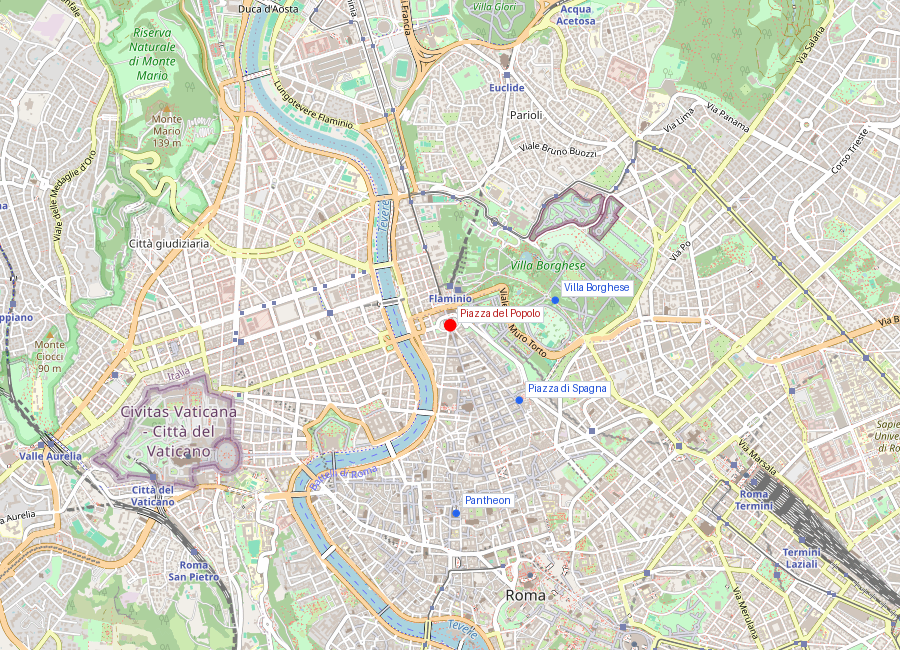
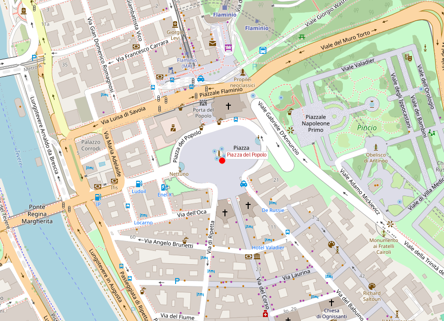

# Piazza del Popolo

```yaml
lugar:
  nombre_original: "Piazza del Popolo"
  pais: "Italia"
  fecha_visita: "2026-03-23/2026-03-30"
```

## Mapa


## Mapa en detalle


## Qué había antes

El sitio de Piazza del Popolo fue durante siglos la puerta norte de Roma — el punto por donde entraban viajeros, peregrinos, ejércitos y mercancías llegados por la Via Flaminia desde el norte de Italia. La Porta del Popolo (antigua Porta Flaminia) era la primera impresión de Roma para quien venía de fuera. Antes de la remodelación neoclásica, la plaza era un espacio irregular y funcional, más estación de paso que escenario monumental. La iglesia de Santa Maria del Popolo, que da nombre a la plaza, fue fundada en 1099 por el papa Pasquale II supuestamente sobre el lugar donde estaba la tumba de Nerón, para exorcizar su espíritu maligno — según la tradición medieval, cuervos y demonios atormentaban el lugar.

## Historia

### Línea de tiempo

| Fecha | Hito |
|---|---|
| 220 a.C. | Construcción de la Via Flaminia, que termina en este punto al entrar en Roma |
| Siglo III d.C. | Porta Flaminia en las Murallas Aurelianas marca la entrada norte |
| 1099 | Pasquale II funda Santa Maria del Popolo sobre el supuesto lugar de la tumba de Nerón |
| 1472-1477 | Sixto IV reconstruye Santa Maria del Popolo; Andrea Bregno y la escuela romana decoran el interior |
| 1505-1510 | Bramante diseña el coro de Santa Maria del Popolo; Rafael diseña la Cappella Chigi (completada después por Bernini) |
| 1589 | Sixto V ordena a Domenico Fontana trasladar el obelisco Flaminio al centro de la plaza |
| 1655-1661 | Bernini renueva la Porta del Popolo para la entrada de la reina Cristina de Suecia |
| 1662 | Se construyen las "iglesias gemelas": Santa Maria dei Miracoli y Santa Maria in Montesanto, diseñadas por Carlo Rainaldi y completadas por Bernini y Carlo Fontana |
| 1811-1822 | Giuseppe Valadier rediseña toda la plaza en estilo neoclásico: forma elíptica, exedras laterales, fuentes con leones, rampa al Pincio |
| 1834 | Se completa la terraza del Pincio con el mirador sobre la plaza |

### Narrativa

Piazza del Popolo es la puerta de Roma, y fue consciente y deliberadamente diseñada como tal. Para un viajero del Grand Tour que llegaba en carroza por la Via Flaminia — agotado tras cruzar los Apeninos —, la plaza era la primera imagen de Roma. Los papas lo sabían, y cada intervención urbana aquí fue pensada como impresión inaugural.

El obelisco Flaminio, que domina el centro, es uno de los más antiguos de Roma: fue traído de Heliópolis (Egipto) por Augusto en el 10 a.C. y originalmente instalado en el Circo Máximo. Sixto V — el papa que reimaginó Roma como ciudad de obeliscos y ejes visuales — lo hizo trasladar aquí en 1589 como parte de su plan maestro urbano. Cuatro leones de granito (añadidos por Valadier en 1823) rodean la base.

Las "iglesias gemelas" son un truco visual brillante: Santa Maria dei Miracoli y Santa Maria in Montesanto parecen simétricas vistas desde la plaza, pero en realidad tienen plantas diferentes (una circular, otra elíptica) porque los solares disponibles no eran iguales. Rainaldi, Bernini y Fontana lograron la ilusión de simetría jugando con las proporciones de las cúpulas y los pórticos.

La intervención de Valadier (1811-1822) es la que da a la plaza su forma actual: un óvalo neoclásico con exedras semicirculares, rampas hacia el Pincio y jardines. Valadier transformó un espacio de tránsito en un lugar de estar — el equivalente romano de un salón urbano.

## Mitología y leyendas

Según la tradición medieval, el lugar donde se alza Santa Maria del Popolo estaba maldito: era la tumba de Nerón, y espíritus malignos en forma de cuervos negros atormentaban a los vecinos. El papa Pasquale II, informado en visión por la Virgen María, habría talado un nogal donde anidaban los cuervos y construido la iglesia para purificar el lugar. La historia vincula la plaza con el lado oscuro de Roma — el recuerdo de Nerón como tirano perseguía la ciudad incluso mil años después de su muerte.

## Qué se puede ver hoy

- **El obelisco Flaminio**: de Ramsés II, traído de Heliópolis por Augusto. 24 metros de altura (36 con la base), con jeroglíficos originales del faraón y de Seti I.
- **Las "iglesias gemelas"**: Santa Maria dei Miracoli (a la izquierda mirando desde la plaza) y Santa Maria in Montesanto (a la derecha), enmarcando la salida hacia Via del Corso. Merece la pena entrar en ambas para ver que no son iguales.
- **Santa Maria del Popolo**: tesoro artístico con dos Caravaggio en la Cappella Cerasi (*Conversión de San Pablo* y *Crucifixión de San Pedro*), la Cappella Chigi diseñada por Rafael y completada por Bernini, y obras de Pinturicchio, Andrea Sansovino y Bramante.
- **La Porta del Popolo**: la cara interior fue rediseñada por Bernini para la entrada triunfal de la reina Cristina de Suecia (1655), que había abdicado y se había convertido al catolicismo — evento diplomático colosal.
- **Las fuentes con leones**: cuatro leones de granito egipcio (estilo neo-egipcio) al pie del obelisco, añadidos por Valadier.
- **Las exedras laterales**: con fuentes que representan a Roma (lado del Pincio) y Neptuno (lado del Tíber).
- **La subida al Pincio**: la rampa de Valadier lleva a la terraza-mirador sobre la plaza, uno de los atardeceres más famosos de Roma — se ve hasta la cúpula de San Pietro.

## Cultura

Sigue siendo plaza de encuentros cívicos, eventos y miradores hacia el Pincio. El área conserva una mezcla fuerte de ritual cotidiano y representación urbana histórica. Los conciertos de Año Nuevo y las concentraciones políticas mantienen su función de ágora moderna.

La plaza es también el arranque del "tridente" — las tres calles (Via del Corso, Via del Babuino, Via di Ripetta) que se abren en abanico hacia el sur del centro histórico. Este sistema de tres ejes fue diseñado como instrumento de control visual y circulación, y funcionó como modelo urbano para otras ciudades europeas.

## Conexiones

- Conecta de forma natural con [Villa Borghese](villa_borghese.md) a través del Pincio.
- Se relaciona con [Piazza di Spagna](piazza_di_spagna.md) via el corredor de Via del Babuino.
- Via del Corso la conecta con [Monumento a Vittorio Emanuele II](monumento_vittorio_emanuele_ii.md) en Piazza Venezia — un eje recto de 1,5 km de norte a sur.
- Santa Maria del Popolo, con sus Caravaggio, conecta con la Roma barroca de [Fontana di Trevi](fontana_di_trevi.md) y las otras plazas del centro.
- El obelisco Flaminio conecta con el de Piazza di Spagna, el de San Pietro y los otros 12 obeliscos egipcios de Roma — la mayor concentración de obeliscos fuera de Egipto.

## Datos interesantes

- Las llamadas "iglesias gemelas" (Santa Maria dei Miracoli y Santa Maria in Montesanto) no son realmente gemelas: una tiene planta circular y la otra elíptica.
- Santa Maria del Popolo contiene dos obras maestras de Caravaggio que se pueden ver gratis.
- El obelisco Flaminio es el segundo más antiguo de Roma (después del Lateranense) y estaba originalmente en Heliópolis, Egipto.
- Cristina de Suecia, cuya entrada triunfal Bernini escenificó en la Porta del Popolo, fue una de las figuras más excéntricas del siglo XVII: reina que abdicó, se convirtió al catolicismo, se instaló en Roma y escandalizó a la corte papal.
- Desde la terraza del Pincio, al atardecer, la luz cae sobre la cúpula de San Pietro enmarcada exactamente entre las dos "iglesias gemelas" — alineación probablemente intencional.

fuente: Turismo Roma (turismoroma.it); Soprintendenza Speciale di Roma; Treccani (treccani.it); Touring Club Italiano, *Roma e dintorni*
