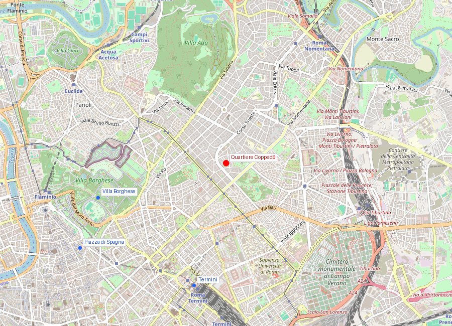
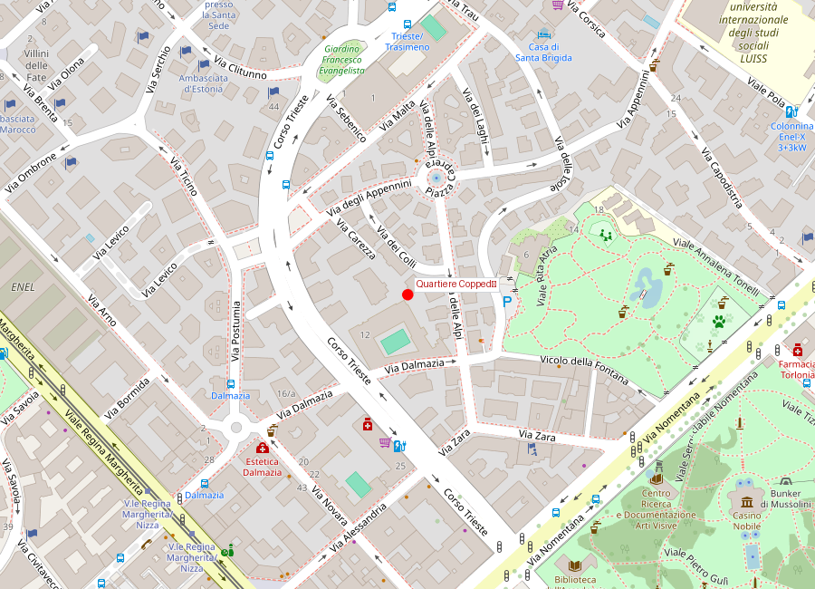

# Quartiere Coppedè

```yaml
lugar:
  nombre_original: "Quartiere Coppedè"
  pais: "Italia"
  fecha_visita: "2026-03-23/2026-03-30"
  region_admin: "Quartiere Trieste, Municipio II"
```

## Mapa


## Mapa en detalle


## Qué había antes

La zona donde se levanta el Quartiere Coppedè era, a principios del siglo XX, terreno en las afueras del centro histórico, parte de la expansión urbana que Roma experimentó tras convertirse en capital de Italia (1871). El barrio Trieste-Salario estaba en pleno desarrollo como zona residencial de clase media-alta, y promotores inmobiliarios buscaban arquitectos que dieran identidad a sus construcciones.

## Historia

### Línea de tiempo

| Fecha | Hito |
|---|---|
| 1913 | La Società Anonima Cooperativa Edilizia Moderna encarga al arquitecto Gino Coppedè un conjunto residencial |
| 1915-1918 | La Primera Guerra Mundial ralentiza la construcción |
| 1921 | Se completa el arco de entrada sobre Via Tagliamento |
| 1926 | Muere Gino Coppedè sin ver terminado el conjunto |
| 1927 | Se completan los últimos edificios del quartiere según los planos de Coppedè |

### Narrativa

El Quartiere Coppedè es una anomalía en Roma: un rincón de fantasía arquitectónica que no se parece a nada más en la ciudad. El arquitecto florentino Gino Coppedè diseñó un conjunto de 26 palazzine y 17 villini entre 1913 y 1926 en un estilo que desafía toda clasificación: mezcla Liberty (Art Nouveau italiano), gótico, barroco, griego, medieval y elementos decorativos que van desde gárgolas hasta arañas de hierro forjado, pasando por frescos, mosaicos y torrecillas.

Coppedè no buscaba la sobriedad ni la coherencia estilística — buscaba el asombro. Cada fachada es diferente, cada portal tiene su propia personalidad, y el conjunto funciona como una escenografía teatral permanente. El resultado ha sido comparado con la arquitectura de Gaudí en Barcelona, aunque los contextos y las referencias son muy distintos.

El punto focal del quartiere es Piazza Mincio, con la Fontana delle Rane (Fuente de las Ranas) en el centro, rodeada por los edificios más decorados del conjunto. El arco de entrada sobre Via Tagliamento, un pasaje elaborado con pinturas y una enorme lámpara de hierro forjado colgante, funciona como portal a un mundo aparte.

## Qué se puede ver hoy

- **El arco de entrada** (Via Tagliamento/Via Dora): el pasaje cubierto con decoración pictórica, escudos nobiliarios y la gran lámpara de hierro forjado que marca el ingreso al quartiere.
- **Piazza Mincio**: la plaza central con la Fontana delle Rane — una fuente con ranas de bronce en los bordes que, según la tradición local, inspiró a los Beatles durante su visita a Roma (anécdota no verificada de forma concluyente). [⚠ VERIFICAR]
- **Palazzo del Ragno** (Palacio de la Araña): con una gran araña decorativa en la fachada y motivos esotéricos. Es el edificio más fotografiado del quartiere.
- **Villini delle Fate** (Casitas de las Hadas): un conjunto de tres villini unidos que mezclan motivos medievales, renacentistas y orientales con frescos, mayólicas y relieves ornamentales.
- **Las fachadas decoradas**: cada edificio tiene un programa decorativo propio — buscar los detalles (animales fantásticos, mascarones, frutos, símbolos) es parte de la experiencia.
- **La mezcla estilística**: en un mismo edificio pueden convivir arcos ojivales, columnas salomónicas, mosaicos bizantinos y barandillas Art Nouveau.

## Cultura

El quartiere ha sido escenario de varias películas italianas — Dario Argento lo usó en *Inferno* (1980) y *L'uccello dalle piume di cristallo* (1970), aprovechando su atmósfera de misterio. [⚠ VERIFICAR] La estética del barrio encaja naturalmente con los géneros fantástico y de suspense.

Hoy es un barrio residencial tranquilo y relativamente poco visitado comparado con el centro histórico. No hay museos ni atracciones formales — el atractivo es el paseo por las calles observando las fachadas, lo que le da un carácter muy diferente al turismo de monumentos.

## Conexiones

- El Liberty italiano de Coppedè conecta con una corriente europea (Art Nouveau, Jugendstil, Modernismo) que en Roma tuvo poca presencia — lo que hace al quartiere aún más raro en el contexto romano.
- Contrasta radicalmente con la Roma monumental del [Vittoriano](monumento_vittorio_emanuele_ii.md) o las plazas barrocas como [Piazza Navona](piazza_navona.md): es una Roma de fantasía privada, no de representación pública.
- La cercanía a [Villa Borghese](villa_borghese.md) (a unas pocas cuadras) permite combinar ambas visitas.
- El estilo ecléctico de Coppedè dialoga a distancia con el eclecticismo del [Vittoriano](monumento_vittorio_emanuele_ii.md) — ambos fueron criticados por "mezclar estilos", pero con intenciones muy diferentes.

## Datos interesantes

- Gino Coppedè murió en 1926 sin ver terminado el conjunto; los últimos edificios se completaron un año después según sus planos.
- El barrio entero se puede recorrer en 20-30 minutos a pie — es compacto y concentrado.
- No hay un solo estilo dominante: se han identificado elementos góticos, griegos, renacentistas, barrocos, Liberty, Art Déco y orientalistas en las fachadas.
- A pesar de su singularidad, el quartiere no tiene ninguna protección patrimonial especial más allá de las restricciones urbanísticas generales del municipio de Roma. [⚠ VERIFICAR]
- Es uno de los pocos lugares de Roma donde la arquitectura del siglo XX compite en interés con los monumentos antiguos.

## Fotos

<!-- Placeholder para fotos de Quartiere Coppedè -->
<!--  -->
<!-- *Descripción de la foto* -->

fuente: Turismo Roma (turismoroma.it); Comune di Roma (comune.roma.it); Touring Club Italiano, *Roma e dintorni*; Vittorio Vidotto, *Roma contemporanea*, Laterza
